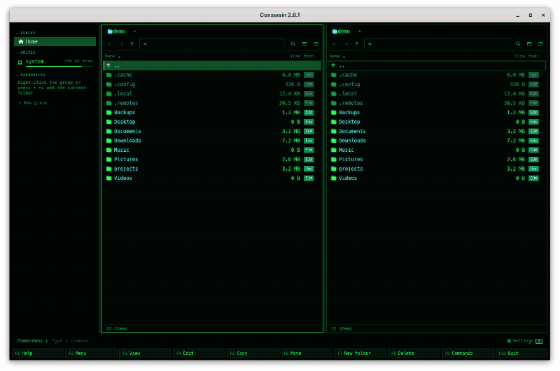

# Coxswain

*The one at the helm, who steers the boat and keeps the crew in time.*

Coxswain is a two-panel file manager in the Norton Commander tradition, built for developers.
It comes as a terminal app (`coxswain`, Rust and Ratatui) and a desktop app (`coxswain-gui`,
Tauri and Svelte 5), both on one shared Rust core and one config file. It finds any file by
its name, its text or what it is about, previews over 60 kinds of file, opens archives like
folders, shows git in every panel, and keeps everything on your machine.

> **What's new in 2.0**
> - **Coxswain runs on FreeBSD:** the terminal app and the desktop app, with one line:
>   `fetch -qo - https://raw.githubusercontent.com/mwo-dk/coxswain/master/install/install-freebsd.sh | sh`
>   ([FreeBSD](docs/reference/freebsd.md); the desktop app is experimental there).
> - **One Find** for names, words, meaning and answers; **Settings by task** in both apps; a **guided setup** for search by meaning and Ask.
> - Meaning reads **whole documents**, on the **Mac's GPU** too; **git branches and worktrees** as folders; **29 languages**; **cloud files** stay in the cloud.
> - A **first-run guide**, install lines for what is missing, and dialogs that say what they do. Your `config.toml` is updated once for 2.0's names.
> [What's new in 2.0](docs/whats-new-2.md)


*The desktop app in **Cyber**, its default. Seventeen more themes are one F9 away, from Norton
Commander blue to Windows 95 and Mac OS 9.*

> **Cloud folders are safe.** Coxswain never downloads OneDrive, Dropbox, Google Drive, Proton
> Drive or iCloud files that are only online: it finds them by name and leaves them in the cloud
> until you open one. Earlier versions could download them while indexing; update to 1.28.1.
> [Cloud files](docs/search/cloud-files.md)

## Highlights

- **On FreeBSD and illumos: browse ZFS snapshots like folders.** **Alt+Z** lists a folder's snapshots, Enter shows it as it was, Diff compares a file with now and F5 copies it back, with no root; the dataset, its compression and space sit in the footer. Properties names a file's package and lists its files, shows and sets chflags, and the sidebar has your boot environments and jails. OpenZFS on Linux and macOS too, and on TrueNAS over SSH. [ZFS snapshots](docs/files/zfs-snapshots.md) · [FreeBSD](docs/reference/freebsd.md#zfs-packages-flags-boot-environments-and-jails)
- **FreeBSD, the other BSDs, illumos, Linux, macOS and Windows:** both apps on FreeBSD, OpenBSD, Linux, macOS and Windows, the terminal app on NetBSD and illumos too, each BSD and illumos with an install line, its own package tool for what is missing, its own service for the search helper (rc.d, rcctl, SMF) and a manual page; TrueNAS over SSH. [FreeBSD](docs/reference/freebsd.md) · [NetBSD](docs/reference/netbsd.md) · [OpenBSD](docs/reference/openbsd.md) · [illumos](docs/reference/illumos.md) · [TrueNAS](docs/reference/truenas.md)
- **Norton Commander at heart:** two panels, the F-key bar, a command line and NC's keys. [Panels and keys](docs/panels/README.md)
- **One Find for names, words, meaning and answers:** Ctrl+F and type; the hits come in groups (*Names*, *In files*, *About this*, *History*) ranked by words and meaning together, Ctrl+Enter asks, one key limits it to this folder, inside your zip, 7z and tar archives too; you choose what is read and what is left out (`*.log`, a folder). [Search](docs/search/README.md) · [Inside archives](docs/search/archives.md) · [Choosing the folders](docs/search/folders.md)
- **Gentle with your cloud:** OneDrive, Dropbox, Google Drive, Proton Drive and iCloud files that are only online are found by name, marked with a cloud, and never downloaded unless you open one. [Cloud files](docs/search/cloud-files.md)
- **Ask your files:** a question in your own words, answered from the closest passages with numbered sources, by your own chat model or one built in that needs no server (on a Mac it uses the GPU). [Ask](docs/search/ask.md) · [Without a server](docs/search/ask-builtin.md) · [Set it up](docs/search/setup.md)
- **Search by meaning, in any language:** a small model on your machine (on Apple Silicon it uses the GPU), or your own Ollama, Lemonade or OpenAI-style server. [Search by meaning](docs/search/meaning.md) · [Set it up](docs/search/setup.md)
- **See before you open:** code, Markdown, PDF, Word, PowerPoint, spreadsheets, SQLite and Parquet (in the terminal app F3 too), HTML, fonts, video and more. [The preview pane](docs/previews/README.md) · [Data](docs/previews/data.md)
- **Builds what needs building:** LaTeX, Office, PlantUML and Graphviz previews, with your tools or a sealed container. [LaTeX](docs/previews/latex.md) · [Tools](docs/previews/tools.md)
- **Reads cryptography bills of materials:** a CycloneDX CBOM as a rated tree or sunburst, compared with last month's scan, in both apps. [CBOMs](docs/previews/bom.md)
- **Reads build provenance:** SLSA and in-toto files as inputs → build → outputs, with who signed them, whether the files here are the ones built, and whether the commit is in your checkout, in both apps. [Build provenance](docs/previews/provenance.md)
- **Archives are folders:** zip, 7z and tar (gz, bz2, xz, zst): go in, preview, copy, move, rename, pack, with passwords to open them and to lock new zips and 7z (AES-256). [Archives](docs/files/archives.md)
- **Git in every panel:** branch, ahead and behind, counts, a glyph per file, and who last committed it and when. [Git](docs/panels/git.md)
- **History as folders:** **Ctrl+G** on a file or folder lists its commits; Enter on one browses the files as they were, F5 copies an old version out, and Find finds commit messages. [Git history](docs/panels/git-history.md) · [History in search](docs/search/history.md)
- **Branches and worktrees too:** **Alt+B** lists the branches, Enter browses one's files, **Alt+S** switches to it (git refuses to lose your changes); **Alt+W** lists the worktrees. The git line names a worktree, a detached HEAD and a merge or rebase under way. [Git branches](docs/panels/git-branches.md)
- **Folder sizes without asking,** instant in your home folder. [Folder sizes](docs/panels/folder-sizes.md)
- **Finds duplicates** by content across folders and disks, and marks the extra copies by rule. [Duplicates](docs/files/duplicates.md)
- **Eighteen themes with the looks of their era,** and 29 languages, listed by region: Hebrew and Persian right to left, Greek capitals without accents, Japanese and Korean lined up in the terminal. [Themes](docs/customise/themes.md) · [Languages](docs/customise/languages.md)
- **Nothing leaves your machine** unless you ask for it. [Privacy](docs/reference/privacy.md)

| | |
|---|---|
|  | <picture><source media="(prefers-reduced-motion: reduce)" srcset="docs/screenshots/find.png"></picture> |
| [The terminal app](docs/reference/terminal-app.md) | [Find](docs/search/find-file.md) |
|  |  |
| [The preview pane](docs/previews/README.md) | [Archives as folders](docs/files/archives.md) |

## Smart search: names, words, meaning and answers

One field finds every file by **name** in a blink, by the **words** inside it, by what it is
**about** in any language, and **Ask** answers a question from your files with numbered sources:
type, and the hits come in groups, the ones that fit your query first; **Ctrl+Enter** asks.
It all runs on your own machine, or on your own server (Ollama, Lemonade, LM Studio, llama.cpp
…); nothing leaves it unless you choose a server elsewhere. Three steps:

1. **Settings → Finding files → Set up…** (terminal app: `coxswain --setup-search`). The guide
   finds the model servers on your machine and says what suits it.
2. **Use the graphics card or NPU** if you have one: the guide checks that the server does.
3. **Let it read in the background:** *Start with my session* keeps the index current between
   launches (a systemd user service, a launchd agent, a Run entry or an XDG autostart entry on
   FreeBSD; no administrator rights).

The whole walk-through: [Smart search in a few minutes](docs/search/setup.md).

<picture><source media="(prefers-reduced-motion: reduce)" srcset="docs/screenshots/ask.png"></picture>

*Ask with `qwen3:8b` on Ollama on the same machine. The wait for the first word is cut short.*

## Install

| System | Terminal app | Desktop app |
|---|---|---|
| FreeBSD 14, 15 | `fetch -qo - https://raw.githubusercontent.com/mwo-dk/coxswain/master/install/install-freebsd.sh \| sh` installs both apps ([FreeBSD](docs/reference/freebsd.md)); `--terminal-only` for the terminal app alone | The same line (experimental), with the packages it needs from `pkg` |
| NetBSD 10, 11 | `ftp -o - https://raw.githubusercontent.com/mwo-dk/coxswain/master/install/install-unix.sh \| sh` ([NetBSD](docs/reference/netbsd.md)) | Not yet: webkit-gtk41's binary packages miss dependencies |
| OpenBSD 7.9 | `ftp -o - https://raw.githubusercontent.com/mwo-dk/coxswain/master/install/install-unix.sh \| sh` installs both apps ([OpenBSD](docs/reference/openbsd.md)); `--terminal-only` for the terminal app alone | The same line (experimental), with `webkitgtk41` from `pkg_add` |
| DragonFly BSD | Not supported; its Rust (1.85 in DPorts) is too old for Coxswain's dependencies | Not supported |
| illumos (OmniOS, OpenIndiana) | `curl -fsSL https://raw.githubusercontent.com/mwo-dk/coxswain/master/install/install-unix.sh \| sh` ([illumos](docs/reference/illumos.md)) | Not built: no WebKitGTK 4.1 |
| TrueNAS | The Linux build (Community Edition) or the FreeBSD one (CORE) in your home, over SSH ([TrueNAS](docs/reference/truenas.md)) | Not on a NAS |
| Linux | `brew install mwo-dk/coxswain/coxswain`, or the static `x86_64-unknown-linux-musl` binary | `.deb`, `.rpm`, `.AppImage`, or the Homebrew cask (x86-64) |
| Linux, Flatpak | Not in it: the line above | Not on Flathub yet: build it with `flatpak-builder` ([Flatpak](docs/reference/flatpak.md)) |
| Linux on ARM64 (Raspberry Pi OS 64-bit, Asahi, ARM servers) | The static `aarch64-unknown-linux-musl` binary, or `brew` as above | `_arm64.deb`, `.aarch64.rpm`, `_aarch64.AppImage` ([Linux on ARM](docs/reference/linux-arm.md)) |
| Nix (Linux, macOS) | `nix run github:mwo-dk/coxswain`, or `nix profile install github:mwo-dk/coxswain` ([Nix](docs/reference/nix.md)) | `nix run github:mwo-dk/coxswain#coxswain-gui` (Linux) |
| Android (Termux) | `pkg install coxswain` once it is in Termux's repository; until then `pkg install rust git && cargo install coxswain` ([Termux](docs/reference/termux.md)) | Not on Android |
| ChromeOS | The Linux binary for its processor, in the Linux terminal | The `.deb` for its processor, in Linux ([ChromeOS](docs/reference/chromeos.md)) |
| Any | `cargo install coxswain` | `./install/install.sh` (or `install\install.ps1`) from a clone |
| macOS | `brew install mwo-dk/coxswain/coxswain` | `brew install --cask mwo-dk/coxswain/coxswain-gui`, or the `.dmg` |
| Windows | `winget install mwo-dk.Coxswain.Terminal`, or `coxswain-terminal-<version>-x86_64-pc-windows-msvc.zip` | `.msi` or `-setup.exe` |
| Windows on ARM | `coxswain-terminal-<version>-aarch64-pc-windows-msvc.zip` | `_arm64_en-US.msi` or `_arm64-setup.exe` ([Windows on ARM](docs/reference/windows-arm.md)) |

Downloads are on the [releases page](https://github.com/mwo-dk/coxswain/releases/latest).
**The builds are not code-signed:** on macOS, if the app "is damaged", run
`xattr -cr /Applications/Coxswain.app` once (the cask does it for you); on Windows click
*More info* and *Run anyway*. Why macOS may ask about your folders again after an update: [macOS](docs/reference/macos.md#why-a-new-version-may-ask-again).
Both apps check once a day for a newer release and give the exact update command
([Update checks](docs/reference/updates.md)). Every way to install and update, and building
from source: [install/INSTALL.md](install/INSTALL.md). Git glyphs want a
[Nerd Font](https://www.nerdfonts.com/); without one set `glyphs = "ascii"`
([Glyphs and fonts](docs/customise/glyphs-and-fonts.md)).

## First steps

1. **Start it** in a folder: `coxswain` (or `cox`) in a terminal, or `coxswain-gui`. Two folders
   open the two panels: `coxswain ~/src ~/Downloads`.
2. **Move** with the arrows, **Enter** opens (a folder, or an archive), **Backspace** goes up,
   **Tab** switches panels.
3. **Mark** with **Insert**, then **F5** copies or **F6** moves to the other panel. **F8** moves
   to the trash, **F7** makes a folder, and **Ctrl+Z** undoes the last of them.
4. **Find** anything with **Ctrl+F**; **Tab** looks deeper.
   **Turn on smart search** (meaning and Ask): *Settings → Finding files → Set up…*, or
   `coxswain --setup-search` ([the guide](docs/search/setup.md)).
5. **Type** a command and press **Enter**: it runs in the panel's folder.
6. **Settings**, sorted by task (Finding files, Previews, Looks, Behaviour, Keys, Privacy and
   updates): **Ctrl+,** in the desktop app, **F9** → *Settings* or `coxswain --settings` in the
   terminal app. In the desktop app, **Space** shows the preview pane.
7. Not sure what you can do with a file? **Shift+F10** (or the **Menu** key, or the **⋯** on the
   row) lists what fits it, each with its key: pack, extract, rename, history
   ([The action menu](docs/panels/action-menu.md)). Forgot a key? **F9** lists every command,
   and **F1** shows your keys.

More in [Panels and keys](docs/panels/README.md) and [Every default key](docs/panels/keys.md).

## Documentation

The [docs index](docs/README.md) is the full map; every feature has its own page with the keys,
what you see, the settings, and the questions people ask.

| Area | What is in it |
|---|---|
| [Panels and keys](docs/panels/README.md) | The screen, moving, quick search, marking, sorting, tabs, views, folder sizes, git, git history, the mouse, every key |
| [Tags, notes, favourites and the sidebar](docs/organise/README.md) | Colour tags, folder notes, favourite groups, places and drives |
| [Commands, the user menu and scripts](docs/commands/README.md) | The command line, F2 menu, scripts, F3 and F4, opening files |
| [Search](docs/search/README.md) | The guided setup, names, text, scans, diagrams, git history, meaning, servers, the helper, disks, battery, notices |
| [The preview pane](docs/previews/README.md) | Every format, HTML, Office, diagrams, LaTeX, tools and containers |
| [Files](docs/files/README.md) | Copy, move, delete, clipboard, drag and drop, batch rename, archives, properties, duplicates |
| [Customising](docs/customise/README.md) | Settings, themes, looks, your own theme, languages, keys, glyphs |
| [Reference](docs/reference/README.md) | The terminal app, flags, every config key, privacy, updates, where files are kept, FreeBSD, NetBSD, OpenBSD, illumos, TrueNAS, Flatpak |
| [Questions, collected](docs/faq.md) | The common questions, linked to their full answers |

## Layout

```
crates/coxswain-core   config, fs ops, archives, git status and history, search index and store, duplicates (shared)
crates/coxswain        terminal UI (package and binaries: coxswain, cox)
gui/                   Svelte 5 frontend
gui/src-tauri          Tauri backend (binary: coxswain-gui)
```

## Licence

MIT. Every release carries the licences of what it is built from (`THIRD-PARTY-NOTICES.md`, also
inside the apps), an SBOM for each app and a CBOM of the cryptography they use; see
[Licences and bills of materials](docs/reference/bills-of-materials.md).

Norton Commander is a trademark of Gen Digital Inc. Coxswain is an independent project, not
affiliated with or endorsed by Gen Digital.

## Changelog

Newest first. Downloads for each release are on the [releases page](https://github.com/mwo-dk/coxswain/releases).

| Version | Date | What's new |
|---|---|---|
| **2.13.0** | 2026-10-07 | **Features and questions.** **F1** has a second tab (**Tab** in the terminal app): every feature by area, each with a line on what it does, its keys as your config has them, and two or three of the questions people ask, answered in a sentence or two, in every language. Type to filter (case and accents do not matter); **Show me** opens the feature's docs page on GitHub, only when pressed, and the terminal app also copies the address. **F1** inside a dialog (Copy, Settings, the command list …) opens it at that dialog's feature; it is also in **F9** and the action menu. [Features and questions](docs/panels/features.md) |
| **2.12.0** | 2026-10-07 | **Ask reads much more before it answers.** It fills the chat model's context instead of taking ten passages: about 2,500–3,000 words with a server's model, each hit with the passages before and after it, and more from the files that match best. A question about the whole folder (*what is this repository's code about?*, *give me an overview*, in the app's languages) also gets the README, the project files, the folder tree and the docs index. A line over the sources says how much was read (*12 excerpts from 10 files, about 2600 words*), and *Context for a server's model* under *Settings → Ask* (`ask_context`, 8,192 tokens) lets a larger server read more, in both apps. [How much it reads](docs/search/ask.md#how-much-it-reads) |
| **2.11.0** | 2026-10-07 | **Nothing hidden.** Find shows its scope as a choice of two, *Everywhere* or *In <folder>* (buttons in the desktop app, `[everywhere \| in rocket]` in the terminal app, the one in force lit), and the empty field says which key flips it; the first few times a hint says **Ctrl+F** again searches only this folder. The action menu (**Shift+F10**) now also offers Find, Search inside files, Ask, Find duplicates, Swap panels, Other panel here, Panels on/off, Colour tag, Folder notes and Git worktrees where they fit, and new hints name **Ctrl+F**, quick search (**Alt+letter**) and the panel keys. In the desktop app the preview has a **×** that closes it (as **Esc** does), each favourites group has a **⋯** with Rename and Delete, a tab's tooltip says middle-click closes it, F1 explains quick search, Left/Right in each view and Ctrl+right-click, and Settings → Keys opens `config.toml` at `[keys]` and shows the F2 scripts folder. [Finding what Coxswain can do](docs/panels/README.md#finding-what-coxswain-can-do) |
| **2.10.1** | 2026-10-07 | **F2 comes with entries that fit your system.** *Open a terminal here* (**t**) opens a terminal in the panel's folder (`$TERMINAL` or the one installed on the BSDs, illumos and Linux, Terminal on macOS, Windows Terminal or PowerShell on Windows), *SHA-256 of the file* (**h**) shows the file's hash with the system's own tool, and *git status* (**s**) is offered inside a repository; an entry that does not fit is left out. The last row, *Add your own command…* (**+**), opens `config.toml` in your editor at `[[user_menu]]`, with the built-in entries written there as a commented example first. The old *git log*, *git diff* and *git blame* entries are gone: **Ctrl+G** and **Alt+B** do that now. Your own `[[user_menu]]` stays as it is; a new `when = "file"` or `"git"` offers an entry only where it fits. [The user menu](docs/commands/user-menu.md) |
| **2.10.0** | 2026-10-07 | **Undo.** **Ctrl+Z** undoes the last file operation, in both apps: a copy (the copies go to the trash), a move or rename, a batch rename, a new folder, a move to the trash (put back where it was; not on a Mac or in the Flatpak, which say so), a pack or an extract, up to 20 back in the same run. Each file is checked first: one that changed since, or whose old place is taken, is left as it is with a reason, and nothing is ever overwritten. The status line says *· Ctrl+Z undoes it* after each, and F9 shows what Ctrl+Z would undo. **Shift+F8** stays for good. On illumos, **F8** works: it failed with *Mount points cannot be determined*, and now uses Coxswain's own trash in `~/.local/share/Trash`, as Termux does (from another ZFS dataset it asks to delete for good). [Undo](docs/files/undo.md) · [illumos](docs/reference/illumos.md) |
| **2.9.1** | 2026-10-07 | The desktop app's sidebar no longer lists a running AppImage's own mount (`/tmp/.mount_…`) under *Drives*, and the name index leaves it out. [The sidebar](docs/organise/sidebar.md#why-did-a-mount_-drive-show-up) |
| **2.9.0** | 2026-10-07 | **What can I do with this?** **Shift+F10** (or the **Menu** key; in the desktop app also the **⋯** on the row under the mouse and **Ctrl+right-click**) opens a short menu of the actions that fit the file, folder, archive or marked files under the cursor, in both apps: open, view, edit, copy, move, rename, pack, extract, delete, properties, git history and branches, ZFS snapshots, each with its key; **Enter** runs one, **Esc** closes. **Shift+F6** renames in place, the old name filled in. The status line shows one short hint that fits, three times each (*Alt+F5 packs it into an archive · Shift+F6 renames it*); *Settings → Behaviour* turns them off or shows them again (`coxswain --hints reset`), and its new *Right-click* setting makes a right-click open the menu instead of marking. [The action menu and hints](docs/panels/action-menu.md) |
| **2.8.2** | 2026-10-07 | **The battery on illumos is noticed.** The search helper asked illumos for a kstat that does not exist (`acpi_drv:0:power:power`), so a laptop never counted as on battery; it now reads `system power` from `acpi_drv:0:power`. The battery readings of NetBSD, OpenBSD, FreeBSD and illumos are tested against real output from their manuals, guides and mailing lists, and NetBSD's older `connected: OFF` counts too. A wrong password for a 7z whose names are open could, about once in 256 times, be taken: the entry's stream ended at once and the archive was written anew with the entry empty; an entry that ends early is now refused as locked. DragonFly BSD is no longer prepared for: its Rust (1.85 in DPorts) is too old for Coxswain's dependencies. ([Battery](docs/search/battery.md)) |
| **2.8.1** | 2026-10-06 | Search by meaning on a large store goes many times faster: choosing the next files no longer reads the text of every file still waiting (2 s for each eight with 300,000 waiting), and with a server making the vectors the helper rests a quarter of the time the server worked instead of as long. Folders a program marked as its cache with `CACHEDIR.TAG` (Cargo's build folders, whatever their name) are no longer read, like folders with `.nosearch`. [Search by meaning](docs/search/meaning.md) · [Choosing the folders](docs/search/folders.md) |
| **2.8.0** | 2026-10-06 | **NetBSD, OpenBSD and illumos.** The terminal app for NetBSD 10 and 11, OpenBSD 7.9 and illumos (OmniOS, OpenIndiana) on every release, and the desktop app for OpenBSD (experimental), each built and tested in a virtual machine of that system on every change. One plain `sh` script installs them (`ftp -o - …/install/install-unix.sh \| sh`, `curl` on illumos), checks the SHA-256 sums, shows the `pkgin`, `pkg_add` or `pkg` line before it runs it, and adds the manual page and the system's own service for the search helper: an rc.d script on NetBSD, one for `rcctl` on OpenBSD, an SMF service on illumos. On illumos the **ZFS snapshots** work as on FreeBSD (datasets from `/etc/mnttab`), and folders are watched with event ports. Battery, memory and the desktop app's drives are read the native way on each; install hints name each system's packages. On the BSDs, folders are watched with kqueue one descriptor each, and the helper keeps a quarter of its open-file limit free (OpenBSD allows 512); before, a copy into a watched folder could open a descriptor for every new file, FreeBSD included; and no walk goes into a ZFS `.zfs` folder, so `snapdir=visible` no longer indexes every snapshot. Pages for DragonFly BSD (what stops a build) and TrueNAS (the terminal app over SSH, snapshots, the system's datasets left alone). [NetBSD](docs/reference/netbsd.md) · [OpenBSD](docs/reference/openbsd.md) · [illumos](docs/reference/illumos.md) · [TrueNAS](docs/reference/truenas.md) |
| **2.7.3** | 2026-10-06 | Background search keeps working while a window of the old version is still open after an update: the helper no longer steps down for older apps, and the app waits for the helpers it starts, so none stays behind. [The search helper](docs/search/helper.md) |
| **2.7.2** | 2026-10-06 | **A trash in Termux.** On Android, **F8** now moves files to a trash of Coxswain's own in `~/.local/share/Trash` instead of saying there is none. On the phone's storage it asks to delete for good instead. [Termux](docs/reference/termux.md#deleting-termuxs-trash) |
| **2.7.1** | 2026-10-06 | **The built-in chat model is no longer recommended on a slow processor.** On a PC (Linux, Windows, the BSDs, Termux) the built-in Qwen3 model runs on the processor, and Coxswain now measures it there first: a short probe (0.2 s, no download) gives *On this processor: about 74 s to the first word, then 7.4 words a second* under the model in step 4 of the setup guide and in *Settings → Ask*, in both apps. It is marked recommended only when the first word comes within 10 s; otherwise a server's model is, and on a PC with no server the built-in model is still chosen, with the estimate beside it. A chat model is always chosen in step 4 and offered in *Settings → Ask*, never an empty choice; **Skip Ask for now** leaves Ask off. On a Mac's GPU nothing changes. [The estimate](docs/search/ask-builtin.md#the-estimate-for-this-processor) |
| **2.7.0** | 2026-10-06 | **Build provenance**, in both apps: an SLSA or in-toto provenance file (`.intoto.jsonl`, a Sigstore bundle, `provenance.json`, or any JSON that holds one) shows as inputs → build → outputs, with who signed it and where it was logged. Each output is checked against the file of that name here or in the other pane (✓ matches, ✗ differs, ? not here), and a git source's commit is looked for in your checkout (*1 commit behind HEAD*), without fetching. **Compare** shows what differs from an earlier build. Nothing is verified, and the view says so. The terminal app opens it on **F3** (`provenance_viewer = false` keeps the pager). [Build provenance](docs/previews/provenance.md) |
| **2.6.0** | 2026-10-06 | **At home in Termux.** On Android the terminal app now builds with `cargo install coxswain` in Termux, and works the Android way there: **Alt+F1** lists the phone's folders after `termux-setup-storage`, **Enter** opens a file in its Android app with `termux-open`, copied lines go to Android's clipboard and the search helper pauses on battery through Termux:API, HTTPS uses Termux's certificates, and the update notice says `pkg upgrade coxswain`. Android has no trash or session service: F8 and *Start with my session* say so. Built and tested inside Termux on every change. [Termux](docs/reference/termux.md) |
| **2.5.0** | 2026-10-06 | **ARM computers.** The desktop app for 64-bit ARM Linux on every release, as `.deb`, `.rpm` and AppImage, for Raspberry Pi OS 64-bit, Asahi, ARM laptops and servers; the Arch package `coxswain-bin` (`packaging/aur/`) has it too. Both apps native for Windows on ARM (Snapdragon laptops): an installer, an `.msi` and the terminal app's zip, and WinGet gets the ARM installer once the packages are listed. Both are built and tested on ARM on every change. A page for ChromeOS: which `.deb`, sharing ChromeOS folders with Linux, and what the builds need. [Linux on ARM](docs/reference/linux-arm.md), [Windows on ARM](docs/reference/windows-arm.md), [ChromeOS](docs/reference/chromeos.md) |
| **2.4.0** | 2026-10-06 | Three more languages, 29 in all: *فارسی* (Persian), *Հայերեն* (Armenian) and *ქართული* (Georgian), picked on a system set to `fa_IR`, `fa_AF`, `prs`, `hy_AM` or `ka_GE` and marked *new*. Persian is right to left in the desktop app like Hebrew, with Persian digits in counts, sizes and dates in both apps, and the falcon banner of the Achaemenids for a flag. Armenian and Georgian sit under a new *Caucasus* region, Persian and Hebrew under *The Middle East*; Georgian headings are never put in capitals. The desktop app draws these letters with Vazirmatn, Noto Sans Arabic, Armenian or Georgian after any font and says on Linux which package to install when none is there. [Persian, Armenian and Georgian](docs/customise/languages.md#persian-armenian-and-georgian) |
| **2.3.0** | 2026-10-06 | **The desktop app as a Flatpak** (`io.github.mwo_dk.Coxswain`), built from source with `flatpak-builder`; it is not on Flathub yet. It sees all your files, keeps its search helper inside the sandbox, and runs your editor (F4), shell commands, F2 scripts and the user menu on the host, with the host's tesseract, pdftoppm, LibreOffice, pandoc, LaTeX and PlantUML for previews and search. *Start with my session* writes an autostart entry that starts the Flatpak; the update notice says `flatpak update io.github.mwo_dk.Coxswain`. [Flatpak](docs/reference/flatpak.md) |
| **2.2.0** | 2026-10-06 | **Ask without a server.** Ask can answer with a chat model built into Coxswain, in both apps: Qwen3 1.7B, or Qwen3 4B Instruct on a Mac with 16 GB or more, downloaded once from huggingface.co (1.0 or 2.3 GB) and run on the Mac's GPU through Metal, or on the processor elsewhere (slowly there: a minute or more before the first word). Nothing leaves the machine. The setup guide offers it in step 4 and recommends it when no server answers; *Settings → Finding files → Details → Ask → Built-in chat models* downloads, uses and deletes it; `coxswain --meaning ask builtin:qwen3-1.7b` in the terminal app. It runs in the search helper, one copy for every window, and is let go five minutes after the last answer. [Ask without a server](docs/search/ask-builtin.md) |
| **2.1.2** | 2026-10-06 | **Background reading that starts.** With *Start with my session* on, the app now asks systemd or launchd to start the search helper and, when the system does not, starts it itself and says once where to allow it (on a Mac: *System Settings → General → Login Items & Extensions → Coxswain → Allow in the Background*). On a Mac the helper no longer runs as a throttled background job, so the backlog moves; the LaunchAgent is loaded with `launchctl bootstrap` and rewritten by the first app you open. The helper writes its starts, exits and errors to `helper.log` in the cache folder. [The search helper](docs/search/helper.md#start-with-my-session-is-on-but-background-reading-does-not-start-why) · [macOS](docs/reference/macos.md#the-search-helper-at-login) |
| **2.1.1** | 2026-10-06 | **Fixes on a Mac.** The search helper and the name index no longer walk `~/Library` (but iCloud Drive and the cloud folders), the Photos and Music libraries, the Trash or `/System/Volumes`, so macOS stops asking *Coxswain would like to access data from other apps*; a folder you refused (Desktop, Documents, a USB or network volume) is asked for once per run, and a notice says once what the folder prompts are. **The setup guide with no Ollama or server** now recommends the built-in model, on the Mac's GPU, downloads it with its progress on one click, turns search by meaning on and says so, shows a failed download's error, and marks Ask optional. The server address field's example is a neutral `http://192.168.1.20:11434`. [macOS](docs/reference/macos.md) · [The setup guide](docs/search/setup.md#the-steps) |
| **2.1.0** | 2026-10-06 | **On FreeBSD: ZFS snapshots as folders**, in both apps: **Alt+Z** on a folder lists its dataset's snapshots, newest first, with their own space and date; **Enter** browses the folder as a snapshot has it (from `.zfs/snapshot`, no root, `snapdir=hidden` is fine), the preview's **Diff** (the terminal app's **Enter**) shows how a file differs now, **F5** copies it back, and **F4**, **F6**, **F7**, **F8** are refused. The dataset, its compression ratio and its space (or quota) are in the footer, and **Properties** shows mountpoint, used, available, referenced, quota, refquota and the number of snapshots. Properties also names the **package** a file belongs to (*Files of this package* lists them as a folder) and the **file flags** as `ls -lo` names them, with your own user flags to tick (`nodump`, `hidden`; `uchg`, `uappnd` off ZFS). **Boot environments** and **jails** are in the desktop app's sidebar and under **Alt+F1** in the terminal app. Properties (**Alt+Enter**) is in the terminal app too. Works with OpenZFS on Linux and macOS; on Linux, `lsattr`'s immutable and append-only show under Flags. [ZFS snapshots](docs/files/zfs-snapshots.md) · [Properties](docs/files/properties.md#zfs-packages-and-file-flags) · [FreeBSD](docs/reference/freebsd.md#zfs-packages-flags-boot-environments-and-jails) |
| **2.0.0** | 2026-10-06 | Coxswain 2.0. A **first-run guide** in both apps, shown once and skippable on every step: the two panels and their keys, how far Find looks (meaning and Ask start the setup guide), theme, language and icons with a Nerd Font check, and what can leave the machine; **F1** (then *Show the guide again*, or **G** in the terminal app) and Settings → *Overview* open it again. When tesseract, pdftoppm, LibreOffice, LaTeX, PlantUML or pandoc is missing, the hint gives the exact install line for your system (`pkg`, `pacman`, `apt`, `dnf`, `zypper`, `brew`, `winget`) with a **Copy** button; Coxswain never runs it. Dialogs name their action and count (*Copy 3 items*), their button is the verb, one key line reads the same in both apps (*Enter Copy · Esc Cancel*), and an error says what failed, its cause in one line and the rest under *Details*. One word per thing: *mark*, *folder*, *Find*, *Refresh*; the desktop key bar says *Move*, *New folder*, *Commands*. **Changed:** `config.toml` is rewritten once on start, your comments kept, and a notice lists it: `[keys]` `select_group`, `unselect_group`, `invert_selection`, `mkdir`, `dir_sizes` become `mark_group`, `unmark_group`, `invert_marks`, `new_folder`, `folder_sizes`; `[search]` `roots` and `exclude` become `name_roots` and `name_exclude`; `--settings` takes an area or an option only (`meaning`, `ask`, `news`, `cloud` are gone). [What's new in 2.0](docs/whats-new-2.md) · [The first-run guide](docs/panels/first-run.md) |
| **1.44.0** | 2026-10-06 | Settings in the terminal app: **F9** → *Settings*, or `coxswain --settings[=area or option]`, opens it full screen with the desktop app's areas and options. **←** **→** pick the area, **↑** **↓** the option, **Space** flips a switch or takes the next value, **Enter** types a text or number in place or opens a list to add and remove folders, **/** finds a setting; each option is explained at the bottom with what it costs, and saved to `config.toml` at once, your comments kept. *Finding files* has the status lines with their next step and the four levels (one that needs a model starts the setup guide); *Overview* lists the tips and what's new; *Keys* lists every key; *Privacy and updates* says what can leave the machine. The theme changes at once. It fits 80×24, Japanese and Korean lined up. [Settings in the terminal app](docs/customise/settings.md#in-the-terminal-app) |
| **1.43.0** | 2026-10-05 | **Coxswain runs on FreeBSD.** Both apps for FreeBSD 14 and 15 (amd64) on every release, installed with one line: `fetch -qo - https://raw.githubusercontent.com/mwo-dk/coxswain/master/install/install-freebsd.sh \| sh`. The script checks the SHA-256 sums, installs into `/usr/local` or `~/.local`, shows the `pkg install` line for what the desktop app needs before it runs it, and adds a manual page (`man coxswain`), a menu entry and an rc.d script for the search helper. The terminal app needs nothing beyond the base system; the desktop app is experimental. *Start with my session* writes an XDG autostart entry there; the helper watches folders, not every file, so kqueue stays light; battery and memory are read with `sysctl`; the update notice names the install line. [FreeBSD](docs/reference/freebsd.md) |
| **1.42.0** | 2026-10-05 | Settings by task, in the desktop app: an *Overview* of how everything stands with *What's new*, then *Finding files*, *Previews*, *Looks*, *Behaviour*, *Keys* and *Privacy and updates*, and *Find a setting…* above them. Every option says in one line what it does and carries badges for what it costs (disk space, processor time, downloads, can leave this machine). *Finding files* opens with a status line for names, words, meaning and Ask, each with its next step (*Read now*, *Start it*, *Set up…*, *Try it*), then *How far should Find look?* in four levels that turn on what they need or open the setup guide; *Details* holds every switch. New in Settings: the terminal app's theme, row height, folder sizes, editor, viewer, the name index's folders, what is never indexed, the largest file read; *Keys* lists every key; *Privacy and updates* lists what can leave the machine and where things are kept. The *Font* field is greyed out under a theme that brings its own font. `--settings=search`, `meaning`, `ask`, `news` and `language` still open where they did. [The Settings window](docs/customise/settings.md) |
| **1.41.0** | 2026-10-05 | One Find, in both apps: one field for names, words in files, meaning and Ask, the hits in groups (*Names*, *In files*, *About this*, *History*) ordered by what you typed; **Tab** picks a kind (or type `text:`, `about:`, `?`), **Ctrl+F** inside Find limits everything, Ask too, to this folder, **Ctrl+Enter** (terminal: **Alt+Enter**) asks and the answer opens in place; every missing piece says what it needs, with one step; a ⌕ button on each path bar. Ask's first word comes without reloading the models on an 8 GB card; the title shows the version only. [Find file](docs/search/find-file.md) |
| **1.40.0** | 2026-10-05 | Ask answers at once: a model that thinks first (such as `qwen3:8b`) is asked not to, so the first word comes in under a second instead of 15–28 seconds; *Let the model think before it answers* in Settings (`ask_think`) brings the thinking back. Searching the text of files ranks the files with your words by meaning too, and a question typed as a question finds the files with some of its words; the setup guide says where the built-in model really runs (a Mac's GPU), and the warning before a change of embedding model counts every passage. [Thinking](docs/search/ask.md#thinking) · [Ranking](docs/search/meaning.md#how-words-and-meaning-are-ranked-together) |
| **1.39.0** | 2026-10-05 | Search by meaning and Ask cover whole documents: every part of a file gets vectors (up to 256 passages, about 25,000 words), not only its first 960 words, and each passage is matched with the file's name, its folder and its Markdown heading. A file counts with its best passage and a little more when several match. With bge-m3 and other server models, answers that score a little lower are no longer cut off (measured on the search-quality corpus: right file in the first five for every question). The first start after the update makes the vectors once more, in the background (the text is not read again); both apps say how many files and about how long. [Search by meaning](docs/search/meaning.md#why-is-search-by-meaning-re-reading-everything) |
| **1.38.0** | 2026-10-05 | Smart search is set up with a guide, in both apps: *Settings → Search by meaning → Set up…* or `coxswain --setup-search`. It finds the model servers on your machine (Ollama, Lemonade, LM Studio, llama.cpp, Jan, LocalAI, or one you name elsewhere), lists only the models that make vectors for meaning and only those that answer for Ask, recommends a server and models for your graphics card, NPU or processor, downloads with a click (Ollama, Lemonade), asks a test question with the time to its first word, says when a model runs on the processor although there is a GPU and how to fix it, and offers *Start with my session*. Find file's "set it up" links open it. [Smart search in a few minutes](docs/search/setup.md) |
| **1.37.0** | 2026-10-05 | Search by meaning uses your Mac's GPU: on Apple Silicon the built-in model runs on the GPU through Metal, several times faster, after a check that its results match the CPU's; Intel Macs stay on the CPU. *Settings → Search by meaning* says *Built-in model · on the GPU (Metal)* or *on the CPU* with the reason, a notice says so once, and `coxswain --meaning` prints the same; *Use the CPU only* (or `coxswain --meaning cpu`) keeps it off the GPU. [On a Mac's GPU](docs/search/meaning.md#on-a-macs-gpu) |
| **1.36.0** | 2026-10-05 | Git branches and worktrees as folders, in both apps: **Alt+B** lists the branches (local ones first, the current one marked, ahead and behind its upstream), **Enter** browses a branch's files read-only, **Alt+S** switches to it after asking (git's own refusal shows when your changes would be overwritten), *New branch here* makes one; **Alt+W** lists the worktrees, dirty or clean, and opens one. The git line says *worktree: …*, *detached at a1b2c3d* and *merging*, *rebasing* and the like, and in the desktop app a click on it opens the branches. [Git branches and worktrees](docs/panels/git-branches.md) · [The git line](docs/panels/git.md#the-git-line) |
| **1.35.0** | 2026-10-05 | Japanese and Korean, 26 languages in all: *日本語* and *한국어*, picked on a Japanese or Korean system and marked *new*. The terminal app lines up letters that take two columns (column titles, sizes, the marked line); the desktop app draws them with Hiragino, Yu Gothic, Malgun Gothic or Noto Sans CJK after any font, says on Linux which package to install when none is there, and leaves Enter and Esc to an input method while it composes. Quick search finds names macOS keeps decomposed. [Japanese and Korean](docs/customise/languages.md#japanese-and-korean) |
| **1.34.0** | 2026-10-05 | Four more languages, 24 in all: *Polski*, *Čeština*, *Українська* and *Ελληνικά*, picked by themselves on a Polish, Czech (or Slovak), Ukrainian or Greek system. They are fresh translations, marked *new* in Settings with a link to say where a word reads wrong; `coxswain --languages` lists them in the terminal. The language list is grouped by region, and Greek headings in capitals drop their accents as Greek does. [Languages](docs/customise/languages.md) |
| **1.33.0** | 2026-10-05 | Two more languages, 20 in all: *Deutsch (Österreich)* and *Deutsch (Schweiz)*, with their flags in Settings. Swiss German writes ss for ß and «guillemets»; a system set to `de_AT`, `de_CH` or `de_LI` picks them by itself. [Languages](docs/customise/languages.md) |
| **1.32.1** | 2026-10-05 | Ask offers only chat models: on Ollama, models that only make vectors (such as `bge-m3`) are left out of *Chat model*, and one already set is named plainly in Find file and Settings (*bge-m3 makes vectors and cannot answer: choose a chat model, e.g. qwen3:8b*) instead of being tried. A model on a server with the OpenAI API is tried with a one-word question when saved. `coxswain --meaning ask` refuses an embedding model. Picking `bge-m3:latest` for `bge-m3` no longer throws all vectors away, and a real change of the embedding model says first how many files it reads again and about how long, and asks. [Ask](docs/search/ask.md#it-says-my-model-makes-vectors-and-cannot-answer-why) · [Servers](docs/search/servers.md#why-does-switching-the-model-start-over) |
| **1.32.0** | 2026-10-05 | **F1** lists the keys by what they do, under headings (Moving, Panels and tabs, Marking, Files, Archives, Search, Git, Viewing and editing, App), the most used first in each, in both apps; the terminal app puts them in two columns when it is wide enough. The desktop app's **F9** shows the same headings until you type. [The command list and Help](docs/panels/command-list.md) · [Every default key](docs/panels/keys.md) |
| **1.31.0** | 2026-10-05 | Pack (Alt+F5) shows its formats: the desktop app has a *Format* list next to the name (Zip, 7z, tar, tar.gz, tar.bz2, tar.xz, tar.zst) with a line on what each is good for, and in the terminal app Tab and Shift+Tab swap the name's ending. The format you packed into last is suggested next time, in both apps. [Pack and extract](docs/files/pack-and-extract.md#formats) |
| **1.30.3** | 2026-10-05 | The terminal app installed with WinGet says `winget upgrade mwo-dk.Coxswain.Terminal` when a new version is out. [Updates](docs/reference/updates.md) |
| **1.30.2** | 2026-10-04 | The terminal app follows changes on disk: a file another program writes, copies in or deletes appears or goes in its panel within a second, the cursor staying put, and the git line follows commits and checkouts. Two Coxswains changing one archive at once (the desktop app and the terminal app, or two windows) wait for each other, so neither change is lost. Ask says *Waiting for … to answer* until the first word comes, on any server; servers with the OpenAI API are sent nothing ahead of the question. [The terminal app](docs/reference/terminal-app.md#what-you-see) · [Archives as folders](docs/files/archives.md#can-i-change-one-archive-from-the-desktop-app-and-the-terminal-app-at-once) · [Ask](docs/search/ask.md#the-first-answer-takes-long-why) |
| **1.30.1** | 2026-10-04 | **Ctrl+A** marks everything in the folder, files and folders, as in a file explorer, in both apps; the desktop app no longer selects the whole window's text. [Marking](docs/panels/marking.md) |
| **1.30.0** | 2026-10-04 | Find file no longer looks inside the archives in caches and programs' folders (`~/Library/Caches`, `AppData\Local`, `node_modules`, `target`, `.m2`, `/var/cache` …) on any system, so they neither fill the results nor the name index; *Settings → Search inside files → Look inside archives everywhere the names are indexed* (`archives_everywhere`) finds the entries of every archive on the machine by name. A 7z whose packed list of contents says it unpacks to more than 64 MB is not opened, so a crafted one cannot fill the memory. [Inside archives](docs/search/archives.md#which-archives) |
| **1.29.2** | 2026-10-04 | The terminal app installs from crates.io again (`cargo install coxswain`): 1.29.0 and 1.29.1 could not be published there. [Install](README.md#install) |
| **1.29.1** | 2026-10-04 | Previewing a video or a sound on Linux without GStreamer's good plugins no longer takes the desktop app's window down: the preview says what to install (or, in an AppImage on a distribution other than Debian and Ubuntu, that its GStreamer cannot find them) with *Open in its app*. The search helper that starts with your session is registered by the link a package manager keeps on your PATH (Homebrew's `bin/coxswain-gui`), so after an upgrade it starts the new version by itself. [Media](docs/previews/media.md) · [The search helper](docs/search/helper.md) |
| **1.29.0** | 2026-10-04 | Search inside files and Ask have keys of their own: **Shift+F7** (or **Ctrl+Shift+F** in the desktop app) opens Find file at the text of your files, **Ctrl+F7** at Ask; in Find file **Tab** and **Shift+Tab** go forward and back through the depths, and each depth's button names its key. The desktop app's Settings button counts what is new: **Settings → What's new** lists what you can turn on, with *Show me* and *Dismiss*, and every version's changes, the unread ones marked; the terminal app has `coxswain --whats-new`. After an upgrade the search helper that starts with your session no longer points at the removed version (search, text and meaning stopped until it was turned off and on); the app that finds it so registers itself. Lit buttons in Cyber glow on the dark and can be read. [Find file](docs/search/find-file.md) · [Notices and what's new](docs/search/notices.md) · [The search helper](docs/search/helper.md) |
| **1.28.4** | 2026-10-04 | More found while taking the pictures: Help (F1) lists actions by name with keys as on the keyboard (Ctrl+G, not Ctrl+g), Batch rename keeps its rows in line when one has a conflict, an HTML page and a photo's camera details fill the preview as they should, a big icon no longer overlaps the size under it, folder notes are not offered inside an archive or a history, the status line stops saying *Working on…* while a locked archive's password is asked for (both apps), and documents keep their paragraphs' direction in Hebrew. The [keys] example no longer takes Git history's Ctrl+G, and the theme example's cursor row no longer hides folder names. [Changing keys](docs/customise/keys.md) · [Your own theme](docs/customise/own-theme.md) |
| **1.28.3** | 2026-10-03 | Found by trying it all: a history's commits are listed newest first however the pane is sorted (they were in the order of their ids), its folders show no "0 B", its tab is named after the file and the path bar keeps its end (badge included) when the path is long; the terminal app asks for a locked 7z's password again (it went back to the folder without asking); an HTML page's own stylesheet and pictures show in its preview; a 7z with locked names says so in the preview, with *Enter the password*; code, diffs and file names keep their direction in Hebrew; small fixes in *Settings → Search*. The desktop app's previews read pictures, PDFs, fonts and video through its own file protocol, which refuses a cloud file you did not ask for. [Git history](docs/panels/git-history.md) · [Cloud files](docs/search/cloud-files.md) |
| **1.28.2** | 2026-10-03 | Quicker where it was slow: a changed archive has only its changed members read again (105 ms instead of 1.5 s for a zip of 10,000), an archive still downloading waits until it has settled, search by meaning reads only the files it shows, a folder sorted by commit shows at once, the git status and the *Last commit* column follow a commit on their own (desktop app), a file's history goes on past its renames, Ask can be stopped while the model loads and loads it ahead, each tab keeps its scroll position, folders copied out of a history get the commit's date, and zip times are read and written in your time zone. [Performance](docs/reference/performance.md) |
| **1.28.1** | 2026-10-03 | Cloud files are safer still: on Windows a file's cloud state is read from the folder's listing, never by opening the file; the desktop app's readers (text, archives, databases, books, mail, certificates, bills of materials, tool previews, git diff) refuse an online-only file until you press *Download and preview*, whatever the page asks; on Linux, davfs2's WebDAV and FUSE mounts without a subtype count as cloud mounts. [Cloud files](docs/search/cloud-files.md) |
| **1.28.0** | 2026-10-03 | Coxswain no longer downloads your cloud. Earlier versions read every file in the folders they searched, and a file that OneDrive, Dropbox, Google Drive, Proton Drive or iCloud kept only online was downloaded by that read, so indexing could fill the disk and take the machine. Now such a file is told from its metadata alone (Windows' Cloud Files attributes, macOS's dataless flag, cloud mounts on Linux), found by name and never read: no text, no hash, no thumbnail, no preview, no git, until you open it. A cloud glyph marks it in both apps, the preview offers **Download and preview**, a notice says which clouds were found, and *Settings → Search inside files* reads them anyway if you want (`cloud`, `cloud_read`). A file that goes back to the cloud loses its text at the next pass. [Cloud files](docs/search/cloud-files.md) |
| **1.27.4** | 2026-10-03 | Security review: an HTML preview may load pictures, styles and fonts from the page's own folder only, not from anywhere on the disk; extracting a crafted tar cannot fill the memory; changing a zip locked the old way (ZipCrypto) no longer scrambles its locked files: they are locked anew with AES-256, with the password, and a wrong password the check byte lets through is noticed; a history copied out on Windows never makes a `.git` by another spelling; Ask's errors never repeat a password in the server's URL; releases carry a `SHA256SUMS` and build provenance. [Security](docs/reference/security.md) |
| **1.27.3** | 2026-10-03 | Dependencies brought up to date: getrandom 0.4 for the search helper's token, Mermaid 12.1 for diagrams, Vite 8.3.2, and the latest patch releases of tokio, uuid, libc and others. No advisories open. [Install](install/INSTALL.md) |
| **1.27.2** | 2026-10-02 | The sidebar's drives and their free space stay current: read again every 30 seconds while the window is in view and when it comes back to the front, so a USB stick appears without reopening the window. [The sidebar](docs/organise/sidebar.md) |
| **1.27.1** | 2026-10-01 | A SQLite database in the desktop preview shows each table's first rows under its schema, open at once for small databases. [Data files](docs/previews/data.md) |
| **1.27.0** | 2026-10-01 | You choose what search leaves out: *Settings → Search inside files → Left out* lists folder names and now file patterns too (`*.log`, `secret*`), with Add and ×, and says how `.nosearch` leaves out one folder. *Show in panel* next to `search.db` (and the built-in model) opens its folder with the cursor on it. **F3** in the terminal app shows a SQLite database or a Parquet file as its tables, row counts and first rows. On a machine without Coxswain's cache folder, the first search helper now keeps the files' text (it could not make its store before). [Choosing the folders](docs/search/folders.md) · [Data](docs/previews/data.md) |
| **1.26.6** | 2026-10-01 | Search by meaning no longer stops after the first files: a store whose Markdown was read again after an update failed every scan from then on, so nothing more was read and no vectors came; it mends itself now. When reading or vectors stop, Settings, the terminal app's Find file and a notice say why (*No vectors: … Connection refused*). Coxswain's own cache folder is never read into the search, on any system. [Search by meaning](docs/search/meaning.md#vectors-stopped-coming-why) |
| **1.26.5** | 2026-10-01 | The desktop app's preview shows files again: since 1.26.0 every file's preview stayed empty, Markdown, Parquet, databases, LaTeX, PDF and Office alike (a name lost in a merge stopped it). A LaTeX document seen before shows from the cache at once and is no longer built again when another file in its folder changes, also inside archives. A check on every pull request now finds a name that is not declared, and `tools/preview-check.py` opens a file of each kind in the real app. [LaTeX](docs/previews/latex.md) |
| **1.26.4** | 2026-10-01 | What Coxswain keeps about your files (the name index, the search store, previews, notes, tags and favourites) is readable by you alone, also on installs from before, from their first start after the update. [Privacy](docs/reference/privacy.md#can-other-users-on-the-same-machine-see-my-index) |
| **1.26.2** | 2026-10-01 | Final performance review: thumbnails keep only the rows on screen (100,000 files in 14 ms), a folder's listing is half the size, highlighting runs off the window's thread, the terminal app copies on a thread with `(2/3)` progress and lists a history without freezing, files copied out of a history keep the commit's date, a solid 7z previews, copies and searches every file again, a short folder after a long one no longer shows blank, and Ask follows its answer only while you are at the bottom. [Performance](docs/reference/performance.md) |
| **1.26.1** | 2026-10-01 | Final security review: a repository someone else made can no longer run its own programs through git (filter drivers, file system monitor, signature checker, fetch); LibreOffice converts with macros and link updates off; on Windows a file opens through the shell, not `cmd`; archives cannot lead outside, fill the disk on a preview or lose files on a move, and keep their long names and permissions when changed; a 7z key is made as 7-Zip makes it; Stop ends an Ask while the model thinks; settings saves never overwrite each other; releases come only from master. [Safety](docs/previews/safety.md) · [Security](docs/reference/security.md) |
| **1.26.0** | 2026-10-01 | Pack with a password: Alt+F5 into a zip or 7z takes a password (typed twice), every file locked with AES-256, and a 7z's file names hidden too if you like; the new archive opens without asking again while the app runs. Both apps. [Passwords](docs/files/archive-passwords.md#locking-a-new-archive) |
| **1.25.2** | 2026-10-01 | Nothing leaves the machine from a preview: the webview is held to the app and your disk, HTML pages see their own folder only, a project's `latexmkrc` no longer runs, and a locked 7z stays locked when changed. [Safety](docs/previews/safety.md) · [Privacy](docs/reference/privacy.md) |
| **1.25.1** | 2026-10-01 | Performance review: the desktop app keeps only the rows on screen in the page, so a folder of 100,000 files lists in 30 ms and the cursor moves in one; nothing that touches the disk runs on the window's thread; both apps say *Working on …* during a copy, move, delete, extract or pack and while a slow folder is read; the terminal app sorts without rereading and draws a frame in half a millisecond however much is marked. [Performance](docs/reference/performance.md) |
| **1.25.0** | 2026-10-01 | Search inside archives: the files in your zip, 7z and tar archives are found by name, by their text, by meaning and by Ask, shown as a path through the archive, and Enter opens the archive there; a changed archive is read again, a locked one keeps its secrets. On by default, *Search inside archives* in Settings. [Inside archives](docs/search/archives.md) |
| **1.24.0** | 2026-10-01 | Git history as folders: Ctrl+G on a file or folder lists the commits that touched it, Enter on one browses the files as they were, with a preview, the commit's diff, F3 and F5; a *Last commit* column (date and author) in both apps; commit messages, authors and changed paths in Find file, by text and by meaning. Text previews of files inside archives show again. [Git history](docs/panels/git-history.md) · [History in search](docs/search/history.md) |
| **1.23.1** | 2026-10-01 | Dependencies reviewed: every crate and npm package at its latest version, the one known vulnerability (lodash in the Mermaid renderer) fixed, the terminal app without widgets it never draws, draw.io diagrams drawn without a word to diagrams.net, and from now on a weekly check of every dependency for advisories, with Dependabot proposing updates. [Security](docs/reference/security.md) |
| **1.23.0** | 2026-10-01 | Files inside archives show in the preview pane, and F3 views them in the terminal app, from a copy of just that file; locked ones ask for their password. [Archives](docs/files/archives.md) |
| **1.22.3** | 2026-10-01 | Both apps reviewed: Ctrl+C in a command keeps the terminal app, Delete while typing a command deletes nothing, Alt+F2 paths start from the right panel, the F-key bar names the action a shared key runs; the desktop app lists your own themes under F9, runs F2 entries with an upper-case key, shows USB sticks under `/run/media`, draws ASCII or your own folder/file/link glyphs, keeps Automatic on British English, and says when an editor or opener fails. [Keys](docs/panels/keys.md) · [Glyphs](docs/customise/glyphs-and-fonts.md) |
| **1.22.2** | 2026-10-01 | Archive review: a 7z with locked contents asks for its password when changed, F5/F6/Ctrl+V into an archive keep the name you give, F8 inside says Delete, only the locked files run again after a password, an archive is listed once while it does not change and written by one change at a time, 7z entries keep their dates, extraction reads a 7z once, an archive inside one is not opened empty, moves fall back to copying only across disks, case-only renames work where case does not count, and a batch rename that fails gives names back. [Archives](docs/files/archives.md) |
| **1.22.1** | 2026-10-01 | Search review: folder totals twenty times faster over a big store, searches go on while the index reads a moved-in folder, a damaged index cache never crashes the helper, a server's refusal of one file no longer stops search by meaning, API keys reach the model lists, diagram sentences get vectors in long files, and honest preview notes. [Search](docs/search/README.md) |
| **1.22.0** | 2026-10-01 | Ask: Tab to the fourth depth of Find file, ask a question, and your own chat model answers from your files, citing them; follow-ups work, nothing is kept. [Ask](docs/search/ask.md) |
| **1.21.0** | 2026-10-01 | Cryptography bills of materials (CycloneDX CBOMs): every algorithm, key, certificate and protocol rated, as a tree or sunburst, compared with an older scan, in both apps. [CBOMs](docs/previews/bom.md) |
| **1.20.0** | 2026-10-01 | More archive kinds: tar.bz2, tar.xz, tar.zst and 7z, read and written, and locked 7z archives open with their password. [Archives](docs/files/archives.md) |
| **1.19.0** | 2026-10-01 | Archives are folders: go in with Enter, copy and move in, out and between them, rename, make folders, take out, pack with Alt+F5, with passwords for locked zips. [Archives](docs/files/archives.md) |
| **1.18.0** | 2026-09-30 | Diagrams are searched by what they say: a sentence per arrow in draw.io, Mermaid, Graphviz and PlantUML. [Diagrams in search](docs/search/diagrams.md) |
| **1.17.0** | 2026-09-30 | HTML files show as pages, safely sealed off; the title bar shows the version and search depths on Linux too. [HTML pages](docs/previews/html.md) |
| **1.16.0** | 2026-09-30 | Search by meaning on your own Ollama, Lemonade or any OpenAI-style server. [Servers](docs/search/servers.md) |
| **1.15.0** | 2026-09-30 | Notices say once what search can do and what is off; the titles show the version and search depths. [Notices](docs/search/notices.md) |
| **1.14.0** | 2026-09-30 | LaTeX builds by itself when its sources change, and another engine takes over when one fails. [LaTeX](docs/previews/latex.md) |
| **1.13.0** | 2026-09-30 | Find file shows where it can look, and that search by meaning is there to turn on. [Find file](docs/search/find-file.md) |
| **1.12.1** | 2026-09-30 | Terminal app: typing in Find file never waits for the search. [Find file](docs/search/find-file.md) |
| **1.12.0** | 2026-09-30 | Search by meaning: a small multilingual model on your machine finds files about what you type. [Search by meaning](docs/search/meaning.md) |
| **1.11.0** | 2026-09-30 | LaTeX picks XeLaTeX or LuaLaTeX by the packages and builds past errors; the preview cache can be cleared. [LaTeX](docs/previews/latex.md) |
| **1.10.0** | 2026-09-30 | PowerPoint decks show at once, drawn in the app; LibreOffice's exact view follows. [Office](docs/previews/office.md) |
| **1.9.1** | 2026-09-30 | Office previews work again from the AppImage. [Office](docs/previews/office.md) |
| **1.9.0** | 2026-09-30 | Search reads pictures, scans and older Office files with programs you have installed. [Scans and pictures](docs/search/scans.md) |
| **1.8.0** | 2026-09-30 | The search helper can start with your session: systemd, launchd or the Windows Run key. [The search helper](docs/search/helper.md) |
| **1.7.0** | 2026-09-30 | draw.io diagrams drawn in the app by draw.io's own viewer; slides and documents render by themselves. [Diagrams](docs/previews/diagrams.md) |
| **1.6.0** | 2026-09-30 | Search pauses on battery, and knows removable disks wherever they are mounted. [Battery](docs/search/battery.md) · [Removable disks](docs/search/removable-disks.md) |
| **1.5.0** | 2026-09-30 | Search inside files in Settings: the folders read, names only, Index now, Delete the index. [Choosing the folders](docs/search/folders.md) |
| **1.4.2** | 2026-09-30 | A new app icon in Cyber's colours. [Themes](docs/customise/themes.md) |
| **1.4.1** | 2026-09-30 | Search follows changes on disk within seconds; Duplicates reuses the hashes search already has. [Text in files](docs/search/text.md) · [Duplicates](docs/files/duplicates.md) |
| **1.4.0** | 2026-09-30 | Folder sizes in your home folder are there at once. [Folder sizes](docs/panels/folder-sizes.md) |
| **1.3.1** | 2026-09-29 | Search inside PDFs. [Documents it reads](docs/search/documents.md) |
| **1.3.0** | 2026-09-29 | Search inside Word, spreadsheets, slides, mail, books and notebooks. [Documents it reads](docs/search/documents.md) |
| **1.2.0** | 2026-09-29 | Search inside your files: Tab in Find file. [Text in files](docs/search/text.md) |
| **1.1.0** | 2026-09-29 | One file name index for every window and the terminal app. [Names everywhere](docs/search/names.md) |
| **1.0.1** | 2026-09-29 | Screenshots in Cyber, diagrams in the theme's colours, Homebrew as the one package manager. [Install](install/INSTALL.md) |
| **1.0.0** | 2026-09-29 | Coxswain under its own name: two panels in the terminal and on the desktop, previews, duplicates, 18 themes and 18 languages. [Docs index](docs/README.md) |
