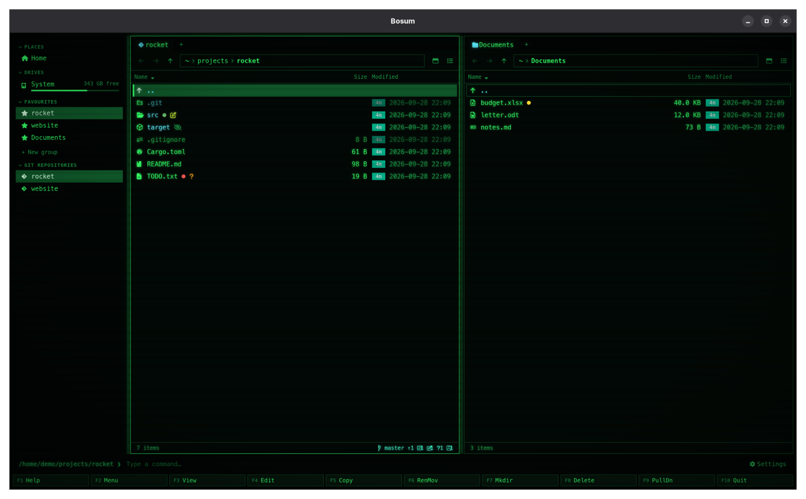
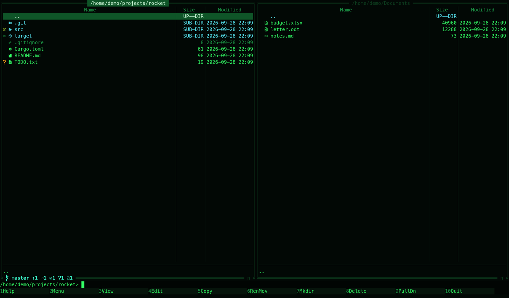
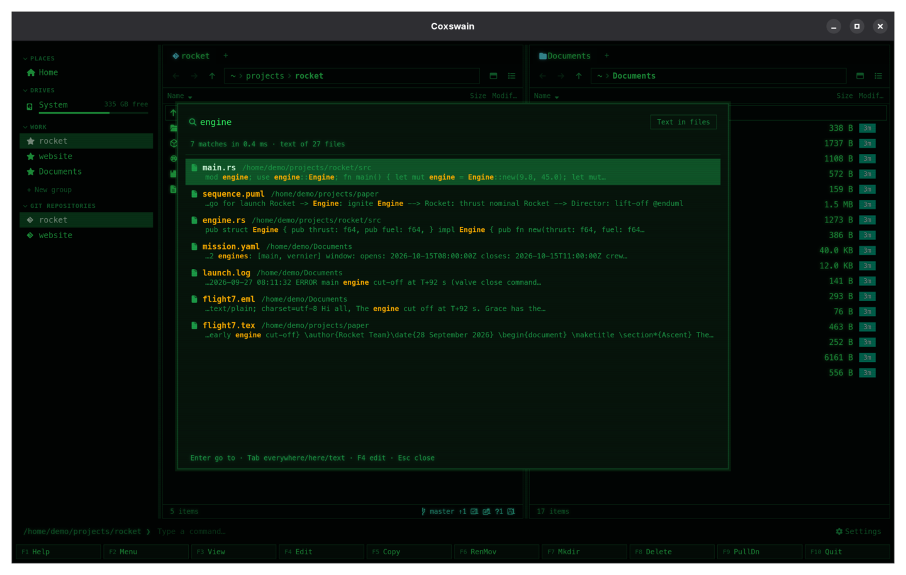
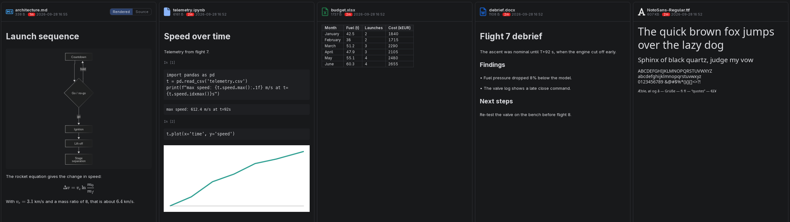

# Coxswain

*The one at the helm, who steers the boat and keeps the crew in time.*

Coxswain is a two-panel file manager in the Norton Commander tradition, built for developers.
It comes as a terminal app (`coxswain`, Rust and Ratatui) and a desktop app (`coxswain-gui`,
Tauri and Svelte 5), both on one shared Rust core and one config file. It finds any file by
its name, its text or what it is about, previews over 60 kinds of file, opens archives like
folders, shows git in every panel, and keeps everything on your machine.


*The desktop app in **Cyber**, its default. Seventeen more themes are one F9 away, from Norton
Commander blue to Windows 95 and Mac OS 9.*

> **Cloud folders are safe.** Coxswain never downloads OneDrive, Dropbox, Google Drive, Proton
> Drive or iCloud files that are only online: it finds them by name and leaves them in the cloud
> until you open one. Earlier versions could download them while indexing; update to 1.28.1.
> [Cloud files](docs/search/cloud-files.md)

## Highlights

- **Norton Commander at heart:** two panels, the F-key bar, a command line and NC's keys. [Panels and keys](docs/panels/README.md)
- **Find by name, text or meaning:** Ctrl+F, and Tab goes deeper, from every name on the machine to what a file is about, inside your zip, 7z and tar archives too; you choose what is read and what is left out (`*.log`, a folder). [Search](docs/search/README.md) · [Inside archives](docs/search/archives.md) · [Choosing the folders](docs/search/folders.md)
- **Gentle with your cloud:** OneDrive, Dropbox, Google Drive, Proton Drive and iCloud files that are only online are found by name, marked with a cloud, and never downloaded unless you open one. [Cloud files](docs/search/cloud-files.md)
- **Ask your files:** a question in your own words, answered by your own chat model from the closest passages, with numbered sources. [Ask](docs/search/ask.md)
- **Search by meaning, in any language:** a small model on your machine, or your own Ollama, Lemonade or OpenAI-style server. [Search by meaning](docs/search/meaning.md)
- **See before you open:** code, Markdown, PDF, Word, PowerPoint, spreadsheets, SQLite and Parquet (in the terminal app F3 too), HTML, fonts, video and more. [The preview pane](docs/previews/README.md) · [Data](docs/previews/data.md)
- **Builds what needs building:** LaTeX, Office, PlantUML and Graphviz previews, with your tools or a sealed container. [LaTeX](docs/previews/latex.md) · [Tools](docs/previews/tools.md)
- **Reads cryptography bills of materials:** a CycloneDX CBOM as a rated tree or sunburst, compared with last month's scan, in both apps. [CBOMs](docs/previews/bom.md)
- **Archives are folders:** zip, 7z and tar (gz, bz2, xz, zst): go in, preview, copy, move, rename, pack, with passwords to open them and to lock new zips and 7z (AES-256). [Archives](docs/files/archives.md)
- **Git in every panel:** branch, ahead and behind, counts, a glyph per file, and who last committed it and when. [Git](docs/panels/git.md)
- **History as folders:** **Ctrl+G** on a file or folder lists its commits; Enter on one browses the files as they were, F5 copies an old version out, and Find file finds commit messages. [Git history](docs/panels/git-history.md) · [History in search](docs/search/history.md)
- **Folder sizes without asking,** instant in your home folder. [Folder sizes](docs/panels/folder-sizes.md)
- **Finds duplicates** by content across folders and disks, and marks the extra copies by rule. [Duplicates](docs/files/duplicates.md)
- **Eighteen themes with the looks of their era,** and 18 languages, Hebrew right to left. [Themes](docs/customise/themes.md) · [Languages](docs/customise/languages.md)
- **Nothing leaves your machine** unless you ask for it. [Privacy](docs/reference/privacy.md)

| | |
|---|---|
|  |  |
| [The terminal app](docs/reference/terminal-app.md) | [Find file, inside files](docs/search/text.md) |
|  |  |
| [The preview pane](docs/previews/README.md) | [Archives as folders](docs/files/archives.md) |

## Install

| System | Terminal app | Desktop app |
|---|---|---|
| macOS | `brew install mwo-dk/coxswain/coxswain` | `brew install --cask mwo-dk/coxswain/coxswain-gui`, or the `.dmg` |
| Linux | `brew install mwo-dk/coxswain/coxswain`, or the static `x86_64-unknown-linux-musl` binary | `.deb`, `.rpm`, `.AppImage`, or the Homebrew cask (x86-64) |
| Windows | `coxswain-terminal-<version>-x86_64-pc-windows-msvc.zip` | `.msi` or `-setup.exe` |
| Any | `cargo install coxswain` | `./install/install.sh` (or `install\install.ps1`) from a clone |

Downloads are on the [releases page](https://github.com/mwo-dk/coxswain/releases/latest).
**The builds are not code-signed:** on Windows click *More info* and *Run anyway*; on macOS, if
the app "is damaged", run `xattr -cr /Applications/Coxswain.app` once (the cask does it for you).
Both apps check once a day for a newer release and give the exact update command
([Update checks](docs/reference/updates.md)). Every way to install and update, and building
from source: [install/INSTALL.md](install/INSTALL.md). Git glyphs want a
[Nerd Font](https://www.nerdfonts.com/); without one set `glyphs = "ascii"`
([Glyphs and fonts](docs/customise/glyphs-and-fonts.md)).

## First steps

1. **Start it** in a folder: `coxswain` (or `cox`) in a terminal, or `coxswain-gui`. Two folders
   open the two panels: `coxswain ~/src ~/Downloads`.
2. **Move** with the arrows, **Enter** opens (a folder, or an archive), **Backspace** goes up,
   **Tab** switches panels.
3. **Mark** with **Insert**, then **F5** copies or **F6** moves to the other panel. **F8** moves
   to the trash, **F7** makes a folder.
4. **Find** anything with **Ctrl+F**; **Tab** looks deeper.
5. **Type** a command and press **Enter**: it runs in the panel's folder.
6. In the desktop app, **Space** shows the preview pane and **Ctrl+,** opens Settings.
7. Forgot a key? **F9** lists every command, and **F1** shows your keys.

More in [Panels and keys](docs/panels/README.md) and [Every default key](docs/panels/keys.md).

## Documentation

The [docs index](docs/README.md) is the full map; every feature has its own page with the keys,
what you see, the settings, and the questions people ask.

| Area | What is in it |
|---|---|
| [Panels and keys](docs/panels/README.md) | The screen, moving, quick search, marking, sorting, tabs, views, folder sizes, git, git history, the mouse, every key |
| [Tags, notes, favourites and the sidebar](docs/organise/README.md) | Colour tags, folder notes, favourite groups, places and drives |
| [Commands, the user menu and scripts](docs/commands/README.md) | The command line, F2 menu, scripts, F3 and F4, opening files |
| [Search](docs/search/README.md) | Names, text, scans, diagrams, git history, meaning, servers, the helper, disks, battery, notices |
| [The preview pane](docs/previews/README.md) | Every format, HTML, Office, diagrams, LaTeX, tools and containers |
| [Files](docs/files/README.md) | Copy, move, delete, clipboard, drag and drop, batch rename, archives, properties, duplicates |
| [Customising](docs/customise/README.md) | Settings, themes, looks, your own theme, languages, keys, glyphs |
| [Reference](docs/reference/README.md) | The terminal app, flags, every config key, privacy, updates, where files are kept |
| [Questions, collected](docs/faq.md) | The common questions, linked to their full answers |

## Layout

```
crates/coxswain-core   config, fs ops, archives, git status and history, search index and store, duplicates (shared)
crates/coxswain        terminal UI (package and binaries: coxswain, cox)
gui/                   Svelte 5 frontend
gui/src-tauri          Tauri backend (binary: coxswain-gui)
```

## Licence

MIT. Every release carries the licences of what it is built from (`THIRD-PARTY-NOTICES.md`, also
inside the apps), an SBOM for each app and a CBOM of the cryptography they use; see
[Licences and bills of materials](docs/reference/bills-of-materials.md).

Norton Commander is a trademark of Gen Digital Inc. Coxswain is an independent project, not
affiliated with or endorsed by Gen Digital.

## Changelog

Newest first. Downloads for each release are on the [releases page](https://github.com/mwo-dk/coxswain/releases).

| Version | Date | What's new |
|---|---|---|
| **1.32.0** | 2026-10-05 | **F1** lists the keys by what they do, under headings (Moving, Panels and tabs, Marking, Files, Archives, Search, Git, Viewing and editing, App), the most used first in each, in both apps; the terminal app puts them in two columns when it is wide enough. The desktop app's **F9** shows the same headings until you type. [The command list and Help](docs/panels/command-list.md) · [Every default key](docs/panels/keys.md) |
| **1.31.0** | 2026-10-05 | Pack (Alt+F5) shows its formats: the desktop app has a *Format* list next to the name (Zip, 7z, tar, tar.gz, tar.bz2, tar.xz, tar.zst) with a line on what each is good for, and in the terminal app Tab and Shift+Tab swap the name's ending. The format you packed into last is suggested next time, in both apps. [Pack and extract](docs/files/pack-and-extract.md#formats) |
| **1.30.3** | 2026-10-05 | The terminal app installed with WinGet says `winget upgrade mwo-dk.Coxswain.Terminal` when a new version is out. [Updates](docs/reference/updates.md) |
| **1.30.2** | 2026-10-04 | The terminal app follows changes on disk: a file another program writes, copies in or deletes appears or goes in its panel within a second, the cursor staying put, and the git line follows commits and checkouts. Two Coxswains changing one archive at once (the desktop app and the terminal app, or two windows) wait for each other, so neither change is lost. Ask says *Waiting for … to answer* until the first word comes, on any server; servers with the OpenAI API are sent nothing ahead of the question. [The terminal app](docs/reference/terminal-app.md#what-you-see) · [Archives as folders](docs/files/archives.md#can-i-change-one-archive-from-the-desktop-app-and-the-terminal-app-at-once) · [Ask](docs/search/ask.md#the-first-answer-takes-long-why) |
| **1.30.1** | 2026-10-04 | **Ctrl+A** marks everything in the folder, files and folders, as in a file explorer, in both apps; the desktop app no longer selects the whole window's text. [Marking](docs/panels/marking.md) |
| **1.30.0** | 2026-10-04 | Find file no longer looks inside the archives in caches and programs' folders (`~/Library/Caches`, `AppData\Local`, `node_modules`, `target`, `.m2`, `/var/cache` …) on any system, so they neither fill the results nor the name index; *Settings → Search inside files → Look inside archives everywhere the names are indexed* (`archives_everywhere`) finds the entries of every archive on the machine by name. A 7z whose packed list of contents says it unpacks to more than 64 MB is not opened, so a crafted one cannot fill the memory. [Inside archives](docs/search/archives.md#which-archives) |
| **1.29.2** | 2026-10-04 | The terminal app installs from crates.io again (`cargo install coxswain`): 1.29.0 and 1.29.1 could not be published there. [Install](README.md#install) |
| **1.29.1** | 2026-10-04 | Previewing a video or a sound on Linux without GStreamer's good plugins no longer takes the desktop app's window down: the preview says what to install (or, in an AppImage on a distribution other than Debian and Ubuntu, that its GStreamer cannot find them) with *Open in its app*. The search helper that starts with your session is registered by the link a package manager keeps on your PATH (Homebrew's `bin/coxswain-gui`), so after an upgrade it starts the new version by itself. [Media](docs/previews/media.md) · [The search helper](docs/search/helper.md) |
| **1.29.0** | 2026-10-04 | Search inside files and Ask have keys of their own: **Shift+F7** (or **Ctrl+Shift+F** in the desktop app) opens Find file at the text of your files, **Ctrl+F7** at Ask; in Find file **Tab** and **Shift+Tab** go forward and back through the depths, and each depth's button names its key. The desktop app's Settings button counts what is new: **Settings → What's new** lists what you can turn on, with *Show me* and *Dismiss*, and every version's changes, the unread ones marked; the terminal app has `coxswain --whats-new`. After an upgrade the search helper that starts with your session no longer points at the removed version (search, text and meaning stopped until it was turned off and on); the app that finds it so registers itself. Lit buttons in Cyber glow on the dark and can be read. [Find file](docs/search/find-file.md) · [Notices and what's new](docs/search/notices.md) · [The search helper](docs/search/helper.md) |
| **1.28.4** | 2026-10-04 | More found while taking the pictures: Help (F1) lists actions by name with keys as on the keyboard (Ctrl+G, not Ctrl+g), Batch rename keeps its rows in line when one has a conflict, an HTML page and a photo's camera details fill the preview as they should, a big icon no longer overlaps the size under it, folder notes are not offered inside an archive or a history, the status line stops saying *Working on…* while a locked archive's password is asked for (both apps), and documents keep their paragraphs' direction in Hebrew. The [keys] example no longer takes Git history's Ctrl+G, and the theme example's cursor row no longer hides folder names. [Changing keys](docs/customise/keys.md) · [Your own theme](docs/customise/own-theme.md) |
| **1.28.3** | 2026-10-03 | Found by trying it all: a history's commits are listed newest first however the pane is sorted (they were in the order of their ids), its folders show no "0 B", its tab is named after the file and the path bar keeps its end (badge included) when the path is long; the terminal app asks for a locked 7z's password again (it went back to the folder without asking); an HTML page's own stylesheet and pictures show in its preview; a 7z with locked names says so in the preview, with *Enter the password*; code, diffs and file names keep their direction in Hebrew; small fixes in *Settings → Search*. The desktop app's previews read pictures, PDFs, fonts and video through its own file protocol, which refuses a cloud file you did not ask for. [Git history](docs/panels/git-history.md) · [Cloud files](docs/search/cloud-files.md) |
| **1.28.2** | 2026-10-03 | Quicker where it was slow: a changed archive has only its changed members read again (105 ms instead of 1.5 s for a zip of 10,000), an archive still downloading waits until it has settled, search by meaning reads only the files it shows, a folder sorted by commit shows at once, the git status and the *Last commit* column follow a commit on their own (desktop app), a file's history goes on past its renames, Ask can be stopped while the model loads and loads it ahead, each tab keeps its scroll position, folders copied out of a history get the commit's date, and zip times are read and written in your time zone. [Performance](docs/reference/performance.md) |
| **1.28.1** | 2026-10-03 | Cloud files are safer still: on Windows a file's cloud state is read from the folder's listing, never by opening the file; the desktop app's readers (text, archives, databases, books, mail, certificates, bills of materials, tool previews, git diff) refuse an online-only file until you press *Download and preview*, whatever the page asks; on Linux, davfs2's WebDAV and FUSE mounts without a subtype count as cloud mounts. [Cloud files](docs/search/cloud-files.md) |
| **1.28.0** | 2026-10-03 | Coxswain no longer downloads your cloud. Earlier versions read every file in the folders they searched, and a file that OneDrive, Dropbox, Google Drive, Proton Drive or iCloud kept only online was downloaded by that read, so indexing could fill the disk and take the machine. Now such a file is told from its metadata alone (Windows' Cloud Files attributes, macOS's dataless flag, cloud mounts on Linux), found by name and never read: no text, no hash, no thumbnail, no preview, no git, until you open it. A cloud glyph marks it in both apps, the preview offers **Download and preview**, a notice says which clouds were found, and *Settings → Search inside files* reads them anyway if you want (`cloud`, `cloud_read`). A file that goes back to the cloud loses its text at the next pass. [Cloud files](docs/search/cloud-files.md) |
| **1.27.4** | 2026-10-03 | Security review: an HTML preview may load pictures, styles and fonts from the page's own folder only, not from anywhere on the disk; extracting a crafted tar cannot fill the memory; changing a zip locked the old way (ZipCrypto) no longer scrambles its locked files: they are locked anew with AES-256, with the password, and a wrong password the check byte lets through is noticed; a history copied out on Windows never makes a `.git` by another spelling; Ask's errors never repeat a password in the server's URL; releases carry a `SHA256SUMS` and build provenance. [Security](docs/reference/security.md) |
| **1.27.3** | 2026-10-03 | Dependencies brought up to date: getrandom 0.4 for the search helper's token, Mermaid 12.1 for diagrams, Vite 8.3.2, and the latest patch releases of tokio, uuid, libc and others. No advisories open. [Install](install/INSTALL.md) |
| **1.27.2** | 2026-10-02 | The sidebar's drives and their free space stay current: read again every 30 seconds while the window is in view and when it comes back to the front, so a USB stick appears without reopening the window. [The sidebar](docs/organise/sidebar.md) |
| **1.27.1** | 2026-10-01 | A SQLite database in the desktop preview shows each table's first rows under its schema, open at once for small databases. [Data files](docs/previews/data.md) |
| **1.27.0** | 2026-10-01 | You choose what search leaves out: *Settings → Search inside files → Left out* lists folder names and now file patterns too (`*.log`, `secret*`), with Add and ×, and says how `.nosearch` leaves out one folder. *Show in panel* next to `search.db` (and the built-in model) opens its folder with the cursor on it. **F3** in the terminal app shows a SQLite database or a Parquet file as its tables, row counts and first rows. On a machine without Coxswain's cache folder, the first search helper now keeps the files' text (it could not make its store before). [Choosing the folders](docs/search/folders.md) · [Data](docs/previews/data.md) |
| **1.26.6** | 2026-10-01 | Search by meaning no longer stops after the first files: a store whose Markdown was read again after an update failed every scan from then on, so nothing more was read and no vectors came; it mends itself now. When reading or vectors stop, Settings, the terminal app's Find file and a notice say why (*No vectors: … Connection refused*). Coxswain's own cache folder is never read into the search, on any system. [Search by meaning](docs/search/meaning.md#vectors-stopped-coming-why) |
| **1.26.5** | 2026-10-01 | The desktop app's preview shows files again: since 1.26.0 every file's preview stayed empty, Markdown, Parquet, databases, LaTeX, PDF and Office alike (a name lost in a merge stopped it). A LaTeX document seen before shows from the cache at once and is no longer built again when another file in its folder changes, also inside archives. A check on every pull request now finds a name that is not declared, and `tools/preview-check.py` opens a file of each kind in the real app. [LaTeX](docs/previews/latex.md) |
| **1.26.4** | 2026-10-01 | What Coxswain keeps about your files (the name index, the search store, previews, notes, tags and favourites) is readable by you alone, also on installs from before, from their first start after the update. [Privacy](docs/reference/privacy.md#can-other-users-on-the-same-machine-see-my-index) |
| **1.26.2** | 2026-10-01 | Final performance review: thumbnails keep only the rows on screen (100,000 files in 14 ms), a folder's listing is half the size, highlighting runs off the window's thread, the terminal app copies on a thread with `(2/3)` progress and lists a history without freezing, files copied out of a history keep the commit's date, a solid 7z previews, copies and searches every file again, a short folder after a long one no longer shows blank, and Ask follows its answer only while you are at the bottom. [Performance](docs/reference/performance.md) |
| **1.26.1** | 2026-10-01 | Final security review: a repository someone else made can no longer run its own programs through git (filter drivers, file system monitor, signature checker, fetch); LibreOffice converts with macros and link updates off; on Windows a file opens through the shell, not `cmd`; archives cannot lead outside, fill the disk on a preview or lose files on a move, and keep their long names and permissions when changed; a 7z key is made as 7-Zip makes it; Stop ends an Ask while the model thinks; settings saves never overwrite each other; releases come only from master. [Safety](docs/previews/safety.md) · [Security](docs/reference/security.md) |
| **1.26.0** | 2026-10-01 | Pack with a password: Alt+F5 into a zip or 7z takes a password (typed twice), every file locked with AES-256, and a 7z's file names hidden too if you like; the new archive opens without asking again while the app runs. Both apps. [Passwords](docs/files/archive-passwords.md#locking-a-new-archive) |
| **1.25.2** | 2026-10-01 | Nothing leaves the machine from a preview: the webview is held to the app and your disk, HTML pages see their own folder only, a project's `latexmkrc` no longer runs, and a locked 7z stays locked when changed. [Safety](docs/previews/safety.md) · [Privacy](docs/reference/privacy.md) |
| **1.25.1** | 2026-10-01 | Performance review: the desktop app keeps only the rows on screen in the page, so a folder of 100,000 files lists in 30 ms and the cursor moves in one; nothing that touches the disk runs on the window's thread; both apps say *Working on …* during a copy, move, delete, extract or pack and while a slow folder is read; the terminal app sorts without rereading and draws a frame in half a millisecond however much is marked. [Performance](docs/reference/performance.md) |
| **1.25.0** | 2026-10-01 | Search inside archives: the files in your zip, 7z and tar archives are found by name, by their text, by meaning and by Ask, shown as a path through the archive, and Enter opens the archive there; a changed archive is read again, a locked one keeps its secrets. On by default, *Search inside archives* in Settings. [Inside archives](docs/search/archives.md) |
| **1.24.0** | 2026-10-01 | Git history as folders: Ctrl+G on a file or folder lists the commits that touched it, Enter on one browses the files as they were, with a preview, the commit's diff, F3 and F5; a *Last commit* column (date and author) in both apps; commit messages, authors and changed paths in Find file, by text and by meaning. Text previews of files inside archives show again. [Git history](docs/panels/git-history.md) · [History in search](docs/search/history.md) |
| **1.23.1** | 2026-10-01 | Dependencies reviewed: every crate and npm package at its latest version, the one known vulnerability (lodash in the Mermaid renderer) fixed, the terminal app without widgets it never draws, draw.io diagrams drawn without a word to diagrams.net, and from now on a weekly check of every dependency for advisories, with Dependabot proposing updates. [Security](docs/reference/security.md) |
| **1.23.0** | 2026-10-01 | Files inside archives show in the preview pane, and F3 views them in the terminal app, from a copy of just that file; locked ones ask for their password. [Archives](docs/files/archives.md) |
| **1.22.3** | 2026-10-01 | Both apps reviewed: Ctrl+C in a command keeps the terminal app, Delete while typing a command deletes nothing, Alt+F2 paths start from the right panel, the F-key bar names the action a shared key runs; the desktop app lists your own themes under F9, runs F2 entries with an upper-case key, shows USB sticks under `/run/media`, draws ASCII or your own folder/file/link glyphs, keeps Automatic on British English, and says when an editor or opener fails. [Keys](docs/panels/keys.md) · [Glyphs](docs/customise/glyphs-and-fonts.md) |
| **1.22.2** | 2026-10-01 | Archive review: a 7z with locked contents asks for its password when changed, F5/F6/Ctrl+V into an archive keep the name you give, F8 inside says Delete, only the locked files run again after a password, an archive is listed once while it does not change and written by one change at a time, 7z entries keep their dates, extraction reads a 7z once, an archive inside one is not opened empty, moves fall back to copying only across disks, case-only renames work where case does not count, and a batch rename that fails gives names back. [Archives](docs/files/archives.md) |
| **1.22.1** | 2026-10-01 | Search review: folder totals twenty times faster over a big store, searches go on while the index reads a moved-in folder, a damaged index cache never crashes the helper, a server's refusal of one file no longer stops search by meaning, API keys reach the model lists, diagram sentences get vectors in long files, and honest preview notes. [Search](docs/search/README.md) |
| **1.22.0** | 2026-10-01 | Ask: Tab to the fourth depth of Find file, ask a question, and your own chat model answers from your files, citing them; follow-ups work, nothing is kept. [Ask](docs/search/ask.md) |
| **1.21.0** | 2026-10-01 | Cryptography bills of materials (CycloneDX CBOMs): every algorithm, key, certificate and protocol rated, as a tree or sunburst, compared with an older scan, in both apps. [CBOMs](docs/previews/bom.md) |
| **1.20.0** | 2026-10-01 | More archive kinds: tar.bz2, tar.xz, tar.zst and 7z, read and written, and locked 7z archives open with their password. [Archives](docs/files/archives.md) |
| **1.19.0** | 2026-10-01 | Archives are folders: go in with Enter, copy and move in, out and between them, rename, make folders, take out, pack with Alt+F5, with passwords for locked zips. [Archives](docs/files/archives.md) |
| **1.18.0** | 2026-09-30 | Diagrams are searched by what they say: a sentence per arrow in draw.io, Mermaid, Graphviz and PlantUML. [Diagrams in search](docs/search/diagrams.md) |
| **1.17.0** | 2026-09-30 | HTML files show as pages, safely sealed off; the title bar shows the version and search depths on Linux too. [HTML pages](docs/previews/html.md) |
| **1.16.0** | 2026-09-30 | Search by meaning on your own Ollama, Lemonade or any OpenAI-style server. [Servers](docs/search/servers.md) |
| **1.15.0** | 2026-09-30 | Notices say once what search can do and what is off; the titles show the version and search depths. [Notices](docs/search/notices.md) |
| **1.14.0** | 2026-09-30 | LaTeX builds by itself when its sources change, and another engine takes over when one fails. [LaTeX](docs/previews/latex.md) |
| **1.13.0** | 2026-09-30 | Find file shows where it can look, and that search by meaning is there to turn on. [Find file](docs/search/find-file.md) |
| **1.12.1** | 2026-09-30 | Terminal app: typing in Find file never waits for the search. [Find file](docs/search/find-file.md) |
| **1.12.0** | 2026-09-30 | Search by meaning: a small multilingual model on your machine finds files about what you type. [Search by meaning](docs/search/meaning.md) |
| **1.11.0** | 2026-09-30 | LaTeX picks XeLaTeX or LuaLaTeX by the packages and builds past errors; the preview cache can be cleared. [LaTeX](docs/previews/latex.md) |
| **1.10.0** | 2026-09-30 | PowerPoint decks show at once, drawn in the app; LibreOffice's exact view follows. [Office](docs/previews/office.md) |
| **1.9.1** | 2026-09-30 | Office previews work again from the AppImage. [Office](docs/previews/office.md) |
| **1.9.0** | 2026-09-30 | Search reads pictures, scans and older Office files with programs you have installed. [Scans and pictures](docs/search/scans.md) |
| **1.8.0** | 2026-09-30 | The search helper can start with your session: systemd, launchd or the Windows Run key. [The search helper](docs/search/helper.md) |
| **1.7.0** | 2026-09-30 | draw.io diagrams drawn in the app by draw.io's own viewer; slides and documents render by themselves. [Diagrams](docs/previews/diagrams.md) |
| **1.6.0** | 2026-09-30 | Search pauses on battery, and knows removable disks wherever they are mounted. [Battery](docs/search/battery.md) · [Removable disks](docs/search/removable-disks.md) |
| **1.5.0** | 2026-09-30 | Search inside files in Settings: the folders read, names only, Index now, Delete the index. [Choosing the folders](docs/search/folders.md) |
| **1.4.2** | 2026-09-30 | A new app icon in Cyber's colours. [Themes](docs/customise/themes.md) |
| **1.4.1** | 2026-09-30 | Search follows changes on disk within seconds; Duplicates reuses the hashes search already has. [Text in files](docs/search/text.md) · [Duplicates](docs/files/duplicates.md) |
| **1.4.0** | 2026-09-30 | Folder sizes in your home folder are there at once. [Folder sizes](docs/panels/folder-sizes.md) |
| **1.3.1** | 2026-09-29 | Search inside PDFs. [Documents it reads](docs/search/documents.md) |
| **1.3.0** | 2026-09-29 | Search inside Word, spreadsheets, slides, mail, books and notebooks. [Documents it reads](docs/search/documents.md) |
| **1.2.0** | 2026-09-29 | Search inside your files: Tab in Find file. [Text in files](docs/search/text.md) |
| **1.1.0** | 2026-09-29 | One file name index for every window and the terminal app. [Names everywhere](docs/search/names.md) |
| **1.0.1** | 2026-09-29 | Screenshots in Cyber, diagrams in the theme's colours, Homebrew as the one package manager. [Install](install/INSTALL.md) |
| **1.0.0** | 2026-09-29 | Coxswain under its own name: two panels in the terminal and on the desktop, previews, duplicates, 18 themes and 18 languages. [Docs index](docs/README.md) |
