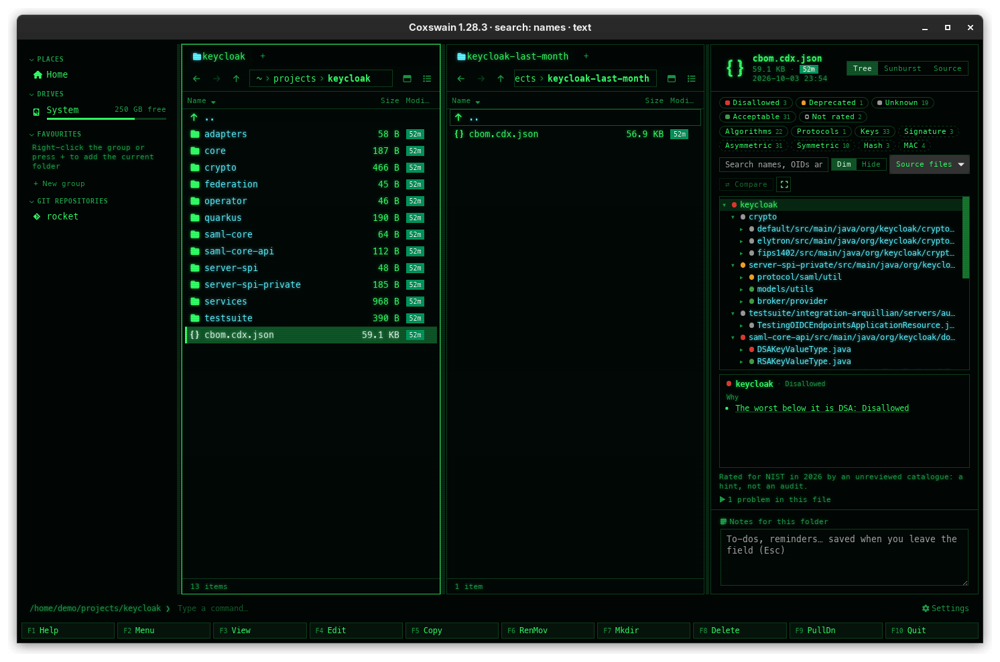
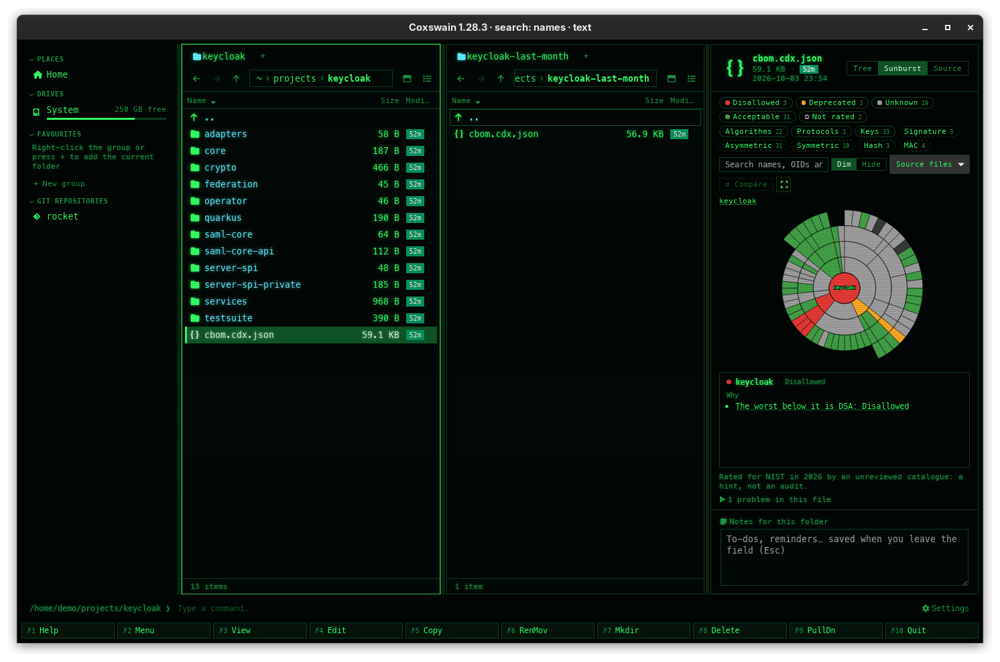
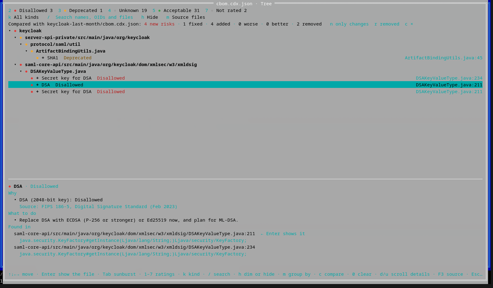
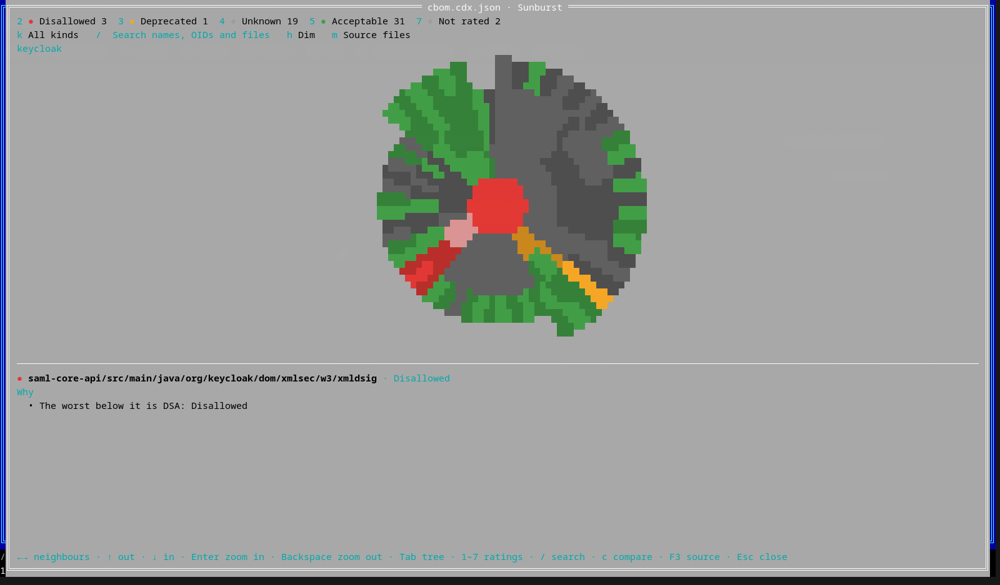

# Cryptography bills of materials

A CycloneDX **CBOM** (Cryptography Bill of Materials) lists the cryptography an application
uses: algorithms, keys, certificates and protocols, and where in the code each one is found.
Scanners such as [CBOMkit](https://github.com/cbomkit/cbomkit) write them. Coxswain shows one
as a readable picture instead of a few thousand lines of JSON: which cryptography is weak,
where it is, and what changed since the last scan. Both apps have it.

- [Using it](#using-it)
- [What the colours mean](#what-the-colours-mean)
- [Where ratings come from](#where-ratings-come-from)
- [Comparing two scans](#comparing-two-scans)
- [Files it reads](#files-it-reads)
- [Safety and speed](#safety-and-speed)
- [Questions](#questions)

## Using it

**Desktop app.** Select a BOM and the preview pane shows it. The switch at its top picks
**Tree**, **Sunburst** or **Source**, and the choice sticks. **⤢** opens the same view in a
window, with the details beside the tree.

- **The tree** is grouped by **dependencies** (components and what they contain, depend on and
  provide), by **source files** (the best view of scanner output, which has no components) or
  by **kind**. *Group by* switches when the BOM allows more than one. Chains of folders with a
  single child are folded into one row. Keys a scanner named by a random ID
  (`secret-key@8ddfc05a-…`) are shown by what they are: *Secret key for HMAC-SHA256*.
- **Keys:** ↑/↓ move, → opens or goes in, ← closes or goes to the parent, Home/End. **Enter**
  shows the file the selected asset is found in, in the other pane, so the BOM stays in view.
- **The details box** says why the selected row has its rating (*RSA (2048-bit key):
  Acceptable*, with the rule's source), what the catalogue advises for anything that is not
  green, every place the asset is found (with the API call, when the scanner recorded it), and
  the entry as it is in the file. A reason that names another asset is a link to it.
- **Filters:** the chips toggle ratings, kinds (algorithms, certificates, protocols, keys,
  components) and families (signature, asymmetric, key exchange, symmetric, hash, MAC), each
  with its count. The search box matches names, OIDs and source paths. **Dim** greys out what
  does not match and keeps the tree; **Hide** shows only the matches and what they sit in.
- **The sunburst** draws the tree as rings: the item in the middle, its children around it, an
  arc's width in proportion to the assets under it. Clicking an arc selects it and zooms in;
  the centre and the breadcrumbs zoom out. With the sunburst focused, Backspace zooms out and
  Enter in. Filters apply here too.

**Terminal app.** **F3** on a BOM opens the viewer full screen; **F3** there (or `s`) shows the
source in your pager, as F3 did before. `bom_viewer = false` in the config keeps the pager.

| Key | Does |
|---|---|
| ↑ ↓ ← → Home End PgUp PgDn | Move, open and close, as in the desktop app |
| Enter | Put the panel's cursor on the file the asset is found in |
| Tab | Tree or sunburst. In the sunburst, ←→ go to the neighbours, ↑ out, ↓ in, Enter zooms in and Backspace out |
| 1 – 7 | Toggle a rating: broken, disallowed, deprecated, unknown, acceptable, quantum-safe, not rated |
| k | Cycle the kind shown |
| / | Search; Enter or Esc ends typing |
| h | Dim or hide what does not match |
| m | Group by dependencies, source files or kind |
| c | Compare with the file under the other panel's cursor; `c` again stops |
| n / r | While comparing: only what changed / the list of removed assets |
| 0 | Clear the filters |
| d / u | Scroll the details |
| Esc | Close |

The terminal sunburst is drawn with half blocks (`▀`): each character cell holds two pixels,
so the rings come out round in any font.

## What the colours mean

| Rating | Colour | Meaning |
|---|---|---|
| Quantum-safe | Green, ringed | Approved, and not vulnerable to a quantum computer (ML-KEM, ML-DSA, SLH-DSA, LMS/XMSS) |
| Acceptable | Green | Approved now |
| Unknown | Grey | Not an algorithm the catalogue knows, or a parameter the rating needs is missing (RSA without a key size could be RSA-1024). **Never green** |
| Deprecated | Yellow | Allowed, but on the way out (SHA-1, a certificate that expires within 90 days) |
| Disallowed | Red | Not permitted by the profile (DSA, 3DES, an expired certificate) |
| Broken | Red | Practically broken (MD5, DES, RC4, RSA-1024) |
| Not rated | Hollow | Padding, key derivation, random number generators and hybrid combiners: nothing to rate on their own |

The colours are the same in every theme, and the rating is always also written out, so colour
is never the only signal. A component, folder or file shows the worst rating beneath it, and
its details name the asset responsible.

## Where ratings come from

Ratings come from the policy catalogue of cipherscape, a browser CBOM visualizer by the same
author: 19 algorithm families with rules per profile and
year, each citing its source (NIST SP 800-131A, SP 800-57, IR 8547, FIPS 186-5 and 203–205).
Coxswain rates with the **NIST profile for the current year**.

> The catalogue is an **unreviewed seed**. The view says so under the tree. A rating is a
> hint, not an audit.

- **Which algorithm is it?** Scanner output is messy: OIDs are often copied wrongly. The OID,
  the `algorithmFamily` and the name each vote, and the majority wins; on a tie the name wins.
  An outvoted OID is listed under the file's problems. A composite such as `SHA512withRSA` is
  rated as its worst part.
- **Parameters** come from the name (`AES128`, `RSA-2048`, `EC-secp384r1`), the OID, the
  `parameterSetIdentifier` and the curve. Where one is missing and a rule needs it, the rating
  is *unknown*, never a guess.
- **Keys** are rated by their own size through their algorithm, or take their algorithm's
  rating. **Certificates** by what they are signed with, their key and their expiry date.
  **Protocols** by their cipher suites' algorithms.

## Comparing two scans

Put an older scan of the same application under the cursor in the other pane (panel) and press
**Compare** (`c` in the terminal). The bar shows **new risks** (assets that came in not green,
or got worse), **fixed** (risks that went away), and how many were added, rated worse, rated
better and removed. Each is a filter; rows get a mark (＋ added, ▲ worse, ▼ better), and the
removed assets are listed on their own, since they have no row.

Scanners make up new IDs on every run, so assets are matched by **what they are and where they
sit**, never by `bom-ref`: an algorithm with its parameters, a key by its type, size and
algorithm, a certificate by subject and issuer, each at the nearest folder, file or component
above it. A renewed certificate therefore counts as rated better, not as removed and added.

## Files it reads

- **Recognised by name** (`*.cdx.json`, `*.cdx.xml`, `*.cbom.json`, `bom.json`, `bom.xml`) or,
  for any other `.json` or `.xml` file, by CycloneDX's marks in its first 8 KB.
- **CycloneDX 1.6 and 1.7**, JSON and XML. Other versions load with a warning.
- **Lenient:** dangling references, duplicate or missing `bom-ref`s and names nothing knows
  are listed as the file's problems, and the rest still shows. Only a file that is not
  CycloneDX, is not valid JSON or XML, or declares a DOCTYPE is refused.
- **A CycloneDX file with no cryptography** (a plain SBOM) opens too, with its components; views
  for software BOMs are to come.

## Safety and speed

- The file is only read, and nothing leaves the machine. XML with a DOCTYPE is refused, which
  rules out entity expansion and external entities, and no entity is ever looked up.
- Up to 64 MB. A 50,000-node BOM (25 MB) is read and rated in about 0.4 s; filtering it takes
  about 15 ms per keystroke. Long lists show 500 rows at a time, and the sunburst merges arcs
  thinner than half a degree into one, so it stays at a few hundred shapes.
- A file named in the BOM is only offered when it is inside the BOM's folder: a path that
  climbs out of it is never followed.

## Questions

**Why is an RSA key or an elliptic curve "Unknown", when RSA is fine?**
Because the rating depends on a parameter the BOM does not give. RSA-1024 is broken and
RSA-2048 acceptable, so RSA without a key size cannot be rated honestly, and it is never
guessed. The details box says what is missing: *RSA: unknown without the key size*. Scanners
often know it; a newer CBOMkit or a scan with more context may fill it in.

**Why is a whole folder red when almost everything in it is green?**
A folder, file or component shows the **worst** rating beneath it, so one DSA key turns its
folder, its parents and the root red. Select the folder: the details box says *The worst below
it is DSA: Disallowed*. In the desktop app, clicking that line selects DSA. In the terminal app,
press **2** (disallowed) and **h** (hide) to see only what is disallowed, and where it sits.

**Enter (or a click under "Found in") does nothing, or the line says "Not next to this BOM".**
A BOM names files relative to the repository it scanned. Coxswain looks for them in the BOM's
own folder, which is where scanners write it (`repo/cbom.json`). A BOM copied elsewhere, or
from a scan of another checkout, finds nothing there. Paths that would climb out of the BOM's
folder (`../`) are never followed.

**The compare lists an asset as removed and added again. Why not as changed?**
Assets are matched by what they are and where they sit. When a scan moves an algorithm to
another file, or learns its key size, it is a different asset by that measure, so the old one
is *removed* and the new one *added*. What changed only in its rating, such as a renewed
certificate, is shown as better or worse.

**Can it rate against CNSA 2.0, or show the ratings for 2031?**
Not yet: both apps rate with the NIST profile for the current year. The catalogue already
holds CNSA 2.0 and the dates on which ratings change, so a profile and year choice can follow.

**How do I get the old F3 back in the terminal app?**
In the viewer, **F3** again (or `s`) opens the BOM in your pager, as F3 did before. Quitting
the pager brings you back to the viewer, and **Esc** to the panels. To make F3 always open the pager, set `bom_viewer = false` in
`config.toml`.

**Does it read SPDX files, or the vulnerabilities in an SBOM?**
No. It reads CycloneDX 1.6 and 1.7, JSON and XML. A CycloneDX SBOM without cryptography opens
with its components, all *not rated*, and a line saying that views for software BOMs are to
come.

**The terminal app's sunburst is egg-shaped.**
It is drawn in half blocks and needs the terminal's cell size to come out round. Terminals that
report their size in pixels (Alacritty, kitty, WezTerm, foot) get round rings; others are
assumed to have cells twice as tall as wide.
