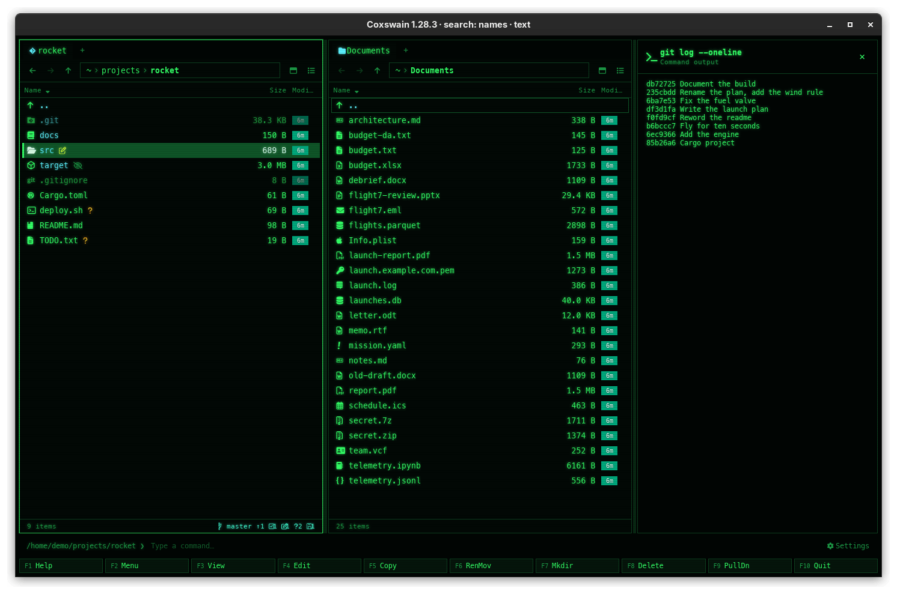

[← README](../../README.md) · [Docs index](../README.md) · [Commands, the user menu and scripts](README.md)

# The command line and its output

Under the panels is a command line, as in Norton Commander. Start typing and your text lands
there; **Enter** runs it with the shell in the active panel's folder. Use it for the quick
`git pull`, `make` or `mv *.jpg photos/` without leaving Coxswain.

*The terminal app's command line: the prompt is the active panel's folder.*

*The desktop app's command line, above the F-key bar.*

## Contents

- [How to use it](#how-to-use-it)
- [cd is built in](#cd-is-built-in)
- [The shell](#the-shell)
- [What you see](#what-you-see)
- [Settings and config.toml](#settings-and-configtoml)
- [In the terminal app](#in-the-terminal-app)
- [Questions](#questions)

## How to use it

1. Type. A plain character that is not bound to a key goes to the command line; in the desktop
   app the line takes the focus.
2. To put the name under the cursor into the line, press **Ctrl+Enter** or **Ctrl+J** (*Path to
   command line*). The name is quoted for the shell when it needs it (`'My Files'`) and a space
   is added after it, so you can add several in a row.
3. Press **Enter**. The line runs in the active panel's folder.
4. Afterwards both panels are read again, so files the command made or removed show at once.

| Key | Desktop app | Terminal app |
|---|---|---|
| **Enter** | Runs the line | Runs the line |
| **Backspace** | Deletes the character before the cursor | Deletes the last character |
| **Esc** | Clears the line (with an empty line: closes the preview pane) | Clears the line |
| **Left**, **Right**, **Home**, **End**, **Delete** | Move and edit in the line, while it has text | Act on the panel as usual |
| **Ctrl+C**, **Ctrl+X**, **Ctrl+V** | Copy, cut and paste text in the line, while it has text | — |
| **Ctrl+Enter**, **Ctrl+J** | Add the name under the cursor | Same |
| **Up**, **Down**, function keys | Act on the panel as usual | Same |

**The first character.** Some plain keys are bound while the line is empty: **+** (*Mark
group*), **-** (*Unmark group*), **\*** (*Invert marks*), **Space** (*Preview* in the desktop
app) and **Backspace** (*Parent folder*). Once the line has text, they type into it. So a command
cannot start with one of them; start with another character, or press **Ctrl+Enter** first.

## cd is built in

A command's own `cd` cannot change Coxswain's folder, so `cd` is handled by Coxswain itself:

| You type | Goes to |
|---|---|
| `cd src` | `src` in the panel's folder |
| `cd ..` | The parent folder |
| `cd ~/Downloads` | `Downloads` in your home folder |
| `cd "My Files"` or `cd 'My Files'` | The folder with a space in its name (outer quotes are removed) |
| `cd /etc` | An absolute path |
| `cd` | Your home folder |

The active panel goes there; the other panel stays. Only `cd` on its own, or `cd` followed by a
space, is taken; `cd src && make` is `cd` to a folder named `src && make`.

## The shell

| | Linux and macOS | Windows |
|---|---|---|
| Terminal app | `$SHELL -c "<line>"` (`sh` when `$SHELL` is unset) | `cmd /C "<line>"` |
| Desktop app | `sh -c "<line>"` | `cmd /C "<line>"` |

On macOS the desktop app takes its `PATH` from your login shell when it starts, so programs from
Homebrew are found even when it was started from the Dock. From an AppImage, commands run
without the AppImage's own libraries in their environment.

## What you see

| | Terminal app | Desktop app |
|---|---|---|
| While it runs | The panels step aside. The terminal shows `/home/demo/projects/rocket> git log` and then the command's own output; the program has the real terminal and can read keys | The status line says *Running git log…*. The app stays usable |
| Afterwards | The panels come back at once | The [preview pane](../previews/README.md) opens and shows the output, headed with the command in bold and *Command output* under it |
| Output shown | As the program writes it | Standard output, then standard error, then `[exit status: 1]` on a line of its own when it failed. A command that printed nothing shows *(no output)* |
| Look again | **Ctrl+O** (*Panels on/off*) hides the panels and shows the terminal with the last output; any key brings the panels back | The `×` in the output's header (*Back to preview*) goes back to the file preview; **Esc**, **F3** or **Space** close the pane |
| `cd` to a folder that is not there | Status line: *cd: no such folder: foo* | Status line: the error, for example `/home/demo/foo: No such file or directory (os error 2)`, and the panel stays |

## Settings and config.toml

No Settings item. The key *Path to command line* is `copy_path` under `[keys]`, default
`["Ctrl+Enter", "Ctrl+J"]`; *Panels on/off* is `toggle_panels`, default `["Ctrl+O"]`. The
theme slots `cmdline` colour the line ([Your own theme](../customise/own-theme.md)). The shell
cannot be set: it is `$SHELL` in the terminal app and `sh` in the desktop app.

## In the terminal app

It works as in Norton Commander: the command gets the real terminal, so `vim`, `less`, `ssh`,
`htop` and prompts that ask for a password all work, and **Ctrl+O** shows what the last command
printed. The desktop app has no terminal to give: its commands get no input (standard input is
empty) and their output is collected and shown when they end. Everything else, `cd`, the quoting
and **Ctrl+Enter**, is the same in both apps.

## Questions

#### Can I run `vim`, `less`, `ssh` or `sudo` from the command line?

In the terminal app, yes: the panels step aside and the program has the terminal until it
ends. In the desktop app, no: a command gets no input and its output is collected, so an
interactive program either ends at once, waits for ever, or prints nothing useful, and `sudo`
cannot ask for your password. Use a terminal, or the terminal app, for those.

#### The output flashed by in the terminal app. Where is it?

Press **Ctrl+O**: the panels hide and the terminal shows what the command printed. Any key
brings the panels back. For commands whose output you always want to read, put them in the
[user menu](user-menu.md) with `wait = true`, which waits for **Enter** before the panels return.

#### How do I stop a command that runs too long in the desktop app?

There is no stop button. The command runs until it ends; the app stays usable meanwhile, and
the status line keeps saying *Running …*. Stop the program from a terminal (`kill`, or `pkill`
with its name) if you have to. In the terminal app, **Ctrl+C** stops the command and brings the
panels back (on Windows it ends the terminal app too, for now).

#### Why does `cd -` not work?

`cd` takes a folder, and `-` (the previous folder) is not supported: it looks for a folder
named `-`. Use **Alt+Left** (*Back*) in the desktop app ([Tabs, back and forward](../panels/tabs-and-panes.md)).

#### My fish (or zsh) syntax works in the terminal app but not in the desktop app.

The terminal app uses your `$SHELL`; the desktop app always uses `sh`. Write the line for `sh`,
or call your shell yourself: `fish -c 'for f in *.png; echo $f; end'`.

#### What does Ctrl+O do in the desktop app?

It switches between one pane and two ([Tabs, back and forward, one pane or two](../panels/tabs-and-panes.md)).
The command output is in the preview pane instead.

#### Ctrl+Enter does nothing in my terminal.

Many terminals send the same code for **Ctrl+Enter** as for **Enter**. Use **Ctrl+J**, which
does the same, or bind `copy_path` to another key.

#### Can I run a command inside an archive I am browsing?

No. A folder inside an archive is not a real folder, so the command cannot start there and
fails with an error. Go to the folder that holds the archive first, or extract it
([Pack and extract](../files/pack-and-extract.md)).

#### Is there a history of commands?

No. The line is cleared when a command runs, and there is no **Up** for the last one: **Up**
moves the panel cursor. Keep the commands you use often in the [user menu](user-menu.md).

---
[← Previous: Commands, the user menu and scripts](README.md) · [Next: The user menu, F2 →](user-menu.md)
