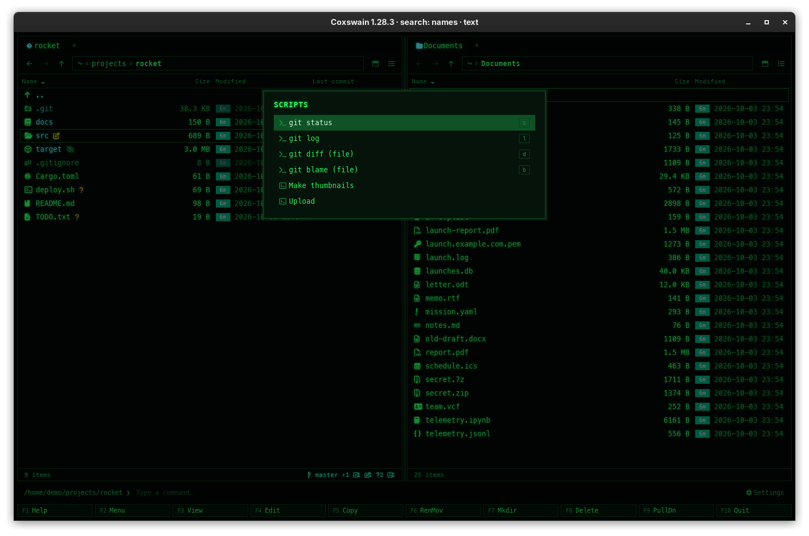
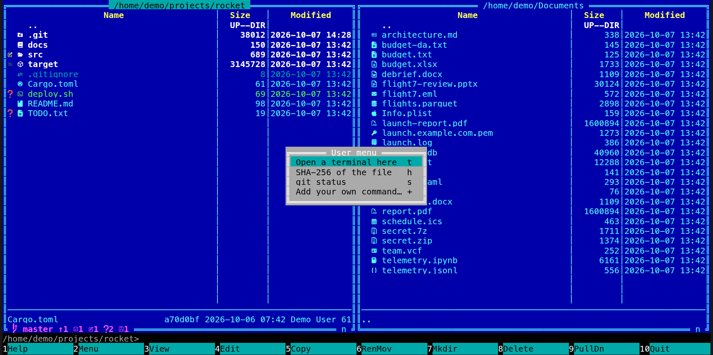

[← README](../../README.md) · [Docs index](../README.md) · [Commands, the user menu and scripts](README.md)

# The user menu, F2

**F2** opens a menu of commands you keep in `config.toml`, each with a key of its own: one
keystroke runs `git status`, `cargo test` or a zip of the marked files, in the active panel's
folder. Placeholders put the file under the cursor or the marked files into the command.




## How to use it

1. Put the cursor on a file, or mark some ([Marking files](../panels/marking.md)).
2. Press **F2**, or pick *Menu* in the command list (**F9**).
3. Press an entry's key to run it at once, or move with **Up** and **Down** and press **Enter**.
   A click runs an entry in the desktop app. **Esc** closes the menu.

| Key | Desktop app | Terminal app |
|---|---|---|
| **F2** | Opens *Scripts*: your `[[user_menu]]` entries, then the [script files](scripts.md) | Opens *User menu*: your `[[user_menu]]` entries |
| An entry's key | Runs it | Runs it |
| **Up**, **Down**, **Enter** | Move, run | Move, run |
| **Esc** | Closes | Closes |

## The entries it comes with

| Key | Label | Command | `wait` |
|---|---|---|---|
| `s` | git status | `git status` | yes |
| `l` | git log | `git log --oneline --graph --decorate -50` | yes |
| `d` | git diff (file) | `git diff -- %f` | yes |
| `b` | git blame (file) | `git blame -- %f \| less` | no (`less` pages it) |

## Your own entries

Each entry is a `[[user_menu]]` table in `config.toml` ([Configuration](../reference/configuration.md)):

```toml
[[user_menu]]
key = "t"                 # the key that runs it inside the menu
label = "cargo test"      # what the menu shows
command = "cargo test"    # run with the shell in the active panel's folder
wait = true               # terminal app: wait for Enter afterwards

[[user_menu]]
key = "z"
label = "Zip the marked files"
command = "zip -r marked.zip %s"

[[user_menu]]
key = "o"
label = "Open the folder in VS Code"
command = "code %d"
```

Your own list **replaces** the four git entries. To keep them, list them again next to yours;
`coxswain --dump-config` prints them.

In `command`:

| Placeholder | Becomes |
|---|---|
| `%f` | The name of the file under the cursor: the name only, since the command runs in its folder. Empty on `..` |
| `%d` | The panel's folder, as a full path |
| `%s` | The marked files as full paths, separated by spaces; when nothing is marked, the name under the cursor |
| `%%` | A single `%` |

Each is quoted for the shell when it needs it: `'it'\''s here.txt'` on Linux and macOS,
`"My File.txt"` on Windows. Names of only letters, digits and `-_./+,:@` stay as they are. So
names with spaces or quotes are safe; do not put your own quotes around a placeholder.

## What you see

- **The menu:** titled *Scripts* in the desktop app and *User menu* in the terminal app. Each row
  is the label with its key at the right; in the desktop app `[[user_menu]]` rows have a terminal
  icon and script files a script icon.
- **Running:** the same as a line typed on the [command line](command-line.md#what-you-see). In the
  terminal app the panels step aside, the terminal shows `folder> command` and its output, and
  with `wait = true` it ends with `-- press Enter --`. In the desktop app the status line says
  *Running git status…* and the preview pane then shows the output under the label and *Command output*.
- Afterwards both panels are read again.

## Settings and config.toml

No Settings item: the menu is edited in `config.toml`.

| Key | Type | Default | Means |
|---|---|---|---|
| `[[user_menu]]` `key` | text, one character | required (`""` for none) | The key that runs the entry inside the menu |
| `[[user_menu]]` `label` | text | required | What the menu shows |
| `[[user_menu]]` `command` | text | required | The shell command, with `%f` `%d` `%s` `%%` |
| `[[user_menu]]` `wait` | true/false | `false` | Terminal app: wait for **Enter** before the panels return |
| `[keys]` `user_menu` | list of keys | `["F2"]` | The key that opens the menu |

The shell is the same as the command line's: `$SHELL -c` in the terminal app, `sh -c` in the
desktop app, `cmd /C` on Windows.

## In the terminal app

The same entries, the same keys and placeholders. Differences: the menu is titled *User menu*;
it lists no script files ([Scripts](scripts.md) are desktop-only); the command has the real
terminal, so `less`, `vim` and prompts work; and `wait = true` holds the output on screen until
you press **Enter**. The desktop app ignores `wait`: it always shows the output in the preview pane.

## Questions

#### My entries replaced the git ones. How do I keep both?

A `[[user_menu]]` in your config replaces the whole default list. Copy the four defaults from
`coxswain --dump-config` into your config next to your own.

#### Why does %f give only the name?

The command runs in the panel's folder, where the name is enough. Use `%d/%f` for the full
path, or `%s`, which gives full paths of the marked files.

#### What does %s give when nothing is marked?

The name under the cursor, as `%f` does. With files marked it gives their full paths, whatever
the cursor is on.

#### Should I put quotes around %f?

No. Coxswain already quotes each name when it needs it; your own quotes would end up inside the
command as part of the name. Write `git diff -- %f`, not `git diff -- "%f"`.

#### An entry with an upper-case key does not run in the desktop app.

In the desktop app a key with **Shift** is read as *Shift+T*, not *T*, and does not match. Use
lower-case letters or digits for `key`; in the terminal app upper-case keys work. The entry can
still be run with the arrows and **Enter**.

#### Can two entries have the same key, or none?

With the same key, the first one runs. With an empty `key = ""`, the entry has no key and is
picked with the arrows and **Enter**.

#### Why does `git blame` show all at once in the desktop app?

The desktop app gives commands no terminal, so `less` has nothing to page on and passes the text
through; the preview pane shows it all and you scroll there. In the terminal app `less` pages it.

#### Can I run a command on the other panel's folder?

There is no placeholder for it. Swap the panels (**Ctrl+U**) or make the other panel active
(**Tab**) first, or use an absolute path in the command.

---
[← Previous: The command line and its output](command-line.md) · [Next: Scripts →](scripts.md)
