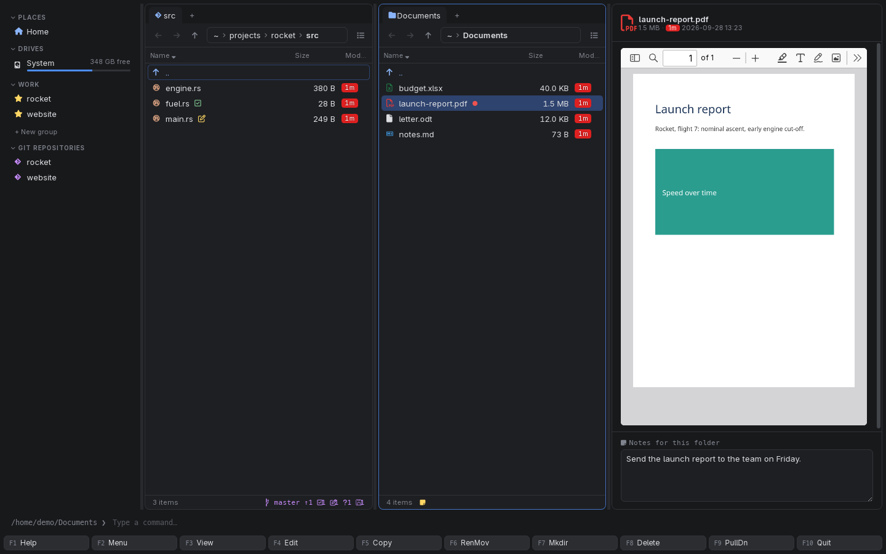

[← README](../../README.md) · [Docs index](../README.md) · [Commands, the user menu and scripts](README.md)

# View and edit, F3 and F4

**F3** views the file under the cursor and **F4** edits it, as in Norton Commander. In the
terminal app they start your pager and your editor in the terminal. In the desktop app **F3**
is the [preview pane](../previews/README.md), which shows far more than a pager can, and **F4**
starts your editor or the file's default application.


*In the desktop app **F3** shows and hides the preview pane, here on a PDF.*

<!-- screenshot: commands-view-tui.png: terminal app, Classic blue (NC) theme, after F3 on README.md in /home/demo/projects/rocket: the panels gone and less showing README.md full screen, "README.md" in less's bottom line -->

## How to use it

1. Put the cursor on a file. Both keys do nothing on a folder or on `..`.
2. Press **F3** to view or **F4** to edit. **F9** lists them as *View* and *Edit*.

| Key | Terminal app | Desktop app |
|---|---|---|
| **F3** | Opens the file in your viewer: `viewer` from the config, else `$PAGER`, else `less` (`more` on Windows). The panels step aside until it ends | Shows or hides the [preview pane](../previews/README.md). When the pane shows command output, **F3** switches it back to the file preview |
| **F4** | Opens the file in your editor: `editor` from the config, else `$VISUAL`, else `$EDITOR`, else `vi` (`notepad` on Windows). The panels step aside until it ends | Starts `editor` from the config with the file, in the background; without `editor`, opens the file in its default application, as **Enter** does |
| **F4** in [Find file](../search/find-file.md) | Edits the hit under the cursor; the search stays open | Same |
| **F3** in Find file | Views the hit under the cursor | — (**Enter** goes to the hit; the preview shows it there) |

A variable that is set but empty counts as unset.

## What you see

- **Terminal app:** the panels disappear and the program has the whole terminal. When you quit
  it (**q** in `less`, `:q` in `vi`), the panels come back and reread, so changes you saved show
  at once. The program runs in the file's folder.
- **Desktop app, F3:** the preview pane opens at the right, or closes. What it shows depends on
  the file: text with syntax colours, PDF pages, pictures, tables, trees ([The preview pane](../previews/README.md)).
- **Desktop app, F4:** your editor opens in its own window. Coxswain does not wait for it: the
  panels stay usable. When the editor cannot be found, nothing happens.

## Settings and config.toml

No Settings item; both are top-level keys in `config.toml` ([Configuration](../reference/configuration.md)).

| Key | Type | Default | Used by |
|---|---|---|---|
| `editor` | text: a command, may have arguments | not set | **F4** in both apps |
| `viewer` | text: a command, may have arguments | not set | **F3** in the terminal app |
| `[keys]` `view` | list of keys | `["F3"]` | |
| `[keys]` `edit` | list of keys | `["F4"]` | |

```toml
editor = "hx"
viewer = "bat --paging=always"
```

The command is run with the shell, with the file's full path added at the end, quoted when it
needs it: `hx '/home/demo/My notes.txt'`. So arguments work (`editor = "code --wait"`), and so do
`~` and variables in the command.

## In the terminal app

**F3** and **F4** are the classic viewer and editor, run in the terminal: see the table above.
The desktop app has no terminal to lend, which is why its **F3** is the preview pane and its
**F4** wants a windowed editor. Both apps read the same `editor` key.

## Questions

#### F4 in the desktop app does nothing, though `editor = "hx"` works in the terminal app.

The desktop app starts the editor without a terminal, so a terminal editor such as `hx`, `vim`
or `nano` has nowhere to show. `editor` is shared by both apps. Either set it to a windowed
editor (`editor = "code"`, `editor = "gnome-text-editor"`), or leave it out of the config and
set `$VISUAL` or `$EDITOR` in your shell for the terminal app: the desktop app then opens files
in their default application.

#### Can I use a terminal editor from the desktop app anyway?

Yes, by starting a terminal with it: `editor = "alacritty -e hx"`, `editor = "kitty hx"` or
`editor = "gnome-terminal -- hx"`. The terminal app would then also open a new terminal window,
so set `$EDITOR` for it and leave `editor` for this.

#### How do I read a file in the desktop app without the preview?

**Enter** opens it in its default application ([Opening files](opening-files.md)). **F4**
without an `editor` does the same.

#### Why does F3 in the desktop app not start my viewer?

The desktop app's **F3** is the preview pane, as Norton Commander's F3 was its built-in viewer;
the preview reads far more formats than a pager. `viewer` is for the terminal app only. To run
a viewer from the desktop app, add it to the [user menu](user-menu.md): `command = "bat %f"`.

#### Which editor does the terminal app pick?

The first that is set: `editor` in `config.toml`, then `$VISUAL`, then `$EDITOR`, then `vi`
(`notepad` on Windows). For **F3**: `viewer`, then `$PAGER`, then `less` (`more` on Windows).

#### F3 and F4 do nothing on a folder.

They work on files only. To look into a folder, press **Enter**; its summary, size and
[note](../organise/notes.md) show in the desktop app's preview pane.

#### Can I edit a file inside an archive with F4?

No. A file in an archive is not a file on disk, so the editor or viewer gets a path that does not
exist. Copy it out with **F5** first ([Archives as folders](../files/archives.md)); in the desktop
app, **F3** shows its preview.

#### F4 on a Find file hit: does the search close?

No. The editor starts for the hit under the cursor and the search stays as it was, so you can
edit several hits in a row. **Enter** goes to the hit's folder instead.

---
[← Previous: Scripts](scripts.md) · [Next: Opening files →](opening-files.md)
