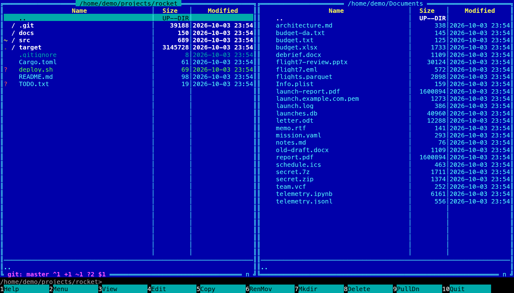

[← README](../../README.md) · [Docs index](../README.md) · [Customising](README.md)

# Glyphs and fonts

Coxswain marks files, folders and git states with small symbols, *glyphs*, from a Nerd Font: a
folder icon, a pencil for a modified file, a branch symbol before the branch name. Without a Nerd Font they show as
empty boxes, so you can switch to plain characters or set your own. In the desktop app you also
choose the interface font, the monospaced font, the icon font and the text size.



## How to use it

**Nerd Font or plain characters:**

| | Desktop app | Terminal app |
|---|---|---|
| Choose | Settings (**Ctrl+,**) → *Appearance* → *Icons and git glyphs*: *Nerd Font* or *Plain characters (ASCII)* | `glyphs = "ascii"` in `config.toml`, then start it again |
| Needs for Nerd Font | A Nerd Font installed and named in *Icon font* | A Nerd Font as the terminal's own font |

**Fonts and size (desktop app):**

1. Press **Ctrl+,**. Under *Appearance*:
2. *Text size*: a number from 9 to 28 (pixels). The rows grow with it.
3. *Font*, *Monospaced font*, *Icon font*: CSS font lists, such as
   `'JetBrains Mono', Menlo, monospace`. The first font in the list that is installed is used.
4. Leave the field (or press **Enter**) and the window re-draws with it.

**Your own glyphs:** a `[glyph_set]` table in `config.toml`; see [below](#your-own-glyph-set).

## What you see

| Glyph | Nerd Font (code point) | ASCII | Where |
|---|---|---|---|
| `branch` | U+E0A0 | `git:` | Start of the git line, before the branch name |
| `ahead`, `behind` | `↑`, `↓` | `^`, `v` | The git line: commits ahead of and behind upstream |
| `staged` | U+F046 | `+` | The git line; next to a file that is added |
| `modified` | U+F044 | `~` | The git line; next to a changed file |
| `deleted` | U+F014 | `-` | The git line; next to a deleted file |
| `untracked` | U+F128 | `?` | The git line; next to a new file git does not know |
| `renamed` | U+F45A | `>` | Next to a renamed file |
| `conflict` | U+F071 | `!` | The git line; next to a file with a merge conflict |
| `ignored` | U+F070 | `.` | Next to an ignored file or folder |
| `stash` | U+EB4B | `$` | The git line: stashes |
| `clean` | U+F00C | `=` | The git line, when nothing is changed |
| `cloud` | U+F0C2 | `*` | After the name of a file only in the cloud, not downloaded ([Cloud files](../search/cloud-files.md)) |
| `folder`, `file`, `symlink` | U+F07B, U+F15B, U+F0C1 | `/`, ` `, `@` | Kept in the set, but not used at present (see the questions) |

Each git state has its own colour from the theme's `git_…` [slots](own-theme.md#the-colour-slots).
More on the git line and the marks: [Git in the panels](../panels/git.md).

**File icons** (a Rust crab for `Cargo.toml`, a picture for `.png`, a folder) come from a
separate list by file type, always from the Nerd Font:

- In the **terminal app**, `glyphs = "ascii"` turns them off: names start after two spaces.
- In the **desktop app** they stay, drawn in the *Icon font*; *Plain characters (ASCII)* changes
  the git glyphs and the git line only.

**Fonts in the desktop app:**

| Setting | Used for | Default |
|---|---|---|
| *Font* | The interface: lists, sidebar, dialogs, in the `modern` look | `Inter, 'Segoe UI Variable', 'Segoe UI', system-ui, -apple-system, 'Noto Sans', sans-serif` |
| *Monospaced font* | The command line, code and text in the preview; everything in Cyber and NC | `'JetBrains Mono', 'Cascadia Code', 'MesloLGS Nerd Font', Menlo, Consolas, monospace` |
| *Icon font* | File icons and git glyphs | `'Symbols Nerd Font Mono', 'JetBrainsMono Nerd Font', 'MesloLGS Nerd Font', 'MesloLGM Nerd Font Mono', 'FiraCode Nerd Font', 'CaskaydiaCove Nerd Font', 'Hack Nerd Font', monospace` |
| *Text size* | Everything; the row height is the size times `line_height` | `13` |

The Windows and Mac themes, Cyber and NC bring their own interface font and put it over *Font*
([Looks](looks.md)); under them Settings says *Cyber and the Windows and Mac themes bring their
own font; these fonts apply to the others.*

After any of these fonts come Japanese and Korean fonts (Hiragino Sans, Yu Gothic, Noto Sans CJK,
Malgun Gothic, …), so file names and texts in those letters are drawn even when the chosen font
lacks them; see [Japanese and Korean](languages.md#japanese-and-korean).

## Your own glyph set

Give `[glyph_set]` the glyphs you want. It replaces `glyphs` in both apps; a glyph you leave out
takes the Nerd Font one. This is the ASCII set, to start from:

```toml
[glyph_set]
branch = "git:"
ahead = "^"
behind = "v"
staged = "+"
modified = "~"
untracked = "?"
deleted = "-"
renamed = ">"
conflict = "!"
ignored = "."
stash = "$"
clean = "="
folder = "/"
file = " "
symlink = "@"
cloud = "*"
```

A glyph can be any text, also an emoji or a word. The git line takes any length, but the mark
next to a file has two cells in the terminal app, and a longer one is cut with `…`, so keep
the file marks (`staged` to `ignored`) to one character.

## Settings and config.toml

| Settings item | Key | Type, default | Used by |
|---|---|---|---|
| *Icons and git glyphs* | `glyphs` | `"nerd"` or `"ascii"`, `"nerd"` | Both apps |
| none | `[glyph_set]` | a table of the glyphs above; none | Both apps |
| *Text size* | `[gui] font_size` | number, `13` | Desktop app |
| none | `[gui] line_height` | number, `1.9` (row height as a multiple of the size) | Desktop app |
| *Font* | `[gui] font` | CSS font list | Desktop app |
| *Monospaced font* | `[gui] mono_font` | CSS font list | Desktop app |
| *Icon font* | `[gui] icon_font` | CSS font list | Desktop app |

## In the terminal app

The terminal app draws in the terminal's own font and size: set those in your terminal. For Nerd
Font glyphs and file icons, the terminal's font must be a Nerd Font (for example *JetBrainsMono
Nerd Font*), or one with a Nerd Font set as fallback. Otherwise use `glyphs = "ascii"`, which
replaces the file icons with `/` for folders and `@` for links (both apps). `glyphs` and `[glyph_set]` are read when it starts.

## Questions

#### The icons are empty boxes.

No font in *Icon font* is installed (desktop app), or the terminal's font is not a Nerd Font
(terminal app). Install one, for example *Symbols Nerd Font Mono*, and list it first in *Icon
font*, or set the terminal to a Nerd Font. Or choose *Plain characters (ASCII)*.

#### I chose Plain characters (ASCII) and the desktop app still shows file icons.

In the desktop app that choice changes the git glyphs and the git line; file icons always come
from the *Icon font*. If they show as boxes, no Nerd Font in that list is installed: install one,
or accept the boxes. The terminal app drops file icons with `glyphs = "ascii"`.

#### Why is the font I picked not used?

The theme brings its own: the Windows and Mac themes use the fonts of their era (Tahoma, Segoe
UI, Chicago, Lucida Grande …, or the nearest your system has), and Cyber and NC use the
*Monospaced font* for everything. *Font* applies to Dark, Light, Nord and Tokyo Night, and to
your own themes with `look = "modern"`. Also check the name: a font list is CSS, so a name with
spaces needs quotes, `'Fira Sans', sans-serif`.

#### Can I make the rows less tall?

Yes: `line_height` under `[gui]`, for example `line_height = 1.5`. The row is the text size
times this number, 13 × 1.9 = 25 pixels by default. It is not in Settings; restart the desktop
app after changing it.

#### How do I make everything bigger?

*Text size* in Settings, up to 28. The rows, lists and dialogs grow with it, since the row
height follows the size.

#### What do `folder`, `file` and `symlink` in `[glyph_set]` do?

With `glyphs = "ascii"` or a `[glyph_set]` of your own, every folder gets the `folder` glyph,
every symbolic link the `symlink` glyph and every other file the `file` glyph, in both apps,
in place of the Nerd Font icon per kind of file. (Symbolic links also show in the `symlink`
colour and, in the terminal app, with `->` and their target on the info line under the panel.)

#### Does the terminal app use the desktop app's fonts?

No. `[gui] font`, `mono_font`, `icon_font` and `font_size` are the desktop app's; a terminal
has one font and one size, set in the terminal.

---
[← Previous: Changing keys](keys.md) · [Next: Reference →](../reference/README.md)
