[← README](../../README.md) · [Docs index](../README.md) · [Customising](README.md)

# Languages

Both apps, the terminal app and the desktop app, speak 29 languages. They share one set of
translations and one setting, so they always agree. By default Coxswain follows your system's
language.

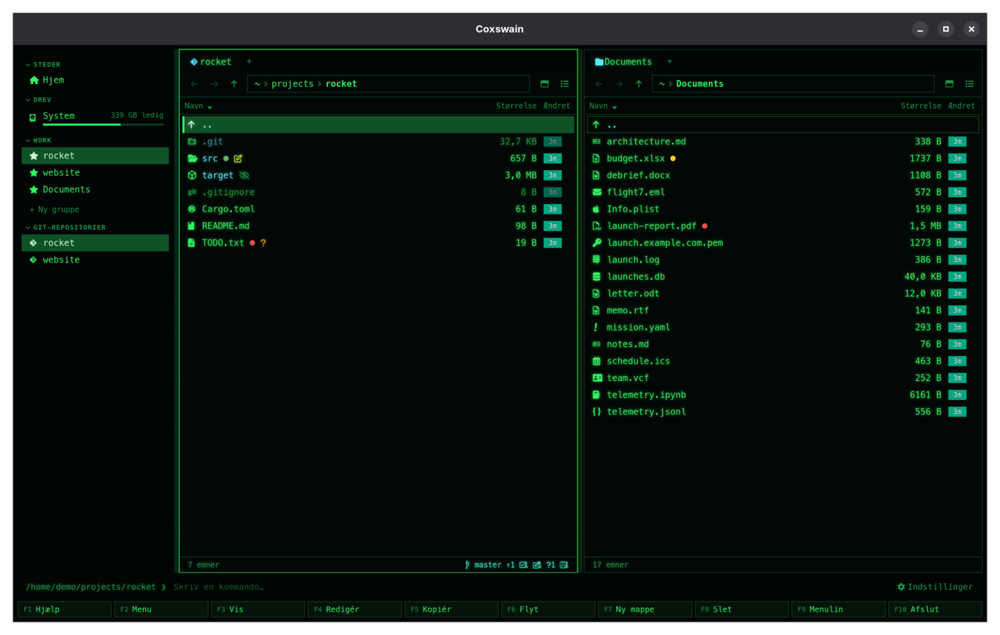
*Coxswain in Danish. Sizes are written 32,7 KB, with the decimal comma.*

## Contents

- [The languages](#the-languages)
- [How to use it](#how-to-use-it)
- [Which language Automatic picks](#which-language-automatic-picks)
- [What you see](#what-you-see)
- [Capitals in Greek](#capitals-in-greek)
- [Japanese and Korean](#japanese-and-korean)
- [Persian, Armenian and Georgian](#persian-armenian-and-georgian)
- [Right to left](#right-to-left)
- [Settings and config.toml](#settings-and-configtoml)
- [In the terminal app](#in-the-terminal-app)
- [Questions](#questions)
- [Improving a translation](#improving-a-translation)

## The languages

Both apps list them by region, and by their own name within a region:

| | Language | Code |
|---|---|---|
| | **Nordic and Baltic** | |
|  | Dansk | `da` |
|  | Eesti | `et` |
| 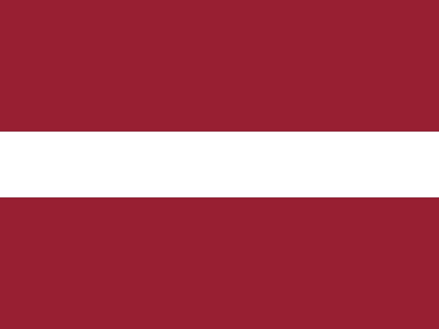 | Latviešu | `lv` |
| 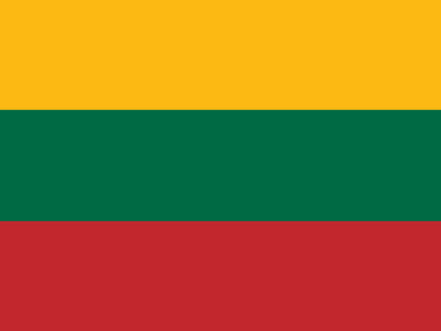 | Lietuvių | `lt` |
| 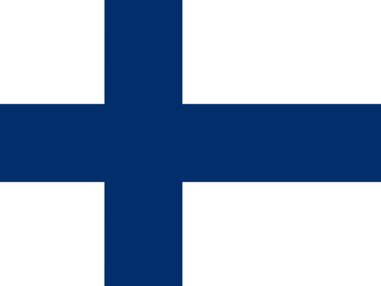 | Suomi | `fi` |
|  | Svenska | `sv` |
| | **Western Europe** | |
| 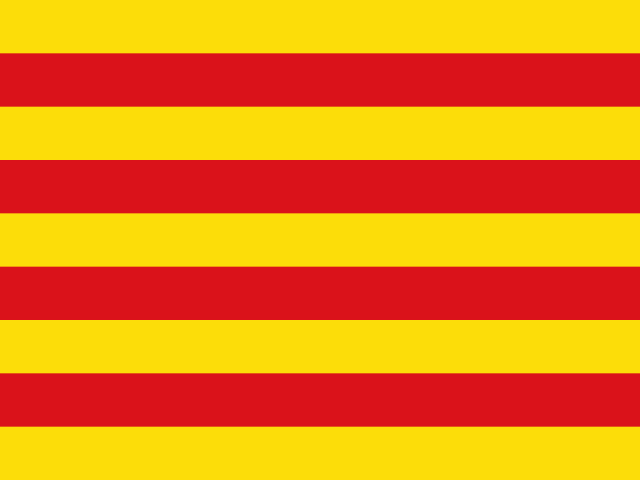 | Català | `ca` |
|  | Deutsch | `de` |
| 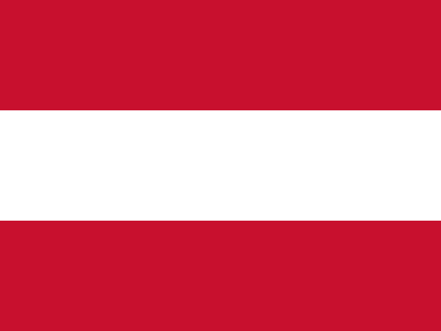 | Deutsch (Österreich) | `de-AT` |
| 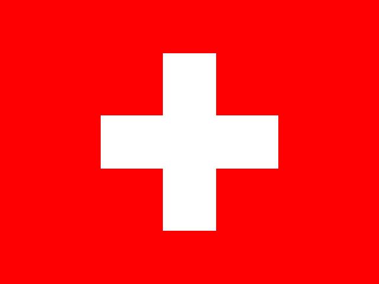 | Deutsch (Schweiz) | `de-CH` |
|  | English (United Kingdom) | `en-GB` |
| 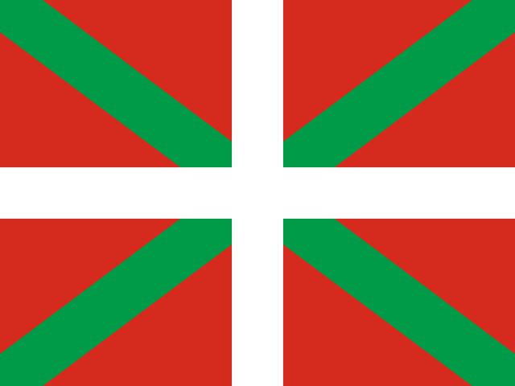 | Euskara | `eu` |
| 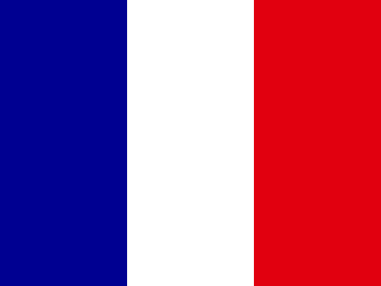 | Français | `fr` |
|  | Italiano | `it` |
|  | Nederlands | `nl` |
| | **Central and Eastern Europe** | |
|  | Čeština (Czech) *(new)* | `cs` |
|  | Polski (Polish) *(new)* | `pl` |
|  | Українська (Ukrainian) *(new)* | `uk` |
| | **Eastern Mediterranean** | |
|  | Ελληνικά (Greek) *(new)* | `el` |
| | **The Middle East** | |
| 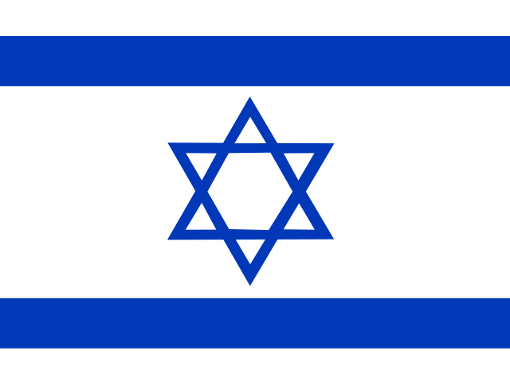 | עברית (Hebrew) | `he` |
| 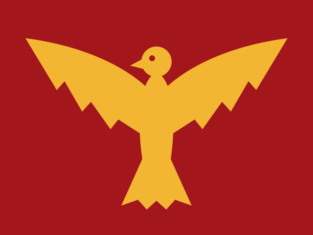 | فارسی (Persian) *(new)* | `fa` |
| | **The Caucasus** | |
| 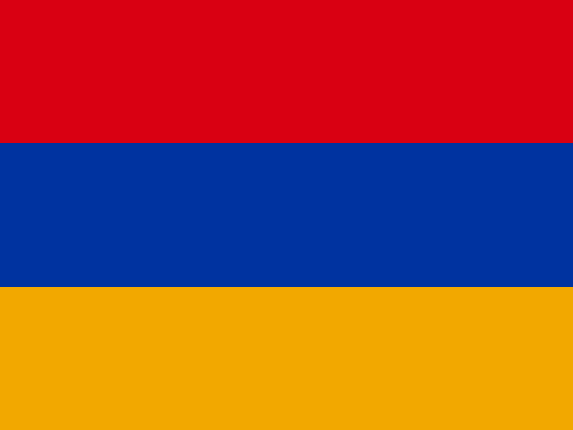 | Հայերեն (Armenian) *(new)* | `hy` |
|  | ქართული (Georgian) *(new)* | `ka` |
| | **The Americas** | |
|  | English (Canada) | `en-CA` |
| 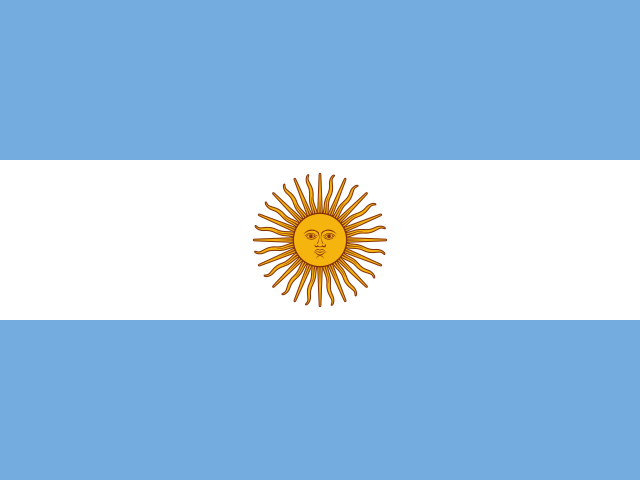 | Español (Argentina) | `es-AR` |
| | **Asia and the Pacific** | |
|  | English (Australia) | `en-AU` |
|  | English (New Zealand) | `en-NZ` |
|  | 日本語 (Japanese) *(new)* | `ja` |
|  | 한국어 (Korean) *(new)* | `ko` |

The ones marked *new* are fresh translations that no native speaker has checked yet: Settings
marks them *new*, and [Improving a translation](#improving-a-translation) says how to help.

Persian has no state flag here: it is spoken in Iran, Afghanistan and Tajikistan, so it shows
a historical banner instead, the Derafsh Shahbaz, the Achaemenid falcon (a gold falcon with
spread wings on crimson), drawn for Coxswain.

British English is the reference: every text is written in it first. Australian and New Zealand
English use British spelling and say "bin"; Canadian English keeps British spelling but says
"trash" and uses -ize where British uses -ise. Argentinian Spanish uses *vos*.

Austrian and Swiss German are German with their own differences on top; any text they do not
change is the German one. Swiss German writes *ss* for every *ß* ("Schliessen", "Grösse") and
«guillemets» for „quotes“, as Swiss Standard German does; in the desktop app its numbers are
written 1'234.5. Coxswain writes dates as numbers (2026-01-05), so Austrian German has no
*Jänner* to show and, for now, no text of its own: it reads as German.

## How to use it

**Desktop app:**

1. Open Settings: **Ctrl+,**, or **F9** → *Settings*, and choose *Looks*; or start it with
   `coxswain-gui --settings=language`, which opens *Looks* at *Language*.
2. Under *Language*, click a language. The one in use is shown at the top, with its flag. Below
   it a field filters the list; the languages are listed under their regions (*Nordic and
   Baltic*, *Western Europe*, …), each by its own name and flag; a fresh translation has a *new*
   badge.
3. The window redraws in the new language at once, and the choice is saved to `config.toml`.

*Automatic* goes back to following the system; below it, small, is the language that picks now.
Under the list, *Translations marked new are fresh…* opens [Improving a translation](#improving-a-translation)
in the browser.

**Terminal app, or by hand:**

1. Open `config.toml` (`coxswain --config-path` prints where).
2. Put `language = "da"` at the top, above the first `[table]`. `"auto"` follows the system.
3. Start the terminal app again (quit with **F10**). The desktop app reads it at its next start,
   or at once when set from Settings.

There are no keys for the language.

## Which language Automatic picks

With `language = "auto"`, the default, Coxswain reads your system's list of preferred languages
(on Linux, macOS and Windows alike), and takes the first one it has, in any regional form (any
English counts); otherwise the nearest relative of the first one:

| Your system | Coxswain uses |
|---|---|
| One of the languages above, in any region (`fr-CA`, `sv-FI`, `ca-ES-valencia`, …) | That language |
| German in Austria (`de-AT`) | Austrian German |
| German in Switzerland or Liechtenstein (`de-CH`, `de-LI`), Swiss German (`gsw`) | Swiss German |
| German anywhere else (`de-DE`, `de-LU`, `de-BE`, …) | German |
| US English, or English without a region | Canadian English |
| Australian, Canadian, New Zealand English | That English |
| Any other English (Britain, Ireland, South Africa, India, …) | British English |
| Any Spanish (Spain, Mexico, …), Galician and Aragonese | Argentinian Spanish |
| Norwegian (Bokmål, Nynorsk) | Danish, the closest written language |
| Frisian, Afrikaans | Dutch |
| Luxembourgish | German |
| Occitan | Catalan |
| Polish, Czech, Ukrainian, Greek (`pl_PL`, `cs_CZ`, `uk_UA`, `el_GR`, `el_CY`, …) | That language |
| Slovak | Czech, which Slovak readers read |
| Japanese, Korean (`ja_JP`, `ko_KR`, …) | That language |
| Persian in Iran or Afghanistan (`fa_IR`, `fa_AF`), Dari (`prs`) | Persian |
| Armenian, Georgian (`hy_AM`, `ka_GE`) | That language |
| Hebrew (also the old code `iw`) | Hebrew |
| Anything else | British English |

A language code in `config.toml` goes through the same table, so `language = "nb"` gives Danish
and `language = "es"` Argentinian Spanish.

## What you see

Everything Coxswain itself says changes: menus, commands and the F-key bar, dialogs, the preview
pane and its facts, the duplicate finder, Settings, status messages, errors, sizes (`KB`, or `Ko`
in French, with the decimal comma where the language uses one) and the age chips (`5m`, `2d`).
Numbers are written the way the language writes them (1 234,5 or 1.234,5). In Persian, counts,
sizes and dates take Persian digits (۳۲٫۷ KB, ۲۰۲۶-۰۱-۰۵) in both apps; paths, keys, versions
and `config.toml` values keep their Latin digits.

Not translated:

- key names (Ctrl, Alt, Enter, F5 …), which are the same in `config.toml` everywhere;
- file and folder names, and the names of your favourite groups;
- error texts that come from the operating system, which are in the system's own language;
- the names of programs and formats (Ollama, LibreOffice, PDF).

## Capitals in Greek

Some headings are written in capitals (Settings' area titles, the sidebar's headings, the
Cyber theme's dialog titles). Greek drops its accents in capitals and keeps a diaeresis:
*Ρυθμίσεις* becomes ΡΥΘΜΙΣΕΙΣ, not ΡΥΘΜΊΣΕΙΣ, and *τσάι* becomes ΤΣΑΪ. The desktop app tells
its web view that the page is Greek, which uppercases it so (WebKitGTK on Linux, WebKit on
macOS and WebView2 on Windows all do). The terminal app writes only the group headings of Find's results in capitals.

Georgian has no capitals in running text, so in Georgian these headings are written as they
are, without capitals or wide spacing, in both apps, and the first letter of an error's cause
is left as it is. Armenian has capitals and takes them as usual.

## Japanese and Korean

Both are written in letters that take two columns in a terminal and need a font that has them.

- **Fonts in the desktop app:** after every font list (*Font*, *Monospaced font*, the era fonts
  of the themes) come Hiragino Sans, Yu Gothic, Meiryo and Noto Sans CJK JP, then Apple SD
  Gothic Neo, Malgun Gothic and Noto Sans CJK KR (Korean first when Coxswain speaks Korean, as
  the same Han letter is drawn differently in each). The first installed one draws them: on
  macOS and Windows one always is. This holds for file names in any language too.
- **No font on Linux:** when Coxswain speaks Japanese or Korean and `fc-list` knows no font
  for it, *Settings → Overview → What's new* says once *No Japanese or Korean font is installed…* and
  names the package: `noto-fonts-cjk` (Arch), `fonts-noto-cjk` (Debian, Ubuntu),
  `google-noto-sans-cjk-fonts` (Fedora). Until then the letters show as boxes.
- **Typing with an input method** (IME: Mozc, Kotoeri, the Microsoft IME, a Hangul keyboard):
  works in every text field of the desktop app (Find, the path bar, rename, notes, the
  dialogs). While a word is being composed, Enter, Esc and the arrows belong to the input
  method: Enter takes the word and does not run the dialog, Esc drops the word and does not
  close it.
- **Quick search** (**Alt+letter**, then letters) jumps to a name that starts with what you
  type; a name kept decomposed (as macOS does with Hangul, or か + ゙ for が) is found by the
  composed letters. An input method composes only in a text field, so in the desktop app quick
  search takes the letters typed straight from the keyboard; for a Japanese or Korean name use
  *Find* (**Alt+F7**), where the input method works. In the terminal app, letters an input
  method commits go to quick search once it is started.
- **The terminal app** measures every text by the columns it takes, not by its letters: the
  column titles, sizes and the marked line are centred and cut to their columns, the F-key bar
  keeps ten slots, and Find and the dialogs keep their frames. Your terminal needs a font with
  these letters (most terminals fall back to one by themselves).

## Persian, Armenian and Georgian

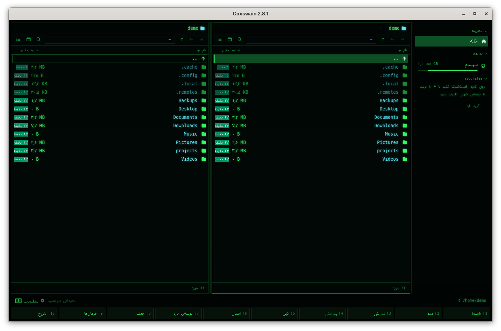

- **Fonts in the desktop app:** after every font list come Vazirmatn, Noto Sans Arabic and Noto
  Naskh Arabic (Geeza Pro on macOS; Segoe UI and Tahoma on Windows have the letters), Noto Sans
  Armenian and Noto Sans Georgian (Sylfaen on Windows; macOS has its own), then the Japanese and
  Korean ones. On Linux they come with `noto-fonts` (Arch), `fonts-noto-core` (Debian, Ubuntu)
  or `google-noto-sans-arabic-fonts`, `google-noto-sans-armenian-fonts` and
  `google-noto-sans-georgian-fonts` (Fedora); Vazirmatn, drawn for Persian, is `fonts-vazirmatn`
  on Debian and Ubuntu. When Coxswain speaks one of these and `fc-list` knows no font for it,
  *Settings → Overview → What's new* says once *No font for فارسی is installed…* with these
  packages.
- **Persian in the desktop app** is right to left, laid out as Hebrew is (see
  [Right to left](#right-to-left)); its letters join as they should, and headings that other
  languages write in spaced capitals are written plain, as spacing pulls joined letters apart.
- **Persian in the terminal app:** a terminal draws a letter per cell; whether Persian letters
  join and run right to left is up to the terminal, not Coxswain. Konsole and mlterm join them
  and run them right to left; Windows Terminal joins them; GNOME Terminal and other VTE
  terminals do both with bidi on. Alacritty, kitty, foot, WezTerm, xterm and the macOS Terminal
  show them unjoined and in reversed order. Coxswain does no shaping of its own: the terminal
  gets the letters in their logical order.
- **Armenian and Georgian** are left to right and need nothing but a font; in the terminal app
  most terminals fall back to one by themselves.

## Right to left

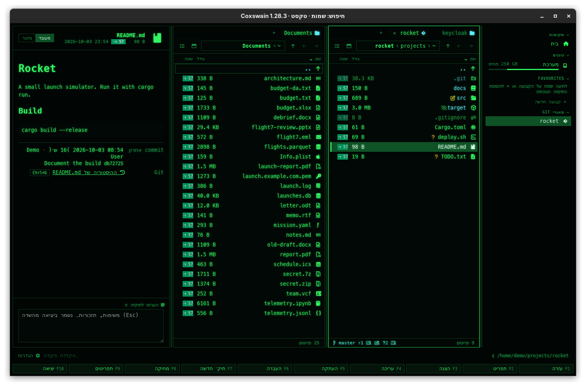
*Coxswain in Hebrew: the whole layout mirrors.*

In Hebrew and Persian the desktop app mirrors its layout: the sidebar is on the right, text is aligned to
the right, the columns run from right to left, and the back arrow points right. File names,
paths and commands stay left to right inside it, as Hebrew and Persian systems show them, and notes and the
command line take the direction of what you type.

The terminal app is limited by the terminal: most terminals, Alacritty among them, do not do
right-to-left text, so Hebrew and Persian there show their letters in reversed order. Terminals
that support it (for example Konsole, mlterm, Windows Terminal, or GNOME Terminal with bidi on)
show it correctly; for Persian see also
[Persian, Armenian and Georgian](#persian-armenian-and-georgian).

## Settings and config.toml

| Setting | Key | Type, default |
|---|---|---|
| Settings → *Looks* → *Language* | `language` | text: `"auto"` or a code from the table; `"auto"` |

One key for both apps.

## In the terminal app

The same 29 languages and the same translations, chosen by the same `language` key. It is read
when the app starts; there is no picker, but `coxswain --languages` prints the list by region,
the one in use and the new ones marked, and where to suggest a better word. Right to left
depends on the terminal (see
[Right to left](#right-to-left)). The help (**F1**), the command list (**F9**), dialogs, the
F-key bar and status texts are all translated.

## Questions

#### My system is in US English. Why does Coxswain say "colour" but "trash"?

US English, and English without a region, get Canadian English: British spelling, North
American words. Pick *English (United Kingdom)* in Settings for "bin", or keep it.

#### I changed the language in Settings and the terminal app still speaks the old one.

The terminal app reads `language` when it starts. Quit it (**F10**) and start it again.

#### How do I go back to following the system?

Settings → *Looks* → *Language* → *Automatic*, or `language = "auto"` in `config.toml` (or delete the line).

#### My system lists British English first and Danish second, and Coxswain speaks Danish.

That is how *Automatic* works now: British English is also what an unknown language falls back
to, so it passes over every system language that comes out as British English (`en-GB`,
`en-IE`, `en-IN`, …) and takes the first that gives another language; only when there is none
does it use British English. Set `language = "en-GB"` (or pick *English (United Kingdom)* in
Settings) to keep English.

#### My system is set to German (Switzerland). Why does Coxswain write "Grösse"?

Swiss Standard German has no *ß*: a system locale `de_CH` (or `de_LI`, or Swiss German `gsw`)
picks *Deutsch (Schweiz)*, which writes *ss* and «guillemets». For *ß* and „quotes“ pick
*Deutsch* in Settings → *Looks* → *Language*, or set `language = "de"`.

#### Polish, Czech, Ukrainian or Greek reads oddly in places. Why?

These are new, marked *new* in Settings (and so are Japanese and Korean), and have not been read by a native speaker yet.
Coxswain shows the notice "*Polski is a new translation…*" once (in the desktop app under
Settings → *Overview* → *What's new*, in the terminal app in the status line) to say so. A better word is
very welcome: see [Improving a translation](#improving-a-translation).

#### Persian, Armenian or Georgian is new. Who checked it?

No native speaker yet: all three are marked *new* in Settings, and Coxswain says once
"*فارسی is a new translation…*" (under *Settings → Overview → What's new* in the desktop app,
in the status line of the terminal app). A better word is very welcome; see
[Improving a translation](#improving-a-translation).

#### Why does Persian have a falcon and not a flag?

Persian is the language of Iran, Afghanistan and Tajikistan; no one state flag stands for it.
Coxswain shows the Derafsh Shahbaz, the falcon banner of the Achaemenids, drawn for Coxswain
(MIT licence, `docs/flags/derafsh.svg`).

#### Persian letters in the terminal app are separate and backwards. Can Coxswain fix that?

No: joining letters and running them right to left is the terminal's work. Use a terminal that
does it: Konsole or mlterm, or GNOME Terminal with bidi on (Windows Terminal joins them). Alacritty, kitty,
foot, WezTerm and xterm do not. The desktop app shows Persian correctly everywhere.

#### Why are sizes in Persian written ۳۲٫۷ but the path keeps 2026?

Counts, sizes and dates are numbers to read, so they take Persian digits. A path, a key, a
version or a `config.toml` value must stay as typed and as the system has it, so its digits stay
Latin.

#### Why are the Cyber theme's headings not in capitals in Georgian?

Georgian has no capitals in running text. Unicode's capitals for Mkhedruli (Mtavruli) are for
rare all-caps lettering and most fonts lack them, so they would show as boxes. Coxswain writes
Georgian headings as they are.

#### Persian, Armenian or Georgian shows as boxes. What is missing?

A font with those letters. On Linux install `noto-fonts` (Arch), `fonts-noto-core` (Debian,
Ubuntu) or `google-noto-sans-arabic-fonts`, `google-noto-sans-armenian-fonts`,
`google-noto-sans-georgian-fonts` (Fedora), and start the desktop app again; on FreeBSD
`pkg install noto`. The desktop app says so once under *Settings → Overview → What's new*. See
[Persian, Armenian and Georgian](#persian-armenian-and-georgian).

#### Japanese or Korean shows as boxes. What is missing?

A font with those letters. On Linux install `noto-fonts-cjk` (Arch), `fonts-noto-cjk` (Debian,
Ubuntu) or `google-noto-sans-cjk-fonts` (Fedora) and start the desktop app again; the desktop
app says so once under *Settings → Overview → What's new*. In the terminal app, it is the terminal's font
that needs them. See [Japanese and Korean](#japanese-and-korean).

#### I type Japanese and press Enter, and the dialog does nothing. Why?

The first Enter takes the word your input method was composing; it is not a key for Coxswain
yet. Press Enter once more to run the dialog. Esc likewise drops the composed word first.

#### Why are key names in English?

Keys are written the same everywhere (Ctrl, Alt, F5), so a key in `config.toml` means the same
in every language, and the names match what is printed on most keyboards.

#### Does the language change what Find reads in pictures?

Yes: [text recognition](../search/scans.md) reads English and your system's language, when
tesseract has that language installed. [Search by meaning](../search/meaning.md) works across
languages whatever you pick: a query in English finds a Danish document.

#### The F-key bar in my language is cut short. Is that a mistake?

Labels on the F-key bar must fit about nine characters, so some are abbreviated. The terminal
app keeps Norton Commander's "RenMov", "Mkdir" and "PullDn" in English on purpose; the desktop
app says "Move", "New folder" and "Commands". A better short word is welcome; see
[Improving a translation](#improving-a-translation).

## Improving a translation

The translations were written with care but have not all been checked by native speakers yet.
The ones marked *new* (Polish, Czech, Ukrainian, Greek, Japanese, Korean, Persian, Armenian,
Georgian) need a native reader most, then Basque,
Latvian and Lithuanian. Corrections are very welcome, in either of two ways:

- **Tell us:** open an [issue on GitHub](https://github.com/mwo-dk/coxswain/issues/new) with the
  language, the text as it is (or where it shows) and what it should say. No setup needed.
- **Change it yourself,** in a pull request:

1. Each language is one file in [`crates/coxswain-core/locales/`](../../crates/coxswain-core/locales/),
   for example `da.json`. It maps a key to its text:
   ```json
   "dupes.keep_newest": "Markér alle undtagen den nyeste",
   "items": { "one": "{n} element", "other": "{n} elementer" }
   ```
2. Change the text, keeping every `{placeholder}` (you may move it). Texts with a count have one
   entry per plural form your language uses: `one`/`other` for most, `one`/`few`/`other` for
   Lithuanian, `zero`/`one`/`other` for Latvian, `one`/`two`/`other` for Hebrew, and
   `one`/`many`/`other` for French, Italian, Spanish and Catalan, `one`/`few`/`many`/`other`
   for Polish and Ukrainian, `one`/`few`/`other` for Czech, `one`/`other` for Persian and
   Armenian (where 0 is `one` too) and for Georgian, and only `other` for Japanese and Korean,
   which do not change a word for a count.
3. Run `cargo test -p coxswain-core i18n`: it checks that every file parses, has no unknown
   keys, keeps the placeholders and has an `other` form.
4. Open a pull request.

**Adding a language:** add its code, name, flag and region to `LANGUAGES` and `source()` in
[`crates/coxswain-core/src/i18n.rs`](../../crates/coxswain-core/src/i18n.rs), map its system codes
in `nearest()`, give it plural rules in `plural()` if it needs other than one/other, copy
`en-GB.json` to the new file and translate it, and add the flag (from
[flag-icons](https://github.com/lipis/flag-icons)) to `docs/flags/` and to the list in
`gui/src/Settings.svelte`.

Flags: [flag-icons](https://github.com/lipis/flag-icons), MIT licence (`docs/flags/LICENSE`);
Persian's falcon banner (`derafsh.svg`) is drawn for Coxswain, MIT licence.

---
[← Previous: Your own theme and the colour slots](own-theme.md) · [Next: Changing keys →](keys.md)
