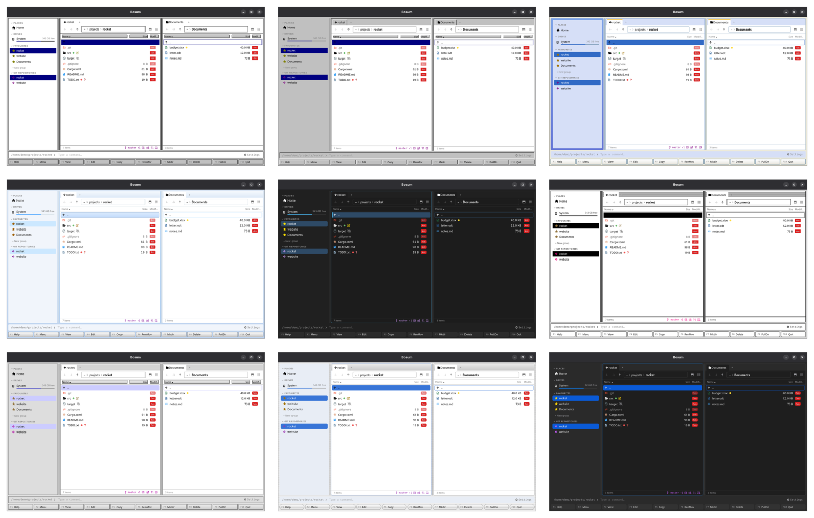

[← README](../../README.md) · [Docs index](../README.md) · [Customising](README.md)

# Looks

A look is the desktop app's shapes and chrome: corners, bevels, borders, title bars, buttons,
scroll bars and the interface font. Each built-in theme has the look of its era, so Windows 95
has grey 3D bevels and Mac System 7 its striped title bars. The lists, text, folders, cursor
row and marks take the theme's colours; the era's chrome (bevels, title bars, button faces) is
drawn in the era's own colours, as the real thing was.


*The same window in nine looks.*

## How to use it

A look comes with its theme: pick the theme and you get its look.

1. Press **Ctrl+,** (or **F9** → *Settings*).
2. Under *Appearance* → *Theme*, click a theme. The table below shows which look each brings.

To give your own theme a look, name it in the theme's table (see
[Your own theme](own-theme.md)):

```toml
[themes.harbour]
look = "win95"          # Windows 95 bevels, in harbour's colours
```

There are no keys of its own: looks are chosen through themes, in Settings or with **F9** →
*Theme: …* ([Themes](themes.md)).

## What you see

| Look | Themes | Shapes | Font it asks for |
|---|---|---|---|
| `modern` | Dark, Light, Nord, Tokyo Night | Rounded corners, soft shadows | Your *Font* setting |
| `crt` | Cyber | Square; glowing text, faint scanlines, rings instead of shadows, one text colour for file icons, lit buttons outlined rather than filled | Your *Monospaced font*, for everything |
| `dos` | Classic blue (NC) | Square; double borders round each pane, a hard drop shadow under dialogs | Your *Monospaced font*, for everything |
| `win31` | Windows 3.11 | Square; black one-pixel frames, grey buttons, navy title bars | MS Sans Serif, else Microsoft Sans Serif, Arial |
| `win95` | Windows 95 | Square; raised and sunken 3D bevels, navy title bars, grey scroll bars | MS Sans Serif, else Microsoft Sans Serif, Tahoma, Arial |
| `winxp` | Windows XP | Luna: rounded blue title bars, a blue task pane, beige chrome | Tahoma, else Segoe UI, Verdana |
| `win7` | Windows 7 | Aero: pale blue navigation, glassy selection | Segoe UI |
| `win10` | Windows 10 | Flat, square, white | Segoe UI |
| `win11` | Windows 11, Windows 11 (dark) | Mica, rounded corners | Segoe UI Variable Text, else Segoe UI Variable, Segoe UI |
| `system7` | Mac System 7 | Square; one-pixel black lines, striped title bars, inverted selection | Chicago, else ChicagoFLF, Charcoal, Geneva |
| `platinum` | Mac OS 9 | Platinum: grey bevels, lavender selection | Charcoal, else Charcoal CY, Geneva, Chicago |
| `aqua` | Mac OS X Aqua | Pinstripes, gel buttons, blue selection | Lucida Grande, else Lucida Sans Unicode, Geneva, Verdana |
| `macos` | macOS, macOS (dark) | Current macOS | The system font (San Francisco), else Helvetica Neue, Inter |

The look reaches the panes, the dialogs, the Settings window and the duplicate finder: their
frames, title bars and buttons, the F-key bar's buttons, the tabs and the scroll bars. Some of
that chrome has fixed colours of its own: Windows 3.11 and 95 draw their bevels and button faces
in the classic greys and their title bars in navy (95 with the gradient to light blue), and
System 7 lays its grey dotted desktop behind the window, whatever the theme's slots say.

In Cyber, lit buttons are not filled with green: a dialog's main button (*OK*, *Scan*), the
chosen kind and the scope in Find file, the update button in the status line, the count on *⚙ Settings*, the
*new* marks under *What's new* and the archive and history badges are dark, with a bright green outline and bold green text. Dark letters on bright green were
smeared by the scanlines and the glow, and could hardly be read.

The fonts are not bundled: each look uses the first one in its list that your system has, and
falls back to a plain sans-serif. Windows 95 looks most like itself on Windows, Aqua on a Mac.
Under any look but `modern`, Settings shows the hint *Cyber and the Windows and Mac themes bring
their own font; these fonts apply to the others.*

## Settings and config.toml

| Setting | Key | Type, default |
|---|---|---|
| none (it comes with the theme) | `[themes.<name>] look` | one of the names above; `"dos"` when a theme of your own leaves it out |

A name that is not one of the thirteen gives the `modern` shapes, with your *Font*.

## In the terminal app

The terminal app ignores looks. A terminal draws characters in cells, in the terminal's own
font, so there are no corners, bevels or fonts to change; its panels always have NC's double
borders. It takes a theme's colours only (see [Themes](themes.md#in-the-terminal-app)).

## Questions

#### Why is my font setting not used in Windows 95?

The look brings its era's font and puts it over yours: Windows 95 asks for MS Sans Serif, Cyber
and NC for the monospaced font. *Font* applies to the `modern` look (Dark, Light, Nord, Tokyo
Night) and to your own themes with `look = "modern"`. *Monospaced font* is still yours in every
look, for the command line and code.

#### Why does Mac System 7 not have the Chicago font on Linux?

Coxswain does not ship fonts. Install a Chicago-like font (ChicagoFLF is free) and the look picks
it up at the next start of the app; until then it falls back to Charcoal, Geneva or a plain
sans-serif.

#### Can I have Windows 95 bevels in Nord colours?

Partly. Copy Nord's colours from `coxswain --dump-config` into a theme of your own and give it
`look = "win95"`, as in [Your own theme](own-theme.md#start-from-a-built-in-theme). The lists,
text, cursor row and sidebar come out in Nord's colours, with square corners and the MS Sans
Serif font; the bevels, button faces and navy title bars keep Windows 95's own colours, because
the look draws them that way.

#### Why is my own theme square and monospaced?

It has no `look`, so it gets the default, NC's `dos`: square corners, double pane borders and
the monospaced font everywhere. Add `look = "modern"` (or any other look) to its table.

#### Is Cyber's glow and scanlines slow?

It is made to be cheap: the scanlines are one small tiled image, and panes and dialogs have
rings instead of blurred shadows, which were redrawn on every repaint. If it still feels slow on
an old machine, pick Dark or Classic blue (NC), which have neither.

#### Why are Cyber's buttons outlined rather than green?

Since 1.29.0 a lit button in Cyber is dark with a green outline and bold green text. Before, it
was dark text on bright green, and the scanlines and glow made those letters hard to read. The
other looks still fill lit buttons with the accent colour.

#### Do the looks follow my system's own theme or accent colour?

No. A look draws its era's chrome itself from the theme's colours; it does not read the
system's accent colour or its light or dark mode. Pick *Windows 11 (dark)* or *macOS (dark)* for
a dark system. Native parts, such as scroll bars and form pickers, are told whether the theme is
light or dark.

---
[← Previous: Themes](themes.md) · [Next: Your own theme and the colour slots →](own-theme.md)
