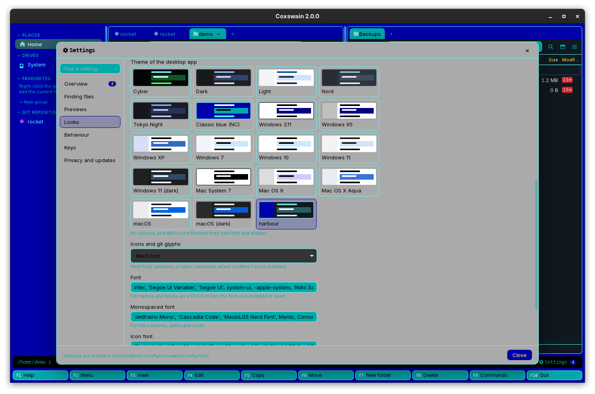

[← README](../../README.md) · [Docs index](../README.md) · [Customising](README.md)

# Your own theme and the colour slots

A theme of your own is a table in `config.toml` that sets the colours of up to 31 slots (the
lists, the cursor row, folders, git states, dialogs …) and, for the desktop app, a
[look](looks.md). Use it to fix one colour you do not like, or to bring your terminal's palette
into both apps.


<!-- screenshot: customise-own-theme.png: desktop app in the harbour theme, Settings open at Looks with For on Desktop app: the harbour swatch after the built-in ones, selected -->

## Contents

- [How to use it](#how-to-use-it)
- [Start from a built-in theme](#start-from-a-built-in-theme)
- [Colours](#colours)
- [The colour slots](#the-colour-slots)
- [What you see](#what-you-see)
- [Settings and config.toml](#settings-and-configtoml)
- [In the terminal app](#in-the-terminal-app)
- [Questions](#questions)

## How to use it

1. Open `config.toml` (`coxswain --config-path` prints where; see
   [Where things are kept](../reference/where-things-are-kept.md)).
2. Add a table under `[themes]` with a name of your own, and a table for each slot you set:

   ```toml
   [themes.harbour]
   look = "modern"                 # the desktop app's shapes; see Looks

   [themes.harbour.panel]
   fg = "#e0e0e0"
   bg = "#101820"

   [themes.harbour.cursor]
   fg = "#ffffff"
   bg = "#2a5d67"                  # not the folders' colour: a folder's name keeps it on the cursor row

   [themes.harbour.directory]
   fg = "#7fdbca"
   bg = "#101820"
   bold = true
   ```

3. Pick it:
   - **Desktop app:** restart it, then Settings (**Ctrl+,**) → *Looks* → *Theme*: your
     theme is after the built-in ones, under its own name. Or set `theme = "harbour"` under
     `[gui]`.
   - **Terminal app:** set `theme = "harbour"` at the top of the file, or pick it in the desktop
     app's Settings → *Looks* with *For* on *Terminal app*, and start it again.

Each slot takes `fg` (text), `bg` (background) and `bold` (`true` or `false`).

**Slots you leave out take the NC theme's colours**, and a theme without `look` gets NC's `dos`
look. Inside a slot you do write, a colour you leave out is empty: `[themes.harbour.directory]`
with only `fg` has no background of its own, so give `bg` too where it matters.

## Start from a built-in theme

The quickest way to a full theme is to copy one:

1. Run `coxswain --dump-config`. It prints every key with its default, including every built-in
   theme in full, as `[themes.nord]`, `[themes.nord.panel]` and so on.
2. Copy the theme's tables into `config.toml` and rename them, `nord` to `mynord`.
3. Change what you want, and pick `mynord`.

Keeping the built-in name (`[themes.nord]`) replaces the built-in theme instead; that works, but
only if you copy all of it (see the [questions](#i-set-themescyberpanel-to-tweak-cyber-and-everything-else-turned-blue)).

## Colours

| Written as | Desktop app | Terminal app |
|---|---|---|
| `#rrggbb`, such as `#7fdbca` | Exact | Exact, on a terminal with true colour |
| The 16 names: `black`, `blue`, `green`, `cyan`, `red`, `magenta`, `yellow`, `gray`, `darkgray`, `lightblue`, `lightgreen`, `lightcyan`, `lightred`, `lightmagenta`, `lightyellow`, `white` | The CGA colours (`blue` is `#0000aa`, `yellow` is CGA brown `#aa5500`); `grey` and `darkgrey` work too | The terminal's own palette for those names, so they look as your terminal's colour scheme says |
| `reset`, a palette number `0` to `255` | Not understood: ignored, as if empty | `reset` is the terminal's default colour; a number picks from the 256-colour palette |
| Empty or left out | No colour of its own | The terminal's default |

`#rrggbb` means the same in both apps, which is why every built-in theme uses it.

## The colour slots

| Slot | Desktop app | Terminal app |
|---|---|---|
| `panel` | The lists: text and background; also the base of dialogs' text and Mermaid diagrams | The lists |
| `border` | Pane borders, column lines, frames of fields | Panel borders and column lines |
| `header` | Column headers | Column headers |
| `directory` | Folders | Folders |
| `executable` | Programs | Programs |
| `hidden` | Hidden files; also dim text such as hints and labels | Hidden files |
| `symlink` | Symbolic links | Symbolic links |
| `cursor` | The cursor row | The cursor row, and the active panel's title |
| `marked` | Marked entries | Marked entries, and the *… marked* total on the info line |
| `marked_cursor` | A marked entry under the cursor | A marked entry under the cursor |
| `status` | The boxes in Mermaid diagrams (background) | Not used |
| `keybar_num` / `keybar_label` | The F-key bar's numbers and labels | The F-key bar's numbers and labels |
| `cmdline` | The command line | The command line, and status messages in it |
| `dialog` | Dialogs and the Settings window | Dialogs |
| `dialog_border` | Not used | Dialog frames |
| `dialog_input` | Input fields | Input fields |
| `git_branch` | The git line, the sidebar's repositories | The git line |
| `git_modified`, `git_added`, `git_untracked`, `git_deleted`, `git_renamed`, `git_conflict`, `git_ignored` | Git states of files ([Git](../panels/git.md)); `git_deleted` also colours errors | Git states of files; `git_conflict` also colours errors on the info line |
| `search_hit` | The words found, in Find and the preview | The words found, in Find |
| `accent` | Buttons, highlights, the active pane's ring, notices | Not used |
| `sidebar` | The sidebar | Not used (no sidebar) |
| `tab`, `tab_active` | Tabs | Not used (no tabs) |
| `preview` | The preview pane | Not used (no preview pane) |

## What you see

The desktop app turns each slot into CSS colours, so a change shows everywhere that slot is used
as soon as the theme is applied. In Settings, your theme gets a swatch like the built-in ones: a
small window in its `panel`, `sidebar`, `directory`, `cursor` and `border` colours. The desktop
app also decides from `panel`'s background whether the theme is light or dark, for scroll bars
and form pickers.

The terminal app sets each cell's colours from the slot; `bold` makes the text bold.

## Settings and config.toml

| Key | Type, default |
|---|---|
| `[themes.<name>]` | a table per theme; none by default (the built-in ones are always there) |
| `[themes.<name>] look` | text, `"dos"` when left out; see [Looks](looks.md) |
| `[themes.<name>.<slot>] fg`, `bg` | text: `#rrggbb` or a colour name; empty by default |
| `[themes.<name>.<slot>] bold` | true/false, `false` |
| `[gui] theme` / `theme` | the name to use, in the desktop app / the terminal app |

Settings does not edit themes; it only picks one. There is no key for a theme to follow the
system's light or dark mode.

## In the terminal app

The terminal app reads your themes too, from the same table. It uses the colours and `bold`,
and ignores `look` and the desktop-only slots (see the table). For colours to match the desktop
app exactly, use `#rrggbb` and a terminal with true colour.

## Questions

#### I set `[themes.cyber.panel]` to tweak Cyber, and everything else turned blue.

A `[themes.cyber]` table of your own replaces the built-in Cyber, and every slot you did not set
takes NC's colours, with NC's `dos` look. Copy the whole theme from `coxswain --dump-config`
into your config, then change what you want; or give yours a new name.

#### Why is my theme square and monospaced?

It has no `look`, so it gets NC's `dos` look. Add `look = "modern"` (or any other
[look](looks.md)) to `[themes.<name>]`.

#### Can I use named colours like `orange`?

No: only `#rrggbb` and the 16 names work in the desktop app, so write `#ffa500`. The terminal
app also takes what its terminal library knows (`reset`, the terminal's own default, and palette
numbers from 0 to 255), but a name the desktop app does not know is ignored there.

#### Why is `yellow` brown in the desktop app?

The 16 names are the CGA colours, as Norton Commander used them, and CGA's "yellow" (colour 6)
is brown, `#aa5500`. `lightyellow` is the bright yellow, `#ffff55`. The terminal app shows the
names in your terminal's palette instead, so they can differ between the apps; `#rrggbb` does
not.

#### My theme's folders have the wrong background on the cursor row.

In the terminal app the cursor row uses `cursor` (or `marked_cursor`) for the whole row,
including folders. In the desktop app, a slot you wrote with only `fg` has no background, so it
shows what is under it. Give `bg` in each slot you write, the same as `panel`'s background.

#### My theme is not in the list in Settings.

The desktop app reads `config.toml` when it starts, and again with every change made in
Settings, which reads the file afresh before writing it. So a theme added by hand appears after
the next start, or after any change in Settings (tick a box twice). Check too that the table is
`[themes.<name>]` (plural `themes`) and that the file still parses: if it does not, the desktop
app starts with the defaults and prints `coxswain: config: …; using defaults` on its terminal.

#### Can I share a theme with someone?

Yes: send them the `[themes.<name>]` tables. They paste them into their `config.toml` and pick
the name. The tables are plain text and work in both apps and on every system.

---
[← Previous: Looks](looks.md) · [Next: Languages →](languages.md)
