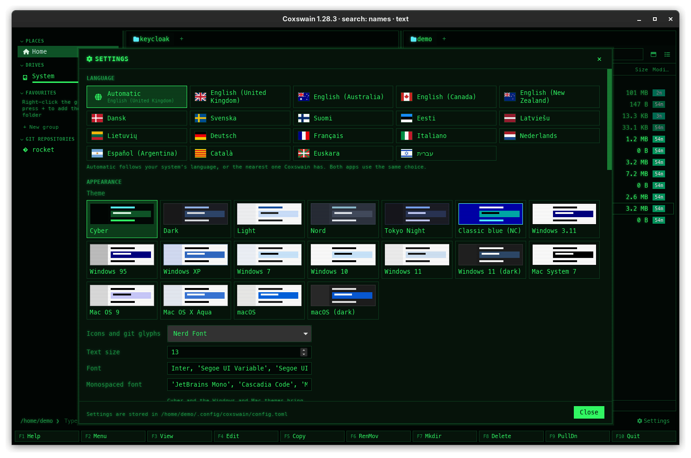
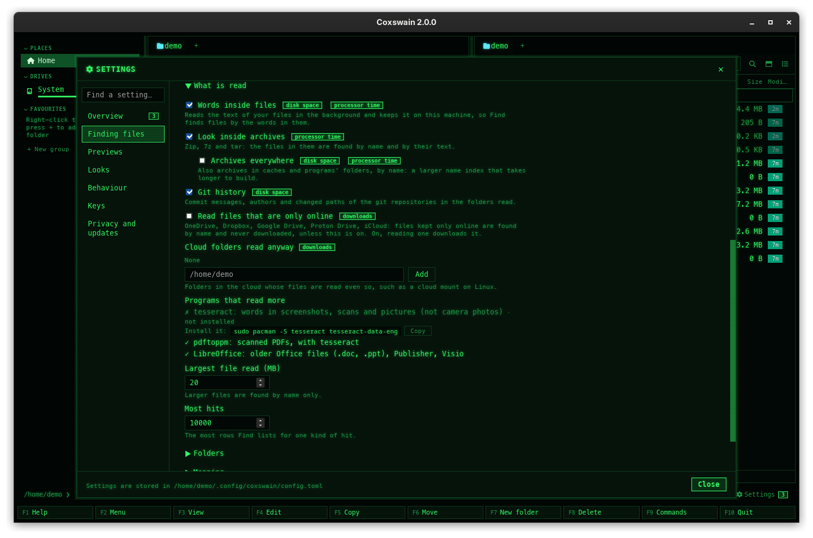

[← README](../../README.md) · [Docs index](../README.md) · [Customising](README.md)

# The Settings window

The desktop app's Settings window changes the most used parts of `config.toml` without opening
the file: language, theme, fonts, behaviour, search inside files, search by meaning and previews
made by tools. Every change applies at once and is written to the file.

*Settings, opened with **Ctrl+,**: Language at the top, Appearance below it.*

## Contents

- [How to use it](#how-to-use-it)
- [How changes are saved](#how-changes-are-saved)
- [Language](#language)
- [Appearance](#appearance)
- [Behaviour](#behaviour)
- [Search inside files](#search-inside-files)
- [Search by meaning](#search-by-meaning)
- [Previews made by tools](#previews-made-by-tools)
- [What's new](#whats-new)
- [Settings and config.toml](#settings-and-configtoml)
- [What Settings does not cover](#what-settings-does-not-cover)
- [In the terminal app](#in-the-terminal-app)
- [Questions](#questions)

## How to use it

1. Open Settings in any of these ways:

   | Way | Where |
   |---|---|
   | **Ctrl+,** | Anywhere in the window (the `settings` action; see [Changing keys](keys.md)) |
   | **F9** → *Settings* | The [command list](../panels/command-list.md) |
   | The **Settings** button with a gear | At the right end of the command line row. With a number after it, it opens the *What's new* page instead ([Notices and what's new](../search/notices.md)) |
   | **Show me** under *What's new* | The meaning and Ollama tips open *Search by meaning*; the tesseract and cloud tips open *Search inside files* |
   | A problem in the status line | *Search inside files has stopped: …* and *Search by meaning gets no vectors: …* open their section |
   | *turn on search by meaning* | The tip in [Find file](../search/find-file.md) |
   | `coxswain-gui --settings` | Starts the app with Settings open |
   | `coxswain-gui --settings=search`, `--settings=meaning` | The same, scrolled to *Search inside files* or *Search by meaning* |
   | `coxswain-gui --settings=news` | The same, at the *What's new* page |

2. Click, tick or type. A text field (a font, a server) is saved when you leave it or press
   **Enter**; everything else is saved on the click.
3. Close it with the **×** at the top, **Close** at the bottom, or **Esc**.

## What you see

A window over the panels, titled *Settings* with a gear. Its sections, top to bottom:
**Language**, **Appearance**, **Behaviour**, **Search inside files**, **Search by meaning**,
**Previews made by tools** and **What's new**. The body scrolls; the footer stays.

The footer says *Settings are stored in /home/me/.config/coxswain/config.toml* until you change
something, then *Saved to /home/me/.config/coxswain/config.toml*. When a change is refused, the
reason shows there in red instead.

## How changes are saved

Each change is written to `config.toml` as you make it, **keeping your comments and layout**:
only that one value changes, in place, or it is added under its table. If the file does not
exist yet, it is created with only what you changed. A change that would make the file invalid
is refused rather than saved: the file on disk is never replaced by one that does not parse.

The desktop app uses the new value at once: a new language redraws every text, a new theme
repaints the window, a new font or size re-lays the rows. A change to *Search inside files* or
*Search by meaning* also restarts the [search helper](../search/helper.md) with the new settings.
The terminal app reads the shared keys the next time it starts.

## Language

*Automatic*, which shows below it which language it picks, then every language by its own name
with its flag. Click one. The hint says: *Automatic follows your system's language, or the
nearest one Coxswain has. Both apps use the same choice.* Writes `language`. Details:
[Languages](languages.md).

## Appearance

| Item | Does | Key |
|---|---|---|
| **Theme** | Every built-in theme as a small swatch in its own colours (a sidebar, a folder row, the cursor row, a file row), then your own `[themes.<name>]` under their own names. Click one. See [Themes](themes.md) | `[gui] theme` |
| **Icons and git glyphs** | *Nerd Font*, or *Plain characters (ASCII)*. See [Glyphs and fonts](glyphs-and-fonts.md) | `glyphs` |
| **Text size** | A number, 9 to 28 pixels; the rows grow with it | `[gui] font_size` |
| **Font** | The interface font, as a CSS font list | `[gui] font` |
| **Monospaced font** | The command line, code in the preview, and everything in Cyber and NC | `[gui] mono_font` |
| **Icon font** | The Nerd Font for file icons and git glyphs, as a CSS font list | `[gui] icon_font` |

Under a theme whose look is not *modern*, a hint below *Monospaced font* says: *Cyber and the
Windows and Mac themes bring their own font; these fonts apply to the others.* See
[Looks](looks.md).

## Behaviour

| Item | Does | Key |
|---|---|---|
| *Show hidden files when Coxswain starts* | Whether hidden files show at start. **Alt+.** still switches them at any time; the desktop app then keeps your last choice in its session ([Sorting and hidden files](../panels/sorting.md)) | `show_hidden` |
| *Ask before deleting* | Unticked, **F8** and **Shift+F8** act at once, without the *Delete* dialog ([Delete](../files/delete.md)) | `confirm_delete` |
| *Check for a new version once a day* | Looks for a newer release on GitHub ([Update checks](../reference/updates.md)) | `check_updates` |
| *Show when each file and folder was last committed, and by whom* | The *Last commit* column and the preview pane's *Last commit* in git repositories ([Last commit per file](../panels/git.md#last-commit-per-file)) | `[git] last_commit` |

## Search inside files

*The Search inside files section. This picture predates the "Start the search helper with my
session" box and the list of programs that read more.*

| Item | Does | Key |
|---|---|---|
| *Keep the text of files, so Find file can search in it (Shift+F7)* | Turns reading files on or off. Unticked, the rest of the section hides | `[search] text` |
| The status line | *Searchable: 107 files · still to read: 0 · 284 KB on disk*, the store's path; *The search helper is not running, so text cannot be searched now.* when it is not; *Paused while the machine runs on its battery. Index now reads anyway.* | |
| *Start the search helper with my session, so it reads while no window is open* | Registers the helper with your session ([The search helper](../search/helper.md)) | none (a system entry) |
| **Index now** | Reads the backlog at full speed ([Battery](../search/battery.md)) | |
| **Delete the index** | Asks *Click again to delete*, then empties the store | |
| *Folders read* | The folders whose files are read; *Your home folder* when none. Each shows its size in the index, or that its disk is away. **Add** takes a path typed in the field (empty: the current folder); **Remove** takes one off | `[search] text_roots` |
| *Names only* | Folders found by name and counted in sizes, never read; *None* when none | `[search] names_only` |
| *Search the history of git repositories too: commit messages, authors and changed paths* | Commits found by Text in files and by meaning ([Git history in search](../search/history.md)) | `[search] history` |
| *Programs that read more* | ✓ or ✗ for tesseract, pdftoppm and LibreOffice, with *not installed* ([Scans, pictures and older Office files](../search/scans.md)) | |

Details: [Text in files](../search/text.md) and [Choosing the folders](../search/folders.md).

## Search by meaning

| Item | Does | Key |
|---|---|---|
| *Vectors made by* | *Built-in model, on this machine (… once)*, *Ollama*, or *A server with the OpenAI API (Lemonade, LM Studio, llama.cpp …)* | `[search] meaning_engine`: `"builtin"`, `"ollama"`, `"openai"` |
| *Server* | Only for a server. Empty means `http://localhost:11434` for Ollama; for the OpenAI API, the base URL such as `http://localhost:8000/api/v1` | `[search] meaning_url` |
| *Embedding model* | Only for a server, with the server's models to pick from; `bge-m3` is Ollama's suggestion. **Pull bge-m3 with Ollama** shows when Ollama does not have it | `[search] meaning_model` |
| *API key from the variable* | Only for the OpenAI API: the name of an environment variable, such as `OPENAI_API_KEY`. The key itself is never written to the file | `[search] meaning_key_env` |
| *Use the CPU only* | On a Mac only: keeps the built-in model off the GPU (Metal). The status above says where it runs: *Built-in model · on the GPU (Metal)* or *on the CPU (why)* ([on a Mac's GPU](../search/meaning.md#on-a-macs-gpu)) | `[search] meaning_device`: `"auto"`, `"cpu"` |
| The server line | *The server answers.*, or the error; and when the server is not this machine, in bold, *The text of your files is sent to … to get its vectors.* | |
| **Download the model (…) and turn on** | For the built-in model, before it is downloaded; *Downloading the model: … of …* with a bar and **Cancel** | `[search] meaning` |
| **Turn on** / **Turn off** | Once the model is there, or with a server. Greyed out while *Keep the text of files* is unticked | `[search] meaning` |
| **Delete the model** | Built-in model only | |
| The status line | *Understood: … files · still to go: …*, the engine, the model's folder, an error in red, and the battery pause | |

Details: [Search by meaning](../search/meaning.md) and [on a server](../search/servers.md).

## Previews made by tools

| Item | Does | Key |
|---|---|---|
| *Use* | *An installed program, else a container* (`"auto"`), *Installed programs only* (`"local"`), *Containers, even when a program is installed* (`"container"`) | `[preview] prefer` |
| *Container runtime* | *podman, else docker* (`"auto"`), *podman*, *docker*, or *No containers* (`"off"`) | `[preview] container` |
| *LaTeX image* | The TeX Live image; `docker.io/texlive/texlive:latest` by default, `:latest-medium` is about 2 GB instead of 5 | `[preview] images.latex` |
| *Build LaTeX documents by themselves when they are shown and have changed* | Unticked, LaTeX waits for **Build PDF** ([LaTeX projects](../previews/latex.md)) | `[preview] latex_auto` |
| *Timeout (seconds)* | 10 to 3600; pulling an image is not counted | `[preview] timeout` |
| *Previews made so far* | *… in the cache; made again when a source changes*, and **Clear**, which empties it (greyed out when it is empty) | none |
| *Container images* | Each image with *Pulled, 5.1 GB* or *Not pulled*, **Pull** (which also updates it; its progress shows in place) and **Remove** | none |

Details: [Previews made by tools](../previews/tools.md) and [Containers](../previews/containers.md).

## What's new

One button, *What's new*, with the count of tips and unread versions after it when there are
any. It opens the *What's new* page in the same window: **← Settings** at its top, then *For
you* (the tips, each with **Show me** and **Dismiss**), the versions you have not read, and
*Earlier versions: N*. Nothing in it is kept in `config.toml`. See
[Notices and what's new](../search/notices.md).

## Settings and config.toml

| Settings item | Key in `config.toml` | Type, default | Used by |
|---|---|---|---|
| Language | `language` | text, `"auto"` | Both apps |
| Theme | `[gui] theme` | text, `"cyber"` | Desktop app; the terminal app has the top-level `theme` |
| Icons and git glyphs | `glyphs` | `"nerd"` or `"ascii"`, `"nerd"` | Both apps |
| Text size | `[gui] font_size` | number, `13` | Desktop app |
| Font, Monospaced font, Icon font | `[gui] font`, `mono_font`, `icon_font` | CSS font lists | Desktop app |
| Show hidden files when Coxswain starts | `show_hidden` | true/false, `true` | Both apps |
| Ask before deleting | `confirm_delete` | true/false, `true` | Both apps |
| Check for a new version once a day | `check_updates` | true/false, `true` | Both apps |
| Show when each file and folder was last committed | `[git] last_commit` | true/false, `true` | Both apps |
| Keep the text of files | `[search] text` | true/false, `true` | The search helper, for both apps |
| Folders read, Names only | `[search] text_roots`, `names_only` | lists of paths, `[]` | The search helper |
| Search the history of git repositories too | `[search] history` | true/false, `true` | The search helper |
| Search by meaning | `[search] meaning` | true/false, `false` | The search helper |
| Vectors made by, Server, Embedding model, API key from the variable | `[search] meaning_engine`, `meaning_url`, `meaning_model`, `meaning_key_env` | text; `"builtin"`, `""`, `""`, `""` | The search helper |
| Use, Container runtime | `[preview] prefer`, `container` | text, `"auto"`, `"auto"` | Desktop app |
| LaTeX image | `[preview] images.latex` | text, `"docker.io/texlive/texlive:latest"` | Desktop app |
| Build LaTeX documents by themselves… | `[preview] latex_auto` | true/false, `true` | Desktop app |
| Timeout (seconds) | `[preview] timeout` | whole number, `120` | Desktop app |

## What Settings does not cover

Set these in `config.toml` (every key: [Configuration](../reference/configuration.md)):

- [keys](keys.md), [your own themes](own-theme.md), the terminal app's `theme`, a
  [`[glyph_set]`](glyphs-and-fonts.md) and the row height `[gui] line_height`;
- the [user menu](../commands/user-menu.md), `editor` and `viewer`
  ([View and edit](../commands/view-and-edit.md));
- `folder_sizes` (the desktop app has its own switch in the [columns menu](../panels/views.md));
- the name index's `[search] roots`, `exclude`, `watch`, `max_results`, and `text_exclude`,
  `text_max_size` ([Choosing the folders](../search/folders.md));
- the other container images and `prefer_tool` ([Previews made by tools](../previews/tools.md)).

## In the terminal app

The terminal app has no Settings window. It reads the same `config.toml` when it starts, so a
change made in Settings to a shared key (`language`, `glyphs`, `show_hidden`, `confirm_delete`,
`check_updates`, `[search]`) reaches it at its next start. Its own theme is the top-level `theme`.

What Settings does for search, the terminal app does with [flags](../reference/command-line-flags.md):

| Settings | Terminal app |
|---|---|
| *Start the search helper with my session…* | `coxswain --index-service on` / `off` |
| **Download the model … and turn on**, **Turn off**, **Delete the model** | `coxswain --meaning on`, `off`, `delete` |
| *Vectors made by* Ollama | `coxswain --meaning ollama [MODEL]` |
| *Vectors made by* a server with the OpenAI API | `coxswain --meaning server URL MODEL` |
| Back to the built-in model | `coxswain --meaning builtin` |

These write the same keys, keeping your comments, and restart the search helper. Previews made
by tools exist only in the desktop app, so their settings have no terminal counterpart.

## Questions

#### Will Settings mess up my hand-written config?

No. It edits the one value in place with a TOML editor that keeps every comment, blank line and
other key; a comment after the value stays too. If the file does not exist yet, it is created
with only what you changed.

#### Settings says something in red at the bottom and nothing changed. Why?

The new file would not have parsed, so it was not written. Most often the file already had an
error you made by hand (for example an unknown key name in `[keys]`, *unknown key 'Ctlr+P'*),
or a table such as `[search]` was written as a plain value. Fix the line the message names in
`config.toml`; until then the file stays as it was.

#### I changed the theme in Settings and the terminal app did not change.

The desktop app's theme is `[gui] theme`; the terminal app's is the top-level `theme`, so the two
can differ. Put `theme = "cyber"` (or any other name) at the top of `config.toml`, above the
first `[table]`, and start the terminal app again. See [Themes](themes.md).

#### Do I have to restart the desktop app after a change in Settings?

No. Language, theme, fonts and size apply at once, and search changes restart the search helper
by themselves. Only changes you make to `config.toml` by hand need a restart of the desktop app.

#### How do I open Settings straight at search by meaning?

Start the app with `coxswain-gui --settings=meaning` (or `--settings=search` for *Search inside
files*). In a running app, **Show me** on the tip *New: search by meaning … Turn it on* under
*Settings → What's new*, and the link in Find file's text depth, open that section too.

#### Where is the Settings key if Ctrl+, does nothing?

`Ctrl+,` is the default of the `settings` action; if you rebound it in `[keys]`, the gear
button's tooltip shows the key it has now. **F9** → *Settings* and the gear button always work.

#### Why can I not tick "Turn on" for search by meaning?

Search by meaning works on the text Coxswain keeps, so it needs *Keep the text of files, so Find
file can search in it (Shift+F7)* ticked first. Tick that in *Search inside files*, then turn search by
meaning on.

#### What does Clear under "Previews made so far" remove?

The previews tools made (LaTeX PDFs, Office conversions, diagrams), kept in the preview cache.
Nothing of yours: each is made again the next time you show its file. See
[Previews made by tools](../previews/tools.md).

---
[← Previous: Customising](README.md) · [Next: Themes →](themes.md)
