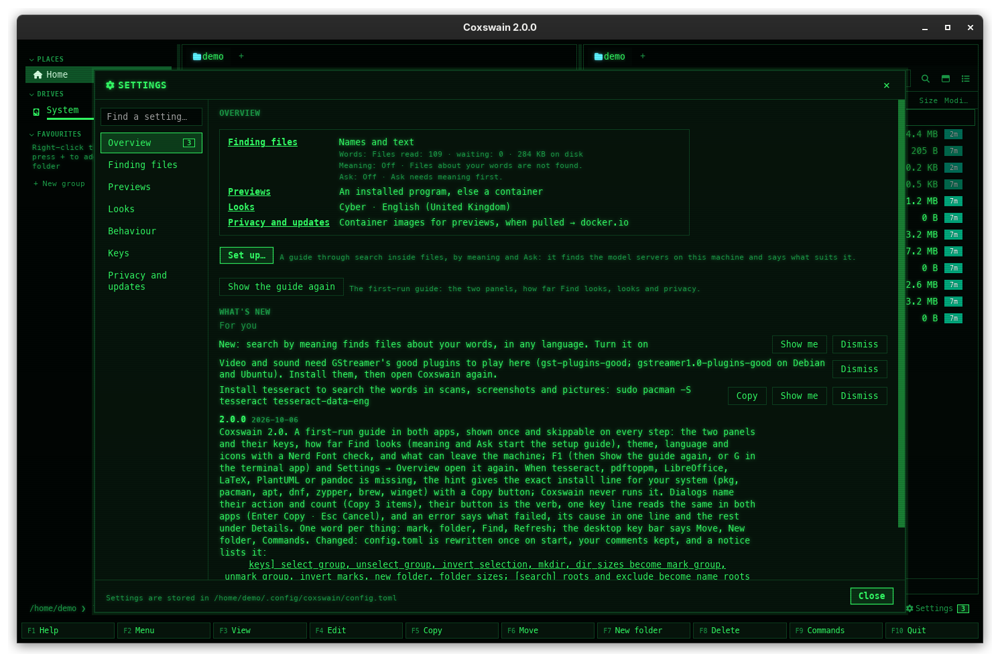
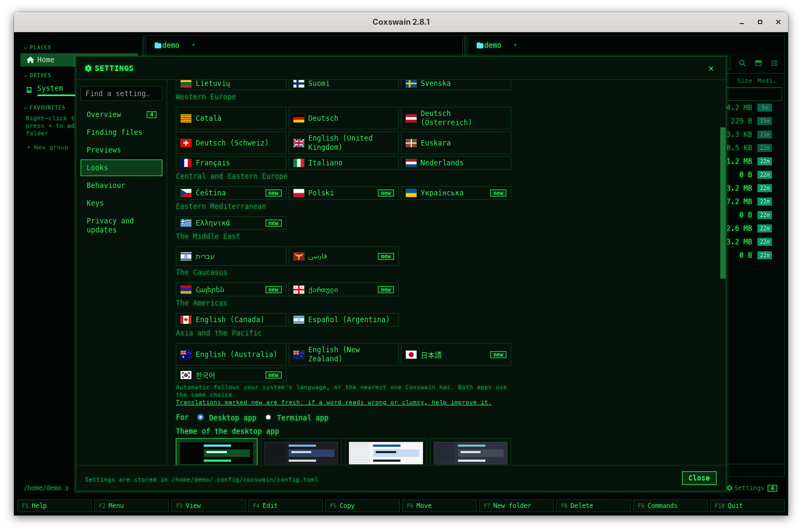
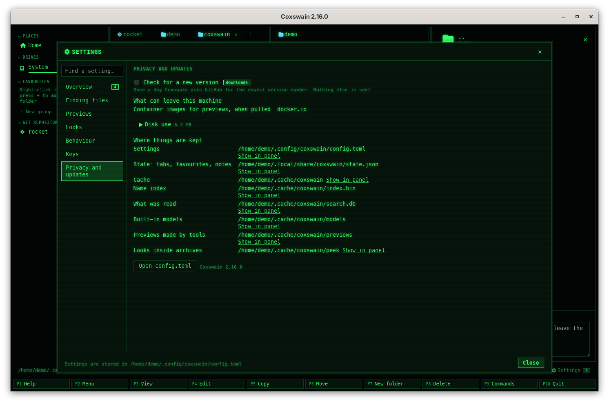
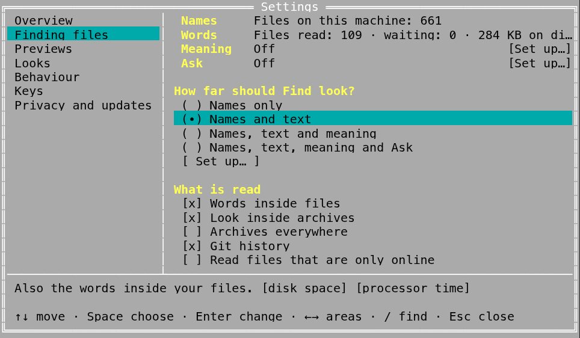

[← README](../../README.md) · [Docs index](../README.md) · [Customising](README.md)

# The Settings window

The desktop app's Settings window changes `config.toml` without opening the file. It is sorted
by what you come for: an **Overview** of how everything stands, **Finding files**, **Previews**,
**Looks**, **Behaviour**, **Keys**, and **Privacy and updates**. Each option has a label in plain
words, one line under it on what it does, and badges for what it costs. Every change applies at
once and is written to the file, your comments kept.


*Settings at Finding files, opened with `coxswain-gui --settings=search`.*

## Contents

- [How to use it](#how-to-use-it)
- [What you see](#what-you-see)
- [Find a setting](#find-a-setting)
- [How changes are saved](#how-changes-are-saved)
- [Overview](#overview)
- [Finding files](#finding-files)
- [Previews](#previews)
- [Looks](#looks)
- [Behaviour](#behaviour)
- [Keys](#keys)
- [Privacy and updates](#privacy-and-updates)
- [Settings and config.toml](#settings-and-configtoml)
- [What Settings does not cover](#what-settings-does-not-cover)
- [In the terminal app](#in-the-terminal-app)
- [Questions](#questions)

## How to use it

1. Open Settings in any of these ways:

   | Way | Opens at |
   |---|---|
   | **Ctrl+,** anywhere in the window (the `settings` action; see [Changing keys](keys.md)) | Overview |
   | **F9** → *Settings* in the [command list](../panels/command-list.md) | Overview |
   | The **Settings** button with a gear, at the right end of the command line row. Its tooltip names the key and, when tips or versions wait, how many and where: *Settings · Ctrl+, · What's new: 2, under Overview* | Overview, where *What's new* is ([Notices and what's new](../search/notices.md)) |
   | **Show me** on a tip under *What's new* | The tip's area: the meaning and Ollama tips open *Finding files* at *Meaning*, the tesseract and cloud tips *Finding files*, a new language *Looks* at *Language*, the 2.0 renaming notice *Keys* |
   | `coxswain-gui --settings` | Overview |
   | `coxswain-gui --settings=search` | Finding files |
   | `coxswain-gui --settings=<area>` | That area: `overview`, `search`, `previews`, `looks`, `behaviour`, `keys`, `privacy` |
   | `coxswain-gui --settings=<option>` | The option's area, with its group unfolded, scrolled to it and lit up for a moment: `search_meaning` (the *Meaning* group), `ask_model` (*Ask*), `language`, `search_cloud`, `check_updates` … (the names in [Settings and config.toml](#settings-and-configtoml)) |
   | `coxswain-gui --settings=models`, `--settings=disk` | *Built-in models* under Finding files, *Disk use* under Privacy and updates, unfolded |
   | Any other name, such as 1.x's `meaning`, `ask`, `news` or `cloud` | Overview |

   The terminal app opens its own Settings the same ways: [In the terminal app](#in-the-terminal-app).

2. Click an area on the left, or type in *Find a setting…* above them.
3. Click, tick or type. A text or number field is saved when you leave it or press **Enter**;
   everything else is saved on the click.
4. Close it with the **×** at the top, **Close** at the bottom, or **Esc**. In *Find a
   setting…* with text in it, the first **Esc** empties the field.

## What you see

A window over the panels, titled *Settings* with a gear:

- **On the left**: *Find a setting…*, then the seven areas. The open one is outlined in the
  accent colour. *Overview* carries a count when tips or versions are waiting to be read.
- **On the right**: the area. Each option is its label, its cost badges, the control, and a line
  in smaller grey text on what it does. Hovering an option shows its key in `config.toml` as a
  tooltip, such as `[search] text`.
- **At the bottom**: *Settings are stored in /home/me/.config/coxswain/config.toml* until you
  change something, then *Saved to /home/me/.config/coxswain/config.toml*. When a change is
  refused, the reason shows there in red instead.

The badges say what an option costs:

| Badge | Means |
|---|---|
| *disk space* | It keeps something on this machine: the text of your files, the model, an image |
| *processor time* | It works in the background: reading, measuring, building |
| *downloads* | It fetches something: a model, a container image, files kept only online |
| *can leave this machine* | Something of yours goes to a server: the text of your files to a model server, your questions to a chat model. To a server on this machine nothing leaves after all; [Privacy and updates](#privacy-and-updates) says where each one goes |

## Find a setting

Type in *Find a setting…*: the right side lists every option whose label, explanation or
`config.toml` key holds what you typed, each with its area and key. Click one: its area opens,
the groups around it unfold, and the option lights up for a moment. *No setting matches.* when
none does. Typing `cloud` finds *Read files that are only online* and *Cloud folders read
anyway*; typing `line_height` finds *Row height*.

## How changes are saved

Each change is written to `config.toml` as you make it, **keeping your comments and layout**:
only that one value changes, in place, or it is added under its table. If the file does not
exist yet, it is created with only what you changed. A change that would make the file invalid
is refused rather than saved: the file on disk is never replaced by one that does not parse.
Emptying *Editor* or *Viewer* takes the key out of the file, so `$EDITOR` or `$PAGER` applies
again.

The desktop app uses the new value at once: a new language redraws every text, a new theme
repaints the window, a new font, size or row height re-lays the rows. A change to anything the
[search helper](../search/helper.md) reads restarts it with the new settings. The terminal app
reads the shared keys the next time it starts.

## Overview



| Part | Shows | Does |
|---|---|---|
| *Finding files* | The search level (*Names and text* …), then one line each for words, meaning and Ask, with what needs saying (*Paused while the machine runs on its battery.*) | Clicking the name opens the area |
| *Previews* | How previews are made: *An installed program, else a container* … | Opens Previews |
| *Looks* | The theme and the language: *Cyber · English (United Kingdom)* | Opens Looks |
| *Privacy and updates* | What can leave this machine and where to, one line each (*The update check, once a day → api.github.com*), or *Nothing leaves this machine.* | Opens Privacy and updates |
| **Set up…** | | Opens the [setup guide](../search/setup.md) for words, meaning and Ask |
| **Show the guide again** | *The first-run guide: the two panels, how far Find looks, looks and privacy.* | Opens the [first-run guide](../panels/first-run.md) at its first step |
| *What's new* | *For you*: the tips, each with **Show me** and **Dismiss**; then the versions you have not read, and *Earlier versions: N* folded | **Show me** opens the tip's area. Once *What's new* is in sight, the versions count as read and the count on the gear goes |

Nothing in Overview is kept in `config.toml`. See [Notices and what's new](../search/notices.md).

## Finding files

Everything about Find: [names](../search/names.md), [words inside files](../search/text.md),
[meaning](../search/meaning.md) and [Ask](../search/ask.md). From the top:

### The status block

One line for each part of search, with the one step it needs:

| Line | Shows | Its button |
|---|---|---|
| *Names* | *Files on this machine: 912 330*, or *Still counting the files on this machine: 412 000 so far* | |
| *Words* | *Files read: 3 875 · waiting: 438 · 284 KB on disk*; *Paused while the machine runs on its battery.*; *Reading stopped: …* in red. *Off* with *Find looks at names only.* when words inside files are off; *Not running* with *Background reading is not running, so the words in files cannot be searched now.* | **Read now** when files wait (full speed, on battery too); **Turn on** when off (the level *Names and text*); **Start it** when not running |
| *Meaning* | *3 343 of 3 343 files · bge-m3 at localhost:11434*, or *· the built-in model on the CPU*; *About 40 minutes until every file is done.*; a server that does not answer as *The server at localhost:11434 does not answer. Is it running?* in red. *Off* with *Files about your words are not found.* | **Set up…** when off or failing |
| *Ask* | *qwen3:8b at localhost:11434*. *Off* with *Ask needs meaning first.* or *No chat model chosen yet.* | **Try it** asks the chat model a test question and shows *It answered: the first word came after 0.4 s.*, or why it could not; **Set up…** when off |

The lines refresh every two seconds while Settings is open.

### How far should Find look?

Four levels, one chosen. Each says what it adds and what it costs:

| Level | Adds | Badges | Choosing it |
|---|---|---|---|
| *Names only* | Files by name, on the whole machine. Nothing is opened | | Turns words inside files and meaning off. The model and the chat model stay |
| *Names and text* | The words inside your files | *disk space*, *processor time* | Turns words on, meaning off |
| *Names, text and meaning* | Files about your words, in any language | *disk space*, *processor time*, *downloads* | Turns words and meaning on, and forgets Ask's chat model. While the built-in model is not downloaded and no server is chosen, the setup guide opens instead |
| *Names, text, meaning and Ask* | Questions answered from your files by a chat model | *can leave this machine* | Turns words and meaning on. Without a chat model chosen, or without a model for meaning, the setup guide opens instead |

When meaning is on but words inside files are off (set by hand), no level is chosen and a red
line says so: meaning needs the words. **Set up…** under the levels opens the
[setup guide](../search/setup.md): it finds the model servers on this machine, chooses the
models, tests them and checks the GPU; what it sets shows in the status block.

### Details

**Details** unfolds every switch on its own, in five groups. *What is read* is open at first.

**What is read**

| Option | Does | Key |
|---|---|---|
| *Words inside files* | Reads the text of your files in the background and keeps it on this machine. Off: no [words](../search/text.md), no meaning, and folder sizes and duplicates lose the store's help | `[search] text` |
| *Look inside archives* | Zip, 7z and tar: their files found by name and by text ([Inside archives](../search/archives.md)) | `[search] archives` |
| *Archives everywhere* (under it, while it is on) | Also archives in caches and programs' folders, by name ([Which archives](../search/archives.md#which-archives)) | `[search] archives_everywhere` |
| *Git history* | Commit messages, authors and changed paths ([Git history in search](../search/history.md)) | `[search] history` |
| *Read files that are only online* | Ticked: files only in OneDrive, Dropbox, Google Drive, Proton Drive or iCloud are read, which downloads them ([Cloud files](../search/cloud-files.md)) | `[search] cloud`: `"local-only"` or `"all"` |
| *Cloud folders read anyway* (while the one above is off) | The clouds found, each with **Read its files**, and folders you add | `[search] cloud_read` |
| *Programs that read more* | ✓ or ✗ for tesseract, pdftoppm and LibreOffice. A missing one says *not installed*, then *Install it:* and the line for this system (`sudo apt install tesseract-ocr`) with **Copy**; Coxswain never runs it. Without a package here: *… has no package here: get it from its website and put it on PATH.* ([Installing what is missing](../search/scans.md#installing-what-is-missing)) | |
| *Largest file read (MB)* | Larger files are found by name only | `[search] text_max_size` (bytes in the file) |
| *Most hits* | The most rows Find lists for one kind of hit (the desktop app shows at most 500) | `[search] max_results` |

**Folders**

| Option | Does | Key |
|---|---|---|
| *Folders read* | Each folder with its size in the store, or that it is kept while its disk is not plugged in; *Your home folder* when none. **Add** takes the path typed (empty: the current folder), **Remove** takes one off ([Choosing the folders](../search/folders.md)) | `[search] text_roots` |
| *Names only* | Found by name and counted in folder sizes, never opened. A `.nosearch` file in a folder does the same | `[search] names_only` |
| *Left out everywhere* | Folder names (`node_modules`) and patterns (`*.log`) never read, as chips with **×** | `[search] text_exclude` |
| *Where names are found* | The folders the name index covers; *None* is the whole machine | `[search] name_roots` |
| *Never indexed* | Paths (`/proc`) and folder names the name index skips: not found even by name | `[search] name_exclude` |
| *Follow changes as they happen* | Off: the names are gathered again once an hour | `[search] watch` |

**Meaning** (`--settings=search_meaning` opens here)

| Option | Does | Key |
|---|---|---|
| *Meaning* | **Download the model (465 MB) and turn on** for the built-in model (*Downloading the model: … of …*, a bar, **Cancel**); **Turn on** once the model is there or with a server (it turns words on too); **Turn off**; **Delete the model**, and the model's folder with **Show in panel** | `[search] meaning` |
| *Made by* | *Built-in model, on this machine (465 MB once)*, *Ollama*, or *A server with the OpenAI API (Lemonade, LM Studio, llama.cpp …)*. A change that makes every file's meaning again asks first: **Change and re-read** or **Keep the current model** | `[search] meaning_engine` |
| *Server* (a server only) | Empty: Ollama on this machine. Under it, *The server answers.* or the error, and in bold when it is another machine: *The text of your files, with their names and folders, is sent to my-server:13305 to be read for meaning.* | `[search] meaning_url` |
| *Model* (a server only) | The server's models to pick from; **Pull bge-m3 with Ollama** when Ollama lacks it | `[search] meaning_model` |
| *API key from the environment variable* (OpenAI API only) | The variable's name, such as `OPENAI_API_KEY`; the key is never written to the file | `[search] meaning_key_env` |
| *Use the CPU only* (a Mac only) | Keeps the built-in model off the GPU ([on a Mac's GPU](../search/meaning.md#on-a-macs-gpu)) | `[search] meaning_device`: `"auto"`, `"cpu"` |

**Ask** (`--settings=ask_model` opens here)

| Option | Does | Key |
|---|---|---|
| *Chat model* | One list: the server's chat models (Ollama here with the built-in model) under *On Ollama at localhost:11434 · on the graphics card (…)*, the built-in ones under *Built in · on the CPU*, then *Another model…* and *Off*; models that only read meaning are left out. A pick saves it (a built-in one is downloaded first). **Try it** asks a test question. Once saved, the model is tried at once: one that cannot answer says why in red; a built-in one that is slow here says so in red with **Use qwen3:8b** ([When it is a poor choice here](../search/ask-builtin.md#when-it-is-a-poor-choice-here)). In bold, when the server is another machine: *Your questions and the passages closest to them are sent to …* | `[search] ask_model` |
| *Let the model think first* | Better reasoning with models that can think, many seconds before the first word ([Thinking](../search/ask.md#thinking)) | `[search] ask_think` |

**Built-in models** (`--settings=models` opens here)

| Part | Does | Key |
|---|---|---|
| Each model on the disk | Its name, *for Ask · 8.4 GB · in use · loaded on the CPU, about 8.4 GB of memory · last used 2026-10-08*, its folder with **Show in panel**, **Unload now** (a chat model that is loaded) and **Delete** (a second click on the one in use) ([Built-in models](../search/models.md)) | none |
| **Delete all not in use (size)** | Deletes every model not in use, unfinished downloads and older versions too | none |

**Background reading**

| Option | Does | Key |
|---|---|---|
| *Start with my session* | The helper starts at login, so the store follows your files between launches ([The search helper](../search/helper.md)) | none: a systemd user unit, a LaunchAgent or a *Run* entry |
| **Read now** | Reads what waits at full speed, on battery too. Greyed out when nothing waits | |
| The store's path | With **Show in panel** | |
| **Delete what was read (284 KB)** | In red, below a dashed line. Asks *Click again to delete*, then empties the store: text, sizes, hashes, meaning. Your files are not touched; they are read again from the start | |

## Previews

<!-- screenshot: previews-tools-settings.png: desktop app, Cyber, Settings → Previews (not in the sandbox, where containers must not run): How previews are made, Container runtime, LaTeX image, Build LaTeX by itself, Timeout, Previews made so far, Container images -->

For the previews that [tools](../previews/tools.md) make: LaTeX, PlantUML, Word and the like.
Opening this area asks the container runtime which images it has.

| Option | Does | Key |
|---|---|---|
| A red line at the top | When neither podman nor docker answers | |
| *How previews are made* | *An installed program, else a container* (`"auto"`), *Installed programs only* (`"local"`), *Containers, even when a program is installed* (`"container"`) | `[preview] prefer` |
| *Container runtime* | *podman, else docker* (`"auto"`), *podman*, *docker*, *No containers* (`"off"`) | `[preview] container` |
| *LaTeX image* | `docker.io/texlive/texlive:latest` by default; `:latest-medium` is about 2 GB instead of 5 | `[preview] images.latex` |
| *Build LaTeX by itself* | Off: LaTeX waits for **Build PDF** ([LaTeX projects](../previews/latex.md)) | `[preview] latex_auto` |
| *Timeout (seconds)* | 10 to 3600; pulling an image is not counted | `[preview] timeout` |
| *Previews made so far* | *… in the cache; made again when a source changes*, and **Clear** | |
| *Container images* | Each image with *Pulled, 5.1 GB* or *Not pulled*, **Pull** (also updates; its progress shows in place) and **Remove** ([Containers](../previews/containers.md)) | |

## Looks



| Option | Does | Key |
|---|---|---|
| *Language* | The language in use with its flag, a filter, then *Automatic* and every language by region, by its own name ([Languages](languages.md)) | `language` |
| *For: Desktop app / Terminal app* | Which app's theme the swatches below choose. The terminal app takes a new one when it starts again ([Themes](themes.md)) | |
| *Theme of the desktop app* / *Theme of the terminal app* | Every built-in theme as a swatch in its own colours, then your own `[themes.<name>]` | `[gui] theme` / `theme` |
| *Icons and git glyphs* | *Nerd Font* or *Plain characters (ASCII)* ([Glyphs and fonts](glyphs-and-fonts.md)) | `glyphs` |
| *Font* | The interface font, as a CSS font list. Greyed out under a theme that brings its own font (every theme but Dark, Light, Nord and Tokyo Night), with the line *Cyber draws its text in a font of its own: the font above applies to the other themes.* ([Looks](looks.md)) | `[gui] font` |
| *Monospaced font* | File contents, paths and code; under Cyber and Classic blue (NC), everything | `[gui] mono_font` |
| *Icon font* | The Nerd Font for file icons and git glyphs | `[gui] icon_font` |
| *Text size* | 9 to 28 pixels | `[gui] font_size` |
| *Row height* | 1.2 to 3 times the text size: 1.9 is roomy, 1.4 fits more rows | `[gui] line_height` |

## Behaviour

| Option | Does | Key |
|---|---|---|
| *Show hidden files when Coxswain starts* | **Alt+.** still switches them at any time ([Sorting and hidden files](../panels/sorting.md)) | `show_hidden` |
| *Ask before deleting* | Off: **F8** and **Delete** act at once ([Delete](../files/delete.md)) | `confirm_delete` |
| *Right-click* | *Marks it (Norton Commander)* or *Opens the action menu (a file explorer)*; Ctrl+right-click does the other in the desktop app ([The action menu](../panels/action-menu.md)) | `right_click` |
| *Show hints* | One short hint on the status line that fits what is under the cursor, each three times. *Show the hints again* (desktop app; `coxswain --hints reset` in a terminal) brings them back ([Hints](../panels/action-menu.md#hints-on-the-status-line)) | `hints` |
| *Measure folder sizes* | Folders show their whole size, measured in the background. The desktop app's columns menu switches it too ([Folder sizes](../panels/folder-sizes.md)) | `folder_sizes` |
| *Last commit of each file* | The *Last commit* column and the preview's *Last commit* ([Last commit per file](../panels/git.md#last-commit-per-file)) | `[git] last_commit` |
| *Editor* | The program **F4** opens a file in. Empty: the system's choice in the desktop app, `$VISUAL` or `$EDITOR` in the terminal app ([View and edit](../commands/view-and-edit.md)) | `editor` |
| *Viewer (terminal app)* | The program **F3** shows a file in, in the terminal app. Empty: `$PAGER`, else `less` | `viewer` |
| *CBOM viewer on F3 (terminal app)* | **F3** on a CycloneDX bill of materials opens the CBOM viewer ([CBOM viewer](../previews/bom.md)) | `bom_viewer` |
| *Provenance viewer on F3 (terminal app)* | **F3** on build provenance (SLSA, in-toto, a Sigstore bundle) opens the provenance viewer ([Build provenance](../previews/provenance.md)) | `provenance_viewer` |

## Keys

Every action and its keys, under the same headings as **F1** and **F9**, with a filter that
matches the action's name or a key: typing `F5` shows *Copy*. The list is read-only: keys are
changed in `config.toml` under `[keys]` ([Changing keys](keys.md)). Both apps read them when they
start.

**Open config.toml** opens `config.toml` at its `[keys]` table: in your `editor` at that line when
the editor takes `+line` (vi, vim, nvim, nano, emacs, micro, kak, …), else with the program
your system opens `.toml` files with. When the file has no `[keys]` yet, an empty `[keys]`
table with a commented example is written at its end first, so there is a place to start.

Above the list of keys, the desktop app shows *F2 scripts folder: <path>* (for example
`~/.config/coxswain/scripts`) with an **Open the folder** button: it opens that folder in the
active pane, made first when it is not there yet ([Scripts](../commands/scripts.md)).

![Settings at Keys in the desktop app: the filter field and Open config.toml, the line Keys are changed in config.toml under [keys], the line F2 scripts folder: /home/demo/.config/coxswain/scripts with the link Open the folder, then Moving and Panels and tabs with their actions and keys](../screenshots/settings-keys.png)

## Privacy and updates



| Part | Does | Key |
|---|---|---|
| *Check for a new version* | Once a day Coxswain asks GitHub for the newest version number ([Update checks](../reference/updates.md)) | `check_updates` |
| *What can leave this machine* | Built from your settings as they are: the update check → `api.github.com`; the built-in model while it is not downloaded → `huggingface.co`; the text of your files → the model server; your questions → the chat model's server; files only online → your cloud services; container images → their registries. A server on this machine says *(this machine)* | |
| *Disk use* | Every place Coxswain keeps things, with its size, what clearing costs, **Show in panel** and **Clear**, the built-in models, what Coxswain caused outside its folder, and *Clear everything that can be built again*; click the heading (with the total beside it) to open it, or `--settings=disk` ([Disk use](../reference/disk-use.md)) | |
| *Where things are kept* | Settings, state, cache, name index, what was read, the built-in model, previews and looks inside archives, each path with **Show in panel** (the list `coxswain --paths` prints; [Where things are kept](../reference/where-things-are-kept.md)) | |
| **Open config.toml**, and the version | *Coxswain 1.42.0* | |

See [Privacy](../reference/privacy.md).

## Settings and config.toml

Every option, the name `--settings=` takes, its key, and who reads it:

| Option (area) | Name | Key | Type, default | Used by |
|---|---|---|---|---|
| Words inside files (Finding files) | `search_text` | `[search] text` | true/false, `true` | The search helper, for both apps |
| Meaning | `search_meaning` | `[search] meaning` | true/false, `false` | The helper |
| Look inside archives, Archives everywhere | `search_archives`, `search_archives_everywhere` | `[search] archives`, `archives_everywhere` | true/false, `true`, `false` | The helper |
| Git history | `search_history` | `[search] history` | true/false, `true` | The helper |
| Read files that are only online, Cloud folders read anyway | `search_cloud`, `cloud_read` | `[search] cloud`, `cloud_read` | `"local-only"`/`"all"`; list of paths | The helper |
| Largest file read, Most hits | `text_max_size`, `max_results` | `[search] text_max_size`, `max_results` | bytes, 20 MB; `10000` | The helper; Find in both apps |
| Folders read, Names only, Left out everywhere | `text_roots`, `names_only`, `text_exclude` | `[search] text_roots`, `names_only`, `text_exclude` | lists | The helper |
| Where names are found, Never indexed, Follow changes as they happen | `name_roots`, `name_exclude`, `watch` | `[search] name_roots`, `name_exclude`, `watch` | lists; true/false, `true` | The name index |
| Made by, Server, Model, API key from the environment variable, Use the CPU only | `meaning_engine`, `meaning_url`, `meaning_model`, `meaning_key_env`, `meaning_device` | `[search] meaning_engine` … `meaning_device` | text; `"builtin"`, `""`, `""`, `""`, `"auto"` | The helper |
| Chat model, Let the model think first | `ask_model`, `ask_think` | `[search] ask_model`, `ask_think` | text, `""`; true/false, `false` | Ask in both apps |
| How previews are made, Container runtime (Previews) | `preview_prefer`, `preview_container` | `[preview] prefer`, `container` | text, `"auto"`, `"auto"` | Desktop app |
| LaTeX image, Build LaTeX by itself, Timeout | `latex_image`, `latex_auto`, `preview_timeout` | `[preview] images.latex`, `latex_auto`, `timeout` | text; true/false, `true`; `120` | Desktop app |
| Language (Looks) | `language` | `language` | text, `"auto"` | Both apps |
| Theme of the desktop app, of the terminal app | `theme`, `tui_theme` | `[gui] theme`, `theme` | text, `"cyber"`, `"nc"` | Each its own app |
| Icons and git glyphs | `glyphs` | `glyphs` | `"nerd"`/`"ascii"`, `"nerd"` | Both apps |
| Font, Monospaced font, Icon font, Text size, Row height | `font`, `mono_font`, `icon_font`, `font_size`, `line_height` | `[gui] font` … `line_height` | CSS font lists; `13`; `1.9` | Desktop app |
| Show hidden files…, Ask before deleting (Behaviour) | `show_hidden`, `confirm_delete` | `show_hidden`, `confirm_delete` | true/false | Both apps |
| Right-click, Show hints (Behaviour) | `right_click`, `hints` | `right_click`, `hints` | `"mark"`/`"menu"`, `"mark"`; true/false, `true` | Both apps |
| Measure folder sizes, Last commit of each file | `folder_sizes`, `git_last_commit` | `folder_sizes`, `[git] last_commit` | true/false | Both apps |
| Editor, Viewer, CBOM viewer on F3, Provenance viewer on F3 | `editor`, `viewer`, `bom_viewer`, `provenance_viewer` | `editor`, `viewer`, `bom_viewer`, `provenance_viewer` | text (absent: the environment); true/false, `true` | Editor: both apps; the others: the terminal app |
| Check for a new version (Privacy and updates) | `check_updates` | `check_updates` | true/false, `true` | Both apps |

The labels, explanations, areas and costs come from one description in `coxswain-core`
(`settings.rs`), which [the terminal app's Settings](#in-the-terminal-app) uses too.

## What Settings does not cover

Set these in `config.toml` (every key: [Configuration](../reference/configuration.md)):

- the keys themselves, under `[keys]` ([Changing keys](keys.md)); the *Keys* area lists them;
- [your own themes](own-theme.md) (`[themes.<name>]`; once there, they show among the swatches)
  and a [`[glyph_set]`](glyphs-and-fonts.md);
- the [user menu](../commands/user-menu.md);
- the other container images and `prefer_tool` ([Previews made by tools](../previews/tools.md)).

## In the terminal app

The terminal app has Settings too, full screen, with the same areas, options, labels,
explanations and costs: both apps read them from one description in `coxswain-core`
(`settings.rs`), so they cannot drift apart. It writes the same `config.toml`, the same way.

```
╔══════════════════════════════════ Settings ══════════════════════════════════╗
║ Overview            │  Names     Files on this machine: 3                    ║
║ Finding files       │  Words     Files read: 1 · waiting: 0 · 80.0 KB on disk║
║ Previews            │  Meaning   Off                                [Set up…]║
║ Looks               │  Ask       Off                                [Set up…]║
║ Behaviour           │                                                        ║
║ Keys                │ How far should Find look?                              ║
║ Privacy and updates │  ( ) Names only                                        ║
║                     │  (•) Names and text                                    ║
║                     │  ( ) Names, text and meaning                           ║
║                     │  ( ) Names, text, meaning and Ask                      ║
║                     │  [ Set up… ]                                           ║
║                     │                                                        ║
║                     │ What is read                                           ║
║                     │  [x] Words inside files                                ║
║                     │  [x] Look inside archives                              ║
║                     │  [ ] Archives everywhere                               ║
║                     │  [x] Git history                                       ║
║                     │  [ ] Read files that are only online                   ║
║─────────────────────┴────────────────────────────────────────────────────────║
║ Also the words inside your files. [disk space] [processor time]              ║
║                                                                              ║
║ ↑↓ move · Space choose · Enter change · ←→ areas · / find · Esc close        ║
╚══════════════════════════════════════════════════════════════════════════════╝
```
*Settings at Finding files, `coxswain --settings=search` at 80×24, the cursor on* Names and text.



### Opening it

| Way | Opens at |
|---|---|
| **F9** → *Settings* in the [command list](../panels/command-list.md) | Overview |
| **Ctrl+,** (the `settings` action), in terminals that pass it on | Overview |
| `coxswain --settings` | Overview, with both panels in the current folder |
| `coxswain --settings=<area>` | That area: `overview`, `search`, `previews`, `looks`, `behaviour`, `keys`, `privacy` |
| `coxswain --settings=<option>` | The option's area, the cursor on it: `show_hidden`, `search_meaning`, `ask_model`, `language`, `check_updates` … (the names in [Settings and config.toml](#settings-and-configtoml)) |
| Any other name, such as 1.x's `meaning`, `ask`, `news` or `cloud` | Overview |
| **Enter** on a tip under *What's new* in Overview | The tip's area, as *Show me* in the desktop app; the tip is not shown again |

Folders after the flag open in the panels, as without it: `coxswain --settings=search ~/src`.

### The keys

| Key | Does |
|---|---|
| **↑** **↓**, **PageUp** **PageDown**, **Home** **End** | Move over the rows; headings are skipped |
| **←** **→**, **Tab** / **Shift+Tab** | The area before or after (round the end) |
| **Space** | A switch (`[x]` / `[ ]`) flips; a choice takes its next value; a level, a step or a button is taken |
| **Enter** | A text or number field opens in place for typing, then **Enter** saves and **Esc** keeps the old value (**Ctrl+U** empties it). A choice opens its values under it: **↑** **↓** and **Enter** take one. A list opens its items: **Delete** removes the one under the cursor, typing goes into the *+ Add* field under them and **Enter** adds it, **Esc** closes the list. On anything else, as **Space** |
| **/** | *Find a setting*: type, and the options whose label, explanation or config key hold the words are listed with their area; **Enter** goes there, **Esc** comes back |
| **Esc**, **F10** | Close Settings (a field, list or search open: close that first) |

Every change is saved at once: the bottom line says *Saved to …/config.toml*, or in red why the
file was not written. While a field is open for typing, the bottom says *Enter Save · Esc
Cancel*. The bottom also shows, for the row under the cursor, its one-line explanation, its costs
as text in brackets (`[disk space]`, `[can leave this machine]` in red) and its key in
`config.toml`.

### What each area holds

| Area | In the terminal app |
|---|---|
| Overview | One line each for Finding files (the level and the Words, Meaning and Ask lines), Previews, Looks (the terminal app's theme and the language) and Privacy (where things can go); **Enter** opens that area. *Set up…*, *[ Show the guide again ]* (the [first-run guide](../panels/first-run.md)), the tips not dismissed yet, and what the versions you have not read brought |
| Finding files | The status block (*Names*, *Words*, *Meaning*, *Ask*), each with its next step in brackets: **Space** or **Enter** runs it (*Read now*, *Start it*, *Turn on*, *Set up…*, *Try it*, whose answer shows at the bottom). The four levels and *Set up…*. Then every option under *What is read*, *Folders*, *Meaning*, *Ask*; *Programs that read more*, each `✓` or `✗` with the line that installs a missing one (**Space** copies it to the terminal's clipboard, see below); and *Start with my session* under *Background reading* |
| Previews, Looks, Behaviour | Their options. The desktop app's own (fonts, text size, row height, its theme, previews) are there too, since both apps share `config.toml` |
| Keys | First the row *Change keys in config.toml, under [keys]*: **Enter** opens your editor there. Then every action the terminal app has, under its group, with its keys; read-only, as in the desktop app. No scripts folder: scripts are the desktop app's |
| Privacy and updates | *Check for a new version*, what can leave the machine with your settings as they are and where to, where things are kept, the version |

A level that needs a model starts the [setup guide](../search/setup.md) (`coxswain
--setup-search`) on the plain terminal, as **Set up…** does; Settings is back when it ends,
with what the guide chose. Changing the model that reads meaning asks first, at the bottom:
**Enter** changes it and reads every file's meaning again, **Esc** keeps the current one.

Changes are used at once: the theme (`tui_theme`), glyphs and language show straight away, a
`[search]` change starts a new search helper, and the rest applies where it is next used.
*Show hidden files when Coxswain starts* is what the next start does; **Alt+.** switches it now.

### What it does not do

The desktop app's buttons that are more than a value have no row: downloading or deleting the
built-in model (a level or *Set up…* downloads it through the guide; `coxswain --meaning delete`
deletes it), pulling container images, clearing the preview cache, *Delete what was read*, and
*Show in panel*. The flags still do what they did, for scripts:

| Settings | Flag |
|---|---|
| **Set up…** | `coxswain --setup-search` |
| *Start with my session* | `coxswain --index-service on` / `off` |
| Meaning on, off, model deleted | `coxswain --meaning on`, `off`, `delete` |
| *Made by* Ollama, a server with the OpenAI API, the built-in model | `coxswain --meaning ollama [MODEL]`, `--meaning server URL MODEL`, `--meaning builtin` |
| *Chat model* | `coxswain --meaning ask MODEL` (checks that it can answer first) |
| *Where things are kept* | `coxswain --paths` |

## Questions

#### Where did Search inside files and Search by meaning go?

Both are in *Finding files*. The four levels under *How far should Find look?* turn words,
meaning and Ask on and off in one click; **Details** holds every switch on its own: *What is
read*, *Folders*, *Meaning*, *Ask* and *Background reading*. `coxswain-gui --settings=search`
opens there, `--settings=search_text` and `--settings=search_meaning` at the switch itself, and
*Find a setting…* finds any of them by name.

#### Why does `--settings=meaning` open the Overview now?

Since 2.0 `--settings=` takes only an area (`overview`, `search`, `previews`, `looks`,
`behaviour`, `keys`, `privacy`) or an option's name. The section names of 1.x went; a name it
does not know opens the Overview. Use the option's name instead:

| 1.x | 2.0 |
|---|---|
| `--settings=meaning` | `--settings=search_meaning` |
| `--settings=ask` | `--settings=ask_model` |
| `--settings=news` | `--settings=overview` (*What's new* is there) |
| `--settings=cloud` | `--settings=search_cloud` |
| `--settings=language` | the same: `language` is an option's name |

#### How do I see the first-run guide again?

*Overview* → **Show the guide again**, in both apps. Or from Help: **F1** → *Show the guide
again* in the desktop app, **F1** then **G** in the terminal app. See
[First-run guide](../panels/first-run.md).

#### How do I copy an install line in the terminal app?

In *Finding files*, put the cursor on the missing program under *Programs that read more* and
press **Space**. The line goes to the terminal's clipboard (OSC 52, which works over ssh too) and
the bottom says *Copied: sudo apt install tesseract-ocr*. Coxswain never runs it: paste it into a
shell. A terminal without OSC 52 (or with it turned off) copies nothing; type the line from the
row instead.

#### I chose "Names, text and meaning" and a guide opened instead. Why?

Meaning needs a model, and none is ready: the built-in model is not downloaded and no server is
chosen. The [setup guide](../search/setup.md) finds the model servers on this machine, or
downloads the built-in model (465 MB) when you say so. Once a model is there, the level turns on
in one click. *Names, text, meaning and Ask* opens the guide the same way while no chat model is
chosen.

#### Why is no level chosen, with a red line under them?

Meaning is on but *Words inside files* is off, which `config.toml` allows and meaning cannot use:
it works on the text Coxswain keeps. Click a level, or tick *Words inside files* under
**Details** → *What is read*.

#### Why is the Font field greyed out?

The theme brings its own font: Cyber and Classic blue (NC) draw everything in the monospaced
font, the Windows and Mac themes in their era's font. The line under the field says so. Choose
Dark, Light, Nord or Tokyo Night to use your own font, or change *Monospaced font*, which Cyber
and Classic blue do use.

#### I changed the theme and the terminal app did not change.

The swatches chose the desktop app's theme. Click *Terminal app* next to *For* above them, then a
theme; the terminal app takes it when it starts again. In the terminal app's own Settings
(**F9** → *Settings* → *Looks* → *Theme of the terminal app*) it changes at once. See
[Themes](themes.md).

#### How do I change a setting in the terminal app?

**F9**, type `set`, **Enter**: Settings opens full screen. **←** **→** pick the area, **↑**
**↓** the option, **Space** flips a switch or takes the next value, **Enter** types a text or a
number or opens a list. It is saved at once; **Esc** closes. `coxswain --settings=show_hidden`
opens with the cursor on that option. See [In the terminal app](#in-the-terminal-app).

#### How do I add a folder to a list in the terminal app?

The cursor on the list (*Names only*, *Folders read* …), **Enter**: its items open under it, the
cursor in the *+ Add* field. Type the folder (relative to the active panel's folder, or empty for
that folder itself) and **Enter**. **↑** to an item and **Delete** removes it. For *Left out
everywhere* and *Never indexed* you type a name or a pattern (`*.log`) instead.

#### Will Settings mess up my hand-written config?

No. It edits the one value in place with a TOML editor that keeps every comment, blank line and
other key; a comment after the value stays too. If the file does not exist yet, it is created
with only what you changed.

#### Settings says something in red at the bottom and nothing changed. Why?

The new file would not have parsed, so it was not written. Most often the file already had an
error you made by hand (for example an unknown key name in `[keys]`, *unknown key 'Ctlr+P'*),
or a table such as `[search]` was written as a plain value. Fix the line the message names in
`config.toml`; until then the file stays as it was.

#### Do I have to restart the desktop app after a change in Settings?

No. Language, theme, fonts, size and row height apply at once, and search changes restart the
search helper by themselves. *Show hidden files when Coxswain starts* and *Measure folder sizes*
are what the app starts with (**Alt+.** and the columns menu switch them now). Changes you make
to `config.toml` by hand need a restart of the desktop app.

#### What does "can leave this machine" on an option mean?

That turning it on sends something of yours to a server: the text of your files to the model
server that finds their meaning, or your questions and passages to Ask's chat model. When the
server is on this machine (Ollama at `localhost`), nothing leaves after all. *Privacy and
updates* lists what can leave with your settings as they are, and where to.

#### Where is the Settings key if Ctrl+, does nothing?

`Ctrl+,` is the default of the `settings` action; if you rebound it in `[keys]`, the gear
button's tooltip shows the key it has now, and so does *Keys* in Settings. **F9** → *Settings*
and the gear button always work. Most terminals send **Ctrl+,** as a plain comma or not at all,
so in the terminal app use **F9** → *Settings* or `coxswain --settings`, or give the action a key
the terminal passes on, such as `settings = ["Alt+,"]` under `[keys]` ([Changing keys](keys.md)).

#### What does Clear under "Previews made so far" remove?

The previews tools made (LaTeX PDFs, Office conversions, diagrams), kept in the preview cache.
Nothing of yours: each is made again the next time you show its file. See
[Previews made by tools](../previews/tools.md).

---
[← Previous: Customising](README.md) · [Next: Themes →](themes.md)
