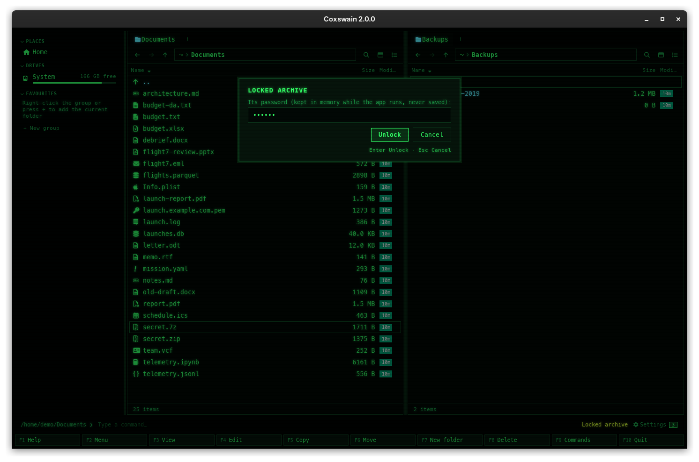

[← README](../../README.md) · [Docs index](../README.md) · [Files](README.md)

# Passwords for encrypted zip and 7z

A locked zip (ZipCrypto or AES) or 7z (AES) asks for its password when Coxswain needs to read
what is locked. The password is kept in the app's memory until you close it, so you are asked
once per archive, and it is never written anywhere. Packing (**Alt+F5**) can lock a new zip or
7z with a password of your own.

## How to use it

1. Do what you want with the archive: open it (**Enter**), copy a file out (**F5**), move it out
   (**F6**), or extract it (**Ctrl+E**).
2. When a locked part is needed, the dialog *Locked archive* opens with *Its password (kept only
   for this, never saved):*.
3. Type the password and press **Enter** (or click *Unlock*). The operation runs again with it.
4. A wrong password asks again, with *That password did not open it. Try again:*. **Esc** gives up.

| | Desktop app | Terminal app |
|---|---|---|
| The field | A password field: dots | Stars, one per character |
| Confirm / cancel | **Enter** or *Unlock* / **Esc** or *Cancel* | **Enter** / **Esc** |
| The key line under it | *Enter Unlock · Esc Cancel* | The same |
| Clear the field | select and type | **Ctrl+U** |

**When you are asked:**

| Archive | Asked when |
|---|---|
| Zip with locked files | You copy, move or extract a locked file. Its names are not locked, so it opens and lists without a password; the badge says *archive, locked* |
| 7z with locked contents | You copy, move or extract a file, or change the archive (add, rename, make a folder, take out): it is unpacked and packed again for that. The badge says *archive, locked* |
| 7z with locked contents and names | Already when you open it with **Enter**: without the password even the list of names cannot be read |

### Locking a new archive

1. Mark what to pack and press **Alt+F5** ([Pack](pack-and-extract.md)).
2. Give the target a `.zip` or `.7z` ending (`.jar` and the other zip endings too).
3. Type the password in *Password (empty: none; kept in memory while the app runs, never saved):*
   and again in *The password again:*.
4. For a 7z, leave *Hide the file names too* on to lock the list of names as well, or turn it
   off to let anyone see the names (but not the contents).
5. Press **Enter**. Leave both fields empty to pack without a password.

| Format | What is locked | Method |
|---|---|---|
| Zip | Every file's contents; names, sizes and dates stay readable | AES-256 (WinZip AE-2) |
| 7z | All contents; with *Hide the file names too*, the names as well | AES-256 with SHA-256 key derivation |
| Tar (all kinds) | Nothing: the format has no passwords | — |

The new archive's password is kept for the rest of the app run, so you can open it straight away
without typing it again.

| | Desktop app | Terminal app |
|---|---|---|
| Password | A password field and a second one to confirm it, both dots | A prompt with stars, then a second one to confirm; **Enter** alone means none |
| Hide the names (7z) | The checkbox, on by default | Always on |
| Different passwords | *Pack* greyed out, *The passwords do not match* | *The passwords do not match* on the status line; nothing is packed |

## What you see

- The dialog *Locked archive*, as above. After a wrong password the label changes to *That
  password did not open it. Try again:* (for copy, move, extract, delete and new folder; when
  opening a 7z, the first label is shown again).
- In the desktop app the pane inside a zip with locked files, or a 7z with locked contents,
  shows the badge *archive, locked*.
- While the password dialog is up, the pane says *Locked archive*.
- If you press **Esc** when opening a locked 7z, the pane stays in the folder that holds it
  (the terminal app's info line says `locked: a password is needed`); open it again to be
  asked again. With the cursor on such a 7z, the desktop app's preview says *This file is
  locked with a password.*, with the link *Enter the password* that lists it once given.
- If you press **Esc** during a copy, nothing is copied from the locked part.

## How long the password is kept, and where

- **In memory only.** The password is held by the running app, for that archive's path. It is
  never written to `config.toml`, the session, the cache, a log or anywhere else on disk.
- **Until the app closes.** Every later copy, move or extract from the same archive uses it
  without asking. Closing the app forgets it. The desktop app and the terminal app each keep
  their own.
- **Kept only when it worked.** A password given for a copy or extract is kept only after it
  opened the archive; one given to open a 7z is replaced when you type another.
- **Per path.** A moved or renamed archive is a new path and asks again.
- It is held as ordinary text in the app's memory, not wiped. A program that can read the app's
  memory as your user (a debugger) could read it; nothing else can.

## Settings and config.toml

None. There is no setting to store passwords, on purpose, and the password you pack with is not
remembered in the Pack dialog either.

## In the terminal app

The same dialog, texts and rules. The field shows stars. The password is kept in the terminal
app's memory until you quit it (**F10**).

## Questions

#### Does Coxswain save my archive passwords?

No. A password lives in the running app's memory and is gone when you close it. It is never
written to disk.

#### Why was I not asked again for the second file?

The password that opened the archive is kept for the rest of the app run, for that archive.

#### Why could I see the names in a locked zip without a password?

In a zip only the contents of each file are locked, not the names or sizes. So Coxswain can list
it; the badge *archive, locked* tells you the password will be needed to copy those files.

#### Why does a 7z ask for the password before it even opens?

That 7z was made with its file names locked as well (`7z -mhe=on`). Without the password there is
nothing to list.

#### Some of the marked files were not locked. Are they copied twice?

No. Whatever was not locked is copied in the first try; when the rest failed only for want of a
password, you are asked for it and the operation runs again for just those files. If something
else failed as well (a name that exists, say), the errors are shown instead and nothing runs
again.

#### Can I remove a locked file from a zip without the password?

Yes. Taking out (**F8**) writes the zip anew with the other entries copied as they are, locked or
not; nothing needs to be unlocked. A 7z has to be unpacked and packed again, so it asks for the
password unless it is known from opening it or from a copy out, and it is then written back locked
with it ([Limits](archives.md#limits)).

#### Which encryption is used?

AES-256 for both formats. A zip gets WinZip's AES encryption (AE-2), which 7-Zip, WinZip, macOS
Archive Utility (recent versions), `unzip` builds with AES and most other tools read; the old
ZipCrypto is never written, as it is easily broken. A 7z gets 7-Zip's own AES-256 with a key made
from the password with SHA-256, as `7z a -p` does.

#### Can I add files to a password-protected archive later?

Yes: copy them in with **F5** (or move them with **F6**). They get the same password as the files
already in it; you are asked for it unless Coxswain still knows it from this run.

A zip locked the old way (ZipCrypto, as `zip -e` and older tools make them) asks for its password
for any change, also taking out or renaming: its locked files are written anew, locked with
AES-256 and the same password, since the old lock cannot be carried over as it is.

#### Can others open the zip I locked?

Yes, with the password, in any program that reads AES zips (7-Zip, WinZip, Keka, The Unarchiver,
`7z x`). Windows Explorer's built-in zip support has long not read AES zips; use 7-Zip there if it refuses.

#### Why are the names in my locked zip visible?

The zip format locks only the contents of each file. To hide the names too, pack into a 7z with
*Hide the file names too*.

#### Why can a tar not have a password?

The tar format has no encryption. Pack into a zip or 7z instead, or encrypt the tar with a tool
such as `gpg` or `age` on the [command line](../commands/command-line.md).

#### How do I make Coxswain forget a password?

Close the app (the desktop window, or **F10** in the terminal app). There is no other way.

#### What if a wrong ZipCrypto password looks right?

The old ZipCrypto method cannot always tell a wrong password at once; Coxswain notices when the
file's checksum does not match. The half-written file is removed and you are asked again.

---
[← Previous: Pack and extract](pack-and-extract.md) · [Next: Properties and permissions →](properties.md)
