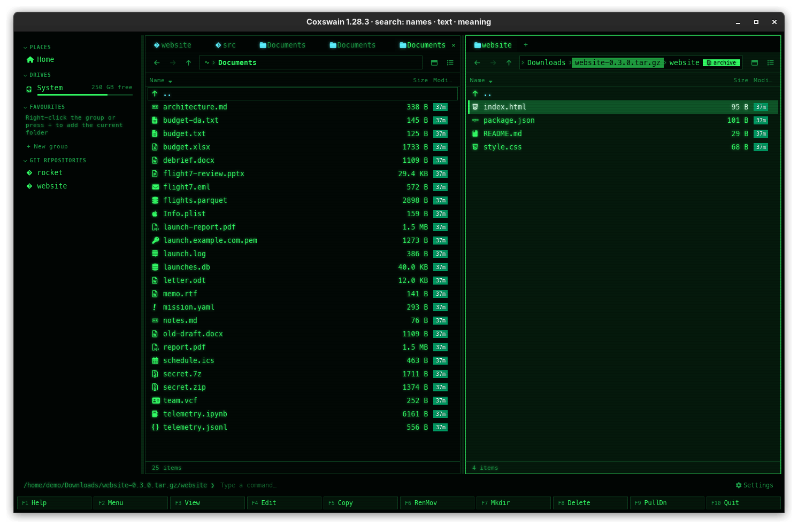

[← README](../../README.md) · [Docs index](../README.md) · [Files](README.md)

# Archives as folders

A zip, tar or 7z archive opens like a folder, in both apps. Inside it the usual keys work:
**F5** copies out, **F6** moves out or renames, **F7** makes a folder, **F8** takes things out,
and **F5** from another panel copies into it. Copies between two archives work too.

![The terminal app in Classic blue (NC): the left panel inside the archive, titled /home/demo/Downloads/website-0.3.0.tar.gz [archive], the right panel an ordinary folder](../screenshots/tui-archive.png)

## Contents

- [How to use it](#how-to-use-it)
- [Formats](#formats)
- [What you see](#what-you-see)
- [What changes, and how safely](#what-changes-and-how-safely)
- [Why not RAR](#why-not-rar)
- [Limits](#limits)
- [Settings and config.toml](#settings-and-configtoml)
- [In the terminal app](#in-the-terminal-app)
- [Questions](#questions)

## How to use it

1. Put the cursor on an archive and press **Enter** (or double-click it in the desktop app). The
   pane now shows the archive's top folder.
2. Move around inside as in any folder: **Enter** goes into a folder, **Backspace** (or `..`)
   goes up. From the archive's top, **Backspace** leads out to the folder that holds it.
3. Use the file keys:

| Key | Inside an archive | Into an archive (the other panel shows one) |
|---|---|---|
| **F5** | Copies the marked files and folders **out**, to the other panel's folder, or into another archive | **Adds** the files to it |
| **F6** | Moves out: copies out, then takes them out of the archive. With a new name, or a folder in the same archive, it **renames** or moves within the archive | Adds the files, then deletes the originals |
| **F7** | Makes a folder inside the archive | |
| **F8**, **Shift+F8** | **Takes out** of the archive, after a question: there is no trash inside an archive | |
| **Enter** on a file | Says on the status line that it must be copied out first | |
| **Space** | The preview pane shows the file: a copy of it is made when the cursor rests on it | |
| **F3** (terminal app) | Views the file: a copy of it goes to your viewer | |
| **Ctrl+E** on an archive | [Extracts](pack-and-extract.md) it into a new folder | |
| **Alt+F5** | [Packs](pack-and-extract.md) files on disk into a new archive | |

The keys are the same in both apps. You can also type an archive's path into the target of the
[Copy](copy.md) or [Move](move-and-rename.md) dialog, `~/backup/tools.zip` or
`~/backup/tools.zip/bin`: the files are added there.

A locked (encrypted) zip or 7z asks for its password when it is needed:
[Passwords for encrypted zip and 7z](archive-passwords.md).

## Formats

Everything is read and written by Coxswain itself, in pure Rust: no `zip`, `tar` or `7z`
program is needed.

| Format | Endings | Browse, copy out, extract | Copy in, rename, new folder, take out, pack | Passwords |
|---|---|---|---|---|
| Zip | `.zip`, and zips by another name: `.jar` `.apk` `.whl` `.nupkg` `.vsix` | yes | yes (new files Deflate-compressed) | ZipCrypto and AES to read, AES-256 when packing; a changed ZipCrypto zip is locked anew with AES-256 |
| Tar | `.tar` | yes | yes | none in the format |
| Tar with gzip | `.tar.gz`, `.tgz` | yes | yes | none |
| Tar with bzip2 | `.tar.bz2`, `.tbz2`, `.tbz` | yes | yes | none |
| Tar with xz | `.tar.xz`, `.txz` | yes | yes | none |
| Tar with zstd | `.tar.zst`, `.tzst` | yes | yes | none |
| 7z | `.7z` | yes | yes (LZMA2) | AES to read and when packing; also locked file names |
| RAR | `.rar` | no | no | ([why](#why-not-rar)) |
| A lone `.gz`, `.bz2`, `.xz`, `.zst` | | no: it holds one file, not a folder | no | |

Endings are recognised in any case (`.ZIP`). A file is taken for an archive by its name only.

## What you see

**Desktop app**

- The pane is **tinted** in the accent colour while it shows the inside of an archive.
- In the path bar, the **archive's name is marked** in the accent colour
  (`Downloads › website-0.3.0.tar.gz › website`), so you see where the archive starts.
- A **badge** at the right end of the path bar says *archive*, or *archive, locked* when
  something in the folder you are in (or below it) needs a password. Its tooltip says: *You are
  inside an archive: F5 copies out of it, F6 moves out, F8 takes out; copies into it are added*.
- **Enter** on a file says on the status line: *website-0.3.0.tar.gz is an archive: F5 copies
  this file out of it*.
- The preview pane for a file inside says *Opening it from website-0.3.0.tar.gz…* for a moment,
  then shows the file as it would any other: a picture, a PDF, code, a spreadsheet. A locked file
  says *This file is locked with a password.* with the link *Enter the password*; once given, the
  preview comes, and the password is kept for the rest of the run. On an archive itself (not opened), the preview lists what is in it; see
  [Media and archives in the preview](../previews/media.md).
- **F8** asks, in a dialog titled *Delete*: *Take "a.txt" out of tools.zip? The archive is
  written anew without it; there is no trash inside an archive.*

**Terminal app**

- The panel's title adds **`[archive]`** after the path:
  `/home/me/Downloads/website-0.3.0.tar.gz/website [archive]`.
- **Enter** on a file, and **F8**, show the same texts as in the desktop app.

The marking is there so that a copy out of an archive is never taken for a copy between two
folders.

Folders inside an archive have no size in the size column, and dates are the ones stored in the
archive (a zip's, which has no time zone, in yours: the time its maker saw, and the time other
tools show for a zip Coxswain made). Hidden entries (names starting with a dot) follow **Alt+.** as elsewhere.

## What changes, and how safely

**Reading never changes the archive.** Browsing, copying out and extracting only read it.

**Every change writes the archive anew.** Adding, renaming, moving within, making a folder and
taking out all write a complete new archive next to the old one, in a file ending in
`.coxswain-tmp` (`tools.zip.4711.coxswain-tmp` for `tools.zip`, the number being the app's process
id, so two apps never write the same file). Only when it is complete does it take the
old one's place, with a rename in the same folder. If anything fails on the way, the new file is
removed and the archive is exactly as it was. One archive is written at a time per app: a second
change waits for the first.

| Format | How it is written anew |
|---|---|
| Zip | Every entry that stays is copied over as it is, compressed and (if locked) still locked: nothing is unpacked. New files are compressed with Deflate. Quick even for large zips. |
| Tar, plain or compressed | Every entry is read and written into a plain tar next to the archive (`….coxswain-tar`), which is then compressed into the new file: gzip and bzip2 at their default level, xz at level 6, zstd at its fastest level. A compressed tar is unpacked and packed again in full, so it takes as long as packing it would, and its size may differ afterwards. |
| 7z | 7z cannot copy entries as they are: every entry is unpacked and packed again (LZMA2) on its way from the old file to the new, keeping its dates and attributes. Nothing is written to the temp folder. A 7z with locked contents needs its password for this ([Passwords](archive-passwords.md)). |

Copying **from one archive into another** goes through a folder of its own in the system's temp
folder (`coxswain-archive-…`), which is removed afterwards.

Free space needed: room for the new archive next to the old one, and for a tar also the
unpacked tar.

The new archive is a new file with the old one's permissions, and hard links to the old one
keep pointing at the old contents. Files added to a zip keep their Unix permissions (the
executable bit).

## Why not RAR

RAR archives are not opened. Their format may only be read with RAR's own code, under its own
licence, and there is no free code to write them. Coxswain reads and writes every format it
supports with its own pure-Rust code, the same on every system, so RAR is left out. **Enter** on a
`.rar` opens it in the program your system uses for it.

## Limits

- **An archive inside an archive** is not opened: **Enter** on it says, like on any file inside,
  that **F5** copies it out. Copy it out first, then open it.
- **Files inside are previewed and viewed from a copy**, not opened or edited: **Enter** and
  **F4** say on the status line that **F5** copies the file out, since changes to a copy would be
  lost. The copy is made in the cache folder (`coxswain/peek/`, readable by you alone), one at
  a time, and removed when the next is made; copies left by an app that ended go after a day.
  Files over 256 MB are not copied just to be looked at, counted as they come out, not by the
  size the archive claims: the preview says to copy them out.
- **Names that lead outside** (`../…`, an absolute path, on Windows a drive or a `\`) are not
  listed, so nothing you do in the archive acts outside it. They stay in the archive when it is
  written anew. A tar whose long-name record is over 64 KB is not opened.
- **Batch rename and properties** do not look inside archives. A folder inside shows the
  size of the files in it, as listed; nothing is measured. **Search** does: Find gets the
  files in the archives of your home folder by name and by their text, and follows their changes
  ([Inside archives](../search/archives.md)). Pack (**Alt+F5**) takes files on
  disk, not entries of another archive.
- **Symbolic links** on disk are left out when added to an archive, since what they point at may
  be anywhere. When copying out of a tar, links and special entries are skipped; **Ctrl+E**
  extracts them. A move (**F6**) out of an archive with such an entry is refused before
  anything is taken out, so nothing is lost. Links in a zip come out as small files that hold
  the target, never as links.
- **Changing a locked archive:** in a zip, locked files stay locked, and files you add are
  locked with its password (AES-256). A locked 7z that you change is written anew locked with
  the same password (its names too, when they were), the key made as 7-Zip makes it.
- **Large compressed tars** are read from the start when opened, as the format has no index.
  The listing is kept while the archive does not change, so moving between its folders is
  quick after that. A multi-gigabyte `.tar.xz` is still slow to open; extract it instead.
- **No overwriting:** a name that already exists inside, or at the target outside, is refused
  with `… exists`, as between folders.

## Settings and config.toml

None. The keys are the usual file keys (`copy`, `move`, `new_folder`, `delete`, `delete_forever`,
`open`, `parent`) and `extract` and `pack` in `[keys]` ([Changing keys](../customise/keys.md)).

## In the terminal app

Everything is the same: opening, copying in, out and between, moving, renaming, new folders,
taking out, extracting, packing and passwords. The difference is only in what you see: the
panel title says `[archive]` instead of a tint and a badge, and there is no preview pane.

## Questions

#### Can I look at a file inside an archive without unpacking it?

Yes. Put the cursor on it with the preview pane open (**Space** in the desktop app), or press
**F3** in the terminal app. Coxswain copies just that file out, into its cache folder, and shows
the copy. Nothing next to the archive is written, and the copy goes when you look at the next
file.

#### Why can I not edit a file inside an archive with F4?

The editor would change a copy, and the change would be lost when the copy goes. Copy the file
out with **F5**, edit it, then copy it back with **F5** into the archive: it is replaced there.

#### How do I get one file out of a zip without unpacking all of it?

Press **Enter** on the zip, go to the file and press **F5**. It is copied to the other panel's
folder; nothing else is unpacked.

#### How do I add files to an existing archive?

Open the archive with **Enter** in one panel. In the other panel, mark the files and press
**F5**. They are added to the folder of the archive you have open. Or type the archive's path as
the target of **F5**.

#### Is it safe to change an archive? What if the power goes off?

The archive is written anew into a `.coxswain-tmp` file next to it and only then renamed over the
old one. Until that rename the old archive is untouched; if something fails, the new file is
removed. After a crash a leftover `….coxswain-tmp` (or `….coxswain-tar`) file can be deleted.

#### Can I change one archive from the desktop app and the terminal app at once?

Yes. Coxswain writes one archive at a time, across all its windows and both apps: a change waits
while another is being written (a lock on `archive-writing.lock` in Coxswain's cache folder), then
starts from the archive as the other left it, so neither change is lost. Another program writing
the same archive at the same moment is not held back by it.

#### Why does adding one small file to a big .tar.xz take so long?

A compressed tar cannot be changed in place: Coxswain reads it all, writes it again and
compresses it again. A zip is quicker, since its entries are copied over without unpacking.

#### Why did F8 not put the file in the trash?

Inside an archive there is no trash: the file is an entry of the archive, and taking it out
writes the archive without it. The question says so. Copy the file out first if you may want it
back.

#### Can I copy from one archive straight into another?

Yes. Open one in each panel and press **F5**. The files pass through a temporary folder and are
added to the other archive.

#### Why does opening a .rar do something else?

RAR is not supported ([Why not RAR](#why-not-rar)), so **Enter** hands it to the program your
system opens `.rar` files with.

#### How do I know I am inside an archive and not a folder?

The desktop app tints the pane, marks the archive's name in the path and shows the *archive*
badge; the terminal app adds `[archive]` to the panel title.

#### Why does an archive inside an archive look empty?

Coxswain opens one level of archive. Copy the inner archive out with **F5**, then open it.

---
[← Previous: Batch rename (Ctrl+M)](batch-rename.md) · [Next: Pack and extract →](pack-and-extract.md)
