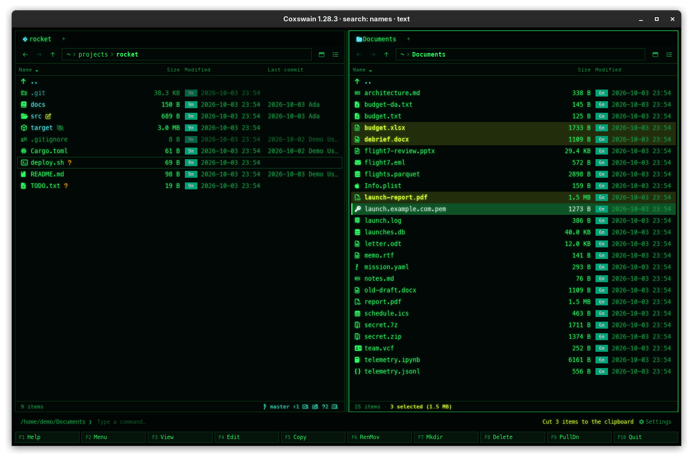

[← README](../../README.md) · [Docs index](../README.md) · [Files](README.md)

# Clipboard: Ctrl+C, Ctrl+X, Ctrl+V

In the desktop app, **Ctrl+C** and **Ctrl+X** put files on the system clipboard and **Ctrl+V**
pastes them into the active tab's folder. The clipboard is the system's, so it works both ways
with your other file manager.

## How to use it

1. Mark the files, or put the cursor on one.
2. Press **Ctrl+C** to copy or **Ctrl+X** to cut.
3. Go to the folder where they should go (either pane, any tab) and press **Ctrl+V**.

| Key | Does | Status line |
|---|---|---|
| **Ctrl+C** | Puts the files on the clipboard | `Copied "a.pdf" to the clipboard` |
| **Ctrl+X** | The same, as a cut | `Cut 3 items to the clipboard` |
| **Ctrl+V** | Pastes into the active tab's folder | `Pasted 3 items`, or `Moved 3 items` after a cut |

The same actions are in the F9 command list as *Copy to clipboard*, *Cut to clipboard* and
*Paste*. While the command line has text in it, these keys copy and paste text there instead.

## What you see

- **Paste takes the system clipboard first**, so files copied in another file manager paste
  here. When it holds no files, Coxswain pastes what it copied itself.
- **A cut moves** only when the clipboard still holds exactly the files Coxswain cut. It pastes
  once; after that the clipboard is empty for Coxswain. Pasting a cut into its own folder does
  nothing.
- **A name that is taken becomes `name (2).ext`**, `name (3).ext` and so on: paste never
  overwrites, unlike [F5](copy.md), which refuses.
- With nothing to paste, a dialog titled *Could not paste* says *The clipboard holds no files*.
  Other failures (a file that cannot be read, a full disk) show in the same dialog: the cause in
  one line, the full text under *Details*
  ([When something goes wrong](copy.md#when-something-goes-wrong)).

## Settings and config.toml

None. The keys are `clip_copy`, `clip_cut` and `paste` in `[keys]`.

## In the terminal app

Not there. A terminal has no access to the system's file clipboard, and **Ctrl+C** belongs to the
terminal. Pressing one of these keys in the terminal app says *Copy to clipboard is available in
the desktop app (coxswain-gui)*. Use **F5** and **F6** instead.

## Questions

#### I cut files in Coxswain and pasted them in my other file manager; they were copied.

There is no common way to mark a cut on the clipboard, so another program sees a copy. Paste in
Coxswain to move, or delete the originals afterwards.

#### Paste pasted old files instead of the text I just copied.

The clipboard reported no files, so Coxswain pasted its own last copy. Copy the files again.

#### Why did the pasted file get "(2)" in its name?

A file of that name was already in the folder. Paste keeps both and numbers the new one. Use
**F5** if you would rather get an error than a second copy.

#### Can I copy files out of an archive with the clipboard?

Within Coxswain, yes: **Ctrl+C** on a file inside an open archive, then **Ctrl+V** in a folder,
copies it out. Other programs cannot paste it, because the file is not on disk until it is
copied out. To add files to an archive, use **F5** into the open archive rather than paste
([Archives as folders](archives.md)).

#### Does it work on Wayland, macOS and Windows?

Yes. On Linux files go on the clipboard as `file://` addresses, as file managers there expect;
on macOS and Windows as paths. Without a system clipboard, copy and paste still work inside
Coxswain.

---
[← Previous: Delete](delete.md) · [Next: Drag and drop →](drag-and-drop.md)
