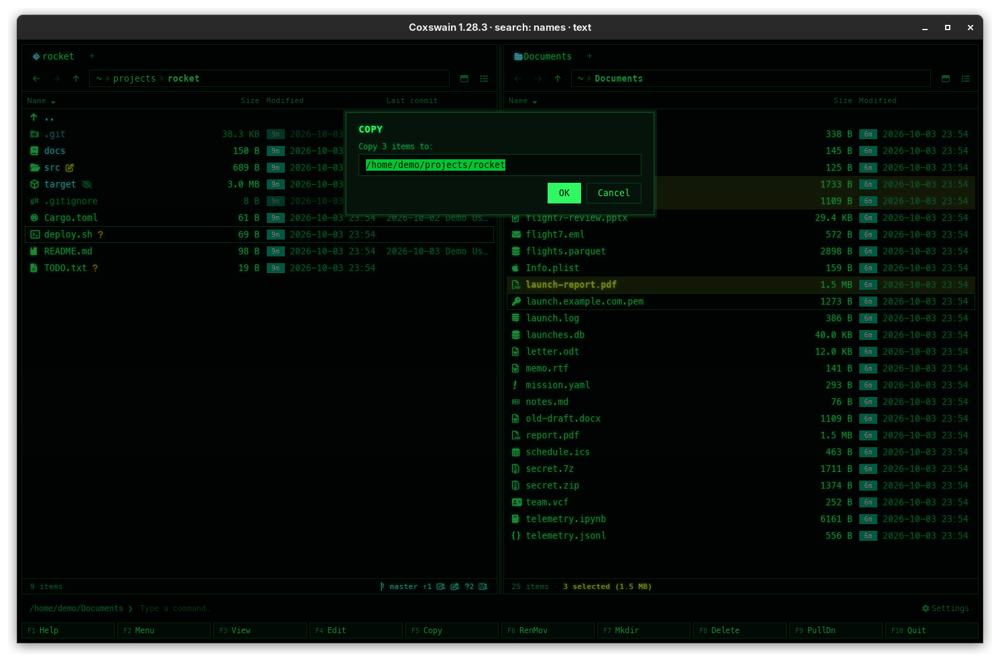

[← README](../../README.md) · [Docs index](../README.md) · [Files](README.md)

# Copy (F5), and when something goes wrong

**F5** copies the marked files, or the one under the cursor, to the other panel's folder or to
any path you type. It never writes over anything, and one failure does not stop the rest.

<!-- screenshot: files-copy.png: retake for 2.0: the desktop app's dialog titled Copy 3 items, the label To: over the field filled with the other pane's folder, the buttons Copy and Cancel, and under them the line Enter Copy · Esc Cancel -->

## How to use it

1. Mark the files to copy (**Insert** or **Shift+Down**), or put the cursor on one.
2. Press **F5**. A dialog titled *Copy "report.pdf"* (or *Copy 3 items*) opens, its field *To:*
   filled in with the other panel's folder. Under the buttons *Copy* and *Cancel* a line says
   *Enter Copy · Esc Cancel*.
3. Press **Enter** (or click *Copy*) to copy there, or change the target first.

| Target you type | Result |
|---|---|
| A folder that exists | The files are copied into it |
| A path that does not exist | A single file or folder is copied under that name: copy and rename in one |
| A relative path | Taken from the active panel's folder: `backup/`, `../old` |
| `~` or `~/…` | From your home folder |
| An archive, or a folder inside one | The files are added to it ([Archives as folders](archives.md)) |

| Key | Desktop app | Terminal app |
|---|---|---|
| Open the dialog | **F5** | **F5** |
| Copy | **Enter** or *Copy* | **Enter** |
| Cancel | **Esc** or *Cancel* | **Esc** |
| Clear the field | select and type | **Ctrl+U** |

An empty target cancels too. **F5** is also *Copy* in the F9 command list
([The command list](../panels/command-list.md)).

## What you see

- While it runs, the status line says *Working on …* (the terminal app adds the item it is on
  and how many there are: `Working on "b.txt"… (2/3)`); you can keep moving about meanwhile,
  in both apps.
  When it is done, the status line says `Copied "report.pdf"` or `Copied 3 items`, the marks
  are cleared and both panels are read again.
- In the terminal app one file operation runs at a time: another asked for meanwhile is not
  started (the status line says what is still running), and quitting waits for the copy to
  finish, so no half-copied file is left behind.
- Folders are copied with everything in them. Symbolic links are copied as links, not as what
  they point at.
- **Nothing is ever written over.** A file that already exists at the target is an error
  (`/home/me/b/a.txt exists`), and a folder cannot be copied into itself (*cannot copy a
  folder into itself*).

### When something goes wrong

An operation on several files goes on past a failure. At the end a dialog says what could not be
done, in three parts, the same in both apps:

| Part | Example |
|---|---|
| The title: what failed | *Could not copy "report.pdf"*, *Could not copy 3 items* |
| The cause, in one line: the first failure's reason, without the path and the system's error number | *Permission denied*, *No space left on device* |
| *Details*: the raw text, each file that failed with its reason, one per line | `/home/me/a.txt: /home/me/b/a.txt exists` |

In the desktop app *Details* is a fold-out under the cause; in the terminal app the raw text is
below a *Details:* line. When the cause is all there is, there is no *Details*. Everything else
was done. **Enter** or **Esc** (or *Close*) closes it; the line under it says *Enter Close*.

The other file operations report the same way, under their own title: *Could not move …*
([move](move-and-rename.md)), *Could not delete …* and *Could not move … to the bin*
([delete](delete.md)), *Could not create …* ([new folder](new-folder.md)), *Could not pack …* and
*Could not extract …* ([pack and extract](pack-and-extract.md)), *Could not paste*
([clipboard](clipboard.md)), *Could not switch to main* ([git branches](../panels/git-branches.md)).

<!-- screenshot: files-copy-error.png: the desktop app's error dialog titled Could not copy 3 items, the cause "Permission denied", Details unfolded with two lines path: reason, the Close button and the line Enter Close -->

## Settings and config.toml

None. The key is `copy` in `[keys]` ([Changing keys](../customise/keys.md)).

## In the terminal app

The same: **F5**, the same dialog title, field and key line, the same rules and the same error
dialog (the raw text below a *Details:* line). The field is
edited with the keyboard only: **Backspace** removes a character, **Ctrl+U** clears it.

## Questions

#### How do I overwrite a file that exists?

Coxswain never overwrites. Delete the old one first (**F8**, [Delete](delete.md)), or copy
under another name by typing it into the target: `report-old.pdf`.

#### I copied a folder onto a folder of the same name, and got errors.

The folders are merged: files that are new are copied in, and each file that exists in both is
left as it was and listed under *Details* in *Could not copy …*. Nothing in the target is lost.

#### Where did "Something went wrong" go?

Since 2.0 the error dialog's title says what failed: *Could not copy "report.pdf"*. Under it is
the cause in one line, and the full list of what failed under *Details*. See
[When something goes wrong](#when-something-goes-wrong).

#### The error says only "Permission denied". Which file?

The cause line leaves the path out to stay short. Unfold *Details* (desktop app) or read below
*Details:* (terminal app): each file that failed is there with its path and the system's own
words.

#### How do I copy a file and give the copy a new name?

Type the new name, or a path ending in it, into the target: `../drafts/report-v2.pdf`. When
that path does not exist, the file is copied under that name. This works for one file or one
folder; with several marked, the first gets the name and the others fail because it then exists.

#### How do I copy into a folder that is not open in the other panel?

Replace the target with any path. Relative paths start in the active panel's folder, `~` is
your home folder. The folder has to exist unless you copy a single item (see above).

#### Does copying keep dates and permissions?

A file's permission bits are kept (the copy is made with the system's file copy). The
modification date of the copy is the time of copying on most systems. Symbolic links stay links.

#### Can I copy files into a zip?

Yes. Open the zip with **Enter** in the other panel and press **F5**, or type the zip's path as
the target. The files are added; a name that is already there is refused. See
[Archives as folders](archives.md).

#### Why does the copy seem to do nothing for a while?

Copies run to the end before the panels are read again, and there is no progress bar, only
the item it is on. A large copy on a slow disk takes as long as the disk needs; the status
line changes when it is done.

---
[← Previous: Files](README.md) · [Next: Move and rename (F6) →](move-and-rename.md)
