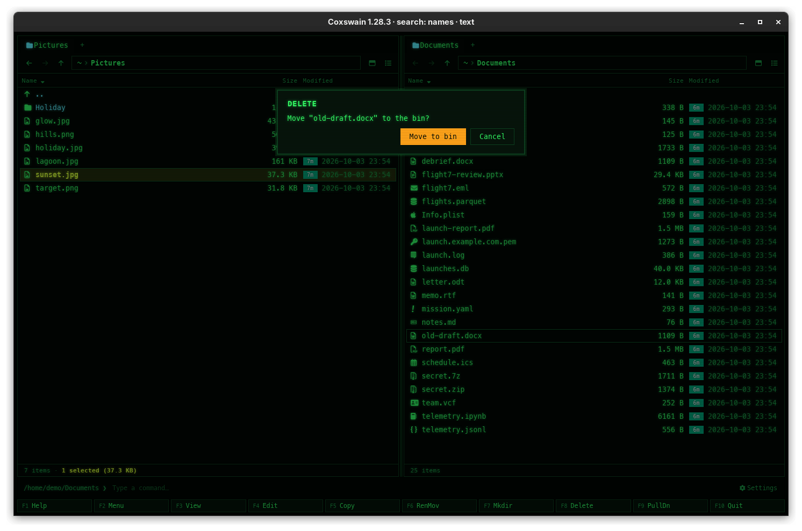

[← README](../../README.md) · [Docs index](../README.md) · [Files](README.md)

# Delete: trash (F8) or for good (Shift+F8)

**F8** moves the marked files, or the one under the cursor, to the system's trash, from where
you can restore them. **Shift+F8** deletes them for good. Both ask first, unless you turn the
question off.

<!-- screenshot: files-delete.png: retake for 2.0: the Delete dialog, Move "old-draft.docx" to the bin?, the red Move to bin button and Cancel, and the line Enter Move to bin · Esc Cancel -->

## How to use it

1. Mark the files, or put the cursor on one.
2. Press the key:

| Key | Does | Asks |
|---|---|---|
| **F8**, **Delete** | Moves to the trash: the desktop's trash on Linux, the Trash on macOS, the Recycle Bin on Windows | *Move "report.pdf" to the bin?* |
| **Shift+F8**, **Shift+Delete** | Deletes for good | *Permanently delete "report.pdf"? This cannot be undone.* |
| either, inside an archive | Takes it out of the archive (there is no trash there) | *Take "a.txt" out of tools.zip? The archive is written anew without it; there is no trash inside an archive.* |

3. Confirm or cancel:

| | Desktop app | Terminal app |
|---|---|---|
| Confirm | **Enter**, **Y**, or the red *Move to bin* / *Delete* button | **Enter** or **Y** |
| Cancel | **Esc**, **N**, or *Cancel* | **Esc** or **N** |

## What you see

The dialog is titled *Delete*. Under the question, both apps show the key line *Enter Move to
bin · Esc Cancel* (*Enter Delete · Esc Cancel* for **Shift+F8** and inside an archive); **Y**
and **N** work too. Afterwards the status line says `Moved 3 items to the bin` or
`Deleted 3 items`, the marks are cleared and the panels are read again. When something could
not be deleted, a dialog titled *Could not move 3 items to the bin* (or *Could not delete …*)
gives the cause in one line and each file with its reason under *Details*
([When something goes wrong](copy.md#when-something-goes-wrong)).

Inside an archive the button reads *Delete* for **F8** too, and the status line says
*Deleted …* afterwards: the files are taken out of the archive, not put in the trash. Copy them
out first (**F5**) if you may want them back. A 7z with locked contents asks for its password
([Passwords](archive-passwords.md)).

Things in the trash are restored with your desktop's own trash tools. Coxswain has no undo.

## Settings and config.toml

| Settings | config.toml | Type | Default |
|---|---|---|---|
| *Behaviour → Ask before deleting* | `confirm_delete` | true / false | `true` |

With the question off, both keys act at once, **Shift+F8 included**, and so does taking things
out of an archive. The keys are `delete` and `delete_forever` in `[keys]`.

## In the terminal app

The same keys, questions and trash. The terminal app uses the same trash as the desktop app, so
files it moves there show in your file manager's trash.

## Questions

#### Where did `[ Yes: Enter/Y ]` go in the terminal app?

2.0 gave both apps one key line: *Enter Move to bin · Esc Cancel*. **Y** and **N** still
confirm and cancel, as before.

#### Moving to the trash fails on a network share or a USB stick.

Not every file system has a trash the system can use. The error names the file. Use
**Shift+F8** to delete it for good, after checking.

#### Where do deleted files go on Linux?

To the freedesktop trash your desktop uses (`~/.local/share/Trash`, or a `.Trash-1000` folder at
the top of other disks), the same one your file manager shows.

#### How do I stop Coxswain asking every time?

Untick *Settings → Behaviour → Ask before deleting*, or put `confirm_delete = false` in
`config.toml`. Be careful: **Shift+F8** then deletes for good without a question.

#### Can I get back a file I deleted with Shift+F8?

Not from Coxswain. It is removed as `rm` would remove it. Only backups or recovery tools can help.

#### Why is there no trash inside an archive?

The trash holds files that are on disk. A file inside a zip is only an entry in the zip, so
taking it out means writing the zip anew without it. Coxswain asks first, and says so in the
question.

#### Does deleting a symbolic link delete what it points at?

No. The link itself is removed (or moved to the trash); the file or folder it points at stays.

---
[← Previous: New folder (F7)](new-folder.md) · [Next: Clipboard →](clipboard.md)
