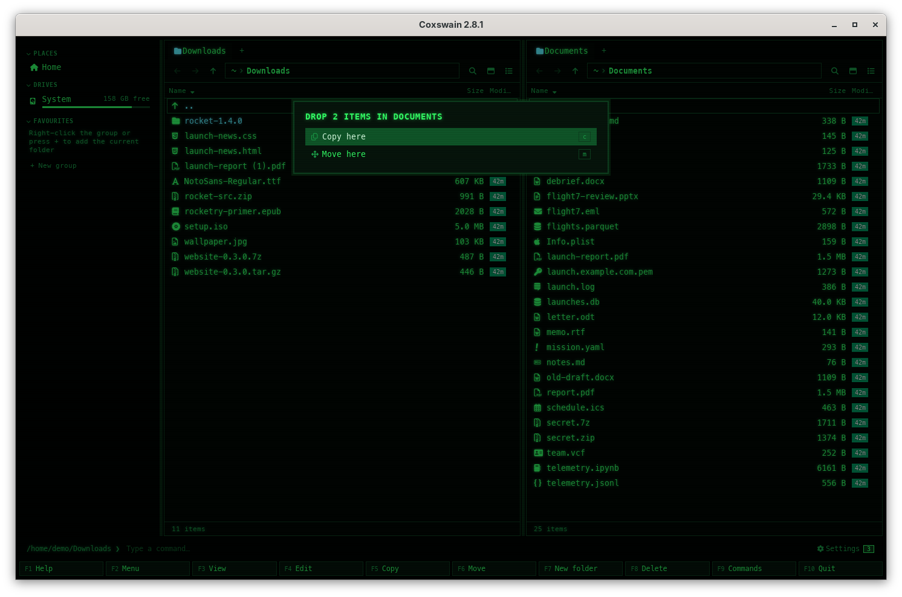

[← README](../../README.md) · [Docs index](../README.md) · [Files](README.md)

# Drag and drop

In the desktop app you drag files out of a pane to other applications, from one pane to the
other, and in from other applications. Dropping asks whether to copy or move.

## How to use it

**Out, to another application** (a mail, a browser upload, your other file manager):

1. Press the mouse on a file and drag it out of the window. Dragging a marked file takes all the
   marked files.
2. Drop it on the other application. The drag is the system's own, so the other application
   decides what a drop does there.

**Between panes, or in from another application:**

1. Drag the files onto a pane. The pane is highlighted while they are over it.
2. Drop. A menu asks *Drop "a.pdf" in Documents* (or *Drop 2 items in Documents*):

| Key | Menu entry | Does |
|---|---|---|
| **C** | *Copy here* | Copies into the folder the pane shows, as [F5](copy.md) does |
| **M** | *Move here* | Moves there, as [F6](move-and-rename.md) does |
| **Esc** | | Cancels |

Press the letter or click the entry. See also [The mouse](../panels/mouse.md).

## What you see

The pane under the pointer is highlighted during the drag. After the drop the status line says
`Copied 2 items` or `Moved 2 items`, and errors (a name that exists) show in *Something went
wrong*. Dropping files on the folder they came from does nothing.

## Settings and config.toml

None.

## In the terminal app

Not there. A terminal passes a dropped file on as typed text at best, so the terminal app takes
no drags; use **F5** and **F6**.

## Questions

#### Can I drop onto a folder inside the pane?

No: a drop always goes to the folder the pane shows. Open the folder first.

#### Can I drop files into an archive?

Yes. Open the archive in a pane with **Enter** and drop the files on that pane; *Copy here* adds
them to the archive, *Move here* adds them and deletes the originals
([Archives as folders](archives.md)).

#### Can I drag files out of an archive to another program?

Not reliably. A file inside an archive is not on disk, so the other program is handed a path it
cannot open. Copy the file out first with **F5**, then drag it.

#### Why is there no menu when I drag between two of my other programs?

The copy-or-move menu is Coxswain's own, for drops on its panes. Where a drag out lands, the
other program decides.

---
[← Previous: Clipboard](clipboard.md) · [Next: Batch rename (Ctrl+M) →](batch-rename.md)
