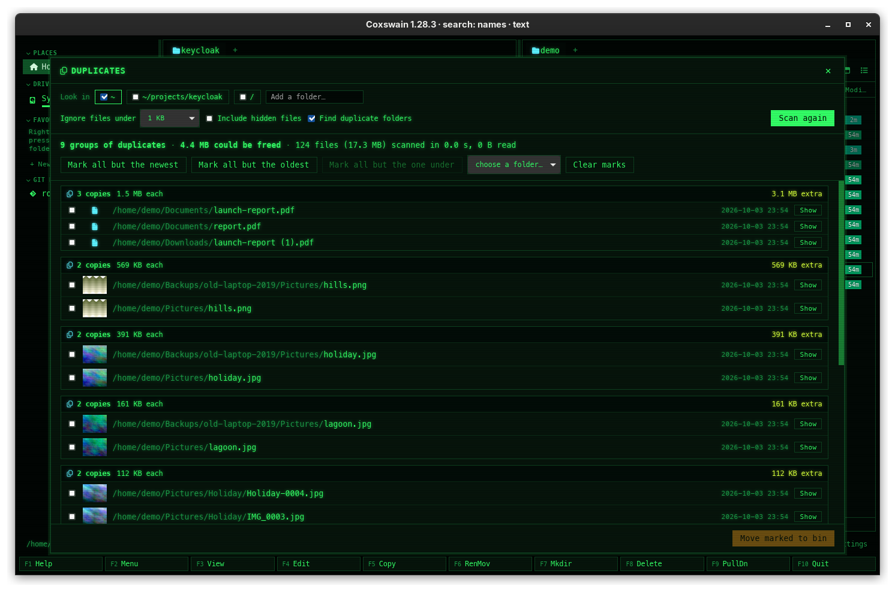

[← README](../../README.md) · [Docs index](../README.md) · [Files](README.md)

# Finding duplicates

The desktop app finds duplicate files and whole duplicate folders: across folders, across
disks, in old backups. It shows how much space they waste and helps you move the extra copies
to the trash, always keeping at least one.


*The Duplicates window after a scan of the home folder: two identical `Pictures` folders, a PDF
downloaded twice, a photo in three places with thumbnails, and a document in an old backup.*

## Contents

- [How to use it](#how-to-use-it)
- [What you see](#what-you-see)
- [What counts as a duplicate](#what-counts-as-a-duplicate)
- [How it stays fast](#how-it-stays-fast)
- [Limits](#limits)
- [Settings and config.toml](#settings-and-configtoml)
- [In the terminal app](#in-the-terminal-app)
- [Questions](#questions)

## How to use it

1. Press **Ctrl+D**, or pick *Find duplicates* in the F9 command list. From a terminal,
   `coxswain-gui --duplicates ~/Pictures /mnt/old-disk` starts straight in a scan of those
   folders (without folders, of the current one;
   [Command-line flags](../reference/command-line-flags.md)).
2. **Look in:** tick the places to compare. Until the first scan, the window says *Pick the
   folders to compare, then Scan. Nothing goes to the bin without asking.* Offered are both panes' folders, your
   [favourites](../organise/favourites.md) and every drive in the sidebar; the active pane's
   folder is ticked to begin with. Type any other folder into *Add a folder…* and press
   **Enter**. Comparing across disks is the point: tick your home and an old backup disk to find
   what is stored twice.
3. **Options:**
   - *Ignore files under:* skips small files: *any size*, 1 KB (the default), 100 KB, 1 MB or
     10 MB.
   - *Include hidden files:* also looks inside dot-files and dot-folders (off by default).
   - *Find duplicate folders:* reports whole identical folders as one entry (on by default).
4. **Scan.** The bar shows the phase, the progress and how much has been read. **Cancel**
   stops at once.
5. **Review.** Groups are sorted by the space they waste, largest first; duplicate folders come
   before duplicate files. Each group lists its copies with their folder, modification date
   and, for pictures, a thumbnail. **Show** closes the window and puts the cursor on that copy
   in the active pane, so you can preview it or look around.
6. **Mark** the copies to remove, with the tick boxes or a rule:
   - *Mark all but the newest:* keeps the most recently changed copy of each file.
   - *Mark all but the oldest:* keeps the original.
   - *Mark all but the one under* a folder: keeps the copy inside the folder you choose
     (*choose a folder…* lists the places you ticked), e.g. your real `Pictures` rather than the
     backup.
   - *Clear marks.*
7. **Move marked to bin.** After a confirmation (*Move 3 copies (12 MB) to the bin? At least one
   copy of each stays.*), the marked copies go to the trash (the Recycle Bin on Windows), so you
   can still restore them. The groups that are left stay on screen.

**Every group always keeps at least one copy.** A rule never marks all of them, and ticking
the last unmarked copy of a group is refused with *Every group keeps at least one copy.*

The `×` at the top right (or **Esc**) closes the window; the `×` also stops a scan under way.
*Scan again* runs the same scan anew, for example after you moved things.

| Key | Desktop app | Terminal app |
|---|---|---|
| Open the finder | **Ctrl+D**, F9 *Find duplicates*, `--duplicates` | not there |
| Add a folder | **Enter** in *Add a folder…* | |
| Close | **Esc** or `×` | |

## What you see

| Where | Says |
|---|---|
| Before a scan | *Pick the folders to compare, then Scan. Nothing goes to the bin without asking.* where the results will be |
| While scanning | `Comparing the first 16 KB · 1,204 of 3,310 · 64,856 files found · 1.9 GB read`, and a bar |
| After it | `42 groups of duplicates · 3.1 GB could be freed · 64,856 files (30 GB) scanned in 1.0 s, 1.9 GB read` |
| A folder group | A folder icon, `2 identical folders`, `1.2 GB each, 340 files`, `1.2 GB extra` |
| A file group | `3 copies`, `4.1 MB each`, `8.2 MB extra` |
| A marked copy | Its tick box ticked and its row highlighted |
| The footer | `3 marked · 12 MB to free`, and *Move marked to bin* in red |
| Nothing found | *No duplicates found.* |
| Many groups | *Showing the 500 groups that waste the most space.* |

The phases are *Looking at files*, *Comparing the first 16 KB*, *Comparing whole files* and
*Done*.

## What counts as a duplicate

Everything is compared **by content**. Names, dates and locations never matter.

- **Files:** the same bytes. `IMG_2041.jpg` in `Pictures` and `wallpaper.jpg` in `Downloads`
  are duplicates when their bytes are equal.
- **Folders:** the same files by content, all the way down, however the files and subfolders
  inside are named or arranged. A backup whose photos were renamed or re-sorted into year
  folders still matches the original. A folder with even one file that exists nowhere else
  has no twin.
- **Only the outermost match is shown.** Two copies of `Pictures` show as one folder group,
  not as one group per photo inside, and a folder that holds nothing but one subfolder stands
  in for it. A file that also exists outside those folders still gets its own file group.
- **Hard links** to one file are not duplicates, because they share the same space on disk, so
  they are counted once.
- **Symbolic links are never followed.** A link to a folder could otherwise make every file
  in it look duplicated.
- Empty files and, by default, files under 1 KB are ignored.
- Files inside [archives](archives.md) are not compared; an archive counts as one file.

## How it stays fast

Reading every file on a large disk would take hours, so Coxswain only reads what could match:

1. **Sizes first.** A parallel walk lists every file with its size. A file whose size occurs
   only once cannot have a duplicate, and is never opened.
2. **The first 16 KB.** Files that share a size are compared by a hash of their first 16 KB.
   Different files usually already differ there.
3. **The whole file,** only for the files still matching. Hashing uses
   [BLAKE3](https://github.com/BLAKE3-team/BLAKE3), which uses SIMD instructions (AVX2 and
   AVX-512 on x86, NEON on ARM) and runs on all cores.
4. **Kept.** Full hashes are kept in the search store, `search.db` in Coxswain's cache folder
   ([Where things are kept](../reference/where-things-are-kept.md)), keyed by path, size and
   modification time. Scanning the same disk again only reads files that changed. In the
   background the [search helper](../search/helper.md) hashes the files in the folders it reads
   (your home folder by default) that share a size, so a scan there reads nothing it already
   knows, not even the first 16 KB. Hashes of files that are gone or have changed are dropped at
   its next pass.

**Files only in the cloud are never read.** A file that OneDrive, Dropbox, Google Drive, Proton
Drive or iCloud keeps online only would be downloaded by hashing it, so a scan leaves it out: it is
not counted and never a duplicate. Files the cloud app keeps on your disk are compared as usual
([Cloud files](../search/cloud-files.md)).

On a developer's home folder of 64,856 files (30 GB), the first scan read 1.9 GB and took
1.0 s; the second took 0.5 s.

Run the same engine from a terminal to try it on your own disks:

```sh
cargo run --release -p coxswain-core --example dupes -- ~/Pictures /mnt/old-disk
```

## Limits

- **Only exact copies.** A photo that was resized, re-saved or edited is a different file. A
  "similar pictures" mode, comparing what images look like, is planned.
- **Spinning disks** are read by several threads at once, which makes their heads seek. On an
  old hard disk the full-hash phase is therefore slower than the drive's top speed.
- **Folder groups and the newest/oldest rules.** *Mark all but the newest* and *… the oldest*
  mark copies in file groups only; use *Mark all but the one under*, or the tick boxes, for
  duplicate folders.
- The results list shows the 500 groups that waste the most space.
- The options (sizes, hidden files, folders) are not remembered between openings.

## Settings and config.toml

None of its own. The key is `duplicates` in `[keys]`. Hashing ahead of time by the search helper
follows the helper's settings: *Words inside files* and the folders it reads (Settings →
*Finding files*)
([Choosing the folders](../search/folders.md)).

## In the terminal app

Not there yet. The engine (`crates/coxswain-core/src/dupes.rs`) is shared and ready for it, but
the review window, with its groups, thumbnails and rules, has not been built for the terminal.
**Ctrl+D** in the terminal app says *Find duplicates is available in the desktop app
(coxswain-gui)*. The `dupes` example above runs the same scan in a terminal and prints the groups.

## Questions

#### Why are two identical photos not found?

They are not byte for byte the same (one was re-saved, rotated, or had its EXIF changed), or they
are smaller than *Ignore files under*, or one is inside a hidden folder and *Include hidden files*
is off. Or they are hard links to one file.

#### Why was a duplicate folder not marked by "Mark all but the newest"?

Folders have no single date to compare, so those rules leave folder groups alone. Use *Mark all
but the one under* with the folder whose copy you want to keep.

#### Is it safe to move the marked copies?

They go to the trash, not away for good, and at least one copy of each group always stays. Check
with **Show** before you move them if the folder matters.

#### Why is the second scan so much faster?

The hashes of the first scan are kept in `search.db`, by path, size and date. Only files that
changed are read again.

#### Does it need search inside files to be on?

No. It uses the same store file, but works without text search. The helper hashing your home
folder ahead of time needs *Words inside files* on (Settings → *Finding files*, any level from *Names
and text* up).

#### Can I compare my home folder with a USB backup disk?

Yes: plug the disk in, and it appears under *Look in* with the other drives. Tick both and scan.
Then *Mark all but the one under* your home folder marks the copies on the backup.

#### Why does a folder with one different file not show as a duplicate?

A folder group needs every file in both folders to match. The files that do match still show as
file groups.

---
[← Previous: Properties and permissions](properties.md) · [Next: ZFS snapshots as folders →](zfs-snapshots.md)
