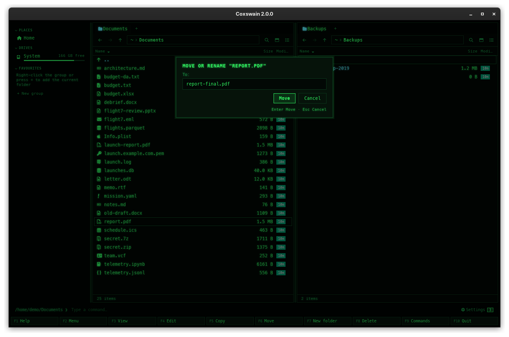

[← README](../../README.md) · [Docs index](../README.md) · [Files](README.md)

# Move and rename (F6)

**F6** moves the marked files, or the one under the cursor, to another folder, or renames it
when you type a new name. It is one key for both, as in Norton Commander. The desktop app's
F-key bar says *Move*; the terminal app's keeps Norton Commander's *RenMov*.

<!-- screenshot: files-move.png: retake for 2.0: the desktop app's dialog titled Move or rename "report.pdf", the label To: over the field edited to report-final.pdf, the buttons Move and Cancel, and the line Enter Move · Esc Cancel -->

## How to use it

**To move:**

1. Mark the files, or put the cursor on one.
2. Press **F6**. A dialog titled *Move or rename "report.pdf"* (or *Move or rename 3 items*)
   opens, its field *To:* filled in with the other panel's folder, and *Enter Move · Esc Cancel*
   under the buttons.
3. Press **Enter** (or click *Move*).

**To rename:** press **F6** on the file, replace the whole target with the new name
(`report-final.pdf`) and press **Enter**. A bare name is taken from the active panel's folder,
so the file is renamed where it is.

| Target you type | Result |
|---|---|
| A folder that exists | The files are moved into it |
| A name or path that does not exist | One file or folder is moved there under that name: a rename, or a move and rename in one |
| A relative path, `~/…` | As for [copy](copy.md): from the active panel's folder, or your home folder |
| An archive, or a folder inside one | The files are added to the archive, then the originals are deleted |

| Key | Desktop app | Terminal app |
|---|---|---|
| Open the dialog | **F6** | **F6** |
| Move or rename | **Enter** or *Move* | **Enter** |
| Cancel | **Esc**, *Cancel*, or an empty field | **Esc**, or an empty field |
| Clear the field | select and type | **Ctrl+U** |

For many names at once, use [Batch rename (Ctrl+M)](batch-rename.md) in the desktop app.

## What you see

- The status line says `Moved "report.pdf"` or `Moved 3 items`; marks are cleared and both
  panels are read again.
- After renaming one file in place, the terminal app keeps the cursor on it under its new name.
- A target that exists is an error: a dialog titled *Could not move "report.pdf"*, with the
  cause and, under *Details*, `… exists`; nothing is written over
  ([When something goes wrong](copy.md#when-something-goes-wrong)).

## Settings and config.toml

None. The key is `move` in `[keys]` ([Changing keys](../customise/keys.md)).

## In the terminal app

The same key, dialog and rules. The only difference: the terminal app puts the cursor on a
file you renamed in place; the desktop app keeps the cursor at the same row.

## Questions

#### How does a move across disks work?

On the same disk a move is a rename: instant, whatever the size. Across disks (or file systems)
the system cannot rename, so Coxswain copies everything and then deletes the originals. The
originals are only deleted after their copy succeeded. Any other failure to rename (no
permission, say) is reported as it is; nothing is copied then.

#### Can I change only the case of a name, `Notes` to `notes`?

Yes, also on macOS and Windows, where `notes` already "exists" as the same folder: Coxswain sees
that it is the folder itself and renames it. Where case counts (Linux), `notes` is another name
and the rename is refused only if a `notes` is really there.

#### Why did my move fail with "exists"?

Something of that name is already in the target folder. Coxswain never writes over it: the
dialog *Could not move …* lists it under *Details* (`/home/me/b/report.pdf exists`). Rename one
of them first, or move the other one out of the way.

#### Can I move a folder into itself?

No. The copy step of a move across disks refuses it, and on the same disk the system refuses it.
Nothing is changed.

#### How do I rename inside an archive?

Open the archive with **Enter**, put the cursor on the file or folder and press **F6** with the
new name. The archive is written anew with the new name; see
[Archives as folders](archives.md#what-changes-and-how-safely).

#### I moved files into a zip. Are the originals in the trash?

No. A move into an archive adds the files to it and then deletes the originals for good, as a
move between disks does. Copy with **F5** if you want to keep them.

#### Can I undo a move or rename?

Coxswain has no undo. Press **F6** again and move or rename it back.

---
[← Previous: Copy (F5)](copy.md) · [Next: New folder (F7) →](new-folder.md)
