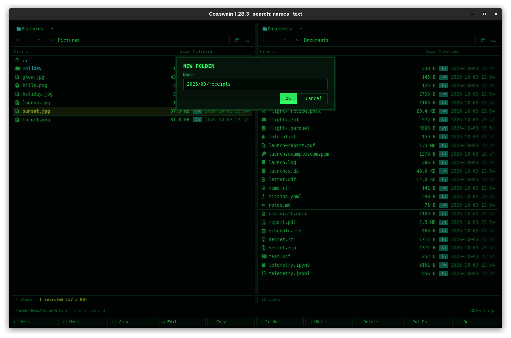

[← README](../../README.md) · [Docs index](../README.md) · [Files](README.md)

# New folder (F7)

**F7** makes a new folder in the active panel's folder, or a whole path of folders at once. It
also makes folders inside an archive.

<!-- screenshot: files-new-folder.png: retake for 2.0: the New folder dialog with Name: 2026/09/receipts typed in, the buttons Create and Cancel, and the line Enter Create · Esc Cancel -->

## How to use it

1. Press **F7**. The dialog *New folder* opens with an empty field.
2. Type a name, or a path: `2026/09/receipts` makes `2026`, `09` in it and `receipts` in that.
3. Press **Enter** (or click *Create*). An empty name, or **Esc**, cancels. The line under the
   buttons says *Enter Create · Esc Cancel*.

| | Desktop app | Terminal app |
|---|---|---|
| Key | **F7** | **F7** |
| Dialog label | *Name:* | *Create the folder:* |
| Confirm / cancel | **Enter** or *Create* / **Esc** or *Cancel* | **Enter** / **Esc** |

A relative name starts in the active panel's folder; `~/…` starts in your home folder, and an
absolute path makes the folder there.

## What you see

The status line says `Created 2026/09/receipts` (the terminal app names the full path,
`Created /home/me/2026/09/receipts`), the panel is read again and the cursor lands
on the new folder (for a path, on its first folder, `2026`). A folder that already exists is
not an error: nothing changes.

Inside an archive the new folder is written into the archive, which is written anew
([Archives as folders](archives.md#what-changes-and-how-safely)); a name that is already there
is refused with `… exists`.

A folder that cannot be made (no permission, a file of that name in the way) opens a dialog
titled *Could not create 2026/09/receipts*, with the cause in one line (*Permission denied*) and
the system's full text under *Details* ([When something goes wrong](copy.md#when-something-goes-wrong)).

## Settings and config.toml

None. The key is `new_folder` in `[keys]` (`mkdir` before 2.0, renamed on the first start; see
[Renamed in 2.0](../reference/configuration.md#renamed-in-20)). The desktop app's F-key bar
calls it *New folder*, the terminal app's keeps Norton Commander's *Mkdir*.

## In the terminal app

The same, with the label *Create the folder:*, and the status line names the full path.
**Ctrl+U** clears the field.

## Questions

#### My `mkdir = [...]` line in `[keys]` stopped working.

2.0 renamed the action to `new_folder`. The first start of 2.0 renames it in `config.toml` and
says so in a notice; an old name typed in afterwards makes the config invalid. Write
`new_folder = ["F7"]`. See [Changing keys](../customise/keys.md#my-keys-mkdir-stopped-working-in-20-why).

#### Can I make several nested folders at once?

Yes: type the whole path, `photos/2026/summer`. Every folder on the way that is missing is made.

#### Why did nothing happen when the folder exists?

Making a folder that is already there is not treated as an error outside archives: the status
line still says `Created …` and the cursor goes to it. Inside an archive it is refused.

#### Can I make a new, empty file?

Not with a key of its own. Use the [command line](../commands/command-line.md): `touch notes.txt`
(Linux, macOS), or a [user menu](../commands/user-menu.md) entry.

#### Can I make a folder inside a zip?

Yes. Open the zip with **Enter**, press **F7** and type the name. The zip gets a folder entry,
so the folder stays even while it is empty.

---
[← Previous: Move and rename (F6)](move-and-rename.md) · [Next: Delete →](delete.md)
