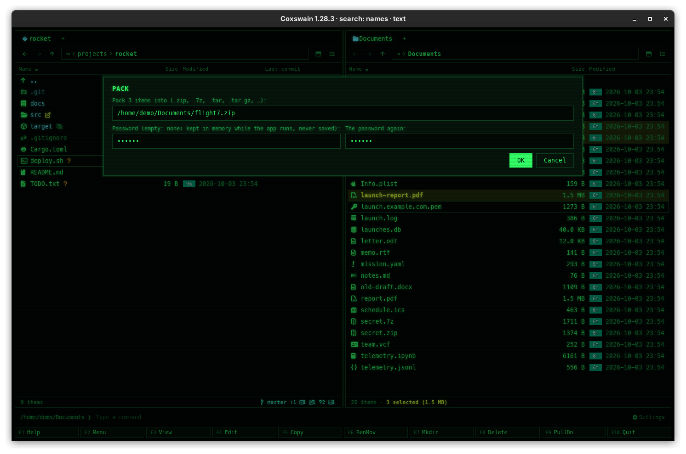

[← README](../../README.md) · [Docs index](../README.md) · [Files](README.md)

# Pack (Alt+F5) and extract (Ctrl+E)

**Alt+F5** packs the marked files and folders into a new archive: zip, 7z, or tar plain or
compressed, chosen in the dialog's *Format* list (desktop app), with **Tab** (terminal app), or by
the ending you type. **Ctrl+E** unpacks an archive into a new folder named
after it. Both apps have both keys.

*An archive under the cursor. The preview pane (Space) lists what is in it and reminds you that
**Ctrl+E** extracts it to the other pane.*

<!-- screenshot: files-pack.png: retake for 2.0: the Pack dialog titled Pack 3 items, the label To:, the Format list (7z chosen) next to the name, the Pack and Cancel buttons with the line Enter Pack · Esc Cancel, the hint "7z: smallest, a password can hide the names too" under it, and the two password fields -->

## Contents

- [How to use it](#how-to-use-it)
- [Formats](#formats)
- [What you see](#what-you-see)
- [What goes in, what comes out](#what-goes-in-what-comes-out)
- [Settings and config.toml](#settings-and-configtoml)
- [In the terminal app](#in-the-terminal-app)
- [Questions](#questions)

## How to use it

### Pack

1. Mark the files and folders to pack, or put the cursor on one.
2. Press **Alt+F5** (or *Pack into an archive* in the F9 command list). A dialog titled
   *Pack "photos"* (or *Pack 3 items*) opens, its field *To:* filled with a name in the other
   panel's folder, and the *Format* list next to it (in the terminal app the label is
   *To (Tab: .zip, .7z, .tar.gz, …):*):
   - one item: its name without its extension, `photos.zip` for a folder `photos`, `report.zip`
     for `report.pdf`;
   - several items: the name of the folder you are in, `rocket.zip`.

   The ending is the format you packed into last time (`.zip` the first time), so after a
   `.tar.gz` the next suggestion is `rocket.tar.gz`.
3. Pick the format in the *Format* list: the name's ending changes with it (`rocket.zip` becomes
   `rocket.tar.gz`, and back). Typing an ending into the name sets the list too. Under the name a
   line tells what the format is good for, such as *7z: smallest, a password can hide the names
   too*.
4. For a zip or a 7z, type a password if you want one, and the same again below it; leave both
   empty for none. A 7z also has *Hide the file names too*, on by default. For a tar the fields
   are not there, and the dialog says *tar archives have no passwords: pack into .zip or .7z for
   one*. More in [Passwords](archive-passwords.md#locking-a-new-archive).
5. Press **Enter** (or click *Pack*; the line under the buttons says *Enter Pack · Esc Cancel*).
   While the two passwords differ, *Pack* is greyed out and the dialog says *The passwords do not
   match*.

| You type | You get |
|---|---|
| `photos.zip` (or `.jar` and the other zip endings) | A zip, Deflate-compressed |
| `photos.7z` | A 7z, LZMA2-compressed |
| `photos.tar` | A plain tar |
| `photos.tar.gz` or `.tgz` | A tar with gzip |
| `photos.tar.bz2`, `.tbz2`, `.tbz` | A tar with bzip2 |
| `photos.tar.xz`, `.txz` | A tar with xz (level 6) |
| `photos.tar.zst`, `.tzst` | A tar with zstd (its fastest level) |
| any other ending | Refused: `… is not an archive Coxswain reads` |

A relative name is taken from the active panel's folder, `~/…` from your home folder. A name
whose ending is no format in the list (`.jar`, say) leaves the *Format* list blank; the archive is
still packed by its ending.

### Extract

1. Put the cursor on an archive, or mark several.
2. Press **Ctrl+E** (or *Extract archive* in the F9 command list). A dialog titled *Extract
   "photos.zip"* (or *Extract 3 items*) opens, its field *To:* filled in with the other panel's
   folder.
3. Press **Enter** (or click *Extract*). Coxswain makes a folder named after the archive there (`photos` for
   `photos.zip`, `backup` for `backup.tar.gz`, `site` for `site.7z`) and unpacks into it. Several
   archives each get their own folder.

| Key | Desktop app | Terminal app |
|---|---|---|
| Pack | **Alt+F5** | **Alt+F5** |
| Extract | **Ctrl+E** | **Ctrl+E** |
| Confirm / cancel | **Enter** or *Pack* / *Extract*, **Esc** or *Cancel* | **Enter** / **Esc** |

To take out only some files, open the archive with **Enter** and copy them with **F5**
([Archives as folders](archives.md)).

## Formats

The *Format* list (desktop app) and **Tab** (terminal app) go through these, in this order. The
last one used is suggested next time, in both apps (it is kept in `state.json`).

| Format | Ending put on the name | Password | Hint shown |
|---|---|---|---|
| Zip | `.zip` | Yes, AES-256 on every file | *Zip: opens everywhere, a password locks the contents* |
| 7z | `.7z` | Yes, AES-256, the names can be hidden too | *7z: smallest, a password can hide the names too* |
| tar | `.tar` | No | *tar: not compressed, no password* |
| tar.gz | `.tar.gz` (`.tgz` is read as this too) | No | *tar.gz: common on Linux and macOS, no password* |
| tar.bz2 | `.tar.bz2` (`.tbz2`, `.tbz`) | No | *tar.bz2: a little smaller than tar.gz, slower, no password* |
| tar.xz | `.tar.xz` (`.txz`) | No | *tar.xz: small, slow to pack, no password* |
| tar.zst | `.tar.zst` (`.tzst`) | No | *tar.zst: fast and small, no password* |

The ending is swapped whole: `rocket.tar.gz` becomes `rocket.7z`, not `rocket.tar.7z`. A name
with no archive ending gets one added (`my.notes` becomes `my.notes.zip`).

| Key | Desktop app | Terminal app |
|---|---|---|
| Next format | The *Format* list | **Tab** |
| Previous format | The *Format* list | **Shift+Tab** |

## What you see

- The *Format* list shows the format of the name's ending, and the line under the name says
  what it is good for. In the terminal app **Tab** puts that line on the status line.
- The password fields show dots, and are there only for Zip and 7z. After packing with a password, the new archive opens without
  asking until you close the app; its badge says *archive, locked*.
- After packing, the status line says `Packed "photos"` or `Packed 3 items`, and the new archive
  shows in the other panel.
- After extracting, it says `Extracted "photos.zip"`.
- **Ctrl+E** on something that is not an archive says `Not a zip, 7z or tar archive` on the
  status line.
- Errors open a dialog titled *Could not pack "photos"* or *Could not extract "photos.zip"*,
  with the cause in one line and the full text under *Details*: an archive or folder that
  already exists (`… exists`), an ending Coxswain cannot write
  ([When something goes wrong](copy.md#when-something-goes-wrong)).
- A locked zip or 7z asks for its password before extracting
  ([Passwords](archive-passwords.md)).

## What goes in, what comes out

**Packing** takes folders with everything in them, hidden files and empty folders included.
Symbolic links are left out, since what they point at may be anywhere. Files keep their
modification dates. The archive is written to a `.coxswain-tmp` file first and gets its name only
when it is complete, so a failure leaves no half archive. With a password, a zip's files are each
locked with AES-256, and a 7z's contents too (and its names, with *Hide the file names too*).

**Extracting** never writes over anything: if the folder named after the archive is already
there, it stops with `… exists`. Entries that would land outside the new folder (`../`, absolute
paths) are not written, and a tar whose name records are made to fill the memory is refused
(`a name in this tar is too long`). If extracting fails half-way, the new folder is removed again.

## Settings and config.toml

None. The keys are `pack` and `extract` in `[keys]` ([Changing keys](../customise/keys.md)). The
last format used is not a setting: it is remembered in `state.json` (`pack_ending`) next to the
session.

## In the terminal app

The same keys, formats and texts. The target prompt reads *Pack "photos" into (Tab: .zip, .7z,
.tar.gz, …):*. **Tab** swaps the name's ending for the next format's (`.zip`, `.7z`, `.tar`,
`.tar.gz`, `.tar.bz2`, `.tar.xz`, `.tar.zst`, then `.zip` again), **Shift+Tab** for the previous
one, and the status line shows the format's hint. **Ctrl+U** clears the field. For a zip or 7z target, the
target prompt is followed by a password prompt (stars; **Enter** alone packs without one) and,
when you typed one, a prompt to type it again; if the two differ, the status line says *The
passwords do not match* and nothing is packed. A 7z packed from the terminal app always hides its
file names too. There is no preview pane,
so the list of contents before extracting is seen by opening the archive with **Enter**.

## Questions

#### How do I extract into the folder I am in?

Change the target in the dialog to `.` (the active panel's folder); the new folder named after
the archive is still made there.

#### Can I extract without the extra folder?

No: Coxswain always makes one, so an archive full of loose files never spills into a folder.
Open the archive with **Enter** instead, mark everything and copy it with **F5** where you want it.

#### Which format should I pick?

Zip when the archive goes to someone else: it opens everywhere, also on Windows and macOS without
extra programs, and takes a password. 7z when size matters or the names must be secret: it is
usually the smallest, and with a password *Hide the file names too* hides what is in it. On
Linux and macOS, `.tar.gz` is what most people expect; `.tar.xz` is smaller and slower,
`.tar.zst` is the quickest to make. Tar formats keep Unix permissions but take no password. In
the desktop app pick it in the *Format* list; in the terminal app press **Tab** until the name
ends as you want.

#### Can I make a .tar.gz?

Yes. In the desktop app choose *tar.gz* in the *Format* list next to the name; in the terminal
app press **Tab** in the target prompt until the name ends in `.tar.gz` (three presses from
`.zip`). Typing `.tar.gz` or `.tgz` at the end of the name does the same in both. The password
fields go away, since a tar has none.

#### Why does it suggest .7z now instead of .zip?

The suggestion is the format you packed into last, in either app. Pick another format and that
one is suggested next time.

#### Can I pack files into an archive with a password?

Yes, into a zip or a 7z: type it in the Pack dialog's password fields. See
[Locking a new archive](archive-passwords.md#locking-a-new-archive).

#### Why was a symbolic link not packed?

Links are left out on purpose: a link can point anywhere, also outside what you packed. Pack the
folder it points at, or use `tar -cf` on the command line if you need the link itself.

#### Can I pack files that are inside another archive?

Not directly: packing takes files on disk. Copy them out first with **F5**, then pack them. To
add them to an archive that already exists, open both archives and copy across with **F5**.

#### Extract says "exists". What now?

A folder of the archive's name is already in the target. Rename or remove it, or extract into
another folder.

---
[← Previous: Archives as folders](archives.md) · [Next: Passwords for encrypted zip and 7z →](archive-passwords.md)
