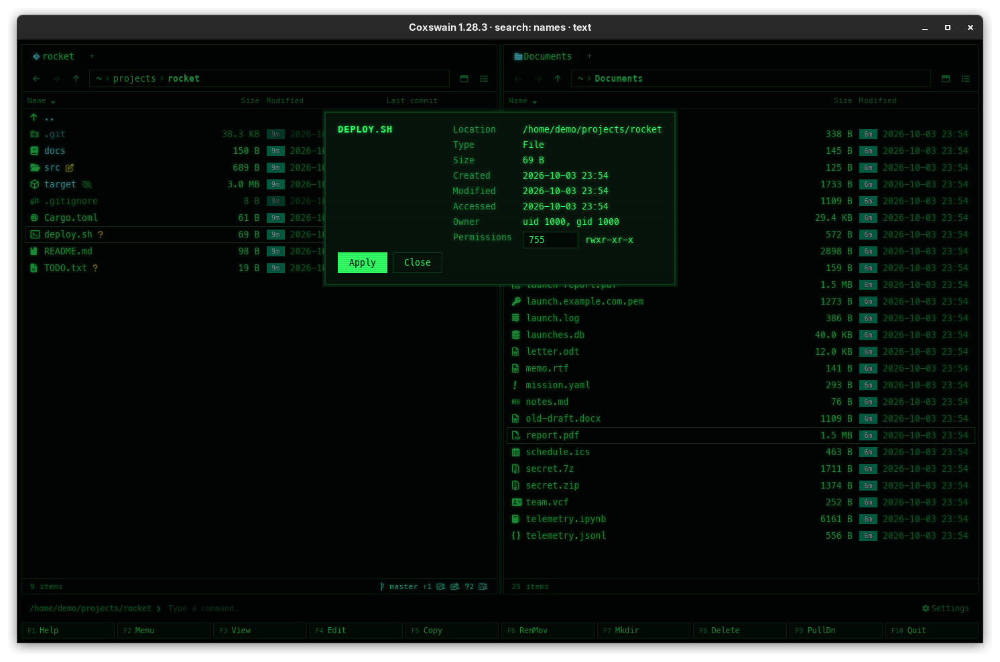

[← README](../../README.md) · [Docs index](../README.md) · [Files](README.md)

# Properties and permissions

In the desktop app, **Alt+Enter** shows what a file or folder is: its size, dates, owner and
permissions. On Linux and macOS you can change the permission bits there; on Windows the
read-only flag.

## How to use it

1. Put the cursor on a file or folder (not `..`).
2. Press **Alt+Enter** (or *Properties* in the F9 command list). For a folder, the status line
   says *Reading properties…* while its size is measured.
3. To change the permissions, type three or four octal digits into the field (`755`, `0600`),
   or tick or untick *Read-only* on Windows.
4. Press **Enter** or *Apply*. *Close* (or **Esc**) closes without changing anything.

## What you see

The dialog is titled with the entry's name.

| Item | Shows |
|---|---|
| *Location* | The folder it is in |
| *Type* | *File*, *Folder*, or *Symbolic link* `→` its target |
| *Size* | The size; from 10 KB on also the exact bytes; for a folder, *in 1,234 files* |
| *Created*, *Modified*, *Accessed* | Dates, where the file system records them |
| *Owner* | `uid 1000, gid 1000` (Linux, macOS) |
| *Permissions* | An octal field, `644`, with `rw-r--r--` next to it, updated as you type (Linux, macOS) |
| *Attributes* | *Read-only* (Windows) |

A value that is not octal says *Permissions are 3 or 4 octal digits, e.g. 644* under the list,
and nothing is changed. After *Apply* the dialog closes and the pane is read again.

## Settings and config.toml

None. The key is `properties` in `[keys]`.

## In the terminal app

Not there. The terminal app shows size and date in its columns; for the rest use the command
line: `ls -l`, `stat report.pdf`, `chmod 755 deploy.sh`
([The command line](../commands/command-line.md)). **Alt+Enter** says *Properties is available in
the desktop app (coxswain-gui)*.

## Questions

#### Can I change the owner?

No, only the permission bits (or the read-only flag on Windows). Changing the owner needs
administrator rights; use `sudo chown` on the command line.

#### Does changing a folder's permissions change the files in it?

No, only the folder itself. For everything inside, use `chmod -R` on the command line.

#### What do the four-digit values mean?

The first digit holds the special bits: `4` setuid, `2` setgid, `1` sticky. `1777` is a shared
folder like `/tmp`; `0644` is the same as `644`.

#### Why is Created missing?

Not every file system records when a file was made. Where it does not (some Linux file systems,
network shares), the line is left out.

#### What happens when I change the permissions of a symbolic link?

The permissions of what it points at change: links themselves have no permissions of their own
on Linux.

#### Why does the dialog show an error for a file inside an archive?

A file inside an archive is not on disk, so it has no properties the system can report. Copy it
out with **F5** first ([Archives as folders](archives.md#limits)).

---
[← Previous: Passwords for encrypted zip and 7z](archive-passwords.md) · [Next: Finding duplicates →](duplicates.md)
