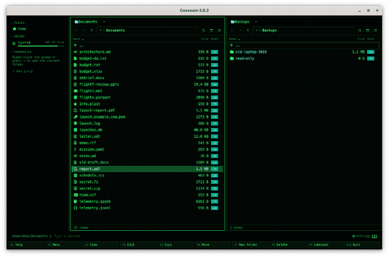

[← README](../../README.md) · [Docs index](../README.md) · [Files](README.md)

# Undo (Ctrl+Z)

**Ctrl+Z** undoes the last file operation: a copy, a move or rename, a batch rename, a new
folder, a move to the trash, a pack or an extract. Press it again for the one before, up to 20
back. Both apps have it, with the same key.

Before anything goes back, Coxswain checks that each file is still as the operation left it.
What changed since is left alone, with a line saying why; the rest is undone. Undo never
overwrites a file, and what it takes away (a copy, a new archive) goes to the trash, not away
for good.

<picture><source media="(prefers-reduced-motion: reduce)" srcset="../screenshots/undo.png"></picture>

- [What can be undone](#what-can-be-undone)
- [How to use it](#how-to-use-it)
- [What you see](#what-you-see)
- [The trash, system by system](#the-trash-system-by-system)
- [What is checked first](#what-is-checked-first)
- [The history](#the-history)
- [In the terminal app](#in-the-terminal-app)
- [config.toml](#configtoml)
- [Questions](#questions)

## What can be undone

| Operation | Keys | Undo does | Only when |
|---|---|---|---|
| Copy | **F5**, *Copy here* when dropping, **Ctrl+V** after **Ctrl+C** | Moves the copies to the trash | the copy is unchanged: same size and modification time, for a folder every file in it too |
| Move or rename | **F6**, **Shift+F6** (rename), *Move here* when dropping, **Ctrl+V** after **Ctrl+X** | Moves each file back to where it was, under its old name | the file is unchanged, and nothing is at the old place now |
| Batch rename | **Ctrl+M** (desktop app) | Gives every file its old name back, swaps too | as for a rename |
| New folder | **F7** | Removes the folder (each folder of a path typed as `a/b/c`) | the folder is still empty |
| Move to the trash | **F8**, **Delete** | Takes the files out of the trash, back where they were | the trash can give them back (below), and nothing is at that place now |
| Pack | **Alt+F5** | Moves the new archive to the trash | the archive is unchanged |
| Extract | **Ctrl+E** | Moves the folder it made to the trash | the folder and everything in it are unchanged |

Never undone:

- **Shift+F8** and **Shift+Delete**, deleting for good. The question says so: *Permanently delete
  "report.pdf"? This cannot be undone.*
- Anything inside an archive (copying into one, taking out of one, a new folder in one): the
  archive is written anew, and there is nothing to go back to. A copy *out* of an archive, or out
  of a [git history](../panels/git-history.md), can be undone like any copy.
- A copy into a folder that was already there and got merged: undo would take away files that
  were there before. Coxswain does not keep that copy in the history.
- Changing permissions, tags and notes, git switches, scripts from the user menu.

## How to use it

1. Do the operation. When it can be undone, the status line ends in *· Ctrl+Z undoes it*.
2. Press **Ctrl+Z**, at once or later in the same run.

Or open the command list with **F9**: in the *Files* group the entry reads *Undo: move
"report.pdf" to Backups*, saying what it would undo, and **Enter** on it does. **F1** lists it
the same way. With nothing to undo it is just *Undo*, and **Ctrl+Z** says *Nothing to undo*.

In the desktop app, while you type in the command line, **Ctrl+Z** undoes the typing, as in any
text field; with the command line empty it undoes the last file operation.

## What you see

| When | Status line |
|---|---|
| After an operation that can be undone | `Moved "report.pdf" · Ctrl+Z undoes it`, `Copied 3 items · Ctrl+Z undoes it`, `Created photos · Ctrl+Z undoes it` (the terminal app names the whole path) |
| While undo works | `Working on move "report.pdf" to Backups…` |
| When it is done | `Undone: move "report.pdf" to Backups`, `Undone: rename a.txt → b.txt` |
| Nothing left to undo | `Nothing to undo` |
| After **F8** on a Mac or in the Flatpak | `Moved "report.pdf" to the bin · Ctrl+Z cannot bring it back here: restore it from the system's bin` |

When some items were left as they are, a dialog titled *Undo move 3 items to Backups: some items
were left as they are* lists each one with its reason under *Details*, and the others are undone:

| Reason | Means |
|---|---|
| *changed since, so it is left as it is* | its size or modification time is not what the operation left |
| *no longer there* | it was moved, renamed or deleted since |
| *something else is there now, so nothing was overwritten* | a file or folder of that name is at the place it would go back to |
| *no longer empty, so it is left as it is* | a new folder that has something in it now |
| *no longer in the bin* | it was restored or the trash was emptied |
| *cannot go to the bin from here, so it is left as it is* | Termux, on the phone's storage: its trash takes only Termux's own files |

The panels are read again afterwards, and the marks are cleared.

## The trash, system by system

Undoing a move to the trash asks the trash for the file back. Not every system lets an app do
that:

| System | **F8** undone | How |
|---|---|---|
| FreeBSD, the other BSDs, illumos | yes | the freedesktop.org trash (`~/.local/share/Trash`, or `.Trash-<uid>` at the top of another disk) |
| Linux | yes | the same trash your desktop and file manager use; not in the Flatpak, whose trash is the host's (it says so) |
| Termux on Android | yes | Coxswain's own trash in Termux's home ([Termux](../reference/termux.md)) |
| macOS | no | the Trash gives nothing back to apps; the status line says so: use Finder's *Put Back* |
| Windows | yes | the Recycle Bin |

The other operations undo the same way on every system. What undo takes away goes to the same
trash, so you can get it back from there too.

## What is checked first

For each item, before it goes back:

- **Is it there, and unchanged?** The size and modification time it had right after the
  operation must still be the same. For a copy, a pack or an extract every file and folder inside
  is compared, so an edit deep in a copied folder keeps the whole copy.
- **Is the place free?** Nothing may be where the file goes back to. A rename that only changed
  the case (`Notes` → `notes`) goes back where case does not count.
- **A new folder must be empty.**

Then undo uses the same code as the operations themselves: a move back across disks copies and
then deletes, as **F6** does, and files only in the cloud (OneDrive, Dropbox, iCloud) are moved,
never downloaded. Undo runs in the background, so the keys keep working. In the terminal app,
as for every file operation, another one is not started meanwhile, and the status line says why.

## The history

- The last **20** operations, the newest first: **Ctrl+Z** undoes the newest, again the one
  before, and so on.
- For this run of the app only: quitting forgets it. The desktop app and the terminal app each
  keep their own.
- An operation leaves the history when it is undone, also when some of its items were refused.
  Fix what was in the way and do those by hand.
- There is no redo: an undo is not itself undone. Do the operation again (**F5**, **F6** …).
- An operation that failed halfway keeps what it did do: undo takes back those items.

## In the terminal app

The same key, history, checks, status lines and trash. It has no batch rename, clipboard or drag
and drop, so there is nothing of those to undo. **F9** and **F1** show *Undo: …* as in the
desktop app.

## config.toml

| Setting | Default | Does |
|---|---|---|
| `[keys] undo` | `["Ctrl+Z"]` | The key for undo; `undo = []` turns the key off (F9 still has it) |

There is no setting for the length of the history. See [Changing keys](../customise/keys.md).

## Questions

#### Can I undo a delete?

A move to the trash (**F8**, **Delete**): yes, with **Ctrl+Z**, on Windows, Linux, the BSDs,
illumos and in Termux. The file comes back where it was, under its name, unless something else
is there now. On a Mac and in the Flatpak the trash gives nothing back to apps, so the status
line says *Ctrl+Z cannot bring it back here* right after **F8**; restore it from the system's
trash (Finder's *Put Back*). Deleting for good (**Shift+F8**) cannot be undone.

#### Why can't I undo Shift+F8?

**Shift+F8** deletes for good, as `rm` does: the file is not kept anywhere, so there is nothing
to bring back. That is why it asks *Permanently delete …? This cannot be undone.* Use **F8** when
you may want it back.

#### Undo said "changed since". I only opened the file.

Opening does not change a file, but saving it does, and some programs write when they open (an
editor's backup, a picture viewer's rotation). Undo compares the size and the modification time
to what the operation left. Move or delete it yourself if you still want to.

#### Can I undo after restarting Coxswain?

No. The history lives in memory, for the app run. After a restart, a move to the trash can still
be restored from the system's trash.

#### Why is there no redo (Ctrl+Y)?

Redoing is the operation once more: press **F5**, **F6** or **F8** again. Keeping both directions
in step with a disk that changes underneath is where undo tools lose files, so Coxswain keeps
only the way back.

#### Why was my copy not offered for undo?

It went into a folder of the same name that was already there, and the two were merged. Undo
would have to tell your files from the copied ones; it does not guess. Copies into an archive are
not undone either.

#### Does undo in one pane affect the other?

Undo is for the operation, not the pane: **Ctrl+Z** in either pane undoes the newest operation,
wherever it was. Both panes are read again afterwards.

#### Can I undo several at once?

Press **Ctrl+Z** again for each. One press undoes one whole operation, however many files it
had.

---
[← Previous: Delete](delete.md) · [Next: Clipboard →](clipboard.md)
