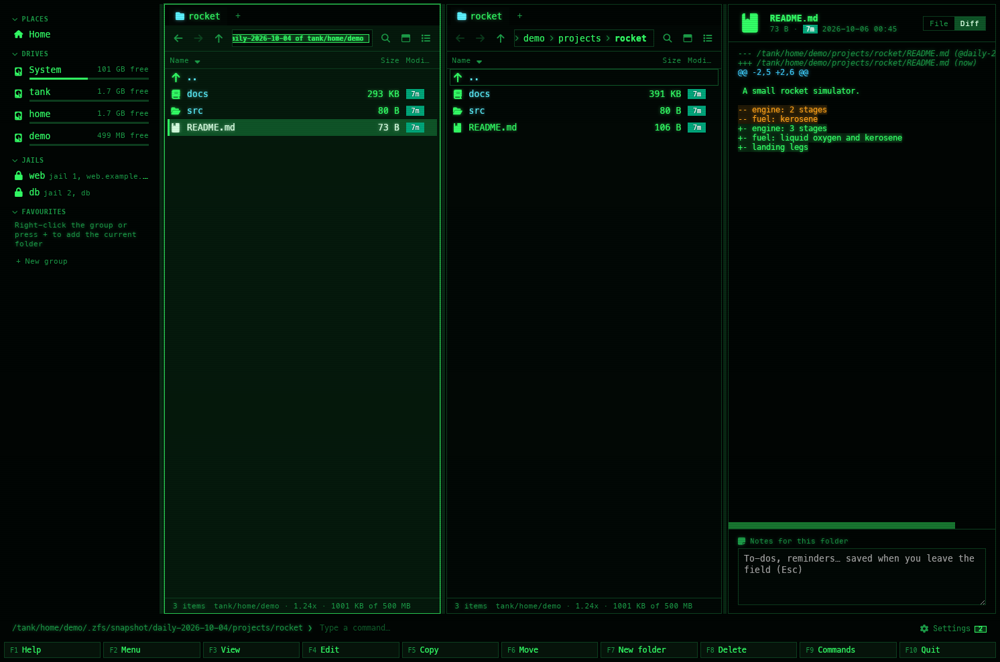

[← README](../../README.md) · [Docs index](../README.md) · [Files](README.md)

# ZFS snapshots as folders

On a folder in a ZFS dataset, **Alt+Z** lists the dataset's snapshots, newest first, the way
**Ctrl+G** lists a file's commits ([Git history as folders](../panels/git-history.md)).
**Enter** on a snapshot shows the folder as that snapshot has it: move around, preview a file,
see how it differs from the file now, and copy an old version back with **F5**. Nothing is ever
written into a snapshot. Both apps do this, on FreeBSD, on Linux with OpenZFS and on macOS
with OpenZFS; no root is needed.


*Alt+Z in `/tank/home/demo/projects/rocket`: the dataset's snapshots, newest first.*


*Enter on a snapshot, then Diff in the preview pane: how README.md differs now.*

## Contents

- [How to use it](#how-to-use-it)
- [What you see](#what-you-see)
- [What works in a snapshot](#what-works-in-a-snapshot)
- [Paths](#paths)
- [The dataset in the footer](#the-dataset-in-the-footer)
- [What it needs](#what-it-needs)
- [Limits](#limits)
- [Settings and config.toml](#settings-and-configtoml)
- [In the terminal app](#in-the-terminal-app)
- [Questions](#questions)

## How to use it

1. In a folder on ZFS, put the cursor on a folder and press **Alt+Z**. On `..` or on a file it
   is the folder you are in. The same is in **F9** as *ZFS snapshots*; in the desktop app a
   click on the ZFS line in the pane's footer does it too.
2. The pane lists the snapshots of the folder's dataset, newest first: the snapshot's name
   (the part after `@`), its own space in *Size* and the time it was taken in *Modified*.
3. **Enter** on a snapshot: the folder you came from, as it was when the snapshot was taken.
   Go into folders as usual.
4. On a file: the desktop app's preview pane (**Space**, or **F3**) shows it as the snapshot has
   it, and **Diff** at its top how the file now differs from it. In the terminal app **F3**
   opens it in your pager, and **Enter** shows the diff in the pager.
5. **F5** copies the file or folder under the cursor out of the snapshot, to the other panel:
   that is how a lost or overwritten file comes back. **F5** on a snapshot in the list copies
   the whole folder as it was.
6. **Backspace** (or `..`) goes up inside the snapshot; from its top it leads back to the list,
   and from the list to the folder on disk. **Alt+Z** inside a snapshot goes straight back to
   the list.

## What you see

| | Desktop app | Terminal app |
|---|---|---|
| The pane | Tinted, as inside an archive or a history | – |
| The list | `…/docs/@snapshots`, badge *snapshots of tank/home* | The same path in the title, `[snapshots of tank/home]` |
| Inside a snapshot | `…/.zfs/snapshot/daily-2026-10-01/docs`, badge *snapshot daily-2026-10-01 of tank/home*; hover it for what you can do | The same path in the title, `[snapshot daily-2026-10-01 of tank/home]` |
| A snapshot in the list | Its name; *Size* is its own space (`used`: what destroying it would free); *Type* says how much data it refers to (`referenced`); *Modified* is when it was taken | The same, and the line under the panel says `12288 used, 25600 referenced` |
| The footer | The dataset's ZFS line ([below](#the-dataset-in-the-footer)) | The same line in the panel's bottom border |

## What works in a snapshot

| Key | In a snapshot, or the list of snapshots |
|---|---|
| **Enter** | On a snapshot or a folder: in. On a file: the desktop app says *This is the file as the snapshot has it: Diff in the preview compares it with now, F5 copies it out*; the terminal app shows the diff in your pager, or *The file is the same now as in the snapshot* |
| **Backspace**, `..` | Up; from the top of a snapshot to the list, from the list to the folder on disk |
| **F3**, **Space** | Desktop app: the preview pane, with *File / Diff*. Terminal app: **F3** opens the file in your pager |
| **F5** | Copies out, as it was then. Never over an existing file |
| **F4**, **F6**, **F7**, **F8**, **Shift+F8** | Refused at once: *A ZFS snapshot is read-only: F5 copies a file or folder out of it* |
| **Alt+Enter** | Properties of the file as the snapshot has it, with the dataset's facts |
| **Alt+Z** | Inside a snapshot: back to the list |

The diff is `diff -u` of the snapshot's copy against the file now, labelled
`… (@first)` and `… (now)`. A file that is gone now, or new since, is compared with nothing.

## Paths

The list is a path, as a history is: `<folder>/@snapshots`. You can type it in the path bar
(**Ctrl+L**), or in **Alt+F1** in the terminal app. A real folder named `@snapshots` is just a
folder.

Inside a snapshot the path is ZFS's own: `<mountpoint>/.zfs/snapshot/<name>/<folder>`. It works
whether the dataset's `snapdir` is `hidden` (the default) or `visible`: hidden only keeps `.zfs`
out of listings, the path still opens, in Coxswain and in a shell:
`cp /tank/home/.zfs/snapshot/daily/docs/report.odt ~/docs/`.

## The dataset in the footer

In any folder on ZFS, the pane's footer (desktop app) or the panel's bottom border (terminal app)
shows the dataset, its compression ratio and its space:

```
tank/home/demo · 1.06x · 50.0 KB used · 1.7 GB free
tank/home/demo · 1.06x · 50.0 KB of 500 MB          (with a quota)
```

In the desktop app, hover it for the mountpoint; a click lists the snapshots. **Alt+Enter**
(Properties) shows more: the dataset, its mountpoint, compression, used, available and
referenced space, quota and refquota, and how many snapshots it has
([Properties](properties.md#zfs-packages-and-file-flags)).

The facts come from `zfs get` and are kept for ten seconds a dataset, so moving between its
folders runs it once.

## What it needs

- ZFS, and the `zfs` command: FreeBSD has both in the base system. On Linux, OpenZFS
  (`zfsutils-linux` on Debian and Ubuntu; the command is in `/sbin`, which Coxswain looks in
  even when it is not on your `PATH`). On macOS, OpenZFS on OS X (`/usr/local/zfs/bin`).
- Nothing else: no root, no `zfs allow`. Listing snapshots and reading them needs only what
  `zfs list` needs, which any user may run.
- Off ZFS, **Alt+Z** says *… is not on ZFS: there are no snapshots here*, and no footer line
  shows. On Windows there is no ZFS.

The dataset of a folder comes from the kernel's mount table (statfs(2) on FreeBSD and macOS,
`/proc/self/mountinfo` on Linux), not from running `zfs`: cheap enough for every folder.

The first time you start Coxswain with your home folder on ZFS, you are told that the snapshots
are there and which key opens them: under *Settings → Overview → What's new* in the desktop app,
once in the status line in the terminal app ([Notices](../search/notices.md)).

## Limits

- **Read-only**, always: Coxswain runs `zfs list` and `zfs get`, and reads the snapshot's
  files. It never takes, destroys, rolls back or clones a snapshot; use `zfs` for that.
- **The dataset's own snapshots** only: a folder in a child dataset lists the child's
  snapshots, not its parent's (`zfs list -d 1`).
- **A folder made after the snapshot** is not in it: **Enter** on that snapshot says
  *No such file or directory* (the terminal app then shows the first folder up that the
  snapshot has).
- **Recursive snapshots** (`zfs snapshot -r`) show in each dataset's own list.
- **Folder sizes** are not measured in the list: *Size* is the snapshot's own space. Inside a
  snapshot folders are measured as anywhere.
- The `zfs` command has four seconds to answer.
- On Linux, ZFS mounts a snapshot when it is first looked into, and unmounts it after a while
  (`zfs_expire_snapshot`); the desktop app's drive list leaves those mounts out.

## Settings and config.toml

| What | config.toml | Default |
|---|---|---|
| The key | `snapshots` in `[keys]` | `["Alt+Z"]` |

Nothing to turn on: the footer line and **Alt+Z** are there whenever a folder is on ZFS.

## In the terminal app

![The terminal app in Classic blue (NC) on FreeBSD: the left panel titled …/projects/rocket/@snapshots [snapshots of tank/home/demo] with before-upgrade, daily-2026-10-05 and daily-2026-10-04, the info line 56320 used, 333824 referenced, and tank/home/demo · 1.24x · 1025024 of 500M in the bottom border; the right panel is the folder now](../screenshots/tui-zfs-snapshots.png)

Everything above works the same, keys included. The differences: the title says
`[snapshots of tank/home]` or `[snapshot daily of tank/home]`; **Enter** on a file in a snapshot
shows its diff against now in your pager (the desktop app shows it in the preview pane); the ZFS
line is in the panel's bottom border, between the git line and the sort letter. The list of
snapshots is read on a thread, so the keys keep working while `zfs` answers.

## Questions

#### How do I get back a file I deleted, or an older version of it?

**Alt+Z** in the folder it was in, **Enter** on a snapshot from before, then **F5** on the file
to copy it to the other panel. Copying never overwrites: copy it beside the new one, or move
that away first. Coxswain never rolls a dataset back; `zfs rollback` does, and it destroys what
came after.

#### Do I need root, or `zfs allow`?

No. Listing snapshots (`zfs list -t snapshot`) and reading `.zfs/snapshot` work for every user.
You see the files the permissions let you see, as on the live dataset.

#### My dataset has `snapdir=hidden`. Does it still work?

Yes. `hidden` keeps `.zfs` out of directory listings only; the path opens all the same, and
that is the path Coxswain uses.

#### Why is a snapshot's size so small?

*Size* is the snapshot's own space, `used` in `zfs list`: the blocks only that snapshot still
holds, what destroying it would free. *Type* (or the line under the panel) shows `referenced`,
all the data the snapshot refers to.

#### How do I see what changed since a snapshot?

On a file inside the snapshot: **Diff** in the desktop app's preview pane, or **Enter** in the
terminal app. For a whole dataset, `zfs diff tank/home@daily` on the command line (it needs
`zfs allow diff`, or root).

#### Can I take or destroy snapshots from Coxswain?

No, on purpose: Coxswain only reads. Use `zfs snapshot tank/home@before-upgrade` and
`zfs destroy`, from the command line or a user menu entry
([The user menu](../commands/user-menu.md)).

#### Why is my snapshot not listed?

It is a snapshot of another dataset: of the parent, or of a child dataset mounted below. Each
folder lists the snapshots of the dataset it is on; the footer names that dataset.

#### Does it work with boot environments?

Yes: a boot environment is a dataset, and its snapshots list like any other. The boot
environments themselves are in the sidebar and **Alt+F1**
([FreeBSD](../reference/freebsd.md#boot-environments-and-jails)).

---
[← Previous: Finding duplicates](duplicates.md) · [Next: Customising →](../customise/README.md)
