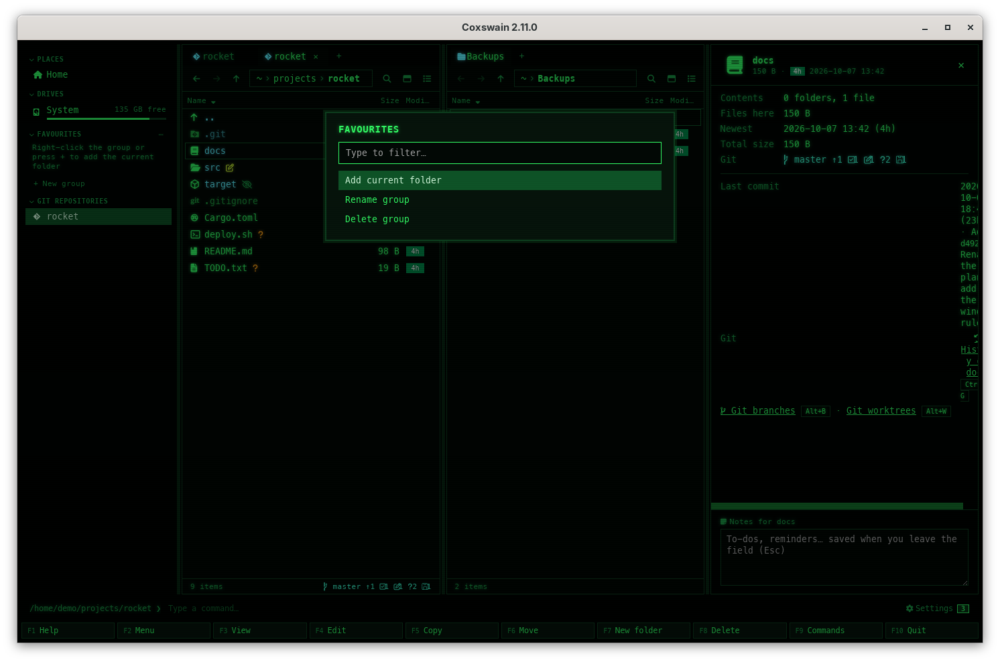

[← README](../../README.md) · [Docs index](../README.md) · [Tags, notes, favourites and the sidebar](README.md)

# Favourites

Favourites are folders you go to often, kept in named groups in the [sidebar](sidebar.md). One
click takes the active tab there. Make a group per project, per client or per habit.

*A favourites group named WORK. The highlighted entry is the folder the active tab is in.*

## How to use it

There is one group to start with, *Favourites* (named in the language in use when Coxswain
first ran). Everything is done with the mouse in the sidebar; show it with **Ctrl+B** if it is hidden.

| To | Do |
|---|---|
| Add the folder you are in | Hover the group's header and click the `+` that shows at its right (*Add current folder*), or right-click the header → *Add current folder* |
| Go to a favourite | Click it: the active tab of the active pane goes there, as if you had typed the path |
| Remove one | Hover it and click the `×` that shows at its right (*Remove*) |
| Make a new group | Click *+ New group* under the last group. The dialog *New favourites group* asks for its *Name:*; **Enter** makes it, **Esc** cancels |
| Rename a group | Click the **⋯** at the right of its header (or right-click the header) → *Rename group*, type the new name, **Enter** |
| Delete a group | The **⋯** (or a right-click on the header) → *Delete group*. It goes at once, without asking |
| Fold a group away | Click its header; click again to open it |

The folder added is the one the active tab shows, not the one under the cursor. To add a
subfolder, go into it first (**Enter**), then click `+`. A folder already in the group is not
added twice. Groups keep the order you made them in; favourites keep the order you added them.

## What you see

- Each group is a section of the sidebar with its name as the header, in capitals.
- Each favourite is a row with a star, in the theme's colour for marked files, and the folder's
  name. Hover it for the full path.
- The favourite for the folder the active tab is in is highlighted in the cursor colour.
- An empty group says *Right-click the group or press + to add the current folder*.
- Each header has a **⋯** at its right, always shown, dimmed until the mouse is on it (its
  tooltip: *Add the folder, rename or delete the group (right-click works too)*); the `+` beside
  it shows while the mouse is on the header.
- The **⋯** menu, the same as the right-click menu, is titled with the group's name and has *Add current folder*, *Rename
  group* and *Delete group*; move with **Up** and **Down** and press **Enter**, or click.
- A favourite whose folder is gone stays in the list. Clicking it leaves the tab where it is,
  and the status line shows the error (for example *No such file or directory*).

## Settings and config.toml

No Settings item and no `config.toml` key. The groups are kept in `state.json` (`favorites`: a
list of groups, each with a `name` and its `paths`); see
[Where things are kept](../reference/where-things-are-kept.md). They are saved at once, on every change.

## In the terminal app

The terminal app has no sidebar and no favourites. To get to a folder quickly there, use
**Alt+F1** / **Alt+F2** (*Left: go to*, *Right: go to*) and type the path, or `cd` on the
[command line](../commands/command-line.md); see [Moving around](../panels/moving.md).

## Questions

#### I clicked + and nothing was added.

The folder is already in that group, or the `+` added the folder you are *in*, which you may
not have expected: the cursor's folder is not the one added. Go into the folder first.

#### Deleting a group asks nothing. Can I undo it?

No. The folders themselves are untouched, only the group is gone. Make the group again and add
the folders back. If you keep backups of your data folder, the old `state.json` has them.

#### Can I reorder favourites or groups, or drag a folder onto a group?

No. Favourites stay in the order you added them and groups in the order you made them. To
reorder, remove and add again. Dragging onto the sidebar is not supported.

#### Can a favourite point at a folder inside an archive, or on a USB stick?

Yes, any folder you can open. When the stick is not plugged in, or the archive is gone, the
click fails and the status line says why; the favourite stays.

#### Where else are my favourites used?

The [duplicate finder](../files/duplicates.md) (**Ctrl+D**) offers them as places to compare,
after the folders of both panes and before the drives.

#### Can I keep my favourites in config.toml, or share them between computers?

They live in `state.json`, not in the config. You can copy `state.json` to another computer, but
it also holds your tags, notes and session, and the paths must exist there.

#### How do I rename or delete a group?

Click the **⋯** at the right of the group's header in the sidebar, or right-click the header.
The menu titled with the group's name has *Add current folder*, *Rename group* and *Delete
group*. *Rename group* asks for the new name with the old one filled in.

#### Can I rename a single favourite?

No. A favourite shows the folder's own name. Two folders with the same name show the same
label; hover them to see the full paths.

---
[← Previous: Folder notes](notes.md) · [Next: The sidebar →](sidebar.md)
