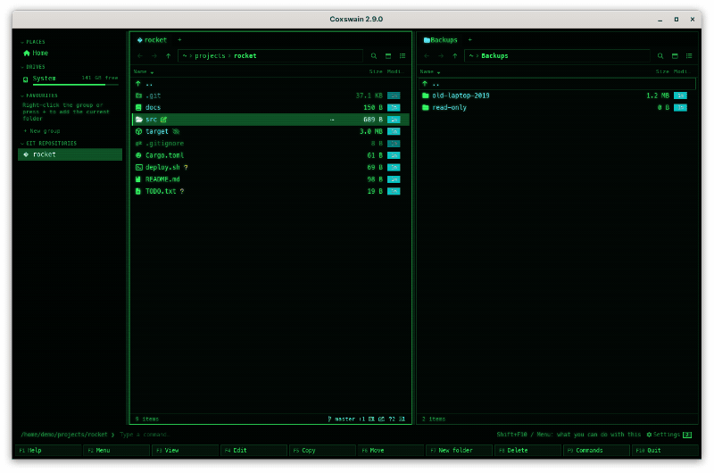
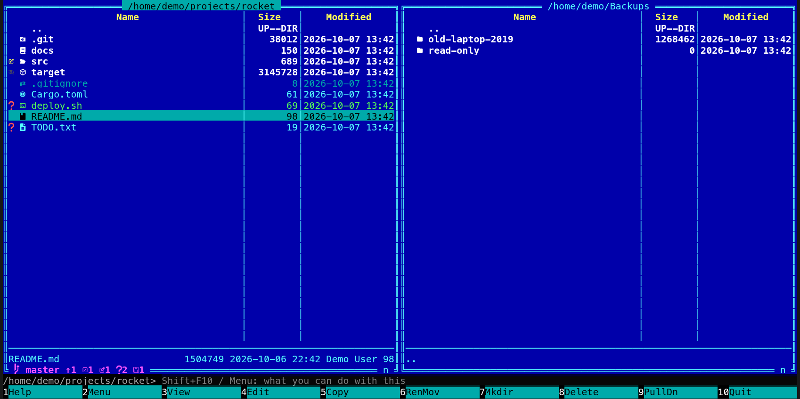

[← README](../../README.md) · [Docs index](../README.md) · [Panels and keys](README.md)

# What can I do with this? The action menu and hints

**Shift+F10** (or the **Menu** key) opens a short menu of what you can do with the file or folder
under the cursor, or with the marked ones: open, view, edit, copy, move, rename, pack, extract,
delete, properties, git history, Find, and on `..` the panels themselves. Only the actions that fit are listed, each with its key, so
the menu also teaches the keys. The status line helps the same way: it shows one short hint
that fits what is under the cursor, such as *Alt+F5 packs it into an archive · Shift+F6 renames
it*.

<picture><source media="(prefers-reduced-motion: reduce)" srcset="../screenshots/action-menu.png"></picture>

- [Opening the menu](#opening-the-menu)
- [What it lists](#what-it-lists)
- [Hints on the status line](#hints-on-the-status-line)
- [Settings and config.toml](#settings-and-configtoml)
- [In the terminal app](#in-the-terminal-app)
- [Questions](#questions)

## Opening the menu

| How | Desktop app | Terminal app |
|---|---|---|
| **Shift+F10** | Yes | Yes |
| The **Menu** key (beside the right Ctrl) | Yes | Only where the terminal passes the key on (kitty, foot, WezTerm with the kitty keyboard protocol); Shift+F10 works everywhere |
| The **⋯** button at the end of the row under the mouse or the cursor (the corner of a thumbnail) | Yes | – |
| **Ctrl+right-click** on a row | Yes | – |
| Right-click on a row | When *Right-click* is set to *Opens the action menu* | The same |
| **F9**, *What can I do with this?* | Yes | Yes |

The menu opens in the middle of the window. Its title says what it is about: *What to do with
"report.pdf"*, *What to do with 3 items*, or *What to do with this folder* when the cursor is on
`..` and nothing is marked.

| Key | In the menu |
|---|---|
| **Up** / **Down** | Move |
| **Enter** | Run the action (a click does too in the desktop app) |
| Letters | Filter by name, as in the [command list](command-list.md) |
| **Esc** | Close without doing anything |

An action runs as if you had pressed its key: *Copy* opens the copy dialog with the other
panel's folder filled in, *Rename* asks for the new name with the old one filled in, *Delete*
asks first (unless you turned that off).

## What it lists

The actions that fit, under the headings of the [command list](command-list.md), in this order:
opening and looking first, then files, archives, search, git and the panels; in each heading
the most used first (*Moving*, *Viewing*, *Files*, *Archives*, *Search*, *Git*, *Panels*).

| Under the cursor (or marked) | The menu lists |
|---|---|
| Anything, anywhere | Find (**Alt+F7**, **Ctrl+F**), Search inside files (**Shift+F7**), Ask your files (**Ctrl+F7**) under *Search* |
| A file | Open, View (**F3**), Edit (**F4**), Path to command line (**Ctrl+Enter**), Folder notes (**Alt+N**, desktop app), Copy (**F5**), Move (**F6**), Rename (**Shift+F6**), Delete (**F8**), New folder (**F7**), Copy to clipboard (**Ctrl+C**, desktop app), Properties (**Alt+Enter**), Colour tag (**Alt+T**, desktop app), Pack into an archive (**Alt+F5**) |
| A folder | Open, Path to command line, Folder notes, Copy, Move, Rename, Delete, New folder, Copy to clipboard, Properties, Colour tag, Pack into an archive, Find duplicates (**Ctrl+D**, desktop app) |
| An archive (zip, tar, 7z …) | What a file has, and Extract archive (**Ctrl+E**); Open goes into it like a folder |
| Several marked | Copy, Move, Delete, New folder, Copy to clipboard, Batch rename (**Ctrl+M**, desktop app), Colour tag, Pack into an archive; Extract archive when an archive is among them; Find duplicates when a folder is among them |
| `..`, nothing marked | New folder, Folder notes, Find duplicates (in this folder), the git and ZFS entries for this folder, and under *Panels*: Other panel here (**Alt+O**), Swap panels (**Ctrl+U**), Panels on/off (**Ctrl+O**) |
| In a git repository | Also Git history (**Ctrl+G**) for the one entry or the folder, Git branches (**Alt+B**) and Git worktrees (**Alt+W**) |
| In the list of branches | Open, Switch to branch (**Alt+S**), New branch here |
| On ZFS | Also ZFS snapshots (**Alt+Z**) for the folder; inside a snapshot, back to the list |
| On FreeBSD, a file | Also Files of this package |
| Inside an archive | Open, View (a file), Copy, Move, Rename, Delete, New folder: the changes write the archive anew |
| In a git history, a ZFS snapshot or a package's list | Only what reads: Open, View, Copy; nothing that changes |

Actions that work on one entry (Open, View, Edit, Rename, Properties) are offered when one
entry is the subject: the one under the cursor with nothing marked, or the one marked entry
when the cursor is on it. With several marked, the menu offers what works on all of them.

The keys shown are the ones in force: rebind *Rename* in `[keys]` and the menu shows your key.

## Hints on the status line

While the command line is empty, the status line shows one short hint that fits what is under
the cursor, in a dim colour. The first ones teach the menu itself; then they teach keys.

| Under the cursor | Hint |
|---|---|
| Anything | *Shift+F10 / Menu: what you can do with this* |
| Anywhere | *Alt+F7 / Ctrl+F finds anything on this machine* |
| A file or folder | *Alt+letter jumps to a name: type how it starts* ([Quick search](quick-search.md)) |
| `..`, nothing marked | *Ctrl+U swaps the panels · Alt+O shows this folder in the other one · Ctrl+O panels on or off* |
| Several marked | *F5 copies them to the other panel · F6 moves them* |
| Files inside an archive | *Inside an archive: F5 copies files out to the other panel* |
| An archive | *Enter opens it like a folder · Ctrl+E extracts it* |
| A folder | *Alt+F5 packs it into an archive · Shift+F6 renames it* |
| A file | *F3 views it · F4 edits it · Shift+F6 renames it* |
| A branch in the list of branches | *Alt+S switches to the branch under the cursor* |
| In a git repository | *Alt+B shows the branches · Ctrl+G the history* |
| On ZFS | *Alt+Z shows the ZFS snapshots of this folder* |

The rules:

- **One at a time**: the first in the table that fits and is not used up.
- **Three times each**: a hint counts once each time it comes up anew, not each time the
  cursor moves: walking down a column of folders shows *Alt+F5 packs it …* once; it comes up
  anew after another hint, or when the cursor goes to another kind of entry (a file after a
  folder, several marked, into an archive). After three times it is not shown again, and the
  next one that fits takes its place. The counts are kept in
  `state.json` ([Where things are kept](../reference/where-things-are-kept.md)).
- **Never in the way**: no hint while you type a command, during quick search, while a dialog
  is open, or while the status line says something else (*Copied "report.pdf"*).
- **Your keys**: the hint names the keys in force; a hint whose action you unbound is skipped.

### The hint in Find

Find has one hint of its own, shown in place rather than on the status line: the first three
times Find opens, the empty list says, dimmed under *Type a name …*, *Ctrl+F again searches only
in rocket* (the search key in force and the active panel's folder). It goes once the scope is
*In rocket*, and it counts and resets with the others. See [Find](../search/find-file.md#the-scope-everywhere-or-this-folder).

To see them all again: *Settings → Behaviour → Show the hints again* in the desktop app, or
`coxswain --hints reset` (the terminal app's command line; it resets them for both apps). To
turn them off: *Settings → Behaviour → Show hints*.

## Settings and config.toml

| Setting (Settings → Behaviour) | `config.toml` | Default | Does |
|---|---|---|---|
| *Right-click* | `right_click = "mark"` or `"menu"` | `"mark"` | `mark`: a right-click marks the row, as in Norton Commander. `menu`: it puts the cursor on the row and opens the action menu, as in a file explorer. In the desktop app **Ctrl+right-click** does the other one |
| *Show hints* | `hints = true` | `true` | The hint on the status line |
| *Show the hints again* (button, desktop app) | – | – | Every hint shows three times again; `coxswain --hints reset` does the same |

| Action | Config name | Default keys |
|---|---|---|
| What can I do with this? | `action_menu` | `Shift+F10`, `Menu` |
| Rename | `rename` | `Shift+F6` |

## In the terminal app

The same menu and the same entries, minus what only the desktop app has (the clipboard, Batch
rename, Colour tag, Folder notes, Find duplicates). *Panels on/off* (**Ctrl+O**) there hides
the panels and shows the terminal with the last output. It is drawn as a dialog with the headings in bold; letters filter it. The hint sits
on the command line after the prompt, dimmed, and goes as soon as you type. Right-click with
the mouse follows the *Right-click* setting; there is no **⋯** button and no Ctrl+right-click.

## Questions

#### How do I zip a folder?

Put the cursor on it and press **Shift+F10**, then pick *Pack into an archive* (or press
**Alt+F5** straight away). A dialog asks where to put it, with the other panel's folder and the
folder's name and `.zip` filled in: `~/Backups/photos.zip`. Change the ending to `.7z`,
`.tar.gz` or another to pick the format, then **Enter**. Mark several files first (**Insert**)
to pack them together. See [Pack and extract](../files/pack-and-extract.md).

#### How do I rename a file?

Put the cursor on it and press **Shift+F6** (or **Shift+F10**, then *Rename*). The *Rename*
dialog opens with the name filled in; change it and press **Enter**. The cursor follows the new
name. **F6** renames too: type a name instead of a folder. Many files at once: mark them and
press **Ctrl+M** in the desktop app ([Batch rename](../files/batch-rename.md)).

#### Why does Shift+F10 not open the right-click menu of my desktop?

Coxswain has its own: the right-click menu of a file manager is the action menu here. It lists
Coxswain's actions on the entry, not the desktop's *Open with* list; **Enter** opens a file in
its default program.

#### The Menu key does nothing in the terminal app.

Most terminals send nothing Coxswain can read for that key. Use **Shift+F10**, which every
terminal passes on, or bind another key to `action_menu` in `[keys]`.

#### Can right-click open the menu instead of marking?

Yes: *Settings → Behaviour → Right-click → Opens the action menu*, or `right_click = "menu"` in
`config.toml`. Both apps follow it. In the desktop app **Ctrl+right-click** then marks.

#### Why is an action I expected missing from the menu?

It does not fit what is under the cursor there. Rename, Edit and Properties need one entry, and
are left out when several are marked; nothing that changes files is listed in a git history, a
ZFS snapshot or a package's list, which are read-only; Extract only shows for archives. Every
action is still in **F9**.

#### How do I get the same folder in both panels, or swap them?

Put the cursor on `..` with nothing marked and press **Shift+F10**: under *Panels* are *Other
panel here* (**Alt+O**), which opens this folder in the other panel, and *Swap panels*
(**Ctrl+U**), which swaps the two panels' folders. *Panels on/off* (**Ctrl+O**) switches the
desktop app between one pane and two, and in the terminal app hides the panels to show the
command output. See [Tabs, back and forward, one pane or two](tabs-and-panes.md).

#### Why did a hint disappear for good?

Each hint shows three times, then makes room for the next. *Settings → Behaviour → Show the
hints again*, or `coxswain --hints reset`, brings them all back.

#### Does the menu work on the marked files or on the one under the cursor?

On the marked ones when there are any, as **F5** and **F8** do; its title says which (*What to
do with 3 items*). With nothing marked, on the one under the cursor.

---
[← Previous: The command list (F9) and Help (F1)](command-list.md) · [Next: What the apps remember →](session.md)
