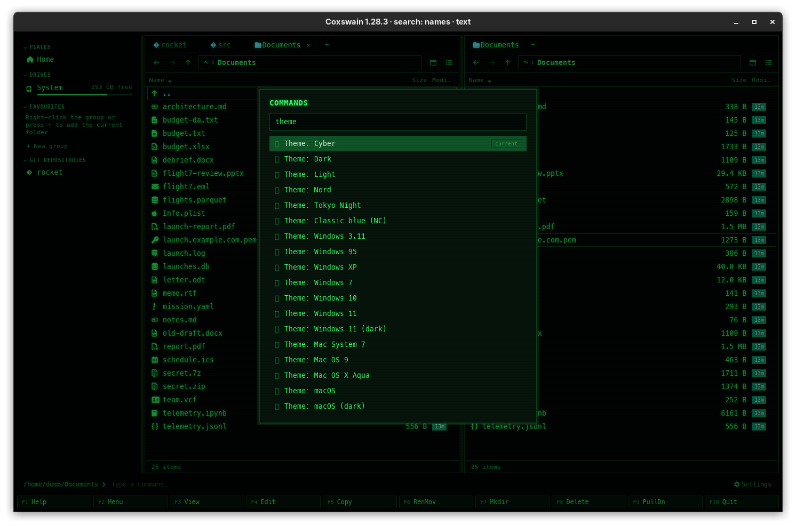
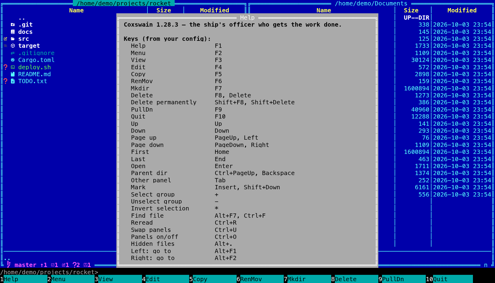

[← README](../../README.md) · [Docs index](../README.md) · [Panels and keys](README.md)

# The command list (F9) and Help (F1)

**F9** opens a list of every action, with its key, that you filter by typing: you never need
to remember a key. **F1** shows the keys as your config has them, with the search syntax and
where the config file is.

## How to use it

### The command list

1. Press **F9**. The *Commands* list opens.
2. Type part of an action's name: `sort`, `tab`, `size`. The list keeps the entries whose
   name contains it, in any case.
3. **Up** and **Down** move, **Enter** runs the entry, **Esc** closes. In the desktop app a
   click runs an entry too.

| Key | In the list |
|---|---|
| Letters | Filter |
| **Backspace** | Take a letter back (terminal app; in the desktop app the filter is a text field) |
| **Up** / **Down** | Move |
| **Enter** | Run |
| **Esc** | Close (in the terminal app **F10** too) |

### Help

Press **F1**.

| | Terminal app | Desktop app |
|---|---|---|
| Scroll | **Up**, **Down**, **PageUp**, **PageDown** | The mouse wheel |
| Close | Any other key | **Esc**, **Enter**, **F1**, or a click outside it |

## What you see

**The command list.** Each entry has its name and its first key. The terminal app lists the
actions it has. The desktop app lists all of them, including those with no key
(*Folder sizes*, *Columns and folder sizes*), plus one entry per built-in theme
(*Theme: Windows 95*); the current theme is marked *current*, and picking one switches to it
and saves it in `config.toml`. *Up*, *Down* and the list itself are left out.

**Help.**

| | Terminal app | Desktop app |
|---|---|---|
| Title | *Help*, then `Coxswain 1.20.0 — the ship's officer who gets the work done.` | `Coxswain 1.20.0 · keyboard shortcuts` |
| Keys | *Keys (from your config):* every action it has, with all its keys | Every action with all its keys |
| Also | Alt+letter quick search, typing goes to the command line, `cd`, Ctrl+O, the mouse | *Mouse: double-click opens · Ctrl-click / right-click marks · Shift-click marks a range · drag …* |
| Search | *Find file (Everything syntax):* with one example per line | *Find file uses Everything's syntax:* with the examples |
| Config | `Config: <path>` and *Run `coxswain --dump-config` for every option with its default.* | `Config: <path> · every option: coxswain --dump-config` |

The names are in the language you chose ([Languages](../customise/languages.md)), and the
keys are the ones in force, so a rebinding shows at once.

## Settings and config.toml

| Action | Config name | Default key |
|---|---|---|
| The command list (*PullDn*) | `menu` | `F9` |
| Help | `help` | `F1` |

The actions in the list are all the `[keys]` names; see [Every default key](keys.md).

## In the terminal app

The same list and help, drawn as dialogs. It lists only the actions the terminal app has;
the desktop-only ones are left out rather than shown and refused. It has no theme entries:
the terminal app's theme is `theme` in `config.toml` ([Themes](../customise/themes.md)).

## Questions

#### Where is the pull-down menu?

**F9** is labelled *PullDn* for NC's sake, but opens the searchable command list instead. It
reaches every action that a menu would.

#### How do I run an action that has no key?

Find it in the **F9** list: *Folder sizes* and *Columns and folder sizes* have no key by
default. Or give it one in `[keys]` ([Changing keys](../customise/keys.md)).

#### How do I switch themes quickly?

Desktop app: **F9**, type `theme`, pick one. It is saved at once. Terminal app: set `theme`
in `config.toml` and restart.

#### Why does Help not list Colour tag in the terminal app?

The terminal app's help lists only the actions it has. The desktop app's help lists all of
them.

#### Why is the list's key column empty for some entries?

Those actions have no key, by default or because you unbound them (`= []`).

#### How do I find the config file?

**F1** shows its path at the bottom. `coxswain --config-path` prints it, and
`coxswain --paths` prints where everything is kept ([Where things are kept](../reference/where-things-are-kept.md)).

---
[← Previous: The mouse](mouse.md) · [Next: What the apps remember →](session.md)
