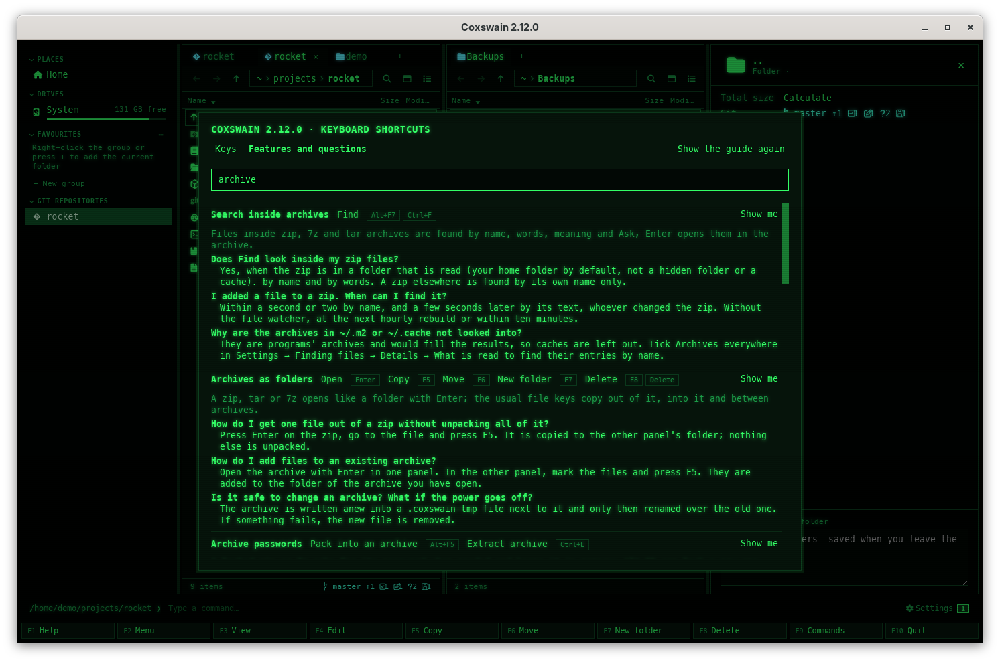
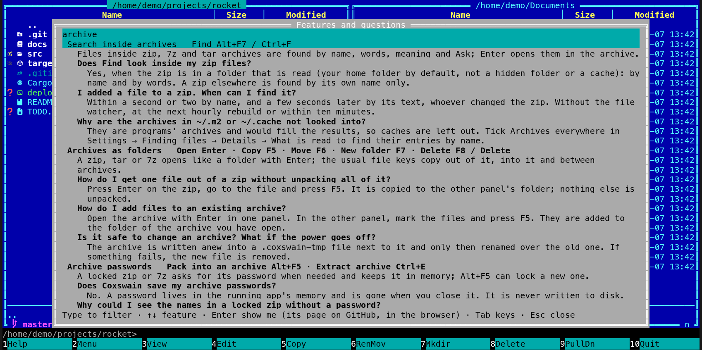

[← README](../../README.md) · [Docs index](../README.md) · [Panels and keys](README.md)

# Features and questions (F1)

**F1**, then *Features and questions*, lists everything Coxswain can do: every feature, by area
as these docs are, each with a line on what it does, its keys as your config has them, and the
two or three questions people ask about it, answered in a sentence or two. Type to filter.
**Show me** opens the feature's page of these docs.

- [How to open it](#how-to-open-it)
- [What you see](#what-you-see)
- [Filtering](#filtering)
- [Show me](#show-me)
- [F1 inside a dialog](#f1-inside-a-dialog)
- [Settings and config.toml](#settings-and-configtoml)
- [In the terminal app](#in-the-terminal-app)
- [Questions](#questions)

## How to open it

| Where | Desktop app | Terminal app |
|---|---|---|
| Help | **F1**, then the *Features and questions* tab at the top | **F1**, then **Tab** (the key line at the bottom of Help says so) |
| The command list | **F9**, *Features and questions* | The same |
| The action menu | **Shift+F10** or **Menu**, *Features and questions* under *App* | The same |
| Inside a dialog | **F1**: Features at that dialog's feature ([below](#f1-inside-a-dialog)) | The same |

The [first-run guide](first-run.md) names it on its first step, and a [hint](action-menu.md#hints-on-the-status-line)
on the status line says *F1 → Features: everything Coxswain can do, with questions answered* the
first three times it fits.

## What you see

The features come in the order of the [docs index](../README.md), under the area headings:
*Panels and keys*, *Tags, notes, favourites and the sidebar*, *Commands, the user menu and
scripts*, *Search*, *The preview pane*, *Files*, *Customising*, *Reference*. Each one shows:

| Part | Example |
|---|---|
| Its title | *Undo* |
| Its keys: each action with all its keys, from your `[keys]` | *Undo* **Ctrl+Z** |
| What it does, in one line | *Ctrl+Z undoes the last file operation (copy, move, rename, new folder, move to the bin, pack, extract), up to 20 back.* |
| Two or three questions, each with a short answer | *Can I undo a delete?* — *A move to the bin, yes, except on a Mac and in the Flatpak, … Deleting for good (Shift+F8) cannot be undone.* |

Keys in the lines and answers are the ones in force: rebind *Copy* to **Ctrl+K** and every
answer that names Copy says **Ctrl+K**. An action with no key shows *—* in the keys and its name
in the answers. Everything is in the language you chose ([Languages](../customise/languages.md)).

| | Desktop app | Terminal app |
|---|---|---|
| Layout | A filter field under the tabs, then the list; each feature has a **Show me** button on its title line | The filter at the top, the list, and a key line at the bottom; the feature under the cursor is lit, and the list scrolls to keep it in the upper third |
| The keys | Each written as on the keyboard (`Ctrl+K`) | `Copy F5 · Move F6` after the title |
| Desktop-only actions | Listed | Left out of the keys (their questions stay, and say *in the desktop app*) |

## Filtering

Type in the filter. A feature whose title or line holds every word you typed stays, with all
its questions; a feature that does not, but has questions that hold every word, stays with only
those. Features whose title matches come first, then those whose line does, then those kept for
a question.

The filter ignores case and diacritics: `große` finds *Grösse*, `etiquette` finds *étiquette*,
`angstrom` finds *Ångström*. Nothing matches: *No feature or question holds these words.*

| Key | Desktop app | Terminal app |
|---|---|---|
| Letters | Typed into the filter field | Typed into the filter |
| **Backspace** | Takes a letter back | The same |
| **Up** / **Down** | – | The feature before or after |
| **PageUp** / **PageDown** | – | Five features at a time |
| **Enter** | – | Show me |
| **Tab** | Moves through the tabs and buttons | Back to the keys of Help |
| **Esc** | Closes (back to the dialog it came from) | The same |
| **F1** | Closes | The same |

## Show me

**Show me** (desktop app: the button; terminal app: **Enter** on the feature) opens the
feature's page of these docs on GitHub, `https://github.com/mwo-dk/coxswain/blob/master/docs/<page>`,
in your browser. The desktop app says *Opening https://github.com/…* on the status line.

The terminal app also puts the address on the terminal's clipboard (OSC 52, or Termux:API in
Termux) and says it on the key line: *Opened in the browser, and copied: https://…*, or, when
no browser could be opened (over ssh, on a server), *No browser could be opened. Copied:
https://…*, so you can paste it into a browser elsewhere.

Nothing else in Features reaches the network: the list, the questions and the filter are in
the app. Only **Show me** opens a page, and only when you press it ([Privacy](../reference/privacy.md)).

## F1 inside a dialog

**F1** pressed in a dialog or window opens Features with the filter set to that dialog's
feature, so its questions are at the top. **Esc** goes back to the dialog, as you left it.

| F1 in | Opens Features at |
|---|---|
| Copy, Move, Rename, New folder, Mark group | *Copy*, *Move and rename*, *New folder*, *Marking files* |
| Delete's question | *Delete* |
| Pack, Extract, a password prompt | *Pack and extract*, *Archive passwords* |
| Switch to branch, New branch here | *Git branches and worktrees* |
| The command list (**F9**), the action menu, the user menu (**F2**) | *Commands and Help*, *The action menu and hints*, *User menu* |
| Settings, the first-run guide | *Settings*, *First-run guide* |
| A CBOM or provenance viewer | *Cryptography bills of materials*, *Build provenance* |
| Desktop app: Properties, Batch rename, Colour tag, Find duplicates, the search setup | Their features |
| Find | **F1** shows the name syntax as before; **F1** again opens Features at *Find* |

## Settings and config.toml

| Action | Config name | Default key |
|---|---|---|
| Features and questions | `features` | none (it is Help's second tab) |

Give it a key of its own under `[keys]`, e.g. `features = ["Ctrl+H"]` ([Changing keys](../customise/keys.md)).
The questions are not a setting: they come with the app, one set per language.

## In the terminal app

The same list, drawn as a full-height dialog. **Tab** switches between the keys of Help and
Features; **Enter** is Show me. The desktop-only actions are left out of the keys line of each
feature.

## Questions

#### How do I find out what a feature does without reading the docs?

Press **F1**, switch to *Features and questions* (the tab in the desktop app, **Tab** in the
terminal app) and type a word: `zip`, `tag`, `branch`. The features and questions that hold
it stay.

#### Does Show me send anything?

It opens the feature's page on GitHub in your browser, and only when you press it. The list
and the questions are in the app; filtering never reaches the network.

#### Show me does nothing in the terminal app over ssh.

No browser can be opened there. The key line says *No browser could be opened. Copied: …*:
the address is on your terminal's clipboard (OSC 52), so paste it into a browser on your own
machine. A terminal that does not pass OSC 52 on still shows the address on the key line.

#### Why are the keys in the answers not the defaults?

They come from your `[keys]`: an answer that names Copy shows the key Copy has now. An action
you unbound (`= []`) is named instead of a key.

#### F1 in Find shows the syntax, not Features.

F1 in Find shows the name syntax, as before. Press **F1** once more for the questions about
Find, or **Esc** to go back to the list.

#### The question I have is not there.

Each feature has its two or three most asked questions; its page has more. Press **Show me**
for the page, or see [Questions, collected](../faq.md).

#### Is it in my language?

Yes, in every language Coxswain speaks: the titles, lines, questions and answers. Filter in
your language; diacritics do not matter.

---
[← Previous: The command list (F9) and Help (F1)](command-list.md) · [Next: What can I do with this? →](action-menu.md)
