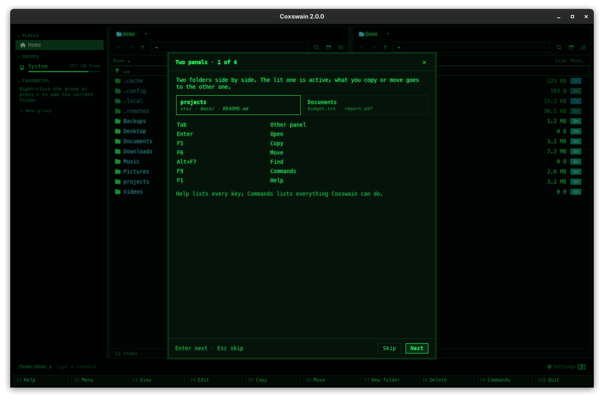
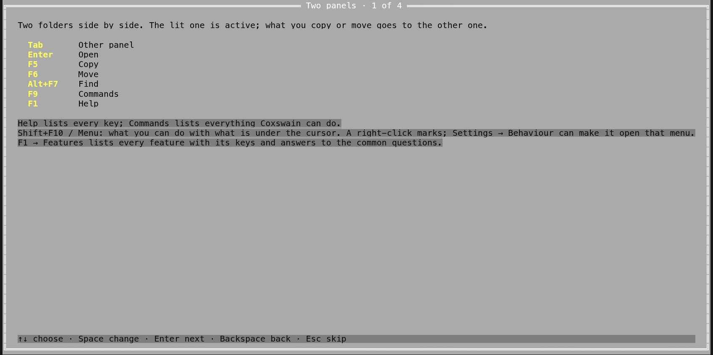

[← README](../../README.md) · [Docs index](../README.md) · [Panels and keys](README.md)

# The first-run guide

The first time Coxswain starts, a short guide opens in both apps: four steps that show the two
panels and their keys, ask how far Find should look, let you choose how it looks, and say what
can leave the machine. Every step can be skipped. Each choice is written to `config.toml` at once,
as in Settings, so closing the guide halfway keeps what you chose.

## Contents

- [When it opens](#when-it-opens)
- [The four steps](#the-four-steps)
- [Keys](#keys)
- [Opening it again](#opening-it-again)
- [How the two apps differ](#how-the-two-apps-differ)
- [What it writes](#what-it-writes)
- [Questions](#questions)

## When it opens

On the very first start of either app, when no version of Coxswain has been started before on
this account. An update from 1.x does not show it: you get the notice of what is new instead (and,
if your `config.toml` had keys that 2.0 renamed, a notice that lists them; see
[What's new in 2.0](../whats-new-2.md)).

It does not open when that first start is `--settings` or, in the desktop app, `--duplicates`:
what you asked for comes first. **F1** opens it then ([Opening it again](#opening-it-again)).

## The four steps

| Step | Title | What it shows | What you can do |
|---|---|---|---|
| 1 | *Two panels* | Two folders side by side; the lit one is active, and what you copy or move goes to the other one. The keys to know first, as your `[keys]` set them: **Tab** other panel, **Enter** open, **F5** copy, **F6** move, **Ctrl+F** Find, **F9** commands, **F1** help. Under them: *Shift+F10 / Menu: what you can do with what is under the cursor. A right-click marks; Settings → Behaviour can make it open that menu.* ([The action menu](action-menu.md)) | Read, then go on |
| 2 | *Finding files* | How far Find looks: the four search levels of [Search settings](../search/settings.md): *Names only*, *Names and text* (the default), *+ meaning*, *+ Ask*, each with what it costs | Choose a level. *+ meaning* and *+ Ask* need a model: when none is chosen yet, the [setup guide](../search/setup.md) opens, and when it closes you are back at this step |
| 3 | *Looks* | Four themes (Cyber, Classic blue, Tokyo Night, Light), the language, and the icons | Choose a theme and a language; the screen changes at once. Icons: see below. More themes, fonts and sizes are in Settings → Looks |
| 4 | *Privacy* | "Nothing leaves this machine unless you turn it on." The update check (once a day, to `api.github.com`) and the list of what can leave the machine with the settings as they are now | Switch the update check off or on; *Done* closes the guide |

**Icons (step 3).** The file and git icons need a Nerd Font.

- The desktop app looks for one (fontconfig on Linux and FreeBSD, the font folders on macOS and
  Windows). Found: it says so. Not found: it says the icons would show as boxes, and offers the
  line that installs one on this system with a **Copy** button (for example
  `sudo pacman -S ttf-nerd-fonts-symbols`, `pkg install nerd-fonts`,
  `brew install --cask font-symbols-only-nerd-font`), or the advice to get one from
  nerdfonts.com where there is no package, and **Use plain characters**.
- The terminal app cannot see the terminal's font, so it shows a folder and a file icon and asks
  whether you see them. If they are boxes or question marks, switch *Icons and git glyphs* to
  *Plain characters (ASCII)* on that row. Where Coxswain knows a package for a Nerd Font, a row
  shows its install line; **Space** copies it.

Coxswain never runs an install line; it only shows it and copies it.

## Keys

| Key | Desktop app | Terminal app |
|---|---|---|
| **Enter** | Next step; *Done* on the last | Next step; closes on the last |
| **Esc** | Skips the rest (closes the guide) | Skips the rest |
| **Backspace** | Back one step | Back one step |
| **↑** **↓** | – (use the mouse or Tab between fields) | Choose a row of the step |
| **Space**, **←** **→** | – | Change the row: the next level, theme, language; flip the icons or the update check; copy an install line |

The desktop app also has **Skip**, **Back** and **Next** (*Done* on step 4) buttons, and **×** in
the title bar. The key line at the bottom says the keys: "Enter next · Esc skip" in the desktop
app, "↑↓ choose · Space change · Enter next · Backspace back · Esc skip" in the terminal app.

## Opening it again

| Where | Desktop app | Terminal app |
|---|---|---|
| Help | **F1**, then **Show the guide again** at the top | **F1**, then **G** |
| Settings | Settings → *Overview* → **Show the guide again** | **F9** → *Settings* → *Overview* → *Show the guide again* (**Enter** or **Space**) |

## How the two apps differ

| | Desktop app | Terminal app |
|---|---|---|
| Shape | A dialog over the window, with buttons | Full screen, in the panel colours |
| Themes | `[gui] theme` (the desktop app's own) | `theme` (the terminal app's own) |
| Nerd Font | Looked for, with an install line or plain characters | Shown for you to judge, with plain characters a key away |
| Search setup | Opens over the guide and comes back to step 2 | Runs `coxswain --setup-search` in the terminal and comes back to step 2 |

## What it writes

| What you change | Written to |
|---|---|
| Search level | `[search] text`, `meaning`, `ask_model` |
| Theme | `[gui] theme` (desktop), `theme` (terminal) |
| Language | `language` |
| Icons | `glyphs = "ascii"` or `"nerd"` |
| Update check | `check_updates` |

Your comments in `config.toml` are kept. That the guide was seen is kept in `state.json` as
`guide_seen` ([What the apps remember](session.md)).

## Questions

**I skipped the guide. Can I get it back?** Yes: **F1**, then *Show the guide again* (desktop) or
**G** (terminal); or Settings → *Overview*.

**Why did the guide not open after I updated to 2.0?** It is for a first start. After an update you
get what is new instead: Settings → *Overview* in the desktop app, `coxswain --whats-new` in the
terminal app, and [What's new in 2.0](../whats-new-2.md).

**Did skipping change anything?** No. Only the choices you made on the steps you saw are saved.

**I chose *+ meaning* and a guide about models opened. Why?** Search by meaning needs a model: the
built-in one (downloaded once, 488 MB) or one on a server such as Ollama. The setup guide
chooses it with you; closing it brings you back to step 2. See [Smart search in a few
minutes](../search/setup.md).

**The icons are boxes in the terminal app.** Your terminal's font has no Nerd Font symbols. Choose
*Plain characters* in step 3, or install a Nerd Font and choose it in your terminal's settings.
See [Glyphs and fonts](../customise/glyphs-and-fonts.md).

**Does the guide send anything anywhere?** No. Step 4 only shows what could leave the machine and
lets you switch the update check.

---
[← Previous: Panels and keys](README.md) · [Next: The screen →](the-screen.md)
