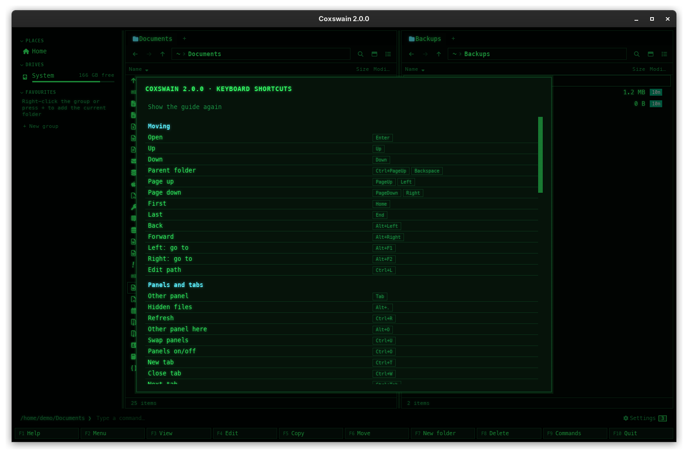

[← README](../../README.md) · [Docs index](../README.md) · [Panels and keys](README.md)

# Every default key

Every key both apps have out of the box, with the action's name in the **F9** list and the
config name that `[keys]` uses. Use it as a reference, or as the list to start from when you
[change keys](../customise/keys.md).



## Contents

- [How to use it](#how-to-use-it)
- [Moving](#moving)
- [Panels and tabs](#panels-and-tabs)
- [Marking](#marking)
- [Files](#files)
- [Archives](#archives)
- [Search](#search)
- [Git](#git)
- [Viewing and editing](#viewing-and-editing)
- [App](#app)
- [Keys that are not actions](#keys-that-are-not-actions)
- [Keys inside dialogs](#keys-inside-dialogs)
- [Settings and config.toml](#settings-and-configtoml)
- [In the terminal app](#in-the-terminal-app)
- [Questions](#questions)

## How to use it

The tables follow the groups of **F1** and **F9**, in the same order: moving first, the app
last, and in each group the most used action first. Find the key in the tables below. *Both* means the key does the same in each app; where they
differ, the columns say how. An action marked *–* in the terminal column answers there with
the status *… is available in the desktop app (coxswain-gui)*. **F1** shows the keys you have
now, and **F9** finds any action by name.

On a Mac the shortcuts are the same, with **Ctrl**, not Cmd.

## What you see

### Moving

| Key | Action (F9 name) | Config name | Desktop app | Terminal app |
|---|---|---|---|---|
| **Enter** | Open | `open` | Open a folder or archive here, a file in its program | The same; a program runs in the panel's folder |
| **Up** / **Down** | Up / Down | `up` / `down` | The cursor ([Moving around](moving.md)) | The same |
| **Ctrl+PageUp**, **Backspace** | Parent folder | `parent` | Up to the parent folder | The same |
| **PageUp**, **Left** | Page up | `page_up` | A page up (columns view: **Left** goes up; thumbnails: one tile left) | A page up |
| **PageDown**, **Right** | Page down | `page_down` | A page down (columns view: **Right** opens the folder; thumbnails: one tile right) | A page down |
| **Home** / **End** | First / Last | `home` / `end` | First / last entry | The same |
| **Alt+Left** / **Alt+Right** | Back / Forward | `back` / `forward` | The tab's history | – |
| **Alt+F1** / **Alt+F2** | Left: go to / Right: go to | `goto_left` / `goto_right` | Type a path in the left / right pane's path bar | *Left panel* / *Right panel* dialog; on FreeBSD with boot environments or jails, a list of those first ([FreeBSD](../reference/freebsd.md#boot-environments-and-jails)) |
| **Ctrl+L** | Edit path | `edit_path` | Type a path in the active pane | – |

### Panels and tabs

| Key | Action (F9 name) | Config name | Desktop app | Terminal app |
|---|---|---|---|---|
| **Tab** | Other panel | `switch_panel` | The other pane | The other panel |
| **Alt+.** | Hidden files | `toggle_hidden` | Show or hide hidden files | The same |
| **Ctrl+R** | Refresh | `refresh` | Read the panes' folders again; the status line says *Refreshed* | The same, for the panels |
| **Alt+O** | Other panel here | `same_dir` | The active pane's folder in the other pane | The same |
| **Ctrl+U** | Swap panels | `swap_panels` | Swap the panes | Swap the panels |
| **Ctrl+O** | Panels on/off | `toggle_panels` | One pane or two ([Tabs and panes](tabs-and-panes.md)) | The output of the last command |
| **Ctrl+T** | New tab | `new_tab` | A new tab in the same folder and view | – |
| **Ctrl+W** | Close tab | `close_tab` | Close the tab (the last one stays) | – |
| **Ctrl+Tab** | Next tab | `next_tab` | The next tab of the pane | – |
| **Ctrl+Shift+Tab** | Previous tab | `prev_tab` | The previous tab | – |
| **Alt+V** | Details/columns/thumbnails | `toggle_view` | The next view ([Views](views.md)) | – |
| **Ctrl+B** | Sidebar | `toggle_sidebar` | The sidebar on or off ([The sidebar](../organise/sidebar.md)) | – |
| **Ctrl+F3** | Sort by name | `sort_name` | By name; again reverses ([Sorting](sorting.md)) | The same |
| **Ctrl+F4** | Sort by extension | `sort_ext` | By extension | The same |
| **Ctrl+F5** | Sort by time | `sort_time` | By time, newest first | The same |
| **Ctrl+F6** | Sort by size | `sort_size` | By size, largest first | The same |
| – | Folder sizes | `folder_sizes` | Measure the marked folders, or all, again ([Folder sizes](folder-sizes.md)) | Measure the panel's folders again |
| – | Columns and folder sizes | `columns` | The columns menu ([Views](views.md#the-columns-menu)); also a right-click on a column header | – |

### Marking

| Key | Action (F9 name) | Config name | Desktop app | Terminal app |
|---|---|---|---|---|
| **Insert**, **Shift+Down** | Mark | `mark` | Mark and move down ([Marking files](marking.md)) | The same |
| **Ctrl+A** | Mark all | `mark_all` | Mark everything in the folder, files and folders (not `..`). In the command line, while it has text, it selects that text instead (desktop app) | The same |
| `+` | Mark group | `mark_group` | Mark files by pattern: the *Mark files* dialog | The same |
| `-` | Unmark group | `unmark_group` | Unmark files by pattern: the *Unmark files* dialog | The same |
| `*` | Invert marks | `invert_marks` | Invert the marks of files | The same |

### Files

| Key | Action (F9 name) | Config name | Desktop app | Terminal app |
|---|---|---|---|---|
| **Shift+F10**, **Menu** | What can I do with this? | `action_menu` | The actions that fit what is under the cursor ([The action menu](action-menu.md)) | The same (the Menu key where the terminal passes it on) |
| **F5** | Copy | `copy` | Copy to the other pane ([Copy](../files/copy.md)) | The same |
| **F6** | Move | `move` | Move or rename ([Move and rename](../files/move-and-rename.md)) | The same |
| **Shift+F6** | Rename | `rename` | Rename the entry under the cursor in place ([Move and rename](../files/move-and-rename.md)) | The same |
| **F8**, **Delete** | Delete | `delete` | To the trash ([Delete](../files/delete.md)) | The same |
| **F7** | New folder | `new_folder` | New folder ([New folder](../files/new-folder.md)) | The same |
| **Ctrl+C** / **Ctrl+X** / **Ctrl+V** | Copy to clipboard / Cut to clipboard / Paste | `clip_copy` / `clip_cut` / `paste` | Files through the system clipboard ([Clipboard](../files/clipboard.md)) | – |
| **Shift+F8**, **Shift+Delete** | Delete permanently | `delete_forever` | Delete for good | The same |
| **Ctrl+Z** | Undo | `undo` | Undo the last file operation ([Undo](../files/undo.md)) | The same |
| **Alt+Enter** | Properties | `properties` | Size, dates, permissions, ZFS, package, flags ([Properties](../files/properties.md)) | The same facts as text |
| **Ctrl+M** | Batch rename | `batch_rename` | Rename the marked files by pattern ([Batch rename](../files/batch-rename.md)) | – |
| **Alt+T** | Colour tag | `tag` | Tag the marked files ([Colour tags](../organise/tags.md)) | – |
| **Alt+Z** | ZFS snapshots | `snapshots` | The snapshots of the folder's ZFS dataset, as folders ([ZFS snapshots](../files/zfs-snapshots.md)) | The same |
| – | File flags | `flags` | Properties, where the flags are ticked ([File flags](../files/properties.md#zfs-packages-and-file-flags)) | A line to edit your file's user flags |
| – | Files of this package | `package` | The files of the FreeBSD package the file belongs to ([Packages](../files/properties.md#zfs-packages-and-file-flags)) | The same |

### Archives

| Key | Action (F9 name) | Config name | Desktop app | Terminal app |
|---|---|---|---|---|
| **Ctrl+E** | Extract archive | `extract` | Extract into the other pane | The same |
| **Alt+F5** | Pack into an archive | `pack` | Pack the marked files ([Pack and extract](../files/pack-and-extract.md)) | The same |

### Search

| Key | Action (F9 name) | Config name | Desktop app | Terminal app |
|---|---|---|---|---|
| **Alt+F7**, **Ctrl+F** | Find | `search` | Find; inside it, the scope: everywhere or this folder ([Find](../search/find-file.md)) | The same |
| **Shift+F7**, **Ctrl+Shift+F** | Find in files | `search_text` | Find at *In files*; inside it, *In files* ⇄ *All* ([Text in files](../search/text.md)) | The same; many terminals send Ctrl+Shift+F as Ctrl+F, so use Shift+F7 |
| **Ctrl+F7** | Ask your files | `ask` | Find at *Ask*; inside it, ask what is typed ([Ask](../search/ask.md)) | The same |
| **Ctrl+D** | Find duplicates | `duplicates` | The duplicate finder ([Finding duplicates](../files/duplicates.md)) | – |

### Git

| Key | Action (F9 name) | Config name | Desktop app | Terminal app |
|---|---|---|---|---|
| **Ctrl+G** | Git history | `history` | The commits of the file or folder under the cursor, as folders ([Git history](git-history.md)) | The same |
| **Alt+B** | Git branches | `branches` | The repository's branches, as folders ([Git branches](git-branches.md)) | The same |
| **Alt+S** | Switch to branch | `switch_branch` | In the list of branches: switch to the one under the cursor, after asking ([Switching](git-branches.md#switching-to-a-branch)) | The same |
| **Alt+W** | Git worktrees | `worktrees` | The repository's worktrees ([Worktrees](git-branches.md#worktrees)) | The same |
| – | New branch here | `new_branch` | A new branch from the one under the cursor, or from the current commit, switched to ([A new branch](git-branches.md#a-new-branch)) | The same |

### Viewing and editing

| Key | Action (F9 name) | Config name | Desktop app | Terminal app |
|---|---|---|---|---|
| **F3** | View | `view` | The preview pane on or off | The file in your viewer (`less`) ([View and edit](../commands/view-and-edit.md)) |
| **F4** | Edit | `edit` | The file in your editor | The same |
| **Space** | Preview | `toggle_preview` | The preview pane on or off ([The preview pane](../previews/README.md)) | – |
| **Ctrl+Enter**, **Ctrl+J** | Path to command line | `copy_path` | The name under the cursor to the command line | The same |
| **F2** | Menu | `user_menu` | Scripts and the user menu | The user menu ([The user menu](../commands/user-menu.md)) |
| **Alt+N** | Folder notes | `notes` | The folder's notes in the preview pane ([Folder notes](../organise/notes.md)) | – |

### App

| Key | Action (F9 name) | Config name | Desktop app | Terminal app |
|---|---|---|---|---|
| **F1** | Help | `help` | The help window; its *Show the guide again* button opens the [first-run guide](first-run.md) | The help screen ([Help](command-list.md)); **G** there opens the first-run guide |
| **F9** | Commands | `menu` | The command list | The same (the F-key bar still says *PullDn*) |
| **Ctrl+,** | Settings | `settings` | The Settings window ([Settings](../customise/settings.md)) | – |
| **F10** | Quit | `quit` | Close the window | Quit |

### Keys that are not actions

These are fixed; `[keys]` does not change them.

| Key | Desktop app | Terminal app |
|---|---|---|
| **Alt+letter** | [Quick search](quick-search.md) (letters and digits not bound to an action) | Quick search (any character not bound) |
| Other characters | Go to the command line | The same |
| **Enter** with text in the command line | Runs it; output in the preview pane ([The command line](../commands/command-line.md)) | Runs it with the panels hidden |
| **Esc** | Clears the command line; with it empty, closes the preview pane; closes a dialog | Clears the command line; closes a dialog |
| **Backspace** with text in the command line | Edits it | The same |
| **Left**, **Right**, **Home**, **End**, **Delete**, **Space** with text in the command line | Edit it | **Space** is typed; the others do nothing (the line edits at its end only), so **Delete** never deletes the entry under the cursor while you type |
| **Ctrl+C**, **Ctrl+X**, **Ctrl+V** with text in the command line | Copy, cut and paste text | – |
| **Left** / **Right** in the columns view | Up / into the folder | – |
| Arrows in thumbnails | Move in two dimensions | – |

### Keys inside dialogs

| Dialog | Keys |
|---|---|
| Any prompt (copy, move, new folder, go to, mark group, password) | **Enter** does what the button says (*Copy*, *Move*, *Create*, *Go*, *Mark*, *Unlock* …), **Esc** cancels; the line under the buttons says so: *Enter Copy · Esc Cancel*. Terminal app: **Backspace** deletes, **Ctrl+U** clears the line, **F10** cancels too |
| Pack (**Alt+F5**) | Desktop app: the *Format* list next to the name swaps its ending. Terminal app: **Tab** the next format's ending, **Shift+Tab** the previous one ([Pack and extract](../files/pack-and-extract.md#formats)) |
| Delete confirmation | **Enter** or **Y** deletes, **Esc** or **N** cancels; the line under it says *Enter Delete · Esc Cancel* (*Enter Move to bin* when it goes to the bin) |
| Find | Type to search, **Tab** the next kind, **Up** / **Down** / **PageUp** / **PageDown** move, **Enter** goes to the hit, **Ctrl+Enter** asks (terminal: **Alt+Enter**), **F1** the syntax, **F4** edits, **Esc** back or close; terminal app also **F3** views it ([Find](../search/find-file.md)) |
| First-run guide | Desktop app: **Enter** next, **Esc** skips, *Back* / *Next* / *Done*. Terminal app: **Up** / **Down** choose, **Space** or **Left** / **Right** change, **Enter** next, **Backspace** back, **Esc** skips ([First-run guide](first-run.md)) |
| Command list (**F9**), columns menu | Type to filter, **Up** / **Down**, **Enter** runs, **Esc** closes |
| User menu (**F2**) | An entry's own key runs it at once; **Up** / **Down** and **Enter** too; **Esc** closes |
| Colour tag (**Alt+T**, desktop app) | **1** to **7** a colour, **0** removes the tag, **Esc** closes |
| Help (**F1**) | Desktop app: **Esc**, **Enter** or **F1** closes; *Show the guide again* opens the first-run guide. Terminal app: **Up** / **Down** / **PageUp** / **PageDown** scroll, **G** opens the first-run guide, any other key closes |
| Error message | Titled with what failed (*Could not copy budget.txt*), the cause in one line, the raw text under *Details*; the line under it says *Enter Close*. Desktop app: **Enter** or **Esc**. Terminal app: any key |
| After a program or a waiting command (terminal app) | **Enter** at `-- press Enter --` |
| **Ctrl+O** output (terminal app) | Any key back to the panels |

## Settings and config.toml

Every action above is a key under `[keys]` in `config.toml`, with a list of keys:

```toml
[keys]
search = ["Ctrl+P"]        # replaces Alt+F7 and Ctrl+F
tag = []                   # unbinds Alt+T, freeing it for quick search
folder_sizes = ["Ctrl+Q"]  # gives Folder sizes a key
```

Listing an action replaces its default keys; `[]` unbinds it. Key names are written as in the
tables (`Ctrl+Shift+Tab`, `Alt+.`, `F5`, `Space`). `coxswain --dump-config` prints every
action with its default keys. The rules and names: [Changing keys](../customise/keys.md) and
[Configuration](../reference/configuration.md).

## In the terminal app

It has every action whose *Terminal app* column is not *–*. The desktop-only ones answer with *… is
available in the desktop app (coxswain-gui)* in the status line, because they need what a
terminal lacks: tabs, a preview pane, a sidebar, pictures, the system clipboard. Keys the
terminal itself takes do not reach it: many terminals send **Ctrl+Enter** as plain **Enter**,
which is why **Ctrl+J** does the same; some keep **Ctrl+F3** to **Ctrl+F6** or **Alt+letter**
for themselves.

## Questions

#### How do I change a key?

In `config.toml`, under `[keys]`: `search = ["Ctrl+P"]`. Listing an action replaces its
default keys; `[]` unbinds it. See [Changing keys](../customise/keys.md).

#### My `[keys]` line `mkdir = ["F7"]` stopped working. Why?

2.0 gave five actions the words the apps use: `mkdir` is `new_folder`, `dir_sizes` is
`folder_sizes`, `select_group` / `unselect_group` / `invert_selection` are `mark_group` /
`unmark_group` / `invert_marks`. On its first start 2.0 renames them in `config.toml` for you,
comments kept, and a notice lists what it changed. An old name typed in afterwards is an
unknown action: the terminal app does not start and names it, the desktop app starts with the
defaults. See [Renamed in 2.0](../reference/configuration.md#renamed-in-20).

#### Why does the F-key bar say *Move* in the desktop app and *RenMov* in the terminal app?

The desktop app's bar uses the action names of **F9** and **F1**: *Move*, *New folder*,
*Commands*. The terminal app keeps Norton Commander's short labels on its bar, *RenMov*,
*Mkdir* and *PullDn*, but its **F9** list and **F1** use the same names as the desktop app.

#### I bound a key and now the desktop app ignores my whole config. Why?

A key it cannot read (`"Ctlr+P"`) makes the config invalid. The terminal app refuses to start
and says `coxswain: unknown key 'Ctlr+P'`; the desktop app starts with every default and
prints the error on its terminal. Fix the name and restart.

#### Why does Ctrl+C in the command line copy text, not files?

While the command line has text, **Ctrl+C**, **Ctrl+X** and **Ctrl+V** edit it, as in any text
field. With the command line empty they copy, cut and paste files.

#### Space in the terminal app says "Preview is available in the desktop app". Why?

**Space** is bound to the preview pane, which the terminal app does not have. With text in the
command line, **Space** is typed as usual. Unbind it (`toggle_preview = []`) to silence the
message.

#### Why is F3 the preview in the desktop app, not a viewer?

NC's **F3** showed the file; the preview pane does that in place, and **Esc** or **F3** again
closes it. For a file in your own viewer, use a [script](../commands/scripts.md) or open it
with **Enter**.

#### Why are the shortcuts Ctrl on a Mac, not Cmd?

Both apps read the same `[keys]`, and Norton Commander's keys are Ctrl keys. `[keys]` knows
Ctrl, Alt and Shift, not Cmd. Cmd-click still marks, as in other Mac apps.

#### Two actions have the same key. Which one wins?

One key drives one action. When two actions list the same key, the one that comes later in
the `[keys]` part of `coxswain --dump-config` takes it, and **F1** in the desktop app shows the
key only there. Give each key to one action only.

#### Can a key run a shell command?

Not from `[keys]`. Put the command in the [user menu](../commands/user-menu.md) (**F2** and a
letter) or a [script](../commands/scripts.md).

---
[← Previous: What the apps remember](session.md) · [Next: Tags, notes, favourites and the sidebar →](../organise/README.md)
