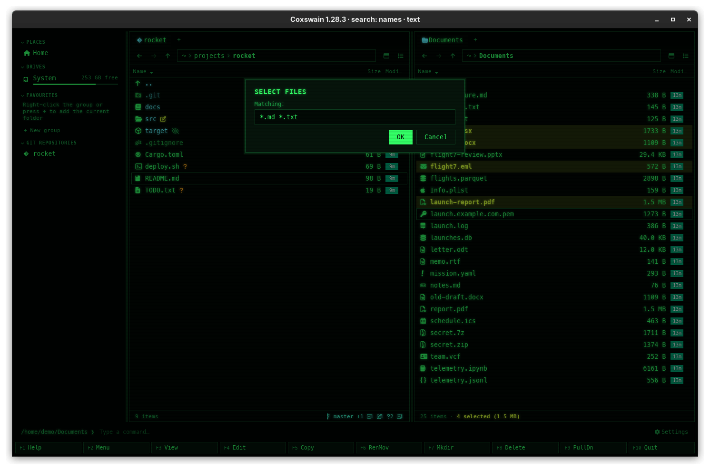

[← README](../../README.md) · [Docs index](../README.md) · [Panels and keys](README.md)

# Marking files

Mark the files you want to work on, then copy, move, delete, tag, rename or run a script on
all of them at once. With nothing marked, those actions work on the entry under the cursor.

## How to use it

| Key | Does |
|---|---|
| **Insert**, **Shift+Down** | Mark or unmark the entry under the cursor, then move down |
| `+` | *Select group*: a dialog asks for patterns (`*` to start with); files that match are marked |
| `-` | *Unselect group*: the same, unmarking |
| `*` | Invert the marks of all files (folders keep theirs) |

Marking a group:

1. Press `+` (with the command line empty).
2. Type one or more patterns, separated by spaces, commas or semicolons: `*.jpg *.png`.
3. Press **Enter**. Every file whose whole name matches one of them is marked, whatever its
   case. **Esc** cancels.

Patterns: `*` stands for any number of characters, `?` for one. `IMG_????.jpg` matches
`IMG_0042.jpg`. Groups mark files only, never folders.

With the mouse ([The mouse](mouse.md)):

| Mouse | Desktop app | Terminal app |
|---|---|---|
| Right-click | Marks or unmarks (details and thumbnails views) | Marks or unmarks |
| Ctrl-click (Cmd-click on a Mac) | Marks or unmarks, in every view | – |
| Shift-click | Marks the range from the cursor to the click (details view) | – |

## What you see

- Marked entries are drawn in the `marked` colour: bold yellow in NC and most themes. The
  cursor on a marked entry uses `marked_cursor`.
- The terminal app's info line, centred under the list: `4.2 MB in 3 selected`.
- The desktop app's pane footer: `17 items · 3 selected (4.2 MB)`.
- The dialog: *Select* / *Unselect* with *Files matching:* in the terminal app; *Select
  files* / *Unselect files* with *Matching:* in the desktop app.

What uses the marks: **F5** copy, **F6** move, **F8** / **Shift+F8** delete, **Alt+F5**
pack, **Ctrl+E** extract, **Ctrl+C** / **Ctrl+X** (desktop app), **Alt+T** colour tag,
**Ctrl+M** batch rename, the *Folder sizes* command, drags of a marked entry, and `%s` in
[scripts and the user menu](../commands/user-menu.md).

Marks go when you leave the folder, and after a copy, move, delete, pack or extract. A reread
(**Ctrl+R**, or the desktop app seeing a change) keeps the marks of entries still there.

## Settings and config.toml

| Action | Config name | Default keys |
|---|---|---|
| Mark | `mark` | `Insert`, `Shift+Down` |
| Select group | `select_group` | `+` |
| Unselect group | `unselect_group` | `-` |
| Invert selection | `invert_selection` | `*` |

`+`, `-` and `*` only fire while the command line is empty, as in NC; otherwise they are typed
into it. The marked colour is the `marked` slot of the theme ([Your own theme](../customise/own-theme.md)).

## In the terminal app

The same keys and patterns. It has no Ctrl-click or Shift-click, and its selected total
counts the sizes of marked files only: a marked folder adds nothing, even when its size is
shown. The desktop app adds a marked folder's size once it is measured.

## Questions

#### Why did `+` not mark any folders?

Groups mark files only, as in NC. Mark folders one by one with **Insert** or a right-click.

#### Why does typing `+` go to the command line?

The command line has text, and plain characters go to it. Press **Esc** to clear it first.

#### How do I mark every file?

With nothing marked, press `*`: every file is inverted, so all files are marked. Or `+` and
**Enter** with the `*` it offers.

#### How do I mark files and folders together?

`*` or `+` for the files, then **Insert** on each folder you want too. `..` can never be
marked.

#### The selected total in the terminal app is smaller than in the desktop app. Why?

The terminal app sums the sizes of marked files; marked folders count nothing there. The
desktop app adds each marked folder's measured size.

#### Where did my marks go?

You left the folder, or an operation finished: both clear the marks, as in NC. Switching
tabs in the desktop app keeps each tab's marks.

#### Right-click does not mark in the columns view. Why?

The columns view marks with Ctrl-click (Cmd-click on a Mac) only. Right-click marks in the
details and thumbnails views, and in the terminal app.

#### Does `?` match a letter like "æ" in the terminal app?

In the desktop app yes. In the terminal app `?` matches one byte, so a letter outside ASCII
needs `??` or `*`.

---
[← Previous: Quick search](quick-search.md) · [Next: Sorting and hidden files →](sorting.md)
