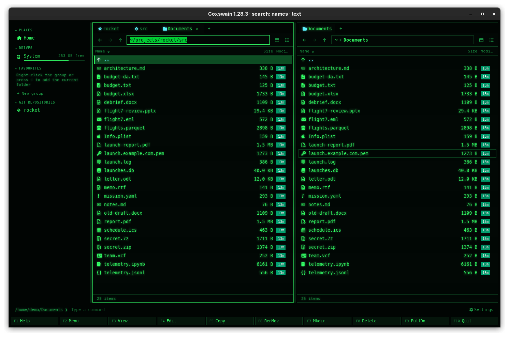

[← README](../../README.md) · [Docs index](../README.md) · [Panels and keys](README.md)

# Moving around and going to a folder

The cursor keys move in the active panel, **Enter** opens, **Backspace** goes up, and **Tab**
goes to the other panel. To jump somewhere far away, type the path: **Alt+F1** and **Alt+F2**
in both apps, **Ctrl+L** in the desktop app, or `cd` on the command line.

## How to use it

### Moving in a panel

| Key | Does |
|---|---|
| **Up** / **Down** | The cursor up or down one entry |
| **PageUp** / **PageDown**, **Left** / **Right** | A page up or down |
| **Home** / **End** | The first / last entry |
| **Enter** | Open: a folder or an archive opens in the panel; a file opens in its program |
| **Backspace**, **Ctrl+PageUp** | Up to the parent folder; the cursor lands on the folder you came from |
| **Tab** | The other panel becomes active |
| **Ctrl+U** | Swap the two panels |
| **Alt+O** | Show the active panel's folder in the other panel too |
| **Ctrl+R** | Reread both panels (their folders, git and sizes); the status line says *Reread* |

In the desktop app's **Miller columns** view, **Left** goes up and **Right** opens the folder
under the cursor; in **thumbnails** the four arrows move in two dimensions
([Views](views.md)).

### What Enter does

| Under the cursor | Terminal app | Desktop app |
|---|---|---|
| A folder | Opens it in the panel | The same |
| An archive (`.zip`, `.tar.gz`, `.7z`, …) | Opens it like a folder ([Archives as folders](../files/archives.md)) | The same |
| A file inside an archive | Status: `tools.zip is an archive: F5 copies this file out of it` | The same |
| A program (executable) | Runs `./name` in the panel's folder, with the panels hidden, then waits for `-- press Enter --` | Hands it to the desktop, like any file |
| Any other file | Opens it in its default program; status `Opened name` | The same |

More on this: [Opening files](../commands/opening-files.md).

### Going to a folder

| Key | Terminal app | Desktop app |
|---|---|---|
| **Alt+F1** | Dialog *Left panel*, *Go to folder:*, filled in with the left panel's folder | The left pane's path bar turns into a text field with its path selected |
| **Alt+F2** | Dialog *Right panel*, the same for the right panel | The same for the right pane |
| **Ctrl+L** | – | The active pane's path bar turns into a text field |

1. Press the key.
2. Type a path. `~` is your home folder; a relative path starts from a folder (see the
   [question](#which-folder-does-a-relative-path-start-from)).
3. Press **Enter** to go there, or **Esc** to leave the panel as it was. In the terminal
   app's dialog, **Ctrl+U** clears the line.

Other ways:

- Type `cd path` on the command line and press **Enter**; `cd` alone goes home
  ([The command line](../commands/command-line.md)).
- Desktop app: click a part of the path bar to go there, or empty space in it to type a path.
  The buttons left of it are **Back**, **Forward** and **Up** ([Tabs, back and forward](tabs-and-panes.md)).
- Desktop app: the [sidebar](../organise/sidebar.md) (**Ctrl+B**) has places, drives,
  favourites and recent git repositories.
- [Find file](../search/find-file.md) (**Alt+F7**, **Ctrl+F**): **Enter** on a hit opens its
  folder with the cursor on it.

## What you see

- Going up, the cursor lands on the folder you came from, as in NC.
- A path that is not a folder: the terminal app says `Not a folder: /tmp/x` (from `cd`:
  `cd: no such folder: x`); the desktop app stays where it is and puts the error in the status
  line.
- Rereading: the cursor stays on the same name, marks on files that are still there stay.
- Both apps reread a folder by themselves when something in it changes (see the questions).

## Settings and config.toml

None of their own. Every key above is an action in `[keys]`:

| Action | Config name | Default keys |
|---|---|---|
| Up / Down | `up` / `down` | `Up` / `Down` |
| Page up / Page down | `page_up` / `page_down` | `PageUp`, `Left` / `PageDown`, `Right` |
| First / Last | `home` / `end` | `Home` / `End` |
| Open | `open` | `Enter` |
| Parent dir | `parent` | `Ctrl+PageUp`, `Backspace` |
| Other panel | `switch_panel` | `Tab` |
| Swap panels | `swap_panels` | `Ctrl+U` |
| Other panel here | `same_dir` | `Alt+O` |
| Reread | `refresh` | `Ctrl+R` |
| Left: go to / Right: go to | `goto_left` / `goto_right` | `Alt+F1` / `Alt+F2` |
| Edit path | `edit_path` | `Ctrl+L` (desktop app) |

See [Changing keys](../customise/keys.md).

## In the terminal app

The same keys, with three differences: **Enter** runs programs itself; **Alt+F1** and
**Alt+F2** open a small dialog instead of a path bar; and there is no **Ctrl+L**, no path bar
to click, no history (**Alt+Left**) and no sidebar, because the terminal app has one folder
per panel and no tabs. It rereads after its own operations, after a command, and on
**Ctrl+R**, not when something outside changes a folder.

## Questions

#### Why do Left and Right page instead of moving into folders?

That is Norton Commander's way. Rebind them if you prefer:
`[keys] parent = ["Left", "Backspace"]` and `open = ["Right", "Enter"]`, and take them out of
`page_up = ["PageUp"]` and `page_down = ["PageDown"]`. In the desktop app's columns view they
already walk the tree.

#### Do the panels follow changes on disk?

Yes. The desktop app watches every folder open in a tab and rereads it within a quarter of a
second of a change. The terminal app watches the folders of its two panels and their
repository's `.git`, and rereads a panel once the changes have settled (a quarter of a second
without another, or every two seconds while they keep coming); the git line follows. Both also
reread after their own operations and on **Ctrl+R**.

#### Which folder does a relative path start from?

The folder of the pane or panel you are typing for: the left one's after **Alt+F1**, the
right one's after **Alt+F2**. Type a full path or one starting with `~` to be sure.

#### What happens when I type a folder that does not exist?

The terminal app says `Not a folder: …` in the status line and the panel stays. The desktop
app stays where it is and shows the error in the status line.

#### Enter on a program did nothing in the desktop app. Why?

The desktop app hands every file to the desktop, which decides what to do with programs;
many desktops will not start them. Run it from the command line instead: type `./name` and
press **Enter**; the output shows in the preview pane.

#### How do I get the same folder in both panels?

**Alt+O** shows the active panel's folder in the other panel. **Ctrl+U** swaps the two.

#### How do I get home quickly?

Type `cd` and **Enter**, or **Alt+F1**, `~`, **Enter**. In the desktop app, the `~` part of
the path bar and *Home* in the sidebar go there too.

#### Backspace deletes a character instead of going up. Why?

The command line has text, and while it does, **Backspace** edits it. Press **Esc** to clear
the command line.

---
[← Previous: The screen](the-screen.md) · [Next: Quick search →](quick-search.md)
