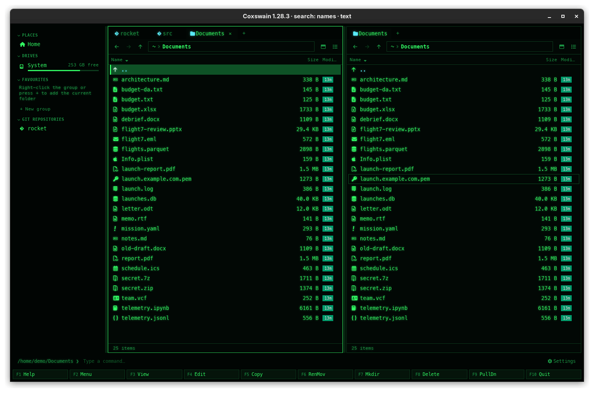

[← README](../../README.md) · [Docs index](../README.md) · [Panels and keys](README.md)

# Tabs, back and forward, one pane or two

In the desktop app each pane has tabs, each with its own folder, view, sort order and
history, so you can keep several places open and step back through where you have been.
**Ctrl+O** shows one pane or two; in the terminal app it shows the output of the last command.

## How to use it

### Tabs (desktop app)

| Key | Mouse | Does |
|---|---|---|
| **Ctrl+T** | The `+` after the tabs | New tab, in the same folder and view |
| **Ctrl+W** | The `×` on a tab, or a middle click on it | Close the tab (the last one of a pane stays) |
| **Ctrl+Tab** / **Ctrl+Shift+Tab** | A click on a tab | Next / previous tab of the active pane |

### Back and forward (desktop app)

| Key | Mouse | Does |
|---|---|---|
| **Alt+Left** | The `←` button left of the path bar | Back to the folder before, in this tab |
| **Alt+Right** | The `→` button | Forward again |
| **Backspace** | The `↑` button | Up to the parent folder (this is a step in the history too) |

Every change of folder in a tab is a step: **Enter**, **Backspace**, a path typed, the
sidebar, Find. Going back and then somewhere new drops the forward steps, as in a web
browser.

### One pane or two

| | Desktop app | Terminal app |
|---|---|---|
| **Ctrl+O** | Switches between two panes and one; also the button at the right of the path bar (*One pane (Ctrl+O)* / *Two panes (Ctrl+O)*) | Hides the panels and shows the terminal with the output of the last command, as NC did; any key brings the panels back |
| Sharing the width | Drag the bar between the panes: from 20% to 80% | Always half and half |

## What you see

- A tab shows the folder's name, with the folder's path as its tooltip. A tab whose folder is
  in a git repository gets the git icon instead of the folder icon.
- The current tab is drawn in the `tab_active` colours, the others in `tab`.
- The back and forward buttons are greyed when there is nothing to go to.
- With one pane, the active pane fills the width and **Tab**, **Alt+O** and swapping have
  no other pane to act on.

## Settings and config.toml

No settings. The keys:

| Action | Config name | Default keys |
|---|---|---|
| New tab | `new_tab` | `Ctrl+T` |
| Close tab | `close_tab` | `Ctrl+W` |
| Next tab / Previous tab | `next_tab` / `prev_tab` | `Ctrl+Tab` / `Ctrl+Shift+Tab` |
| Back / Forward | `back` / `forward` | `Alt+Left` / `Alt+Right` |
| Panels on/off | `toggle_panels` | `Ctrl+O` |

The tabs, their folders, views and orders, one or two panes and the split are kept in the
session ([What the apps remember](session.md)); the history is not.

## In the terminal app

No tabs and no history: a terminal is narrow, one folder per panel keeps it as NC was, and
**Alt+F1**/**Alt+F2** or `cd` get you anywhere. **Ctrl+T**, **Ctrl+W**, **Ctrl+Tab**,
**Alt+Left** and **Alt+Right** say *… is available in the desktop app (coxswain-gui)*.
**Ctrl+O** shows the terminal behind the panels, where commands you ran from the command line
left their output.

## Questions

#### Are tabs coming to the terminal app?

Not planned. Two panels with one folder each is the terminal app's layout; for more places at
once, run it in several terminal tabs.

#### Where do F5 and F6 copy to with one pane?

To the folder of the pane you see: the dialog offers that folder, and you type another one
there. With two panes they offer the other pane's folder.

#### Does a tab keep its place when I switch away and back?

Yes: each tab keeps its cursor and, in the desktop app's details view, how far it is scrolled.
The terminal app has one panel per side and keeps the cursor.

#### Is the back history kept after a restart?

No. The tabs and their folders come back, but each tab starts with an empty history.

#### How do I close a tab with the mouse?

Click its `×` (shown when the pane has more than one tab), or click it with the middle button.

#### Can I move a tab to the other pane?

No. Open a new tab there (**Tab**, then **Ctrl+T**) and go to the folder, or press **Alt+O**
to show the active pane's folder in the other pane.

#### Why does Ctrl+O in the terminal app show an empty screen?

It shows what the terminal had before the panels: the output of commands run from the
command line, or nothing when none ran yet. Press any key to return.

#### Why does Ctrl+Tab switch tabs only in one pane?

It cycles the tabs of the active pane. Press **Tab** to make the other pane active first.

---
[← Previous: Sorting and hidden files](sorting.md) · [Next: Views: details, columns, thumbnails →](views.md)
