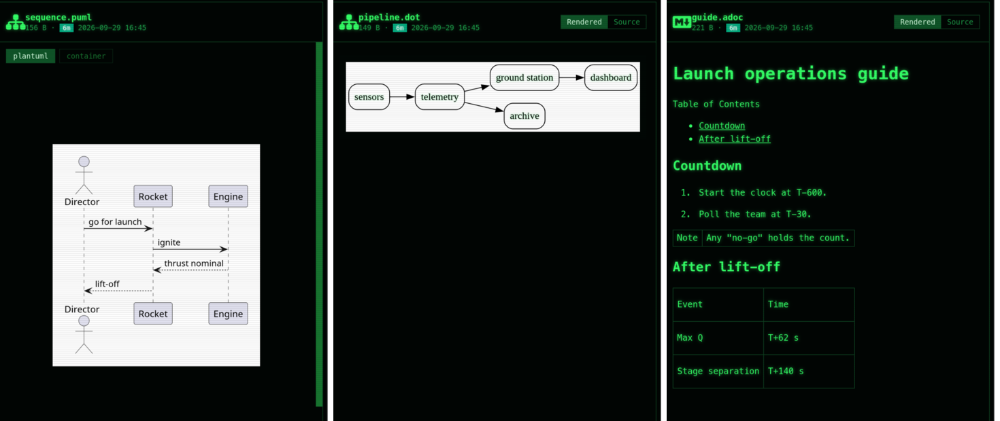
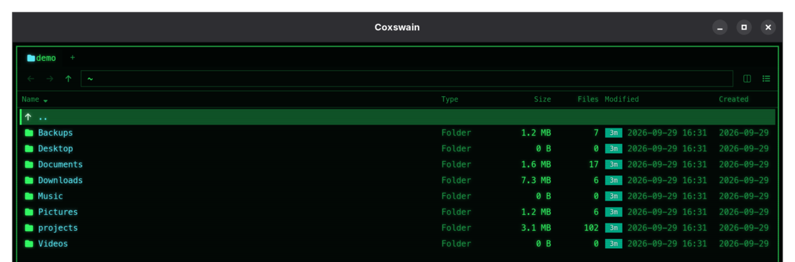

# The preview pane

The desktop app's preview pane (**Space**, or F3) shows the file or folder under the cursor
and follows it as you move. It waits a moment before loading, so holding an arrow key stays
smooth. This page covers everything it can show, the switches at its top, and the limits. The
terminal app has no preview pane: F3 opens the file in your viewer (`viewer` in the config,
else `$PAGER`, else `less`).





## Switches

Where a file can be shown more than one way, buttons at the top right of the preview choose.
Your choice sticks: it applies to the next file of that kind too, and survives a restart.

| Switch | Shown for | Choices |
|---|---|---|
| **File / Diff** | Files git sees as changed (modified, staged, renamed, deleted, conflicted) | The file, or `git diff HEAD` for it: staged and unstaged changes together, added lines green, removed lines red |
| **Rendered / Source** | Markdown, Mermaid, calendars, contacts | The rendered view, or the highlighted source |
| **Tree / Source** | JSON, YAML, TOML | A collapsible tree (the first two levels open), or the source |
| **Table / Source** | JSON Lines | A table, or the source |
| **Sheet names** | Workbooks with more than one sheet | One button per sheet |
| **Engine** | Files made by an external tool (LaTeX, Office, PlantUML, ...) | The installed programs and the container, e.g. **latexmk · tectonic · podman texlive**; see [Previews made by tools](#previews-made-by-tools) |

## Formats

### Text and code

| Files | Preview |
|---|---|
| Source code, config, plain text | Syntax highlighted by [highlight.js](https://highlightjs.org/) (its "common" set of about 36 languages). The language comes from the extension, otherwise it is detected. Colors come from the current theme, so every theme matches |
| `.log` | Each line colored by its level: errors red, warnings yellow, info green, debug grey |
| Binary files | A hex dump |

The first 512 KB is shown. Files under 200 KB are highlighted; larger ones stay plain so
scrolling stays smooth.

### Documents

| Files | Preview | Done by |
|---|---|---|
| `.md`, `.markdown` | Rendered Markdown, with ```` ```mermaid ```` blocks drawn as diagrams and `$…$` / `$$…$$` math typeset | [marked](https://marked.js.org/), [Mermaid](https://mermaid.js.org/), [KaTeX](https://katex.org/) |
| `.mmd`, `.mermaid` | The diagram | Mermaid |
| `.ipynb` | Jupyter notebook: Markdown cells, highlighted code with its `In [n]` number, and outputs (text, errors, tables, PNG and SVG plots) | marked, highlight.js |
| `.docx` | The Word document: headings, paragraphs, lists, tables and embedded images | [mammoth](https://github.com/mwilliamson/mammoth.js) |
| `.pdf` | The PDF, with paging and zoom | The webview's own PDF viewer |
| `.epub` | The book's title and its first chapter with real text (covers and title pages are skipped) | Read in Rust |
| `.eml` | Subject, sender, recipients, date, attachments with sizes, and the text of the message | [mail-parser](https://crates.io/crates/mail-parser) |
| `.adoc`, `.asciidoc` | Rendered AsciiDoc (headings, lists, tables, admonitions, table of contents); **Rendered / Source** | [Asciidoctor.js](https://asciidoctor.org/), in secure mode (no file includes) |
| `.dot`, `.gv` | The Graphviz graph | [Graphviz](https://graphviz.org/) compiled to WebAssembly ([viz.js](https://github.com/mdaines/viz-js)); nothing to install |

### Data

| Files | Preview | Done by |
|---|---|---|
| `.json`, `.geojson`, `.yaml`, `.yml`, `.toml` | A collapsible tree with counts per level; strings, numbers and booleans colored | Built in, [yaml](https://eemeli.org/yaml/), [smol-toml](https://github.com/squirrelchat/smol-toml) |
| `.jsonl`, `.ndjson` | The first 200 lines as a table, one column per key | Built in |
| `.csv`, `.tsv`, `.xlsx`, `.xlsm`, `.xls`, `.ods` | The first 200 rows as a table, with a button per sheet | [SheetJS](https://sheetjs.com/) |
| `.db`, `.sqlite`, `.sqlite3`, `.db3` | Every table and view with its row count; click a name for its schema | [SQLite](https://sqlite.org/), opened read-only |
| `.parquet`, `.pq` | Row and column counts, the first 200 rows, and the schema (click **Schema**) | [hyparquet](https://github.com/hyparam/hyparquet), with Snappy, Gzip, Zstd, Brotli and LZ4; nothing to install |
| `.ics` | The events: title, start and end, place, description | Built in |
| `.vcf` | The contact cards: name, title, organization, e-mail, phone | Built in |
| `.plist` | Binary or XML property lists, as XML | [plist](https://crates.io/crates/plist) |

### Media and files

| Files | Preview |
|---|---|
| Images (`png jpg gif webp bmp ico svg avif`) | The image on a checkerboard, plus its EXIF facts |
| Video (`mp4 webm mkv mov m4v ogv`) | A player |
| Audio (`mp3 flac wav ogg m4a opus aac`) | A player, plus its tags |
| Fonts (`.ttf`, `.otf`, `.woff`, `.woff2`) | Sample text at several sizes, the alphabet, digits and some accented letters |
| `.pem`, `.crt`, `.cer`, `.der` | Each certificate in the file (a chain shows all of them): subject, issuer, validity, the names it covers, serial number. Expiry within 30 days shows in yellow, an expired certificate in red |
| `.zip`, `.jar`, `.apk`, `.nupkg`, `.whl`, `.vsix`, `.tar`, `.tar.gz`, `.tgz` | The list of files inside. **Ctrl+E** extracts into a new folder in the other pane; it never writes over an existing folder or outside it |
| Folders | Number of folders and files, the size of the files directly inside, the newest change, the total size, and the git line |

### Facts

Under the preview, some files get a short list of facts:

- **Photos:** camera, lens, date taken, exposure, aperture, ISO, focal length, and GPS
  position as decimal degrees (paste them into any map).
- **Audio:** title, artist, album, year, track, genre, length, bitrate, sample rate, channels.
- **Programs and libraries:** the platform and CPU they are built for (Linux ELF, Windows PE,
  macOS Mach-O including universal binaries; x86, x86-64, ARM, ARM64, RISC-V and more) and
  what they are (program, windowed or console program, shared library, object file).

## Previews made by tools

Some formats need a real program: a TeX distribution, LibreOffice, PlantUML. Coxswain uses one
that is installed, or runs it in a **container** (podman or docker), so nothing has to be
installed for a preview you only need now and then.

| Files | Tool | Installed programs it looks for | Container image (default) | Result |
|---|---|---|---|---|
| `.tex`, `.ltx` | LaTeX | `latexmk`, `tectonic`, `pdflatex` | `docker.io/texlive/texlive:latest` (about 5 GB) | PDF |
| `.doc` `.docm` `.dotx` `.odt` `.ott` `.rtf` `.ppt` `.pptx` `.pps` `.ppsx` `.pot` `.potx` `.odp` `.otp` `.odg` `.vsd` `.vsdx` `.pub` `.wpd` `.wps` | LibreOffice | `soffice` (also its usual macOS and Windows install folders) | none; set one you trust | PDF |
| `.puml`, `.plantuml`, `.pu`, `.iuml`, `.wsd` | PlantUML | `plantuml` | `docker.io/plantuml/plantuml:latest` | SVG |
| `.rst`, `.rest` | pandoc | `pandoc` | `docker.io/pandoc/core:latest` | HTML |
| `.duckdb`, `.ddb` | DuckDB | `duckdb` | none; set one you trust | Tables, row estimates, column counts |

### How it works

1. **Pick an engine.** The buttons at the top of the preview list the installed programs and
   the container, e.g. **latexmk · podman texlive:latest**. Unavailable ones are greyed out;
   hover for the reason ("tectonic is not installed", "No image for duckdb"). Your pick is
   remembered per tool.
PowerPoint decks (`.pptx`, `.pptm`, `.ppsx`, `.potx`) need nothing installed to be seen: they
are drawn in the app at once by [pptx-to-html](https://github.com/javier-mora/pptx-to-html)
(MIT), with their layout, text, pictures and tables; not every font, colour scheme, effect or
chart. With LibreOffice installed (or a LibreOffice container image set), the exact rendering
runs meanwhile and takes the quick view's place when it is ready.

2. **Render.** LaTeX waits for **Build PDF**, because a build takes long and runs someone
   else's document. The others run by themselves; LibreOffice once a file has stayed selected
   for a moment, so moving through a folder of slides does not start one per file. None runs
   by itself while its container image still has to be pulled.
3. **Reuse.** Results are cached in the cache folder (`~/.cache/coxswain/previews` on Linux),
   keyed by the file's path, size, modification time and the engine. A file renders once and
   shows at once afterwards; editing it makes the next render fresh.
4. **Errors** show in the preview. For LaTeX that is the first `!` error from the log with
   its context, e.g. `! Undefined control sequence.` and the offending line.

### LaTeX projects

Coxswain works out what a LaTeX editor would, so a document that builds in LaTeX Workshop,
TeXShop or TeXstudio builds here, from whichever of its files the cursor is on:

| | |
|---|---|
| **The document** | The file itself if it has a `\documentclass`; else the file named by `% !TEX root = ../main.tex` in its first lines; else the document in its folder, or up to two folders above, that includes it |
| **The project** | The git repository the document is in; without one, as far up as the document's own `../` paths reach (three folders at most, never your home folder). A container sees this folder, read-only, and builds from the document's folder, so `\includegraphics{../figures/plot}` works |
| **The engine** | `% !TEX program = xelatex` or `lualatex` in the document's first lines; pdfLaTeX otherwise. A `latexmkrc` next to the document is honored by latexmk as always |
| **A fresh build** | Whenever a file in the document's folder or below has changed: a chapter, a picture, the bibliography |

Still not possible, on purpose: `-shell-escape` (so no `minted`), and packages that write
next to the source (the source is read-only; results go to the cache).

### Containers

- **Chosen by the config.** Containers run with podman, or docker where podman is missing
  (`container` below).
- **No network:** `--network=none`.
- **The file's folder is mounted read-only at `/src`.** Nothing in your folder can be
  changed. For LaTeX it is the whole project (see [LaTeX projects](#latex-projects)), so
  chapters, pictures and the bibliography are found.
- **Results only go to a fresh folder in the cache,** mounted at `/out`. With rootful docker
  the container runs as your user, so the cache gets no root-owned files.
- **No SELinux relabeling** (`--security-opt label=disable`), so your folders' labels are
  never changed.
- **The first run pulls the image.** The engine button says so beforehand ("First run pulls
  docker.io/texlive/texlive:latest (about 5 GB)"), and while it downloads the preview shows
  the runtime's own progress line.
- **Settings lists the images** under *Previews made by tools*: each with its size, **Pull**
  to download it ahead of time or update it to the newest, and **Remove** to free the space.
  Coxswain never updates or removes an image by itself.
- **A run that takes longer than the timeout** (120 s by default) is stopped and its
  container killed. Pulling is not counted.
- LaTeX runs without `-shell-escape`, so a document cannot run commands.

### Configuration

```toml
[preview]
prefer = "container"     # "auto" (installed program first, else container), "local", "container"
container = "podman"     # "auto" (podman, else docker), "podman", "docker", "off"
timeout = 120            # seconds per conversion

[preview.prefer_tool]    # per tool, overrides prefer
libreoffice = "local"

[preview.images]         # "" means that tool never uses a container
latex = "docker.io/texlive/texlive:latest"   # or :latest-medium, about 2 GB
plantuml = "docker.io/plantuml/plantuml:latest"
pandoc = "docker.io/pandoc/core:latest"
libreoffice = ""
duckdb = ""
```

LibreOffice and DuckDB have no official images. If you set one, it must provide the command
Coxswain runs: `soffice` for LibreOffice; for DuckDB, the image's entry point must be `duckdb`
itself.

draw.io diagrams (`.drawio`, `.dio`) need no tool: draw.io's own viewer, which ships inside
Coxswain, draws them in the preview, with a page switcher, zoom and layers. It works offline,
so shapes from draw.io's extra libraries (AWS, Azure, Cisco, …), which it would fetch from
diagrams.net, show as plain boxes.

## Columns and folder sizes

Right-click the column header in the details view, or pick **Columns and folder sizes** in
F9, to choose the columns:

| Column | Shows |
|---|---|
| Type | The extension, or "Folder" |
| Size | File size; for folders, once measured |
| Files | For folders: how many files are inside, all levels down |
| Modified | The age chip (red within the hour, fading to grey after a year) and the date |
| Created | The creation date, where the file system records it |

**Folder sizes fill themselves in.** Both apps measure the folders of a folder as it opens,
in the background: one at a time so the first appear quickly, on two threads so the machine
stays responsive, and stopping when you leave the folder. A size is remembered for five
minutes, so going back shows it at once; copying, moving or deleting with Coxswain, or a change
in a folder on screen, measures afresh. `/proc`, `/sys`, `/dev` and `/run` are skipped.
**Measure folder sizes automatically**, in the same menu, switches it off and on in the
desktop app; `folder_sizes = false` in `config.toml` does for the terminal app, and is where
the desktop app starts. **Folder sizes** in the F9 list measures afresh, now.
Narrow panes drop columns: Type, Files and
Created first, then the date part of Modified, then Size.



## Safety

Previews show other people's files, so:

- Every rendered result is HTML sanitized with [DOMPurify](https://github.com/cure53/DOMPurify)
  before it reaches the page. That covers Markdown, notebooks, Word documents, EPUB chapters
  and HTML notebook outputs. Scripts never run.
- Mermaid runs with `securityLevel: "strict"`.
- SQLite databases open read-only, and counting rows stops after about a second per table.
- Previews never write anything. The only thing that does is extracting an archive, and only
  when you press Ctrl+E.
- Nothing is sent over the network; every library is bundled with the app. Tool previews run
  local programs or network-less containers ([above](#containers)); only pulling a container
  image, which the engine button announces first, downloads anything.

## Speed

The libraries behind the heavier previews (Mermaid, KaTeX, SheetJS, mammoth, the YAML and
TOML parsers, Graphviz, Asciidoctor, hyparquet) load the first time a file needs them, so they
add nothing to startup. The preview pane can be dragged to 60% of the window; documents and
PDFs open fitted to its width. Files
bigger than 25 MB are not rendered as documents or spreadsheets.

## Adding a format

- A format that is easy in the browser goes into `gui/src/renderers.js`: a function that
  returns sanitized HTML or plain data.
- One that needs native code goes into `gui/src-tauri/src/preview.rs`, as a Tauri command.
- One that needs an external program goes into `gui/src-tauri/src/convert.rs`: add the tool,
  its programs, its container command and its output, and map the extensions to it in
  `CONVERTER` in `gui/src/lib.js`.
- `previewKind` in `gui/src/lib.js` maps extensions to a kind.
- `gui/src/Preview.svelte` shows each kind.

For screenshots, `docs/screenshots/demo-docs.py` writes a demo file for each format, and
[the README](../README.md) describes the sandbox the screenshots are taken in.
