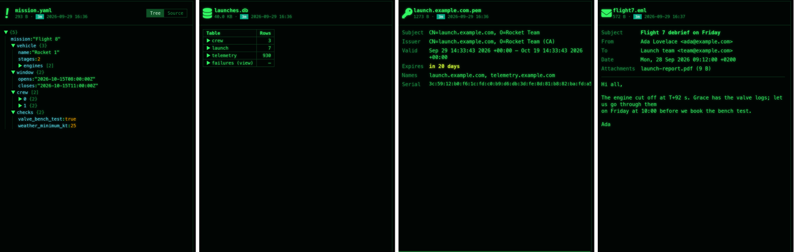

[← README](../../README.md) · [Docs index](../README.md) · [The preview pane](README.md)

# Data: trees, spreadsheets, databases and certificates

Structured files are shown by their structure: JSON, YAML and TOML as a collapsible tree, JSON
Lines, CSV and workbooks as tables, SQLite, Parquet and DuckDB as their tables and schema, and
certificates as the facts that matter, with expiry coloured.

*A YAML tree (**Tree** on), a SQLite database, a certificate chain's facts.*

## How to use it

1. Put the cursor on the file and press **Space** or **F3**.
2. In a tree, click a ▶ to open a level; the first two levels open by themselves.
3. **Tree / Source** (JSON, YAML, TOML) and **Table / Source** (JSON Lines) switch to the text.
4. A workbook with several sheets gets a button per sheet above the table.
5. In a SQLite database, click a table's name for its schema (`CREATE TABLE …`); a Parquet
   file has **Schema** under its rows.

| Key | Desktop app | Terminal app |
|---|---|---|
| **Space** / **F3** | Shows or hides the pane | **F3** opens the file in your pager; a database or Parquet file as its tables and first rows |
| **Enter** | Opens the file in its program | The same |

## Formats

| Files | Preview | Done by |
|---|---|---|
| `.json`, `.geojson`, `.yaml`, `.yml`, `.toml` | A tree with counts per level (`{12}` keys, `[3]` items); strings, numbers, booleans and `null` coloured; at most 500 entries per level, then *… 120 more* | Built in, [yaml](https://eemeli.org/yaml/), [smol-toml](https://github.com/squirrelchat/smol-toml) |
| `.jsonl`, `.ndjson` | The first 200 lines as a table, one column per key; a line that is not JSON shows under *(not JSON)* | Built in |
| `.csv`, `.tsv`, `.xlsx`, `.xlsm`, `.xls`, `.ods` | The first 200 rows as a table, a button per sheet | [SheetJS](https://sheetjs.com/) |
| `.db`, `.sqlite`, `.sqlite3`, `.db3` | Every table and view (*name (view)*) with its row count; click a name for its schema | [SQLite](https://sqlite.org/), opened read-only |
| `.parquet`, `.pq` | Row and column counts, the first 200 rows, and **Schema** (column, type, repetition) | [hyparquet](https://github.com/hyparam/hyparquet), with Snappy, Gzip, Zstd, Brotli and LZ4 |
| `.duckdb`, `.ddb` | Schema, table, estimated rows and column count per table | DuckDB, installed or in a container ([Previews made by tools](tools.md)) |
| `.pem`, `.crt`, `.cer`, `.der` | Each certificate in the file (a chain shows all): *Subject*, *Issuer* (*(CA)* for an authority), *Valid*, *Expires*, *Names*, *Serial* | Read in Rust |
| `.plist` | Binary or XML property lists, as highlighted XML | [plist](https://crates.io/crates/plist) |

## What you see

- **Trees:** keys in one colour, values in the colour of their type.
- **Tables:** a header row, then the rows; *Showing the first 200 rows* when there are more.
- **SQLite:** a *Table* / *Rows* table; *–* where a count took too long or the row is a view.
  Coxswain's own `search.db` is shown the same way.
- **Certificates:** *Expires* says *in 20 days* or *expired 3 days ago*; yellow within 30
  days, red once expired.
- **DuckDB:** the **Read tables** button when it cannot run by itself (an image to pull), the
  table otherwise.
- A spreadsheet over 25 MB, or a Parquet file over 500 MB, says *Too large to preview*.

## Settings and config.toml

None for the built-in formats. DuckDB uses `[preview.images] duckdb` (default `""`: no
container, as DuckDB has no official image) and the rest of [`[preview]`](tools.md#settings-and-configtoml).

## In the terminal app

No preview pane (tables and trees are drawn by the desktop app's webview). **F3** shows the text
of JSON, YAML, TOML, CSV and PEM files in your pager. On a SQLite database (`.db`, `.sqlite`,
`.sqlite3`, `.db3`) it pages its tables instead: each with its row count, its `CREATE` statement
and its first 20 rows as aligned columns. On a Parquet file: its row count, its columns with their
types, and its first 20 rows; a file compressed with zstd shows its columns and count, and says
*Its rows are compressed with zstd, which only the desktop app's preview reads.* For DuckDB the
command line does the job: `duckdb file.duckdb -c "SHOW TABLES"`.

## Questions

#### My JSON file shows as text, not as a tree.

It does not parse, or it is over 512 KB and was cut off, which breaks the JSON. Then the source
is shown instead. Fix the error (the source view shows where) or open it with **F4**.

#### Why do only 200 rows show?

The pane is for a look at the data, and a table of 200 rows draws at once. Open the file with
**Enter** for the rest.

#### Is it safe to preview a database another program is writing to?

Yes. SQLite files are opened read-only, and counting rows stops after about a second per table
(the count then shows *–*), so a huge database does not hold up the pane.

#### Why does a DuckDB file need a program, when SQLite does not?

SQLite is built into the app; DuckDB's file format needs DuckDB itself. Install `duckdb`, or set
an image you trust whose entry point is `duckdb` under `[preview.images] duckdb`.

#### Why is a certificate shown in yellow?

It expires within 30 days. Red means it has expired. A `.pem` with a chain shows every
certificate in it, the server's first.

#### Which compressions can Parquet files use?

Snappy, Gzip, Zstd, Brotli and LZ4 are all read in the desktop app; nothing to install. The
terminal app's **F3** reads all but Zstd, whose files show their columns and row count.

#### Can I edit a cell in the table?

No, previews only read. Open the file with **Enter** in its program.

---
[← Previous: PowerPoint and Office](office.md) · [Next: Cryptography bills of materials →](bom.md)
