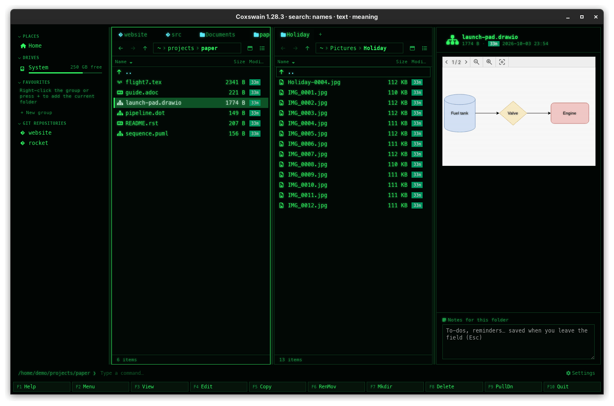

[← README](../../README.md) · [Docs index](../README.md) · [The preview pane](README.md)

# Diagrams: draw.io, Mermaid, Graphviz and PlantUML

Diagram files are drawn, not shown as their source: draw.io by draw.io's own viewer, Mermaid and
Graphviz in the app, PlantUML by PlantUML itself. Three of the four need nothing installed.
(Search reads the same diagrams as sentences, one per arrow: see [Diagrams read as
sentences](../search/diagrams.md).)


*sequence.puml rendered by the installed `plantuml`, and pipeline.dot drawn by Graphviz in the app.*



## How to use it

1. Put the cursor on the diagram and press **Space** or **F3**.
2. Mermaid and Graphviz: **Rendered / Source** switches to the text.
3. draw.io: the toolbar at the top switches pages, zooms and shows or hides layers.
4. PlantUML: the engine buttons choose the installed `plantuml` or the container.
5. **Enter** opens the file in its program (draw.io's desktop app, an editor).

| Key | Desktop app | Terminal app |
|---|---|---|
| **Space** / **F3** | Shows or hides the pane | **F3** opens the source in your pager |
| **Enter** | Opens the file in its program | The same |

## Formats

| Files | Drawn by | Needs |
|---|---|---|
| `.drawio`, `.dio` | draw.io's own viewer, shipped inside Coxswain: every page (a page switcher), zoom, layers | Nothing |
| `.mmd`, `.mermaid`, and ```` ```mermaid ```` blocks in Markdown | [Mermaid](https://mermaid.js.org/), in the theme's colours, `securityLevel: "strict"` | Nothing |
| `.dot`, `.gv` | [Graphviz](https://graphviz.org/) compiled to WebAssembly ([viz.js](https://github.com/mdaines/viz-js)) | Nothing |
| `.puml`, `.plantuml`, `.pu`, `.iuml`, `.wsd` | [PlantUML](https://plantuml.com/), as SVG | `plantuml` installed, or the container `docker.io/plantuml/plantuml:latest` |

## What you see

- **draw.io:** the diagram on white, with its toolbar; a file with several pages gets a page
  switcher.
- **Mermaid:** the diagram in the theme's colours (green in Cyber, grey in Windows 95); an error
  in the source shows Mermaid's message in its place.
- **Graphviz:** the graph as SVG; a syntax error shows Graphviz's message.
- **PlantUML:** the engine buttons, then the SVG on white. PlantUML runs by itself as soon as
  the file is shown, unless its image has to be pulled first: then **Render**, with *First run
  pulls docker.io/plantuml/plantuml:latest* under it.

## Settings and config.toml

Only PlantUML has any, as a tool of [Previews made by tools](tools.md):

| config.toml | Type, default |
|---|---|
| `[preview.images] plantuml` | String, `"docker.io/plantuml/plantuml:latest"`; `""` never uses a container |
| `[preview.prefer_tool] plantuml` | `"auto"`, `"local"` or `"container"`; default: `[preview] prefer` |

## In the terminal app

No preview pane; diagrams need the desktop app's webview to be drawn. **F3** shows the source
in your pager. To draw one from the command line: `dot -Tpng graph.dot -o graph.png`,
`plantuml seq.puml`, `mmdc -i chart.mmd` (Mermaid's CLI).

## Questions

#### Why do some draw.io shapes show as plain boxes?

draw.io's viewer fetches the shapes of its extra libraries (AWS, Azure, Cisco, …) from
diagrams.net. The preview works offline and never fetches anything, so those shapes show as
boxes with their labels. Open the file in draw.io for the real icons.

#### Do I need draw.io, Graphviz or Mermaid installed?

No. All three are drawn by code that ships with Coxswain. Only PlantUML (a Java program) needs
`plantuml` or a container.

#### Why is the Mermaid diagram in my theme's colours, not Mermaid's?

So it reads well in every theme. The colours come from the theme's panel, border and status
colours. **Source** shows the text, and **Enter** opens it in your Mermaid editor.

#### PlantUML never draws; the button says Render.

`plantuml` is not installed and the container image is not pulled yet. A pull never starts by
itself: click **Render** once, or **Pull** the image in *Settings → Previews made by tools*.

#### How large can a draw.io file be?

Up to 32 MB is read; a larger one is cut off and does not parse. Diagrams are rarely a
fraction of that.

#### Can a diagram run code?

Mermaid runs in strict mode, Graphviz's SVG is cleaned by DOMPurify before it is shown, and
PlantUML's SVG is shown as a picture, in which scripts never run. draw.io's viewer is draw.io's
own code and loads nothing from the web. See [Safety](safety.md).

---
[← Previous: Media and files](media.md) · [Next: LaTeX projects →](latex.md)
