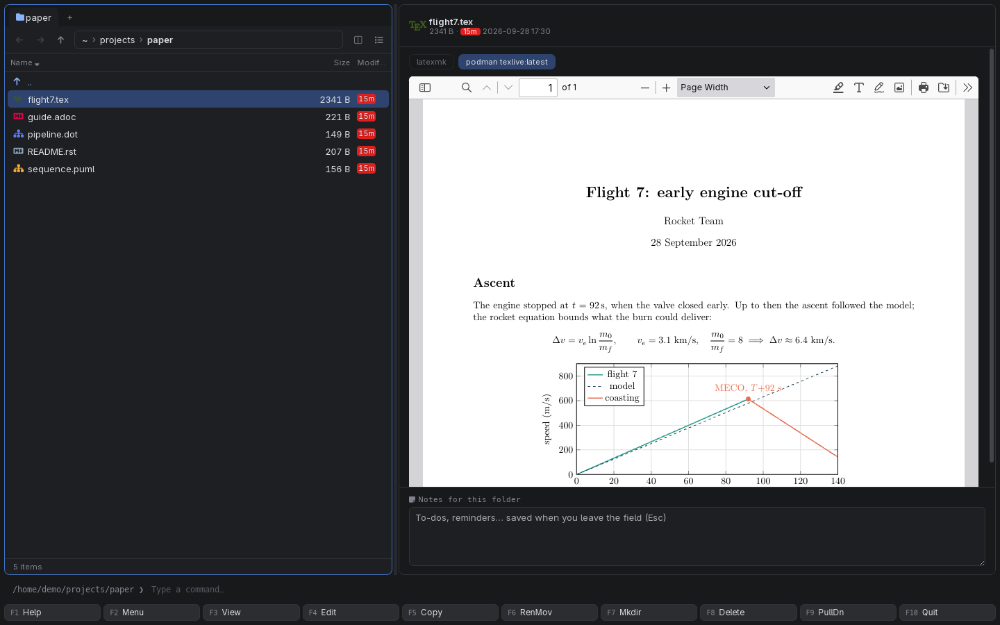

[← README](../../README.md) · [Docs index](../README.md) · [The preview pane](README.md)

# LaTeX projects

Put the cursor on any `.tex` file of a document and the preview pane shows its PDF. Coxswain
works out what a LaTeX editor would: which file is the document, which folder is the project,
and which engine it needs. It builds by itself when the sources have changed, goes on past
errors, and tries another engine when one cannot build the document.

*flight7.tex, built with the installed tectonic; the container is the other choice.*

<!-- screenshot: previews-latex-fallback.png: desktop app, Cyber theme: a .tex document that latexmk cannot build (a missing package) but tectonic can; above the PDF the line "Built with tectonic: latexmk stopped (! LaTeX Error: …)", the engine buttons latexmk and tectonic above it -->

## Contents

- [How to use it](#how-to-use-it)
- [What Coxswain works out](#what-coxswain-works-out)
- [Building by itself](#building-by-itself)
- [When an engine fails](#when-an-engine-fails)
- [What you see](#what-you-see)
- [Settings and config.toml](#settings-and-configtoml)
- [In the terminal app](#in-the-terminal-app)
- [Questions](#questions)

## How to use it

1. Put the cursor on the document, or on any chapter of it, and press **Space** or **F3**.
2. Wait a moment: once the file has stayed under the cursor for 0.8 s, the build starts
   (*Rendering with latexmk…*) and the PDF appears.
3. To build with another engine, click its button: **latexmk**, **tectonic**, **pdflatex**, or
   the container (**podman texlive:latest**). Your pick is remembered for every LaTeX file.
4. Edit and save the source: the next look builds afresh (see [Building by
   itself](#building-by-itself)).
5. **Enter** opens the `.tex` file in its program, **F4** in your editor.

| Key | Desktop app | Terminal app |
|---|---|---|
| **Space** / **F3** | Shows or hides the pane (and so the PDF) | **F3** opens the source in your pager |
| **F4** | Opens the source in your editor | The same |
| **Enter** | Opens the file in its program | The same |

## What Coxswain works out

| | |
|---|---|
| **The document** | The file named by `% !TEX root = ../main.tex` in its first 20 lines; else the file itself if it has a `\documentclass`; else a document in its folder, or up to two folders above, that has a `\documentclass` and names the file |
| **The project** | The git repository the document is in; without one, as far up as the document's own `../` paths reach (three folders at most, never your home folder). A container sees this folder, read-only, and builds from the document's folder, so `\includegraphics{../figures/plot}` works |
| **The engine** | `% !TEX program = xelatex` or `lualatex` (also `% !TeX TS-program = …`) in the first 20 lines. Without that, what the document and the `.sty` and `.cls` files next to it load: `fontspec`, `unicode-math`, `polyglossia`, `xeCJK`, `xltxtra`, `mathspec` or `\setmainfont` mean XeLaTeX; `luacode`, `luatexja`, `luaotfload`, `luatexbase` or `\directlua` LuaLaTeX. pdfLaTeX otherwise |
| **A fresh build** | Whenever a file in the document's folder or below has changed: a chapter, a picture, the bibliography (hidden files and folders do not count; 5,000 files at most are looked at) |

Two details of the engine choice: commented-out lines count for nothing (`% \usepackage{fontspec}`
asks for no engine), and a file that itself asks which engine runs (`\ifxetex`, `\ifluatex`,
`iftex`) works with each and counts for neither. When pdfLaTeX stops because a package *requires
either XeTeX or LuaTeX*, the build runs once more with XeLaTeX. A `latexmkrc` next to the
document is honoured by latexmk as always.

**How each engine runs:**

| Engine | Command |
|---|---|
| latexmk (installed or in the container) | `latexmk -pdf` (or `-pdfxe`, `-pdflua`) `-interaction=nonstopmode`, with output to the cache; no `-halt-on-error`, so it goes on past errors |
| tectonic | `tectonic --outdir <cache> file.tex` (XeTeX only) |
| pdflatex | `pdflatex -interaction=nonstopmode -halt-on-error`, one pass |

Output and auxiliary files (`.aux`, `.log`, `.toc`) go to the cache, never next to your
source.

## Building by itself

With *Build LaTeX documents by themselves when they are shown and have changed* ticked (the
default, `latex_auto = true`):

- A document is built when it is shown and there is no PDF yet for its sources as they are now.
  A document you have seen before, unchanged, shows its PDF at once from the cache.
- While the file is in the pane and you save it (or anything in the folder the panel shows),
  the panel rereads the folder, the preview looks again, and a new build starts.
- A change in a subfolder (a chapter in `chapters/` while the cursor is on `main.tex`) is found
  the next time the file is shown: move off it and back.
- It never starts by itself while the container's image still has to be pulled: the button
  then says **Build PDF**, with *First run pulls docker.io/texlive/texlive:latest (about 5 GB)*.

Untick it (`latex_auto = false`) and a document waits for **Build PDF**; a PDF built before
still shows at once.

## When an engine fails

When the engine picked cannot build the document at all, the others that are ready (installed,
or a container whose image is pulled) are tried in turn. tectonic is XeTeX only; the TeX Live
container has every engine and package, so it is often the one that succeeds. The PDF that one
makes is kept as the picked engine's result, so the next look finds it at once. Above the PDF:

*Built with tectonic: latexmk stopped (! LaTeX Error: File `minted.sty' not found.)*

LaTeX usually goes on past an error and still makes a PDF. That PDF is shown, with a closed
*Built with errors: the first one* above it; click it for the first `!` error from the log with
the lines after it, e.g. `! Undefined control sequence.` and the offending line.

When no engine makes a PDF, the preview shows the error (for LaTeX, the first `!` error and
five lines after it; for tectonic, which keeps no log, what it said without its warnings) and
**Try again**.

## What you see

| State | In the preview |
|---|---|
| Choosing | The engine buttons at the top; a greyed one says why on hover (*latexmk is not installed*) |
| Waiting for a click | **Build PDF**, and the engine's note under it |
| Pulling the image | *Pulling docker.io/texlive/texlive:latest…* and the runtime's progress line |
| Building | *Rendering with latexmk…* |
| Done | The PDF, opened at page width, in the webview's viewer |
| Done by another engine | *Built with tectonic: latexmk stopped (…)* above the PDF |
| Done with errors | *Built with errors: the first one* (click to open) above the PDF |
| Failed | The error in red and **Try again** |
| Too slow | *Stopped after 120 s (the timeout in [preview])* |

## Settings and config.toml

*Settings → Previews made by tools*:

| Settings item | config.toml | Type, default |
|---|---|---|
| *Build LaTeX documents by themselves when they are shown and have changed* | `[preview] latex_auto` | Boolean, `true` |
| *LaTeX image* | `[preview.images] latex` | String, `"docker.io/texlive/texlive:latest"` (about 5 GB; `:latest-medium` is about 2 GB) |
| *Use* | `[preview] prefer` (or `[preview.prefer_tool] latex`) | `"auto"`, `"local"`, `"container"`; `"auto"` |
| *Timeout (seconds)* | `[preview] timeout` | 10 to 3600, `120` |
| *Previews made so far* → **Clear** | – | Empties the preview cache, so every PDF is built again |

The installed programs looked for are `latexmk`, `tectonic` and `pdflatex`, in that order. See
[Previews made by tools](tools.md) and [Containers](containers.md).

## In the terminal app

No preview pane: the PDF needs the desktop app's viewer. Build on the command line
(`latexmk -pdf main.tex`) and open the PDF with **Enter**; **F4** edits the source. The rules
above (document, engine) are the desktop app's own.

## Questions

#### Why does LaTeX build with XeLaTeX here?

One of these asked for it: a `% !TEX program = xelatex` line; a XeTeX package (`fontspec`,
`unicode-math`, `polyglossia`, `xeCJK`, `mathspec`) or `\setmainfont` in the document or in a
`.sty` or `.cls` next to it; or pdfLaTeX stopped because a package *requires either XeTeX or
LuaTeX*. Put `% !TEX program = pdflatex` in the first lines to choose yourself.

#### A chapter file shows the whole book. Why?

A file without `\documentclass` builds the document that includes it, as a LaTeX editor would.
Its `% !TEX root` line, if it has one, names that document; otherwise the document in its
folder or up to two folders above that names it.

#### I changed a picture in `../figures` and the PDF did not change.

A fresh build follows changes in the document's folder and below, not beside it. Save the
`.tex` file (any change to it counts), or clear the cache: *Settings → Previews made by tools →
Previews made so far → Clear*.

#### I saved a chapter and the preview did not rebuild.

The panel only rereads the folder it shows. If the chapter is in a subfolder of the document's
folder, the change is found the next time the document is shown: move the cursor off it and
back, and it builds.

#### It says "Built with tectonic: latexmk stopped". What happened?

latexmk could not make the PDF (here a missing package), so the next ready engine was tried
and succeeded. Install the package for latexmk, or pick tectonic's button so it is tried first.

#### It shows a PDF and "Built with errors: the first one".

LaTeX met an error but went on and made a PDF, as it does with `-interaction=nonstopmode`.
Click the line for the error and the lines around it; the PDF may be missing what the error
was about.

#### Why is `minted` not working?

It needs `-shell-escape`, which lets a document run programs on your machine. Coxswain never
passes it, so no document can run a command. Packages that write next to the source cannot
either: results go to the cache.

#### The LaTeX container never starts by itself.

Its image is not pulled yet, and a 5 GB download never starts without a click. Press **Build
PDF**, or **Pull** it in Settings first.

#### Does tectonic download anything?

tectonic fetches the packages a document needs from its own bundle on the web the first time,
by its own design; Coxswain does not pass anything to stop that. Use latexmk or the TeX Live
container for builds with no network at all.

#### How do I turn automatic builds off?

Untick *Build LaTeX documents by themselves when they are shown and have changed* in *Settings →
Previews made by tools*, or set `latex_auto = false` under `[preview]`. Documents then wait for
**Build PDF**.

---
[← Previous: Diagrams](diagrams.md) · [Next: Previews made by tools →](tools.md)
