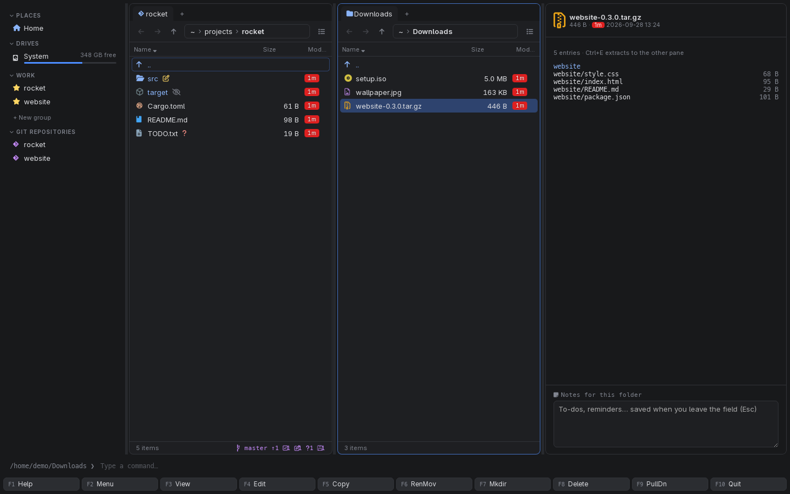
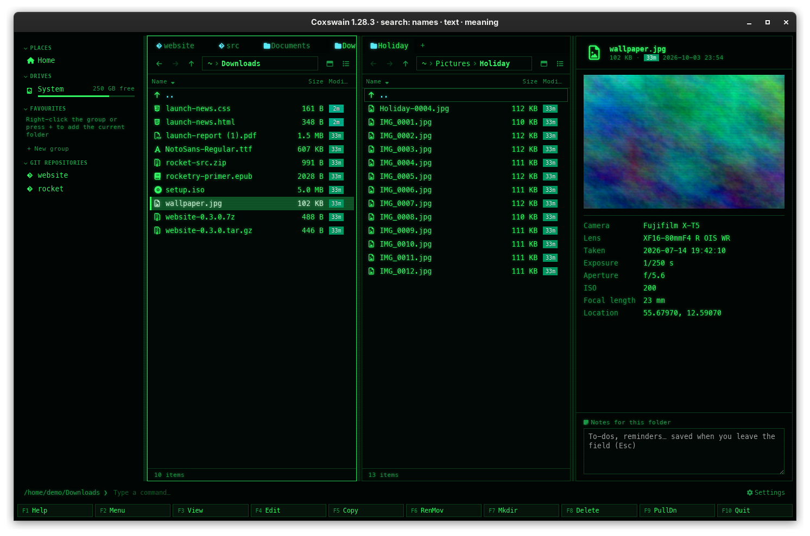

[← README](../../README.md) · [Docs index](../README.md) · [The preview pane](README.md)

# Media and files: pictures, video, audio, fonts, archives, folders

Pictures show on a checkerboard with their camera facts, video and audio get a player, fonts
show sample text, archives list what is inside, and a folder shows what it holds. Under many
files the pane adds a short list of facts: EXIF for photos, tags for music, the platform a
program is built for.

*An archive in the preview: what is inside, and how to unpack it.*

## How to use it

1. Put the cursor on the file or folder and press **Space** or **F3**.
2. Video and audio: press the player's play button (they never start by themselves).
3. Archive: read the list; **Enter** opens the archive as a folder, **Ctrl+E** unpacks it into
   the other panel.
4. Folder: click **Calculate** for its total size.

| Key | Desktop app | Terminal app |
|---|---|---|
| **Space** / **F3** | Shows or hides the pane | **F3** opens the file in your pager |
| **Enter** | Opens the file in its program; goes into a folder or archive | The same |
| **Ctrl+E** | Extracts the archive into the other panel | The same |

## Formats

| Files | Preview |
|---|---|
| Pictures: `png jpg jpeg gif webp bmp ico svg avif` | The picture on a checkerboard (so transparency shows), plus its EXIF facts |
| Video: `mp4 webm mkv mov m4v ogv` | A player |
| Audio: `mp3 flac wav ogg m4a opus aac` | A player, plus its tags |
| Fonts: `.ttf`, `.otf`, `.woff`, `.woff2` | *The quick brown fox jumps over the lazy dog* and *Sphinx of black quartz, judge my vow* in large sizes, the alphabet, digits and signs, and *Æble, øl og å — Grüße — fi fl — “quotes” — €£¥* |
| Folders | *Contents* (folders and files), *Files here* (their size), *Newest*, *Total size* (or **Calculate**), and the *Git* line of a repository |
| Archives | The files inside; see [below](#archives) |

Whether video and audio play depends on the codecs of your system's webview: WebKitGTK with
GStreamer on Linux, WebKit on macOS, WebView2 on Windows.

On Linux the player needs GStreamer's `autodetect` and `playback` plugins (from
`gst-plugins-good` and `gst-plugins-base`). Without them WebKit stops the whole page as soon as a
player is shown, so Coxswain looks for them first. When they are missing, the preview shows no
player but *Video and sound need GStreamer's good plugins to play here (gst-plugins-good;
gstreamer1.0-plugins-good on Debian and Ubuntu). Install them, then open Coxswain again.* with
the link *Open in its app*, and *Settings → What's new* says the same once. The AppImage carries
a GStreamer built on Ubuntu, which looks for plugins only where Debian and Ubuntu keep them
(`/usr/lib/x86_64-linux-gnu/gstreamer-1.0`); on other distributions it says so and suggests
installing Coxswain from your package manager.

### Archives

`.zip`, `.jar`, `.apk`, `.nupkg`, `.whl`, `.vsix`, `.7z`, `.tar`, `.tar.gz` / `.tgz`,
`.tar.bz2` / `.tbz` / `.tbz2`, `.tar.xz` / `.txz` and `.tar.zst` / `.tzst` list the files
inside, the first 2,000, with their sizes: *5 entries · Ctrl+E extracts to the other pane*
(*2000+ entries* when there are more).

Since archives open as folders ([Archives as folders](../files/archives.md)), **Enter** takes you
inside. There the panel shows the archive's files, and the preview shows the one under the cursor:
when the cursor rests on it, Coxswain copies that one file out into its cache folder (*Opening it
from website-0.3.0.tar.gz…*) and previews the copy as usual. A locked file asks for its password
first, with the link *Enter the password*.

### Facts

Under the preview, some files get a short list:

- **Photos:** *Camera*, *Lens*, *Taken*, *Exposure*, *Aperture*, *ISO*, *Focal length*, and
  *Location* as decimal degrees (paste them into any map).
- **Audio:** *Title*, *Artist*, *Album*, *Year*, *Track*, *Genre*, *Length*, *Bitrate*, and
  the sample rate and channels (*44.1 kHz, stereo*).
- **Programs and libraries:** the platform and CPU they are built for (*Linux/Unix ELF 64-bit*,
  *Windows PE*, *macOS Mach-O*, *macOS universal*; x86, x86-64, ARM, ARM64, RISC-V and more)
  and what they are (program, windowed or console program, shared library, object file).

## What you see

- The picture, scaled down to fit and never up; an SVG drawn as a picture (its scripts never
  run).
- The player's own controls.
- The facts as a two-column list under the preview.
- An archive that cannot be read shows why, in place of the list.

## Settings and config.toml

None. Thumbnails of pictures in the panel itself are a view of their own:
[Views](../panels/views.md). Folder sizes: [Folder sizes](../panels/folder-sizes.md).

## In the terminal app

No preview pane: a terminal cannot show pictures, play media or draw fonts reliably. **Enter**
opens the file in its program (image viewer, media player). Archives work as in the desktop app:
**Enter** goes inside, **F5** copies out, **Ctrl+E** extracts, and the panel's title says
*[archive]*. See [Archives as folders](../files/archives.md).

## Questions

#### Why does a video not play?

The webview lacks the codec. On Linux, install the GStreamer plugins for it (for example
`gst-plugins-good`, `gst-plugins-bad`, `gst-libav`). **Enter** plays it in your media player.

#### Previewing a video made the window go blank or stop. Why?

Before 1.29.1, on Linux without GStreamer's good plugins (`gst-plugins-good`): WebKit could not
find an audio output (`autoaudiosink`) and ended the page's process, which left the window empty
and deaf to keys. From 1.29.1 the preview checks for the plugins first and says what to install
instead of showing a player. With the AppImage on a distribution other than Debian or Ubuntu,
installing them does not help, since its GStreamer does not look where your distribution keeps
them: install Coxswain from your package manager (the AUR, Homebrew's formula) or press
**Enter** to play the file in its app.

#### How is a file inside an archive previewed?

It is not on disk, so Coxswain copies that one file out into its cache folder
(`coxswain/peek/`, see [Where things are kept](../reference/where-things-are-kept.md)) and
previews the copy. There is one copy at a time; the next look replaces it. Files over 256 MB are
not copied just for a look.

#### Where do the GPS numbers come from, and are they sent anywhere?

They are the photo's own EXIF data, read on your machine. Nothing is sent; copy the numbers into
a map yourself if you want to see the place.

#### Why does a 7z archive say "This file is locked with a password."?

Its file names are encrypted, so it cannot be listed without the password. Click *Enter the
password* under it to list it, or press **Enter** to open it: Coxswain asks for the password (*Locked archive*) and keeps it in memory for this run.
See [Passwords](../files/archive-passwords.md).

#### Why does a zip with a password list its files?

A zip encrypts the contents of its files but not their names, so the list shows without a
password. Copying one out asks for it.

#### Why are RAR files not listed?

RAR is not one of the formats Coxswain reads; see [Archives as folders](../files/archives.md).
**Enter** opens it in the program your system has for it.

#### The folder's Total size says Calculate. Why not at once?

Measuring a big folder reads every file under it. With folder sizes on in the columns menu, it
appears by itself; otherwise **Calculate** measures this one.

---
[← Previous: Cryptography bills of materials](bom.md) · [Next: Diagrams →](diagrams.md)
