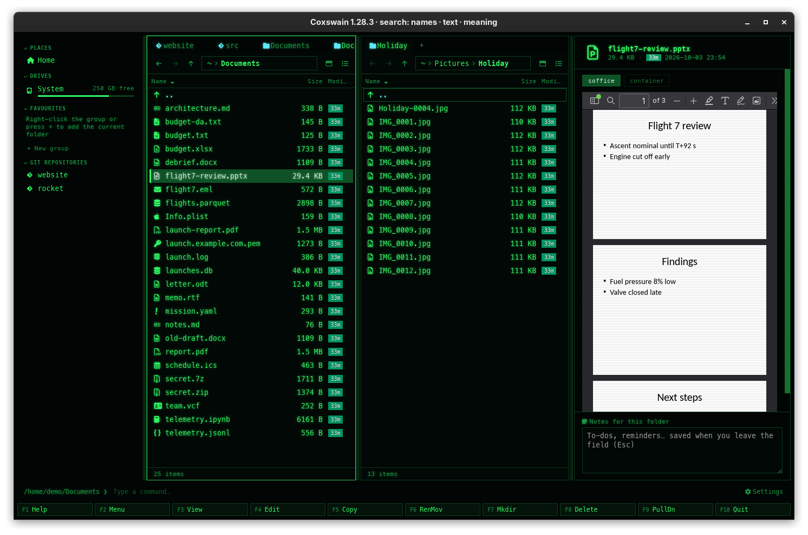

[← README](../../README.md) · [Docs index](../README.md) · [The preview pane](README.md)

# PowerPoint and Office: quick view and LibreOffice's exact view

PowerPoint decks show at once, drawn in the app with nothing installed. Where LibreOffice is
installed (or a LibreOffice container image is set), its exact rendering follows and takes the
quick view's place. Older and other Office formats (`.doc`, `.odt`, `.rtf`, `.ppt`, `.vsdx`, …)
are shown as the PDF LibreOffice makes of them.

## How to use it

1. Put the cursor on the deck or document and press **Space** or **F3**.
2. A PowerPoint deck shows its slides at once. With LibreOffice there, it starts by itself once
   the file has stayed under the cursor for 0.6 s; the exact view replaces the slides when it
   is ready.
3. The engine buttons at the top (**soffice**, **podman libreoffice…**) choose who renders; a
   click renders again with that one.
4. **Enter** opens the file in its program.

| Key | Desktop app | Terminal app |
|---|---|---|
| **Space** / **F3** | Shows or hides the pane | – |
| **Enter** | Opens the file in its program | The same |

## Formats

| Files | Quick view, in the app | Exact view |
|---|---|---|
| `.pptx` `.pptm` `.ppsx` `.potx` | The slides at once: layout, text, pictures and tables ([pptx-to-html](https://github.com/javier-mora/pptx-to-html)); not every font, colour scheme, effect or chart | LibreOffice's PDF |
| `.docx` | The document, by mammoth ([Documents](documents.md)) | – (never goes to LibreOffice) |
| `.xlsx` `.xlsm` `.xls` `.ods` | The sheets as tables, by SheetJS ([Data](data.md)) | – |
| `.doc` `.docm` `.dotx` `.odt` `.ott` `.rtf` | – | LibreOffice's PDF |
| `.ppt` `.pps` `.pot` `.odp` `.otp` | – | LibreOffice's PDF |
| `.odg` `.vsd` `.vsdx` `.pub` `.wpd` `.wps` | – | LibreOffice's PDF |

Decks saved by PowerPoint for the web (whose parts start with a byte order mark and name each
other by absolute paths) are mended before they are drawn, so they show too.

## What you see

- **Quick view:** the slides one under another, 16:9, scaled to the pane.
- **While LibreOffice works:** *Shown at once; the exact rendering with soffice is on its way…*
  above the slides.
- **Exact view:** the PDF in the webview's viewer, fitted to the width.
- **If LibreOffice fails:** its first error line above the quick view, which stays.
- **Formats with no quick view, without LibreOffice:** *soffice is not installed. No image for
  libreoffice: set [preview.images] libreoffice in the config. See the [preview] section in
  the config.*
- **While another format renders:** *Rendering with soffice…*; on an error, the message with
  **Try again**.

## Settings and config.toml

| Settings → Previews | config.toml | Type, default |
|---|---|---|
| *How previews are made* | `[preview] prefer` | `"auto"`: an installed program, else a container |
| – | `[preview.prefer_tool] libreoffice` | Overrides `prefer` for LibreOffice |
| – | `[preview.images] libreoffice` | String, `""`: no container (there is no official image) |
| *Timeout (seconds)* | `[preview] timeout` | 120 |

Coxswain looks for `soffice` and `libreoffice` on the `PATH`, and in LibreOffice's usual
install folders on macOS and Windows. A LibreOffice image you set must provide `soffice`. See
[Previews made by tools](tools.md) and [Containers](containers.md).

## In the terminal app

No preview pane: slides and PDFs need the desktop app's webview. **Enter** opens the file in
LibreOffice or PowerPoint. To get a PDF from the command line: `soffice --headless --convert-to pdf file.pptx`.

## Questions

#### Why do the slides look slightly different, then change?

The first view is drawn by the app, quickly, and misses some fonts, effects and charts. When
LibreOffice is there, its exact rendering follows and takes the quick view's place. That one is
kept in the [cache](tools.md#the-preview-cache), so the next look shows it at once.

#### Do I need LibreOffice to see a PowerPoint deck?

No. The quick view needs nothing installed. LibreOffice only adds the exact rendering, and is
needed for `.ppt`, `.odp` and the other formats without a quick view.

#### Why is a Word `.doc` file not shown?

`.doc` needs LibreOffice: install it (so `soffice` is found), or set an image for it under
`[preview.images] libreoffice`. `.docx` needs nothing.

#### Does it disturb a LibreOffice I have open?

No. Coxswain runs LibreOffice with a profile of its own in the cache folder
(`libreoffice-profile`), so a running LibreOffice neither takes over the conversion nor sees
it. Conversions run one at a time.

#### Why is there no official LibreOffice container image?

The LibreOffice project publishes none, so Coxswain sets none by default. Set one you trust in
`[preview.images] libreoffice`; it must provide the `soffice` command.

#### The deck shows but the exact view never comes.

Either LibreOffice is not found (the engine button is greyed; hover it for the reason), or the
only engine is a container whose image is not pulled yet: that never starts by itself. Click
**Render** under the quick view (or the container's button), or **Pull** it in Settings.

#### Why did LibreOffice stop with "Stopped after 120 s"?

A conversion is stopped after the timeout. Large decks can take longer: raise *Timeout
(seconds)* (10 to 3600) in *Settings → Previews*.

---
[← Previous: HTML pages, sandboxed](html.md) · [Next: Data →](data.md)
