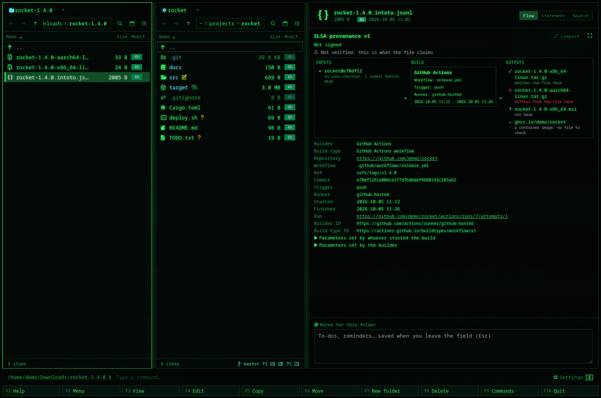
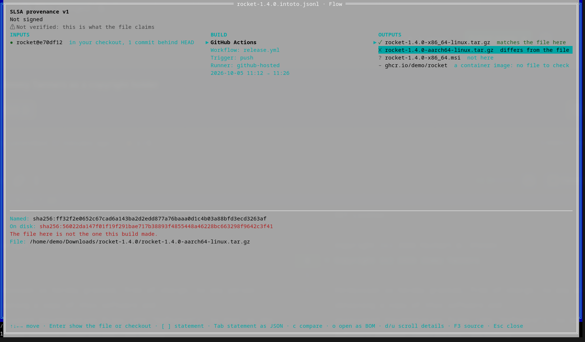

[← README](../../README.md) · [Docs index](../README.md) · [The preview pane](README.md)

# Build provenance

A **provenance** file says how software was built: which files came out (the *outputs*, each
with a digest), which builder made them, and from what (a repository at a commit, a workflow,
parameters, dependencies). SLSA defines the format; GitHub Actions, the SLSA GitHub generator,
npm, PyPI and Google Cloud Build write it, often wrapped in a signed envelope and a Sigstore
bundle. Coxswain shows one as inputs → build → outputs, says who signed it, and checks the
claims it can check on your disk: **are these files the ones that were built, and is that
commit in my checkout?** Both apps have it.

- [Using it](#using-it)
- [What the marks mean](#what-the-marks-mean)
- [What it checks, and what it does not](#what-it-checks-and-what-it-does-not)
- [Who signed, and the build's facts](#who-signed-and-the-builds-facts)
- [Comparing two builds](#comparing-two-builds)
- [Other attestations](#other-attestations)
- [Files it reads](#files-it-reads)
- [Safety and speed](#safety-and-speed)
- [Settings and config.toml](#settings-and-configtoml)
- [Questions](#questions)

## Using it

**Desktop app.** Put the cursor on a provenance file and the preview pane shows it. The switch
at its top picks **Flow**, **Statement** or **Source**, and the choice sticks. **⤢** opens the
same view in a window.

- **At the top:** what the file is (*SLSA provenance v1*), *statement 2 of 3* with **‹ ›** when
  the file holds several, who signed it and where it was logged, and always *⚠ Not verified:
  this is what the file claims*. A file with broken parts says *n problems in the file*; open
  it for the list.
- **Flow:** three columns. **Inputs** are the dependencies, sources first: a git source reads
  `repo@commit` (`rocket@1a2b3c4`) with where that commit is in your checkout. **Build** is the
  builder (a short name for well-known ones, such as *GitHub Actions*), the workflow, the
  trigger, the runner and the times. **Outputs** are the files the build made, each with its
  check, and the byproducts, dimmed. In a narrow pane the columns are stacked.
- **Keys:** click the flow (or Tab to it), then ←/→ move between columns, ↑/↓ within one,
  Home/End. **Enter** on an output shows the file in the other pane, so the provenance stays in
  view; on a large one it checks it. **Enter** on a source shows the checkout. **[** and **]**
  move to the previous or next statement.
- **The details** under the flow show the row under the cursor in full: an output's digests
  (both, side by side, when the file here differs), an input's URI and digests and its
  checkout, or for the build every fact with where it came from, the full builder ID, the
  build type, the builder's version and both sets of parameters.
- **Statement** shows the decoded statement as a tree: what a provenance file holds, without
  the base64. **Source** shows the file as it is.

**Terminal app.** **F3** on a provenance file opens the viewer full screen; **F3** there (or
`s`) shows the source in your pager, as F3 did before. `provenance_viewer = false` keeps the
pager. At 100 columns or more the three columns sit side by side; narrower, they are stacked.

| Key | Does |
|---|---|
| ← → | Move between columns (stacked: between sections) |
| ↑ ↓ Home End PgUp PgDn | Move within a column |
| Enter | On an output: put the panel's cursor on the file, or check a large one. On a source: show its checkout |
| [ ] | Previous / next statement |
| Tab | Flow, or the statement as indented JSON |
| c | Compare with the file under the other panel's cursor; `c` again stops |
| n | While comparing: the list of changes, or the details |
| o | Open a CycloneDX predicate in the [BOM viewer](bom.md) |
| d / u | Scroll the details |
| F3 / s | The source in your pager |
| Esc | Close |

## What the marks mean

| Mark | On | Means |
|---|---|---|
| ✓ (green) | Output | A file of that name here has the digest the provenance names |
| ✗ (red) | Output | It has another digest: it is **not** the file this build made |
| ? (grey) | Output | No file of that name here or in the other pane's folder |
| – (grey) | Output | Cannot be checked: a container image, no digest, or only digests Coxswain does not compute (SHA-1, MD5) |
| ↵ (grey) | Output | Over 256 MB: **Enter** (or *Check*) checks it |
| ! (red) | Output | The file could not be read (no permission, or only in the cloud) |
| … | Output | Being checked |
| ● (green) | Source | The commit is in your checkout, at HEAD or behind it (or ahead of it) |
| ◐ (grey) | Source | In your checkout, but not on the branch you are on |
| ○ (grey) | Source | Not in your checkout, or no checkout of that repository here |
| Δ | Input, output | Changed since the build you compare with |

Every mark is written out next to it (*matches the file here*), so colour is never the only
signal; the colours are the same in every theme.

## What it checks, and what it does not

**Outputs.** Each output is looked for by its name below the provenance's folder
(`dist/rocket-1.4.0.tar.gz`), then by its file name alone in that folder, then in the folder of
the other pane (panel). Its SHA-256 (or SHA-512) is computed and compared. Files up to 256 MB
are checked at once, in the background; larger ones when you press **Enter**. Moving on stops a
check, and a file already checked is not read again until it changes.

**Sources.** A git source (`git+https://github.com/owner/repo@refs/tags/v1.4.0` with a commit)
is looked for in a checkout of that repository: the provenance's folder or one above it, or
the other pane's folder, whose `origin` (or any remote) points to the same host and path. Then
git says whether the commit is there and how far from HEAD. **Coxswain never fetches**: a commit
you have not fetched reads *not in your checkout*.

**Not verified.** Coxswain reads the signature, the certificate and the transparency-log entry,
but checks none of them. A ✓ says that the file here is the file the provenance names, not
that the provenance is genuine: anyone can write a provenance file. To verify one, use a
verifier:

| Tool | Command |
|---|---|
| slsa-verifier | `slsa-verifier verify-artifact rocket-1.4.0.tar.gz --provenance-path rocket-1.4.0.intoto.jsonl --source-uri github.com/owner/rocket` |
| GitHub CLI | `gh attestation verify rocket-1.4.0.tar.gz --owner owner` |
| cosign | `cosign verify-blob-attestation --bundle rocket.sigstore.json --certificate-identity … --certificate-oidc-issuer … rocket-1.4.0.tar.gz` |

These contact Sigstore for its trusted root, which is why Coxswain does not run them.

## Who signed, and the build's facts

A Sigstore bundle carries a short-lived certificate (Fulcio's) whose claims name the workflow
that signed it, the repository, the ref, the commit, the trigger and the runner. Coxswain shows
the identity at the top (*Signed by https://github.com/owner/rocket/.github/workflows/release.yml@refs/tags/v1.4.0
· via https://token.actions.githubusercontent.com*) and the log entry (*logged in Rekor as
#188622862*). An envelope signed with a key shows the key's ID; one with no signature says
*Not signed*.

The build's facts (repository, workflow, ref, commit, trigger, runner, run) come from the
certificate where it has them, else from the provenance; the details say which (*from the
certificate*, *from the provenance*). When the two disagree, for example the provenance names
another commit than the certificate, the fact is marked *⚠ The provenance says …* and the build
box says *The certificate and the provenance disagree*. That is worth a closer look.

SLSA v0.2 and v1 are shown alike: v0.2's `materials` and `configSource` are inputs, its
`parameters` the parameters set by whoever started the build, and its environment those set
by the builder. v0.2's *complete* and *reproducible* flags show in the build's details.

## Comparing two builds

Put an earlier build's provenance under the cursor in the other pane and press **Compare**
(`c` in the terminal). Statements are paired by a shared output name; a file of one statement
each always pairs. The bar shows how many **builder** changes, **parameters**, **inputs**,
**outputs** and **signer claims** differ, each a filter, and the list under it says what
changed (before → after, ＋ added, − removed). Inputs and outputs that changed get a **Δ** in
the flow. An input is matched by its URI without its `@ref`, so a new tag and commit of the
same repository is one change, not a removal and an addition.

## Other attestations

- **A verification summary (VSA)**, someone else's verdict on a file, shows *✓ Passed* or
  *✗ Failed*, the levels it vouches for (`SLSA_BUILD_LEVEL_3`), the verifier, the resource, the
  policy and the time, with the note that Coxswain does not verify it.
- **A CycloneDX SBOM in a statement** shows its outputs and **Open as BOM** (`o`), which opens
  the predicate in the [BOM viewer](bom.md).
- **Anything else** (SPDX, test results, vulnerability scans) shows its outputs, with their
  checks; its content is under **Statement**.

## Files it reads

- **By name:** `*.intoto.jsonl`, `*.intoto.json`, `*.sigstore.json`, `*.sigstore`,
  `*.dsse.json`, `*.provenance.json`, `*.build.slsa` and `provenance.json`.
- **By content,** for any other `.json`, `.jsonl` or `.ndjson`: an in-toto envelope, a
  statement or a Sigstore bundle in the first 8 KB. This catches `gh attestation download`'s
  `sha256:….jsonl`. A statement that carries a CycloneDX SBOM is provenance first.
- **Forms:** a bare in-toto statement (v0.1, v1), a DSSE envelope, a Sigstore bundle (v0.1 to
  v0.3, with a certificate, a certificate chain or a key), and JSON Lines of any of these.
- **Predicates:** SLSA provenance v0.2 and v1, verification summaries, CycloneDX, and any other
  as its outputs and its JSON.
- **Lenient:** a line that is not JSON, a payload that is not base64, an output without a
  digest or a certificate that cannot be read is listed under *problems in the file*, and the
  rest still shows. Only a file with no attestation in it, or that is not JSON, is refused.

## Safety and speed

- The file is only read, and nothing leaves the machine. The links (the run, the repository,
  the log) open in your browser only when you click them.
- The only program run is `git`, read-only, in a checkout found as above, with its hooks,
  filters and fetches turned off as everywhere in Coxswain.
- Output names never lead out of the provenance's folder or the other pane's: `../` and drive
  letters are refused.
- Up to 64 MB per file; real provenance is a few kilobytes. Outputs are hashed in the
  background, up to 256 MB unasked, and a cloud file that is not on this machine is not read.

## Settings and config.toml

| Where | Key | Default | Does |
|---|---|---|---|
| `config.toml`, top level; the desktop app's Settings → *Behaviour* → *Provenance viewer on F3 (terminal app)* | `provenance_viewer` | `true` | The terminal app's **F3** on provenance opens the provenance viewer; `false` opens the pager as for any file |

The desktop app itself has no setting for it: the preview pane always shows provenance, and the
**Flow / Statement / Source** switch remembers your choice. See also
[Configuration: every key](../reference/configuration.md#top-level-keys).

## Questions

#### Does a ✓ mean the file is safe?
No. It means a file here has exactly the digest the provenance names, so it is the file that
build made, *if* the provenance is genuine. Coxswain does not verify the signature; the top of
the view says *Not verified* for that reason. Verify with `slsa-verifier` or
`gh attestation verify` (see [What it checks](#what-it-checks-and-what-it-does-not)) before
you trust a build.

#### Why does an output say "not here" when the file is right there?
It is looked for by the name the provenance gives, in the provenance's folder and in the other
pane's folder. A file renamed after the build (`rocket.tar.gz` for `rocket-1.4.0.tar.gz`) is not
found. Open the other pane on the folder that holds it: the desktop app checks again at once;
in the terminal app, close the viewer and press **F3** again.

#### Why is my commit "not in your checkout"?
Coxswain never fetches. A tag or branch built on GitHub but not yet pulled is not in your
checkout; run `git fetch` there, and move off the provenance and back on. *No checkout of it
here* means no repository with a matching remote was found in the provenance's folder, above
it, or in the other pane: open the other pane in your checkout.

#### What does "The certificate and the provenance disagree" mean?
The signing certificate names one thing (say, commit `8f70009`) and the provenance another.
Builders that work properly do not produce this. Look at the build's details: the fact marked
*⚠ The provenance says …* shows both.

#### Can it read npm or PyPI provenance?
npm's provenance is a Sigstore bundle with SLSA v1, which Coxswain reads; save it from the
registry as a `.sigstore.json`. PyPI's PEP 740 attestation files (`.publish.attestation`) are
a different wrapping that Coxswain does not read yet.

#### Can it verify the signature?
Not in this version, on purpose: verifying needs Sigstore's trusted root, which changes and is
fetched from the network. Use one of the verifiers in
[What it checks](#what-it-checks-and-what-it-does-not).

#### How do I get the old F3 back in the terminal app?
In the viewer, **F3** again (or `s`) opens the file in your pager. To make F3 always open the
pager, set `provenance_viewer = false` in `config.toml`.

---
[← Previous: Cryptography bills of materials](bom.md) · [Next: Media and files →](media.md)
