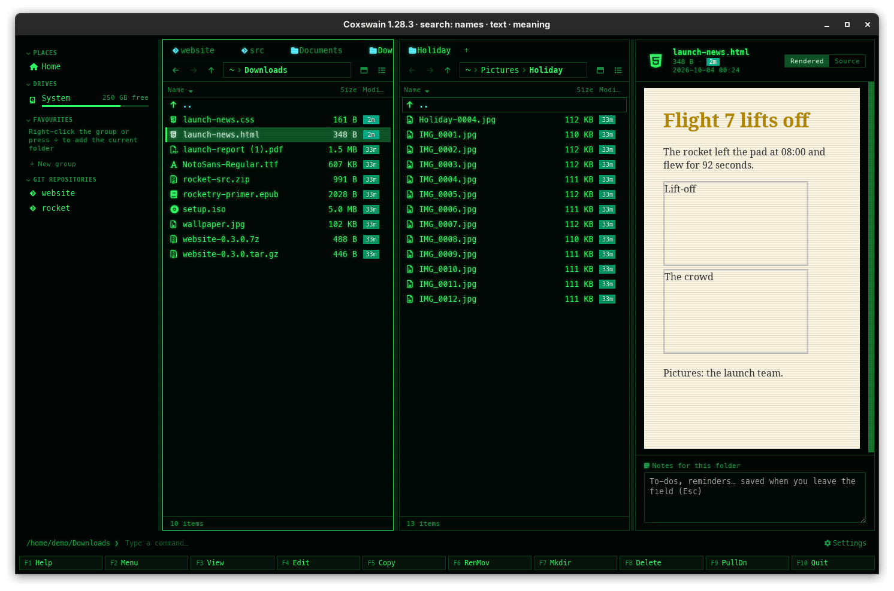

[← README](../../README.md) · [Docs index](../README.md) · [The preview pane](README.md)

# Safety, speed and limits

Previews show other people's files: downloads, attachments, repositories you have just cloned.
So no preview runs a script from a file, writes next to it, or reaches the network on its own.
And the pane stays quick: heavy libraries load only when a file needs them, and large files are
shown in part.

## How to use it

Nothing to do: all of this holds for every preview. To see a file with its scripts, or in full,
open it outside the pane:

| Key | Desktop app | Terminal app |
|---|---|---|
| **Enter** | Opens the file in its program (a browser runs a page's scripts) | The same |
| **F4** | Opens the file in your editor | The same |
| **Space** / **F3** | Shows or hides the pane | **F3** opens the file in your pager |

## What a preview never does

- **Run a file's scripts.** Every rendered result is HTML cleaned by
  [DOMPurify](https://github.com/cure53/DOMPurify) before it reaches the page: Markdown,
  notebooks, Word documents, slides, EPUB chapters, AsciiDoc, reStructuredText, Graphviz and
  HTML notebook outputs. Mermaid runs with `securityLevel: "strict"`; AsciiDoc in secure mode,
  without includes. HTML files are shown in a frame that allows no scripts at all ([HTML
  pages](html.md)).
- **Write next to your files.** Tool results, LaTeX's auxiliary files and LibreOffice's profile
  go to the cache folder. Containers see your folders read-only. The only thing that writes is
  extracting an archive, and only when you press **Ctrl+E**.
- **Change a database.** SQLite and DuckDB files are opened read-only; counting SQLite rows
  stops after about a second per table.
- **Let a document run programs.** LaTeX runs without `-shell-escape`, and latexmk without the
  `latexmkrc` a project may carry (it is Perl); only your own `~/.latexmkrc` is read. pandoc
  runs with `--sandbox`, PlantUML may include files from the diagram's folder only, and
  containers have no network. LibreOffice converts a document in a profile of its own with all
  macros off (macro security "very high" behind that) and links never updated, so a document
  neither runs its macros nor fetches what it links.
- **Run what a repository names.** A folder may be a repository someone else made (a
  download, an unpacked archive), and its `.git/config` can name programs. The git line, the
  diff and [Git history](../panels/git-history.md) run git without any of them: no file system
  monitor, none of the repository's filter drivers (git would run them on every file it looks
  at), no signature checker, no external diff or textconv, and no fetch of missing objects.
  Your own git config (git-lfs, say) still holds.
- **Reach the web.** The webview is held to the app's own pages and your disk by a content
  security policy: a picture at an `https://` address in a Markdown file, notebook or book
  stays an empty box, and no preview can report that it was opened. A web link you click in a
  rendered file opens in your browser.
- **Download a tool by itself.** Pulling a container image, the one big download, waits for a
  click, and the engine button says what will be pulled beforehand.

### What does reach the network

| What | When |
|---|---|
| Pulling a container image | After your click on the engine or **Pull** |
| tectonic's package bundle | When tectonic builds a document; tectonic's own design |

Nothing else: every library (Mermaid, KaTeX, SheetJS, draw.io's viewer, Graphviz, …) ships inside
the app, and previews of every kind are blocked from the web.

## Speed

- The pane waits 80 ms after the cursor stops before it loads, so holding an arrow key stays
  smooth; facts come after 120 ms.
- Tools wait longer: LibreOffice 0.6 s, LaTeX 0.8 s, others 0.15 s.
- The libraries behind the heavier previews (Mermaid, KaTeX, SheetJS, mammoth, the YAML and TOML
  parsers, Graphviz, Asciidoctor, hyparquet, pptx-to-html, draw.io) load the first time a file
  needs them, so they add nothing to startup.
- Tool results come from the [preview cache](tools.md#the-preview-cache) after the first run.

## Limits

| What | Limit | Then |
|---|---|---|
| Text, code, HTML, Markdown, data files | First 512 KB | *Showing the first 512 KB* under text and logs |
| Highlighting | Files under 200 KB | Larger ones stay plain |
| Hex dump of a binary file | First 64 KB | – |
| Git diff | First 512 KB | – |
| Tables (spreadsheets, CSV, JSON Lines, Parquet) | 200 rows | *Showing the first 200 rows* |
| Trees (JSON, YAML, TOML) | 500 entries per level | *… n more* |
| Archives | 2,000 entries | *2000+ entries* |
| Word, notebooks, spreadsheets, PowerPoint quick view | 25 MB | *Too large to preview* |
| Parquet | 500 MB | *Too large to preview* |
| draw.io | 32 MB | Cut off, does not parse |
| E-mail text | 200,000 characters | – |
| Tool runs | `[preview] timeout`, 120 s | *Stopped after 120 s (the timeout in [preview])* |

## Settings and config.toml

Only the tool timeout: `[preview] timeout` (10 to 3600 seconds, default 120), *Settings →
Previews → Timeout (seconds)*. The limits above are fixed.

## In the terminal app

No preview pane, so none of this applies there: **F3** hands the file to your pager, which
shows its text as it is.

## Questions

#### Can opening a folder of downloads in Coxswain harm my machine?

A preview never runs a file's scripts, writes next to files, or starts a program with the file
except the tools on [Previews made by tools](tools.md), which read it and write only to the
cache. A repository among the downloads cannot make git run its programs either. What a file
*is* still matters when you press **Enter**: that opens it in its program (on Windows through
the shell itself, so nothing in its name is read as a command).

#### Why are pictures from the web missing in a Markdown preview?

Because files use web pictures to report that they were opened. The app's content security
policy lets the webview load only the app itself and files on your disk, so an `https://`
picture in a Markdown file, notebook or book stays an empty box. Press **Enter** to open the
file in a program that fetches it.

#### Why does the preview only show the start of a big file?

Reading a whole large file would make the pane slow as you move through a folder. Text shows
its first 512 KB, tables their first 200 rows. Press **F4** or **Enter** for the whole file.

#### A spreadsheet or document says "Too large to preview".

Files over 25 MB are not rendered as documents or spreadsheets (Parquet: 500 MB). Open it with
**Enter**.

#### Does the preview slow down startup?

No. The pane's libraries are loaded the first time a file needs one, not when the app starts.

#### Does a preview leave anything behind?

Only in the cache folder: tool results and LibreOffice's profile. *Settings → Previews →
Previews made so far → Clear* removes the results.

---
[← Previous: Containers](containers.md) · [Next: Files →](../files/README.md)
