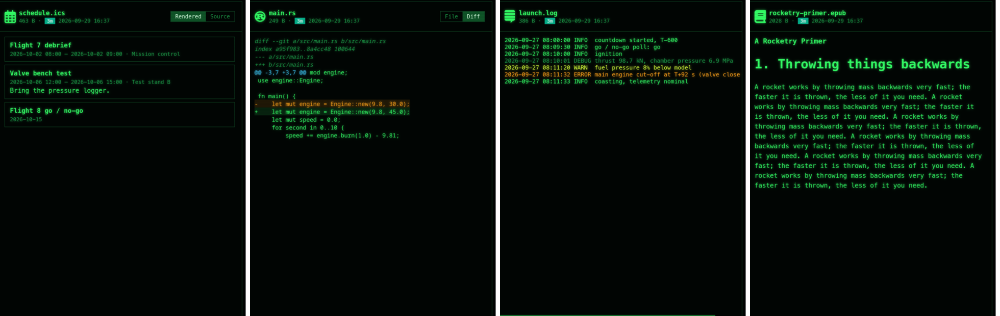

[← README](../../README.md) · [Docs index](../README.md) · [The preview pane](README.md)

# Text and code

Source code, config files, logs and plain text show highlighted in the current theme's colours;
Markdown shows rendered, with Mermaid diagrams and typeset math; a file git sees as changed can
show its diff. Use it to read a file without opening an editor.


*main.rs with **Diff** on, and launch.log with its WARN and ERROR lines coloured.*

## How to use it

1. Put the cursor on the file and press **Space** or **F3** to open the pane.
2. For Markdown, choose **Rendered** or **Source** at the top right.
3. For a file git shows as changed (a coloured git glyph in the panel), choose **File** or
   **Diff**.
4. **Enter** opens the file in its program, **F4** in your editor.

| Key | Desktop app | Terminal app |
|---|---|---|
| **Space** / **F3** | Shows or hides the pane | **F3** opens the file in your pager |
| **F4** | Opens the file in your editor | The same |
| **Enter** | Opens the file in its program | The same |

## Formats

| Files | Preview |
|---|---|
| Source code, config, plain text | Highlighted by [highlight.js](https://highlightjs.org/) (its "common" set of about 36 languages). The language comes from the extension; otherwise it is detected. Colours come from the theme, so every [theme](../customise/themes.md) matches |
| `.log` | Each line coloured by its level: `ERROR`, `FATAL`, `CRITICAL`, `PANIC` red; `WARN` yellow; `INFO`, `NOTICE` green; `DEBUG`, `TRACE`, `VERBOSE` grey |
| Binary files | A hex dump: offset, 16 bytes in hex, and the printable characters |
| `.md`, `.markdown` | Rendered by [marked](https://marked.js.org/); ```` ```mermaid ```` blocks drawn as diagrams by [Mermaid](https://mermaid.js.org/); `$…$`, `$$…$$`, `\(…\)` and `\[…\]` typeset by [KaTeX](https://katex.org/) |

A file counts as binary when its first 8 KB hold a zero byte. Anything the app has no special
view for is shown as text or hex, so every file has a preview.

### Markdown

The rendered view is the default; **Source** shows the Markdown itself, highlighted. Math is
typeset only when the file holds a `$`, `\(` or `\[`, so plain notes load quickly. A mistake in
a formula shows the formula in red instead of stopping the page. A Mermaid block that does not
parse shows Mermaid's error in its place. The diagrams take the theme's colours: green in
Cyber, grey in Windows 95. The whole result is cleaned by DOMPurify, so no script in a
Markdown file runs ([Safety](safety.md)).

### The git diff

**Diff** shows `git diff HEAD` for the file: staged and unstaged changes together, added lines
green, removed lines red. It is offered for files that are modified, staged, renamed, deleted
or conflicted, not for untracked or ignored ones. A file whose changes cancel out shows
*(no changes against HEAD)*. See [Git in the panels](../panels/git.md).

## What you see

- The text, with the language's colours, in the pane's monospace font.
- Under a file larger than 512 KB: *Showing the first 512 KB*.
- Files under 200 KB are highlighted; larger ones stay plain, so scrolling stays smooth.
- A hex dump in place of text for binary files.

## Settings and config.toml

None of its own. The colours follow the [theme](../customise/themes.md); the monospace font is
`[gui] mono_font` ([Glyphs and fonts](../customise/glyphs-and-fonts.md)). **Rendered / Source**
and **File / Diff** are remembered in the session, not in `config.toml`.

## In the terminal app

There is no preview pane, because the terminal draws character cells only. **F3** opens the file
in `$PAGER` (the `viewer` key in `config.toml` wins, else `less`, or `more` on Windows); **F4**
opens it in `$VISUAL` / `$EDITOR` (or `editor`, else `vi` / `notepad`). For a diff, type
`git diff HEAD -- file` on the command line. See [View and edit](../commands/view-and-edit.md).

## Questions

#### Space types a space in the command line instead of opening the preview.

When the command line has text, **Space** belongs to it. Press **Esc** to clear the line, or
use **F3**, which always toggles the pane.

#### Why is a large file shown without colours?

Highlighting a file over 200 KB would make scrolling slow, so it stays plain. Over 512 KB, only
the first 512 KB is read at all (*Showing the first 512 KB*). Press **F4** to see all of it in
your editor.

#### Why is my text file shown as a hex dump?

Its first 8 KB contain a zero byte, which is how the pane tells binary from text. UTF-16 files
have one in almost every character, so they show as hex too.

#### Why do pictures in my Markdown not show?

A picture given by a path next to the file (``) is not found: the Markdown
preview does not resolve relative paths. A picture from the web (``) is loaded
by the webview, as a browser would.

#### Why is there no Diff button on a new file?

Git has no earlier version of an untracked file to compare against. Once you `git add` it,
**Diff** appears and shows the whole file as added.

#### The language is guessed wrong.

The extension decides; a file without one (or with an unknown one) is detected by
highlight.js from its content, which can miss on short files. Give the file its usual extension.

#### Can I choose Source by default?

Yes: press **Source** once. The choice sticks for every Markdown, HTML, diagram and data file
until you press **Rendered** (or **Tree**, **Table**) again, also after a restart.

---
[← Previous: The preview pane](README.md) · [Next: Documents →](documents.md)
