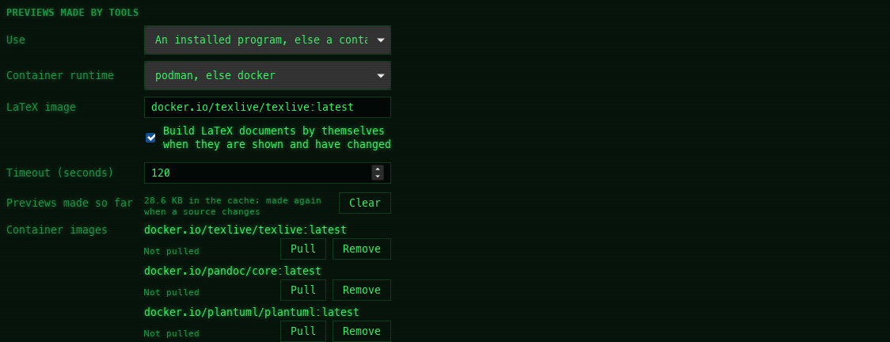

[← README](../../README.md) · [Docs index](../README.md) · [The preview pane](README.md)

# Previews made by tools

Some formats need a real program: a TeX distribution, LibreOffice, PlantUML, pandoc, DuckDB.
Coxswain uses one that is installed, or runs it in a [container](containers.md) (podman or
docker), so nothing has to be installed for a preview you only need now and then. Results are
kept in a cache, so each file is made once.


*The engine buttons at the top of a tool preview: here the installed `plantuml` is used; the container is greyed, as there is no podman or docker to run it.*



## Contents

- [The tools](#the-tools)
- [How to use it](#how-to-use-it)
- [How it works](#how-it-works)
- [The preview cache](#the-preview-cache)
- [What you see](#what-you-see)
- [Settings and config.toml](#settings-and-configtoml)
- [In the terminal app](#in-the-terminal-app)
- [Questions](#questions)

## The tools

| Files | Tool | Installed programs it looks for | Container image (default) | Result | Runs by itself |
|---|---|---|---|---|---|
| `.tex`, `.ltx` | LaTeX ([LaTeX projects](latex.md)) | `latexmk`, `tectonic`, `pdflatex` | `docker.io/texlive/texlive:latest` (about 5 GB) | PDF | After 0.8 s, when `latex_auto` is on |
| `.doc` `.docm` `.dotx` `.odt` `.ott` `.rtf` `.ppt` `.pptx` `.pps` `.ppsx` `.pot` `.potx` `.odp` `.otp` `.odg` `.vsd` `.vsdx` `.pub` `.wpd` `.wps` | LibreOffice ([Office](office.md)) | `soffice`, `libreoffice` (also its usual macOS and Windows install folders) | none; set one you trust | PDF | After 0.6 s |
| `.puml`, `.plantuml`, `.pu`, `.iuml`, `.wsd` | PlantUML ([Diagrams](diagrams.md)) | `plantuml` | `docker.io/plantuml/plantuml:latest` | SVG | At once |
| `.rst`, `.rest` | pandoc ([Documents](documents.md)) | `pandoc` | `docker.io/pandoc/core:latest` | HTML | At once |
| `.duckdb`, `.ddb` | DuckDB ([Data](data.md)) | `duckdb` | none; set one you trust | Tables, row estimates, column counts | At once |

"Runs by itself" never includes a container whose image is not pulled yet: a download waits for
your click.

## How to use it

1. Put the cursor on the file and open the pane with **Space** or **F3**.
2. It renders by itself (see the table), or shows a button: **Build PDF**, **Render** or
   **Read tables**. Press it.
3. To use another engine, click its button at the top; that renders again with it, and the pick
   is remembered for the tool (in the session).
4. To change what is preferred, or the container runtime, open *Settings → Previews made by
   tools* (**Ctrl+,**).

| Key | Desktop app | Terminal app |
|---|---|---|
| **Space** / **F3** | Shows or hides the pane | – |
| **Ctrl+,** | Settings | – (edit `config.toml`) |

## How it works

1. **The engines.** The buttons list the installed programs (one per real program:
   `libreoffice` is usually a link to `soffice`, so only one shows) and the container, labelled
   by runtime and image, e.g. **podman texlive:latest**. When none of the programs is
   installed, the first is shown greyed out; hover it for the reason (*tectonic is not
   installed*). The container is greyed with *No image for duckdb: set [preview.images] duckdb
   in the config* or *Neither podman nor docker is installed*.
2. **The default.** Without a pick of yours, the first available engine is used, in the order
   `prefer` gives: `auto` puts installed programs first and the container last; `local` never
   defaults to a container; `container` puts it first.
3. **Waiting a moment.** A tool starts only once the file has stayed under the cursor for a
   moment, so moving through a folder does not start one per file.
4. **Running.** The preview says *Rendering with latexmk…*. Programs run in the file's folder;
   containers as described in [Containers](containers.md). Every program is started without
   the AppImage's own libraries, so an installed LibreOffice or LaTeX works from the AppImage
   too.
5. **Errors** show in the preview in red, with **Try again**. A run longer than the timeout is
   stopped: *Stopped after 120 s (the timeout in [preview])*. A tool that ends without a file
   says *The tool finished without producing a result.*

## The preview cache

Results go to the cache folder (`~/.cache/coxswain/previews` on Linux, `~/Library/Caches/coxswain/previews`
on macOS, `%LOCALAPPDATA%\coxswain\previews` on Windows), in a folder named after a hash of the
file's path, size and modification time, the tool and the engine; for LaTeX also the newest
change in the document's folder. So:

- A file renders once and shows at once afterwards, also after a restart.
- Editing it makes the next render fresh; the old result is simply no longer used.
- Each engine has its own result, so switching back and forth costs nothing after the first run.

*Settings → Previews made by tools → Previews made so far* shows how much room they take
(*84.2 MB in the cache; made again when a source changes*). **Clear** empties the cache (it is
greyed when the cache is empty); every preview is then made again when next shown. See [Where
things are kept](../reference/where-things-are-kept.md).

## What you see

| Line or button | Means |
|---|---|
| **Build PDF** / **Render** / **Read tables** | Waiting for a click; the engine's note is under it |
| *Runs docker.io/pandoc/core:latest without network access* | The container's image is here |
| *First run pulls docker.io/texlive/texlive:latest (about 5 GB)* | The first click downloads the image |
| *Rendering with soffice…* | Running |
| *Pulling docker.io/texlive/texlive:latest…* and a progress line | Downloading the image |
| *soffice is not installed. No image for libreoffice: set [preview.images] libreoffice in the config. See the [preview] section in the config.* | No engine can run |
| *Stopped after 120 s (the timeout in [preview])* | Too slow |
| **Try again** | After an error |

## Settings and config.toml

```toml
[preview]
prefer = "auto"          # "auto" (installed program first, else container), "local", "container"
container = "auto"       # "auto" (podman, else docker), "podman", "docker", "off"
timeout = 120            # seconds per conversion; pulling is not counted
latex_auto = true        # build LaTeX by itself when shown and changed

[preview.prefer_tool]    # per tool, overrides prefer
libreoffice = "local"

[preview.images]         # "" means that tool never uses a container
latex = "docker.io/texlive/texlive:latest"   # or :latest-medium, about 2 GB
plantuml = "docker.io/plantuml/plantuml:latest"
pandoc = "docker.io/pandoc/core:latest"
libreoffice = ""
duckdb = ""
```

| Settings → Previews made by tools | config.toml | Choices, default |
|---|---|---|
| *Use* | `prefer` | *An installed program, else a container* (`auto`, default), *Installed programs only* (`local`), *Containers, even when a program is installed* (`container`) |
| *Container runtime* | `container` | *podman, else docker* (`auto`, default), podman, docker, *No containers* (`off`) |
| *LaTeX image* | `images.latex` | `docker.io/texlive/texlive:latest` |
| *Build LaTeX documents by themselves when they are shown and have changed* | `latex_auto` | on |
| *Timeout (seconds)* | `timeout` | 10 to 3600, `120` |
| *Previews made so far* | – | The cache size, **Clear** |
| *Container images* | `images.*` | Each image with **Pull** and **Remove** ([Containers](containers.md)) |

Setting one image keeps the others' defaults. `prefer_tool` and the other images are set in
`config.toml` only. Every key: [Configuration](../reference/configuration.md#preview).

## In the terminal app

The terminal app has no preview pane, so it runs none of these tools; the `[preview]` section is
the desktop app's (the terminal app reads the same `config.toml` and leaves it alone). Run the
tool yourself on the command line (`latexmk -pdf`, `soffice --headless --convert-to pdf`,
`plantuml`, `pandoc`, `duckdb`) and open the result with **Enter**.

## Questions

#### Why does the preview show a button instead of rendering?

Either the tool waits for a click (LaTeX with `latex_auto` off), or the only engine is a
container whose image is not pulled yet. Coxswain never starts a download of gigabytes by
itself. The note under the button says which.

#### How do I stop using containers?

*Settings → Previews made by tools → Container runtime → No containers* (`container = "off"`),
or *Use → Installed programs only* (`prefer = "local"`), which keeps the container as a button
but never as the default.

#### I installed a program, but the button still says it is not installed.

Coxswain looks for it on the `PATH` the app was started with. A desktop session started before
the install may have the old `PATH`; start Coxswain again. On macOS and Windows, LibreOffice is
also found in its usual install folder.

#### How much room do previews take, and can I free it?

*Settings → Previews made by tools → Previews made so far* shows the size; **Clear** frees it.
Nothing is lost: previews are made again when shown.

#### Can I use a tool from a container even though it is installed?

Yes: click the container's button (the pick is remembered for that tool), or set
`prefer = "container"`, or per tool `[preview.prefer_tool] latex = "container"`.

#### Why did the timeout not stop the first run?

Pulling an image is not counted: it can be gigabytes. The timeout starts with the run itself.

#### Where is the result? Can I keep the PDF?

In the preview cache ([above](#the-preview-cache)). Copy it from there, or better, build it
yourself; the cache is emptied by **Clear** and its folders are named by hashes.

---
[← Previous: LaTeX projects](latex.md) · [Next: Containers →](containers.md)
