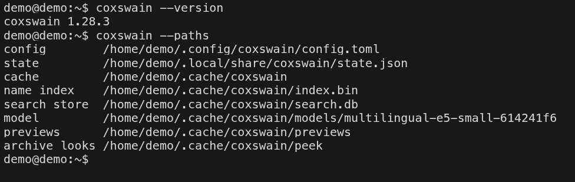

[← README](../../README.md) · [Docs index](../README.md) · [Reference](README.md)

# Command-line flags

Every flag of both programs, `coxswain` (the terminal app) and `coxswain-gui` (the desktop app).
Use them to start in certain folders, to find where Coxswain keeps its files, and to change the
settings that do more than set a value (search by meaning, the search helper) without the
Settings window. For the command line *inside* Coxswain, where you type shell commands, see
[The command line and its output](../commands/command-line.md).



## Contents

- [How to use it](#how-to-use-it)
- [The terminal app: `coxswain`](#the-terminal-app-coxswain)
- [`--meaning`](#--meaning)
- [`--index-service`](#--index-service)
- [The desktop app: `coxswain-gui`](#the-desktop-app-coxswain-gui)
- [The helper: `--index-helper`](#the-helper---index-helper)
- [What you see](#what-you-see)
- [Settings and config.toml](#settings-and-configtoml)
- [Questions](#questions)

## How to use it

1. Open a shell. Both programs are on your `PATH` after an install ([README → Install](../../README.md#install)).
2. Type the program, then the flag: `coxswain --paths`, `coxswain-gui --settings=meaning`.
3. A flag is read only as the **first** argument, and one at a time. `coxswain --paths --version`
   prints the paths and ignores `--version`.

| Want | Terminal app | Desktop app |
|---|---|---|
| Start in two folders | `coxswain ~/src ~/Downloads` | `coxswain-gui ~/src ~/Downloads` |
| Start on a file | `coxswain notes.md` | `coxswain-gui notes.md` |
| The version | `coxswain --version` | The title of *Help* (**F1**), or the window title |
| Where things are kept | `coxswain --paths` | Settings shows the search store and model paths |
| Every default | `coxswain --dump-config` | – |
| Search by meaning on | `coxswain --meaning on` | `coxswain-gui --settings=meaning`, then *Download the model and turn on* |
| Find duplicates in a folder | – | `coxswain-gui --duplicates ~/Pictures` |

## The terminal app: `coxswain`

`cox` is the same program under a shorter name. `coxswain --help` prints:

```
coxswain [LEFT] [RIGHT]      a folder, or a file to open its folder with the cursor on it
  --dump-config   print the full default config (redirect it to the config file to customise)
  --config-path   print where the config file is read from
  --paths         print where everything is kept: config, state, index, search store, model
  --index-service on|off   start the search helper with your session, or stop doing so
  --meaning on|off|delete  search by meaning: download the model and turn it on, turn it off,
                           or turn it off and delete the model
  --meaning ollama [MODEL] the vectors from Ollama here (bge-m3 unless named; pulled if missing)
  --meaning server URL MODEL  the vectors from a server with the OpenAI API (Lemonade, LM Studio)
  --meaning builtin        back to the built-in model
  --meaning ask MODEL|off  Ask in Find file: the chat model on that server (Ollama here with the
                           built-in model) that answers questions from your files
  --version
  --help
```

| Flag | Does |
|---|---|
| `LEFT`, `RIGHT` | The folders of the left and right panel. A relative path is from the current folder, `~` is home. A file opens its folder with the cursor on it. Without them: the current folder in both |
| `--help`, `-h` | Prints the text above |
| `--version`, `-V` | Prints `coxswain 1.20.0` |
| `--dump-config` | Prints every option with its default, as TOML, including every built-in theme and the full `[keys]` table. `coxswain --dump-config > ~/.config/coxswain/config.toml` gives you the full list to edit |
| `--config-path` | Prints where `config.toml` is read from |
| `--paths` | Prints where everything is kept, one line each: `config`, `state`, `cache`, `name index`, `search store`, `model`, `previews`. See [Where things are kept](where-things-are-kept.md) |
| `--index-service [on\|off]` | The search helper with your session: see [below](#--index-service) |
| `--meaning [on\|off\|delete\|ollama\|server\|builtin]` | Search by meaning: see [below](#--meaning) |
| `--index-helper` | Runs as the search helper instead of the app: see [below](#the-helper---index-helper) |

Anything else that starts with `-` is taken as a folder name, like any other argument.

### `--meaning`

These write `config.toml` the way Settings does (keeping your comments and layout), then start a
new search helper with the new settings. See [Search by meaning](../search/meaning.md) and
[Search by meaning on a server](../search/servers.md).

| Flag | Does |
|---|---|
| `--meaning` | Prints `on` when `[search] meaning` is on **and** the built-in model is downloaded, else `off`. With a server and no built-in model it prints `off` even though the search is on |
| `--meaning on` | Downloads the built-in model (multilingual-e5-small, about 488 MB) if it is not there, showing `Downloading the model for search by meaning: 42%`, then sets `meaning = true`. It does not change `meaning_engine` |
| `--meaning off` | Sets `meaning = false`. The model stays on disk |
| `--meaning delete` | Sets `meaning = false` and deletes the model folder |
| `--meaning ollama [MODEL]` | Uses Ollama on this machine (`http://localhost:11434`) with `MODEL`, default `bge-m3`. When Ollama lacks the model it pulls it first: `Pulling bge-m3 with Ollama…`. Sets `meaning_engine = "ollama"`, `meaning_model` and `meaning = true` |
| `--meaning server URL MODEL` | Uses a server with the OpenAI API at `URL` (for example `http://localhost:8000/api/v1` for Lemonade) with `MODEL`. It first asks the server for its models, so a wrong address fails here, not later. Sets `meaning_engine = "openai"`, `meaning_url`, `meaning_model` and `meaning = true` |
| `--meaning builtin` | Back to the built-in model: sets `meaning_engine = "builtin"`, then does `--meaning on` |
| `--meaning ask MODEL` | [Ask](../search/ask.md)'s chat model, on the vectors' server (Ollama here with the built-in model). On Ollama a missing model is pulled first; an OpenAI-style server must list it. Sets `ask_model`. `--meaning ask off` empties it |

`--meaning server` without both a URL and a model prints
`usage: coxswain --meaning server URL MODEL, e.g. http://localhost:8000/api/v1 nomic-embed-text-v1-GGUF`.
A server that needs an API key reads it from the environment variable named in
`meaning_key_env` ([Configuration](configuration.md#search)); there is no flag for it.

### `--index-service`

| Flag | Does |
|---|---|
| `--index-service` | Prints `on` or `off`: whether the search helper starts with your session |
| `--index-service on` | Registers the helper with the system (a systemd user unit on Linux, a LaunchAgent on macOS, a Run entry on Windows) and starts it. The same as Settings → *Search inside files* → *Start the search helper with my session, so it reads while no window is open* |
| `--index-service off` | Removes the registration; the running helper makes way for one that leaves with the apps |

See [The search helper](../search/helper.md).

### Exit status

| Status | When |
|---|---|
| `0` | Done, or the app quit normally |
| `1` | A `--meaning` or `--index-service` flag failed; it prints `coxswain: …` with the reason |
| `2` | `config.toml` could not be read or has a mistake: `coxswain: config: …` or `coxswain: unknown key 'Ctlr+P'`. The app does not start |

## The desktop app: `coxswain-gui`

```
coxswain-gui [--settings[=SECTION]] [--duplicates [FOLDER …] | [LEFT] [RIGHT]]
```

| Flag | Does |
|---|---|
| `LEFT`, `RIGHT` | As in the terminal app. The last session is restored, and `LEFT` is added to the left pane as a new tab when no tab there shows it. `RIGHT` is used only when there is no saved session. Started from a desktop menu, where the current folder is `/`, it takes your home folder |
| `--settings` | Opens with the Settings window open, at the top |
| `--settings=search` | …scrolled to *Search inside files* |
| `--settings=meaning` | …scrolled to *Search by meaning* |
| `--duplicates [FOLDER …]` | Opens *Find duplicates* and scans these folders at once; without folders, the current one. The panes open as usual behind it |
| `--index-helper` | Runs as the search helper, with no window: see [below](#the-helper---index-helper) |

`--settings` must come first, then `--duplicates`; everything else is taken as folders. Given
both, *Find duplicates* opens (there is one window at a time); Settings is a **Ctrl+,** away.
Another section name after `--settings=` opens it at the top.

The desktop app has no `--help`, `--version`, `--paths` or `--meaning`: use the terminal app's
flags, which work on the same `config.toml`, the same cache and the same helper. A
`config.toml` it cannot read does not stop it: it starts with every default and prints
`coxswain: config: …; using defaults` on the terminal it was started from.

## The helper: `--index-helper`

`coxswain --index-helper` and `coxswain-gui --index-helper` make the program the
[search helper](../search/helper.md) instead of an app: no window, no panels. The apps start it
by themselves when none runs; you never need to. It leaves ten minutes after the last app has
gone. With `--stay` after it, it does not leave; that is how the session registration
(`--index-service on`) starts it.

## What you see

- The printing flags (`--help`, `--version`, `--paths`, `--config-path`, `--dump-config`, and
  `--meaning` or `--index-service` without a word after them) print to the terminal and exit.
  No window opens.
- `--meaning on` shows the download percentage on one line while it runs; `--meaning ollama`
  shows `Pulling bge-m3 with Ollama…`. Both print nothing when they succeed.
- `coxswain-gui --settings=…` and `--duplicates` open the main window with that dialog on top.

## Settings and config.toml

The flags write these keys:

| Flag | Keys it writes |
|---|---|
| `--meaning on`, `off`, `delete` | `[search] meaning` |
| `--meaning ollama` | `[search] meaning_engine`, `meaning_model`, `meaning` |
| `--meaning server` | `[search] meaning_engine`, `meaning_url`, `meaning_model`, `meaning` |
| `--meaning ask` | `[search] ask_model` |
| `--meaning builtin` | `[search] meaning_engine`, `meaning` |
| `--index-service` | None: it writes the system's session registration, not `config.toml` |

Every other flag changes nothing. See [Configuration: every key](configuration.md).

## Questions

#### How do I find out which version I have?

`coxswain --version` prints `coxswain 1.20.0`. In the desktop app, the title of *Help* (**F1**)
and the window title show it: `Coxswain 1.20.0 · search: names · text`.

#### `coxswain-gui --help` opened a window.

The desktop app takes arguments it does not know as folders. Use `coxswain --help`.

#### `coxswain --meaning ollama` says it cannot connect.

Ollama must be running on this machine (`ollama serve`) on its usual port 11434. The flag always
talks to Ollama on this machine. For Ollama on another machine, set `meaning_url` in
`config.toml` or use Settings → *Search by meaning* → *Server*.

#### Can I set the API key for a server on the command line?

No, on purpose: a key on the command line ends up in your shell history. Put it in an
environment variable and name that variable in `[search] meaning_key_env`. The key itself is
never written to `config.toml`.

#### I gave the desktop app two folders and the right pane ignored mine.

With a saved session, the desktop app restores it and only adds `LEFT` as a tab on the left.
`RIGHT` is used on a first start, when there is no session yet.

#### How do I open Settings straight at search by meaning?

`coxswain-gui --settings=meaning`. `--settings=search` opens it at *Search inside files*. A
desktop menu entry or a script can use these.

#### Does `--dump-config` change my config?

No. It prints to the terminal only. Redirect it with `>` yourself if you want a file; see
[Configuration](configuration.md#questions) before you do.

#### Why is a flag after a folder ignored?

A flag is looked at only as the first argument. In `coxswain ~/src --paths`, `--paths` is taken
as the right panel's folder, not as a flag. Put the flag first, on its own: `coxswain --paths`.

---
[← Previous: The terminal app](terminal-app.md) · [Next: Configuration: every key →](configuration.md)
