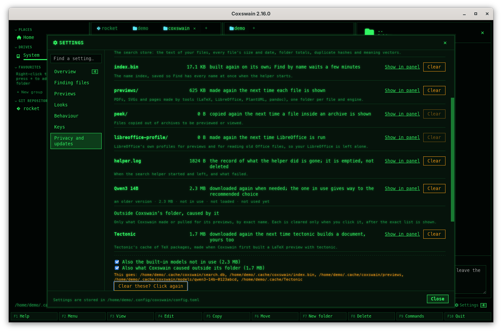

[← README](../../README.md) · [Docs index](../README.md) · [Reference](README.md)

# Disk use

Every place Coxswain keeps things on the disk, in one list: what each is, its size, where it is,
what clearing it costs, and a button that clears it. What Coxswain caused outside its own folder
(Tectonic's cache, container images it pulled for previews) is listed too, and cleared only when
you ask for it by name. [Where things are kept](where-things-are-kept.md) has every path on each
system; this page is about the room they take and getting it back.


*Settings → Privacy and updates → Disk use in the desktop app.*

## Contents

- [How to reach it](#how-to-reach-it)
- [The rows](#the-rows)
- [Clearing](#clearing)
- [Outside Coxswain's folder](#outside-coxswains-folder)
- [In the terminal app](#in-the-terminal-app)
- [On the command line](#on-the-command-line)
- [Settings and config.toml](#settings-and-configtoml)
- [Questions](#questions)

## How to reach it

| Where | Desktop app | Terminal app |
|---|---|---|
| The command list | **F9** → *Disk use* | **F9** → *Disk use* |
| Settings | **Ctrl+,** → *Privacy and updates* → *Disk use* (click the heading to open it; it shows the total beside it) | **F9** → *Settings* → *Privacy and updates*, rows under *Disk use* |
| Starting at it | `coxswain-gui --settings=disk` | `coxswain --settings=disk` |
| From the file itself | The preview of `index.bin` or `search.db` → **Settings at Disk use** ([Data previews](../previews/data.md#coxswains-own-index-and-store)) | **F3** on either file names the way there |
| Command line | | `coxswain --disk`, `coxswain --disk clear …` |

*Disk use* has no key of its own; it is an entry of the command list (**F9**) and F1 → Features.

## The rows

| Row | What it holds | Clearing it costs | In *Clear everything* |
|---|---|---|---|
| `search.db` (with `-wal`, `-shm`) | The search store: the text of your files, every file's size and date, folder totals, duplicate hashes, meaning vectors | It is read again on its own, at half speed; until then Find finds fewer words in files, and search by meaning has to make its vectors again | Yes |
| `index.bin` | The name index, saved so Find has every name at once when the helper starts | Built again on its own: Find by name waits a few minutes on a large disk | Yes |
| `previews/` | PDFs, SVGs and pages made by LaTeX, LibreOffice, PlantUML and pandoc | Made again the next time each file is shown | Yes |
| `peek/` | Files copied out of archives to be previewed or viewed | Copied again the next time | Yes |
| `inside-…/` | Left-overs of the search helper reading files inside archives; shown only when there are some | Nothing. A folder a running helper is using now is kept | Yes |
| `libreoffice-profile/` (and `libreoffice-index-profile/`) | LibreOffice's own profiles for previews and for reading old Office files | Made again the next time LibreOffice runs | Yes |
| `helper.log` | When the search helper started and left, and what failed | The record is gone. It is emptied, not deleted, since the helper writes to it | No |
| A built-in model (*Qwen3 4B*, *multilingual-e5-small*, a left-over) | Its weights ([Built-in models](../search/models.md)) | Downloaded again when needed; the one in use gives way to the recommended choice | Only when ticked, and never the one in use |
| *Tectonic* | Tectonic's cache of TeX packages, made by a LaTeX preview | Downloaded again the next time tectonic builds a document, yours too | Only when ticked |
| A container image | The image of `[preview] images` for LaTeX, PlantUML, pandoc … | Pulled again the next time a preview needs it | Only when ticked |

Each row shows its name, its size, what clearing costs, **Show in panel** (the active pane opens
its folder, the cursor on the file; hover it for the path) and **Clear**. The small line under it
says what it holds. The total of all rows is beside the heading *Disk use*.

Sizes are measured when the area opens: the folders on disk at once, the container images a
moment later (podman or docker is asked about each image by its exact name).

## Clearing

- **Clear** on a row: the button turns into *Clear /home/me/.cache/coxswain/previews? Click
  again*; the second click clears it and the line under the list says *previews/ cleared: 12.4 MB
  freed.* Moving away (the button loses the focus) cancels it.
- **Clear everything that can be built again (…)** clears the rows marked *Yes* above. Tick *Also
  the built-in models not in use* or *Also what Coxswain caused outside its folder* to take those
  too; the size on the button follows. The first click lists exactly what goes (*This goes:
  /home/me/.cache/coxswain/search.db, …*) and turns the button into *Clear these? Click again*.



How each is cleared:

- **The search store while the search helper runs** is emptied by the helper itself (the same as
  *Delete what was read* under Finding files → Details → Background reading): the store in use is
  never deleted from under it, and its write-ahead log is emptied too, so the room is free at
  once. With no helper running, the files are deleted.
- **The name index** is deleted, then a running helper is asked to make way for a new one, which
  builds the index again and saves it.
- **A built-in model in use** gives way first: Ask or search by meaning takes the recommended
  choice, saved, and the line says which (as under [Built-in models](../search/models.md)).
- **A container image** is removed with `podman image rm <name>` (or docker's). No container is
  ever started. An image a container still uses is refused by podman, and its words are shown.

## Outside Coxswain's folder

Coxswain lists only what it caused, matched exactly:

- **Tectonic's cache** (`~/.cache/tectonic` on Linux and the BSDs, `~/.cache/Tectonic` with older tectonic, `~/Library/Caches/Tectonic`
  on macOS, `%LOCALAPPDATA%\TectonicProject\Tectonic` on Windows, or `TECTONIC_CACHE_DIR`), and
  only when Coxswain made it: when a LaTeX preview runs tectonic and its cache folder was not
  there before, Coxswain notes the folder in `made-outside.txt` in its cache folder. A Tectonic
  cache you had before is never listed.
- **Container images** named in `[preview] images` (by default
  `docker.io/texlive/texlive:latest`, `docker.io/plantuml/plantuml:latest`,
  `docker.io/pandoc/core:latest`) that podman or docker has. Other images, even ones that look
  alike, are not listed.

Nothing outside is cleared by *Clear everything* unless its box is ticked, and every clear shows
the exact path or image name before the second click.

## In the terminal app

**F9** → *Disk use* opens Settings at *Privacy and updates* with the cursor on the first row of
*Disk use*: each row shows its name, size and what clearing costs; the bottom says what it holds,
what clearing costs and its path, and the key line *Enter: show in panel · Delete: clear*.


| Key | Does |
|---|---|
| **↑** **↓** | Moves between the rows |
| **Enter** | On a row: Settings closes and the active panel opens its folder, the cursor on the file |
| **Delete** | On a row: the bottom turns red, *This goes: /path (size) · what it costs. Enter clears it, Esc keeps it* |
| **Enter** (asked) | Clears it; the key line says *previews/ cleared: 12.4 MB freed.* |
| **Esc** (asked) | Keeps it |
| **Space** or **Enter** | On *Also the built-in models not in use* or *Also what Coxswain caused outside its folder*: ticks it |
| **Enter** | On *[ Clear everything that can be built again ]*: lists what goes, red, and asks |

The container images come a moment after the area opens: the terminal app asks podman or docker
on a thread of its own.

## On the command line

`coxswain --disk` prints every row: its name to clear it by, its size, its file name, its path,
what it holds and what clearing it costs, under *In Coxswain's cache folder*, *Built-in models*
and *Outside Coxswain's folder, caused by it*; then the total that is built again on its own.

```
$ coxswain --disk
In Coxswain's cache folder
  store               284 KB  search.db
                              /home/me/.cache/coxswain/search.db
                              The search store: the text of your files, …
                              Clearing it: read again on its own, at half speed; …
  index               16.4 KB  index.bin
…
Built again on their own: 12.9 MB, coxswain --disk clear rebuildable
```

| Command | Does |
|---|---|
| `coxswain --disk clear store` | Empties the search store, through the helper when one runs: *search.db cleared: 284 KB freed.* |
| `coxswain --disk clear index` (`previews`, `peek`, `inside`, `libreoffice`, `log`) | Clears that row |
| `coxswain --disk clear qwen3-4b-a06e946b` | A model, by the name in the first column; the same as `coxswain --models delete`, which asks *[y/N]* for the one in use |
| `coxswain --disk clear tectonic`, `coxswain --disk clear images`, `coxswain --disk clear docker.io/pandoc/core:latest` | Prints *This goes:* with the exact path or image and its size, then asks *[y/N]* |
| `coxswain --disk clear rebuildable` | Every row that is built again on its own: *Cleared: 12.9 MB freed.* |

A value it does not know is refused with the names it takes and exit status 2, like every other
option ([Command-line flags](command-line-flags.md)); a clear that fails exits with 1.

## Settings and config.toml

Disk use has no options. The images it lists are `[preview] images`; which runtime it asks is
`[preview] container` (`auto`, `podman`, `docker`, or `off` for none). The folders follow the
system's ([Where things are kept](where-things-are-kept.md#on-each-system)).

## Questions

#### What can I clear without losing anything?

Everything in the list but your models and what is outside comes back by itself. **Clear
everything that can be built again** takes the search store, the name index, previews, archive
copies and LibreOffice profiles. The cost is time: the search store is read again at half speed
(**Read now** in Settings → *Finding files* reads at full speed), and Find by name waits for the
index.

#### Will it delete container images or a Tectonic cache that are mine?

No. Only the images named in `[preview] images` are listed, by their exact names, and a Tectonic
cache only when Coxswain's own LaTeX preview made it (it is noted in `made-outside.txt`). Each
goes only on its own click (or `[y/N]` on the command line), after the exact path or name is
shown.

#### I cleared search.db and it is large again a minute later. Why?

The helper reads your files again at once. The size grows back to what your files need; clearing
it frees room only for as long as the reading takes. To keep it small for good, read fewer
folders (Settings → *Finding files* → *Details* → *Folders*) or turn off search inside files.

#### Is it safe to clear search.db while Coxswain runs?

Yes. While the search helper runs, it empties the store itself, so nothing is cut from under it;
the desktop app's duplicate finder waits for it. With no helper, the file is deleted.

#### Why is Tectonic listed but my Docker images are not?

Only images named in `[preview] images` are Coxswain's. Tectonic's cache is listed when a LaTeX
preview made it; one that was there before Coxswain first ran tectonic is yours and not shown.

#### Why does helper.log not go with Clear everything?

It is not built again: it is the record of what the helper did, which you may want when
something failed. Clear it on its own row; it is emptied, not deleted, since the helper writes to
it.

#### The container images do not show.

Podman or docker is asked only when it is there and `[preview] container` is not `off`, and only
about the images in `[preview] images`. An image that was never pulled has no size and no row.

#### What does the terminal app show that the desktop app does not, or the other way?

The same rows and the same clearing in both. The desktop app has **Show in panel** and the two
clicks; the terminal app has **Enter** and **Delete**, and `coxswain --disk` on the command line.

---
[← Previous: Where things are kept](where-things-are-kept.md) · [Next: Security →](security.md)
