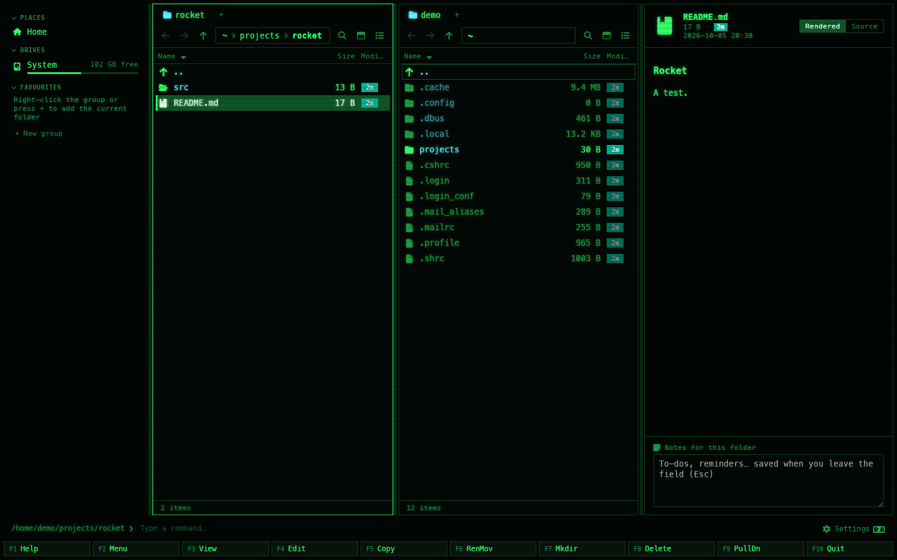

[← README](../../README.md) · [Docs index](../README.md) · [Reference](README.md)

# FreeBSD

Both apps run on FreeBSD. The terminal app, `coxswain`, is a first-class build: one binary that
needs nothing beyond the base system, tested on every change. The desktop app, `coxswain-gui`,
is **experimental** on FreeBSD: it is built and tested on every change as well, and browsing,
the preview pane, Find, copy, move, the trash and the clipboard work, but it is built from two
patched crates until their fixes are released, and it has had less use on real desktops than on
Linux. [What experimental means here](#the-desktop-app-what-experimental-means).

Release builds are for **FreeBSD 14 and 15 on amd64**, built on FreeBSD 14.5. Other
architectures build from source.


*The desktop app on FreeBSD 14.5, theme Cyber, with a Markdown file in the preview pane (F3).*

## Contents

- [Install with one line](#install-with-one-line)
- [What the script does](#what-the-script-does)
- [Install by hand](#install-by-hand)
- [The packages, and what each is for](#the-packages-and-what-each-is-for)
- [Starting the apps](#starting-the-apps)
- [The search helper](#the-search-helper)
- [Search by meaning and Ask](#search-by-meaning-and-ask)
- [How FreeBSD differs from Linux here](#how-freebsd-differs-from-linux-here)
- [Updating](#updating)
- [Uninstalling](#uninstalling)
- [Building from source](#building-from-source)
- [The desktop app: what experimental means](#the-desktop-app-what-experimental-means)
- [Troubleshooting](#troubleshooting)
- [Other BSDs](#other-bsds)
- [Questions](#questions)

## Install with one line

```sh
fetch -qo - https://raw.githubusercontent.com/mwo-dk/coxswain/master/install/install-freebsd.sh | sh
```

The script is plain `sh`, so it runs from any login shell. It asks before it does anything that
needs root, shows each `pkg install` command before it runs it, and checks every download
against its SHA-256 sum. To read it first:

```sh
fetch https://raw.githubusercontent.com/mwo-dk/coxswain/master/install/install-freebsd.sh
less install-freebsd.sh
sh install-freebsd.sh
```

| Option | Does |
|---|---|
| `--terminal-only` | Only the terminal app; no packages are needed |
| `--prefix DIR` | Install into `DIR`. Without it the script uses the place Coxswain is already in, or asks: `/usr/local` for every user, or `~/.local` for you alone |
| `--version v1.43.0` | That release instead of the latest |
| `--from DIR` | Install from release archives already in `DIR`, without downloading (a machine without network) |
| `--yes` | Answer yes to every question |
| `--uninstall` | Remove what the script installed |

Options go after `sh -s --` when the script comes through a pipe:
`fetch -qo - …/install-freebsd.sh | sh -s -- --terminal-only`.

## What the script does

1. Asks GitHub for the latest release and downloads
   `coxswain-terminal-<version>-x86_64-unknown-freebsd.tar.gz` and its `.sha256`, and stops if
   the sum does not match.
2. Installs `bin/coxswain`, the `cox` link and the manual page `coxswain(1)` under the prefix.
   With the prefix `/usr/local` it also installs the rc.d script
   `/usr/local/etc/rc.d/coxswain_index`, which stays off until you turn it on
   ([the search helper](#the-search-helper)).
3. For the desktop app, checks which of its packages are missing, prints the `pkg install`
   line, and runs it through `doas` or `sudo` when you say yes. Without WebKitGTK it leaves the
   desktop app out and says so; the terminal app is installed either way.
4. Downloads `coxswain-desktop-<version>-x86_64-unknown-freebsd.tar.gz` the same way and
   installs `bin/coxswain-gui`, `share/applications/coxswain.desktop` and the icon
   `share/icons/hicolor/128x128/apps/coxswain.png`, so Coxswain appears in your desktop's menu.
5. Lists the optional packages that are not installed, with what each adds.

When you install into `~/.local`, nothing needs root except the packages, and
`man coxswain` finds the manual once `~/.local/bin` is on your `PATH` (man(1) looks next to each
`bin` folder on it). The script prints the line to add for `sh` and for `csh`/`tcsh`.

## Install by hand

Every release on the [releases page](https://github.com/mwo-dk/coxswain/releases/latest) has
both archives with their sums:

```sh
v=v1.43.0
t=x86_64-unknown-freebsd
fetch https://github.com/mwo-dk/coxswain/releases/download/$v/coxswain-terminal-$v-$t.tar.gz
fetch https://github.com/mwo-dk/coxswain/releases/download/$v/coxswain-terminal-$v-$t.tar.gz.sha256
sha256 -c "$(cut -d' ' -f1 coxswain-terminal-$v-$t.tar.gz.sha256)" coxswain-terminal-$v-$t.tar.gz
tar xzf coxswain-terminal-$v-$t.tar.gz
cd coxswain-terminal-$v-$t
doas install -m 755 coxswain /usr/local/bin/
doas ln -sf coxswain /usr/local/bin/cox
gzip -9c coxswain.1 | doas tee /usr/local/share/man/man1/coxswain.1.gz >/dev/null
doas install -m 555 coxswain_index /usr/local/etc/rc.d/
```

The desktop archive holds `coxswain-gui`, `coxswain.desktop` and `coxswain.png`: install the
packages below first, then copy the binary to `/usr/local/bin`, the `.desktop` file to
`/usr/local/share/applications` and the icon to `/usr/local/share/icons/hicolor/128x128/apps`.
Every download can also be checked against the release's `SHA256SUMS` and its signed provenance
([Security](security.md)).

## The packages, and what each is for

The terminal app needs no packages: it links only against the base system's libraries.

| Package | For | Needed by |
|---|---|---|
| `webkit2-gtk_41` | The desktop app's window content: WebKitGTK with the 4.1 API | Desktop app, required |
| `gtk3` | The window, its menus and dialogs | Desktop app, required (comes with `webkit2-gtk_41`) |
| `libsoup3` | WebKitGTK's network layer | Desktop app, required (comes with `webkit2-gtk_41`) |
| `xdg-utils` | `xdg-open`, which opens a file in its program (**Enter** on a file the app does not show itself) | Desktop app; the terminal app uses it for the same |
| `gstreamer1-plugins-good` | Video and sound in the preview pane | Desktop app; without it a notice says what to install |
| `nerd-fonts` | The file icons and git glyphs in both apps | Optional; or set `glyphs = "ascii"` ([Glyphs and fonts](../customise/glyphs-and-fonts.md)) |
| `noto-sans-jp`, `noto-sans-kr` | Japanese and Korean letters in the desktop app | Optional; a notice says so when the language is in use and no font is there |
| `tesseract` | Search the words in scans, screenshots and pictures | Optional ([Scans and pictures](../search/scans.md)) |
| `poppler-utils` | The same for scanned PDFs: `pdftoppm` makes pictures of their pages | Optional, with `tesseract` |
| `libreoffice` | Search older Office files: `.doc`, `.ppt`, Visio and others | Optional |
| `git` | Git status, history and branches in the panels | Optional; most machines have it |
| `ollama` | A model server for search by meaning and Ask | Optional ([below](#search-by-meaning-and-ask)) |

Where one of the optional programs is missing, both apps show the line that installs it with
`pkg` (`pkg install tesseract`, `pkg install texlive-full` for LaTeX previews, `pkg install
hs-pandoc` …), with **Copy** in the desktop app and **Space** to copy in the terminal app's
Settings. Coxswain never runs it; run it as root, or with `doas` in front
([Installing what is missing](../search/scans.md#installing-what-is-missing)).

The session D-Bus is not needed. A desktop session that runs `dbus` (as KDE Plasma, Xfce, GNOME
and MATE do) is fine too.

## Starting the apps

| App | Start | Notes |
|---|---|---|
| Terminal app | `coxswain` or `cox`, optionally with two folders: `coxswain ~/src /usr/ports` | Any terminal with 256 colours; true colour looks best. Works on the console (`vt`) too, with `glyphs = "ascii"` |
| Desktop app | `coxswain-gui`, or *Coxswain* in the desktop's menu | Needs an X11 or Wayland session |

`coxswain --help` lists the command-line flags, and `man coxswain` describes them.

## The search helper

Find reads names, words and meaning from an index that the search helper keeps current. By
default the helper starts with the first Coxswain app and leaves ten minutes after the last
([The search helper](../search/helper.md)). To have it read while no app is open, start it with
your session, from boot, or from your login shell. Only one helper runs per user at a time, so
having two of these does no harm.

### With your desktop session

*Settings → Finding files → Details → Background reading → Start with my session* in the desktop app,
or `coxswain --index-service on` in a terminal, writes an XDG autostart entry:

```
~/.config/autostart/coxswain-index.desktop
```

KDE Plasma, Xfce, GNOME, MATE, LXQt and Cinnamon start it at login. A window manager on its own
(i3, sway, Openbox, twm) does not read autostart entries: use one of the ways below. The entry
starts the helper now as well. `coxswain --index-service off` (or unticking it) removes the
entry; the helper running now stays until you log out.

### From boot, with rc.d

For a machine you use over SSH, or a window manager without autostart. The script installs
`/usr/local/etc/rc.d/coxswain_index` (with the prefix `/usr/local`); it runs the helper as the
user you name, under daemon(8), which starts it again if it ends:

```sh
doas sysrc coxswain_index_enable=YES coxswain_index_user=alice
doas service coxswain_index start
service coxswain_index status
```

| rc.conf variable | Default | Meaning |
|---|---|---|
| `coxswain_index_enable` | `NO` | Start it at boot |
| `coxswain_index_user` | none, required | The user whose files are indexed; the helper runs as this user, with this user's home |

What the helper says goes to syslog (`/var/log/messages`), tagged `coxswain_index`. One rc.d
script serves one user; for a second user, copy it under another name
(`coxswain_index_bob`, with `name=` changed to match).

### From your login shell

The smallest way, for one user: start it when you log in. For `sh` (the default since FreeBSD
14), in `~/.profile`:

```sh
coxswain --index-helper --stay >/dev/null 2>&1 &
```

For `csh` or `tcsh`, in `~/.login`:

```csh
( coxswain --index-helper --stay >& /dev/null & )
```

A second login finds the first helper running and its own one ends at once.

## Search by meaning and Ask

| Way | On FreeBSD |
|---|---|
| The built-in model | Works as on Linux, on the processor: `coxswain --meaning on`, or *Settings → Search by meaning*. The model (488 MB) is downloaded once, after you say so |
| Ollama on this machine | `doas pkg install ollama`, start it with `ollama serve` in a terminal of its own, then `coxswain --meaning ollama` or the guide in Settings |
| A server elsewhere | Lemonade, LM Studio or llama.cpp on another machine, with the OpenAI API: `coxswain --meaning server http://host:port MODEL`. Its address is shown in Settings, and the text of your files goes there |

**Graphics cards.** The setup guide (`coxswain --setup-search`, or *Set up…* in Settings) finds an
NVIDIA card through `nvidia-smi`, which the `nvidia-driver` package installs. AMD cards and NPUs
are found on Linux from files FreeBSD does not have, so on FreeBSD the guide says no card was
found and advises models that suit the processor. Whether Ollama uses a card depends on how its
package was built: after the guide's test question, `ollama ps` shows `100% GPU` or `100% CPU`.

## How FreeBSD differs from Linux here

| Feature | On FreeBSD |
|---|---|
| File watching | kqueue. It holds an open descriptor for every path it watches, so the helper watches folders only, not files, shallowest first and at most 20,000 of them (a FreeBSD base system with a desktop has about 11,000). A file added, removed or renamed shows in Find within a second; folders past the 20,000 are read again at the hourly rebuild, and changed text is read within ten minutes |
| Trash (F8) | `~/.local/share/Trash`, the freedesktop.org layout that KDE, Xfce and GNOME use, so their trash shows and restores what Coxswain moved there |
| Drives in the sidebar | The mounted file systems, from the kernel's mount list; the root file system is *System* |
| Battery | `sysctl hw.acpi.acline`: `0` means on battery, and the helper pauses ([Battery](../search/battery.md)). A machine without ACPI power reporting counts as on mains |
| Removable disks | Known by their path only: a USB disk mounted somewhere else next time is read again, not recognised ([Removable disks](../search/removable-disks.md)) |
| Start with my session | An XDG autostart entry, not a service ([above](#the-search-helper)) |
| The update notice | Names the install script's one-line command ([Updating](#updating)) |
| Cloud folders | No cloud clients are detected on FreeBSD; files under a FUSE mount are read like any other |

## Updating

Both apps check once a day for a newer release, and say so with the command to update
([Update checks](updates.md)). On FreeBSD that command is the install line again:

```sh
fetch -qo - https://raw.githubusercontent.com/mwo-dk/coxswain/master/install/install-freebsd.sh | sh
```

It finds where Coxswain is installed and replaces it there. Your settings and the index stay.

## Uninstalling

```sh
fetch -qo - https://raw.githubusercontent.com/mwo-dk/coxswain/master/install/install-freebsd.sh | sh -s -- --uninstall
```

This removes the programs, the manual page, the menu entry, the icon, the rc.d script and the
autostart entry. If rc.conf turns the helper on, remove those lines too:
`doas sysrc -x coxswain_index_enable coxswain_index_user`. Your settings, the state and the index
stay; remove them with `rm -rf ~/.config/coxswain ~/.local/share/coxswain ~/.cache/coxswain`
([Where things are kept](where-things-are-kept.md)).

## Building from source

On any architecture FreeBSD's Rust supports (aarch64 too):

```sh
doas pkg install git rust pkgconf
git clone https://github.com/mwo-dk/coxswain.git && cd coxswain
cargo build --release --locked -p coxswain
```

For the desktop app as well:

```sh
doas pkg install node22 npm-node22 webkit2-gtk_41 gtk3 libsoup3 librsvg2-rust
(cd gui && npm ci && npm run build)
cargo build --release --locked -p coxswain-gui
```

The binaries are in `target/release/`. The terminal app is also on crates.io:
`cargo install --locked coxswain`. (`install/install.sh` is the Linux and macOS script; it needs
bash and does not know `pkg`.)

## The desktop app: what experimental means

Coxswain's desktop app is a [Tauri](https://tauri.app) app, and Tauri does not support FreeBSD
officially. It builds and runs because its window layer (tao, wry) is written for GTK on the
BSDs as on Linux, with two gaps that Coxswain patches until upstream releases close them:

| Crate | The problem | Patched with | Upstream |
|---|---|---|---|
| `tao` 0.37.1 | Resize hit testing was compiled for Linux only, so tao did not build on FreeBSD | tao's own commit `d19f4c1`, merged after 0.37.1 | [tauri-apps/tao#1356](https://github.com/tauri-apps/tao/pull/1356) |
| `drag` 2.1.1 | Its GTK backend, which drags files out of the window, was selected for Linux only | A fork, commit `5781aba` on `mwo-dk/drag-rs` | [crabnebula-dev/drag-rs#99](https://github.com/crabnebula-dev/drag-rs/pull/99) |

Both patches only widen a `cfg(target_os = "linux")` to the BSDs, so the Linux, macOS and Windows
builds compile the same code as from crates.io. They are in `[patch.crates-io]` in `Cargo.toml`
and go when the fixed versions are released.

Tested on FreeBSD 14.5 (amd64), on every change in CI and by hand under X11:

| Works | |
|---|---|
| Browsing, tabs, the sidebar with places and drives, the F-key bar, F9's command list | Yes |
| The preview pane (Markdown, code, pictures, PDF and the rest that need no extra package) | Yes |
| Find: names, words in files, the search helper | Yes |
| Copy (F5), move (F6), new folder (F7), delete to the trash (F8) | Yes |
| The clipboard: **Ctrl+C** on files offers them as `file://` lists (`text/uri-list`, GNOME's and Nautilus's formats) as on Linux, and **Ctrl+V** pastes them | Yes |
| Dragging files out of the window | The native GTK drag starts; dropping on other programs is not yet confirmed on a real desktop |
| Opening a file in its program | Through `xdg-open` (package `xdg-utils`), the same code as on Linux; not tried on FreeBSD yet |
| Video and sound in the preview | With `gstreamer1-plugins-good` |
| Wayland sessions | Not tested yet; `GDK_BACKEND=x11` starts it under XWayland |
| FreeBSD 15 | Built on 14.5; not tested on 15 yet |

The app has no tray icon and sends no desktop notifications, so neither depends on FreeBSD
support. Please report what works and what does not on your desktop in an
[issue](https://github.com/mwo-dk/coxswain/issues): the word *experimental* goes when it has had
that use.

## Troubleshooting

**The icons are empty boxes.** No Nerd Font is installed. `doas pkg install nerd-fonts`, then
restart the app; or choose plain characters: the [first-run guide](../panels/first-run.md)'s
*Looks* step offers both (*Use plain characters*), or Settings (**Ctrl+,**) → *Looks* → *Icons
and git glyphs* → *Plain characters (ASCII)*, or `glyphs = "ascii"`
in `config.toml` ([Glyphs and fonts](../customise/glyphs-and-fonts.md)).

**`coxswain-gui` says it cannot find `libwebkit2gtk-4.1.so.0`.** WebKitGTK is not installed:
`doas pkg install webkit2-gtk_41`.

**MESA-EGL warns about DRI3 when the app starts.** Harmless: there is no accelerated OpenGL
(a virtual machine, or `Xvfb`), and WebKitGTK draws in software.

**The window stays white or flickers.** Some graphics drivers disagree with WebKitGTK's
compositing. Start it with `WEBKIT_DISABLE_COMPOSITING_MODE=1 coxswain-gui`; if that helps,
put the variable in the `Exec=` line of `coxswain.desktop`, or in your shell's profile.

**Wayland or X11?** GTK chooses Wayland when `WAYLAND_DISPLAY` is set and X11 otherwise. To try
X11 under a Wayland compositor: `GDK_BACKEND=x11 coxswain-gui`.

**Enter on a file says no program could open it.** `xdg-open` is missing (`doas pkg install
xdg-utils`), or no program is set for that kind of file: `xdg-mime default <app>.desktop
<type>`.

**A new file deep in a large tree shows in Find only after an hour.** Its folder is past the
20,000 the helper watches ([above](#how-freebsd-differs-from-linux-here)). Leave large trees you
never search out of the index (`/usr/ports`, `/usr/src`, build folders): *Settings → Finding
files → Details → Folders → Never indexed*, or `name_exclude` in `[search]` ([Choosing the folders](../search/folders.md)).

## Other BSDs

The code that differs between systems is written for FreeBSD and falls back gracefully
elsewhere, but only FreeBSD is built and tested. On NetBSD, OpenBSD and DragonFly BSD the
terminal app may well build from source (`cargo build -p coxswain`); what is known to be missing:

| What | Missing on NetBSD, OpenBSD, DragonFly |
|---|---|
| Release builds, CI | None yet |
| Battery | Not read: the helper never pauses for it (OpenBSD and NetBSD report it through `apm` and `envsys`) |
| Memory in the setup guide | Not read: the guide's advice by memory size is missing |
| Desktop app | WebKitGTK 4.1 must be packaged (`www/webkitgtk41` on OpenBSD), and Rust's support for these systems is tier 3 on some architectures |

## Questions

**Is the desktop app safe to use on FreeBSD?** It uses the same code as on Linux for everything
that touches your files: copying, moving and deleting are in the shared core, tested on FreeBSD
in CI. *Experimental* is about the window layer and desktop integration, not about your data.

**Why is the desktop app experimental and the terminal app not?** The terminal app depends on
nothing FreeBSD-specific beyond what its tests cover. The desktop app depends on Tauri, which
does not support FreeBSD officially and needs two patched crates
([above](#the-desktop-app-what-experimental-means)).

**Is there a port or a package?** Not yet in the ports tree; a `sysutils/coxswain` port is being
prepared. Until then the script, the archives or `cargo install --locked coxswain`.

**Does it need Linux binary compatibility (`linux64`)?** No. Both apps are native FreeBSD
binaries.

**Why does the script ask for root?** Only to install packages with `pkg`, and to write under
`/usr/local` when you choose it. With `--prefix ~/.local` and `--terminal-only`, it needs no
root at all.

**Does Start with my session work under i3 or another window manager?** Not by itself: only
desktop environments read XDG autostart entries. Use the [rc.d script](#from-boot-with-rcd) or
the [login shell line](#from-your-login-shell); or start the entry with `dex`, if you use it
already.

**Does it run on aarch64 (a Raspberry Pi, an Ampere server)?** From source, yes; there is no
release build yet ([Building from source](#building-from-source)).

---
[← Previous: Performance](performance.md) · [Next: Questions, collected →](../faq.md)
