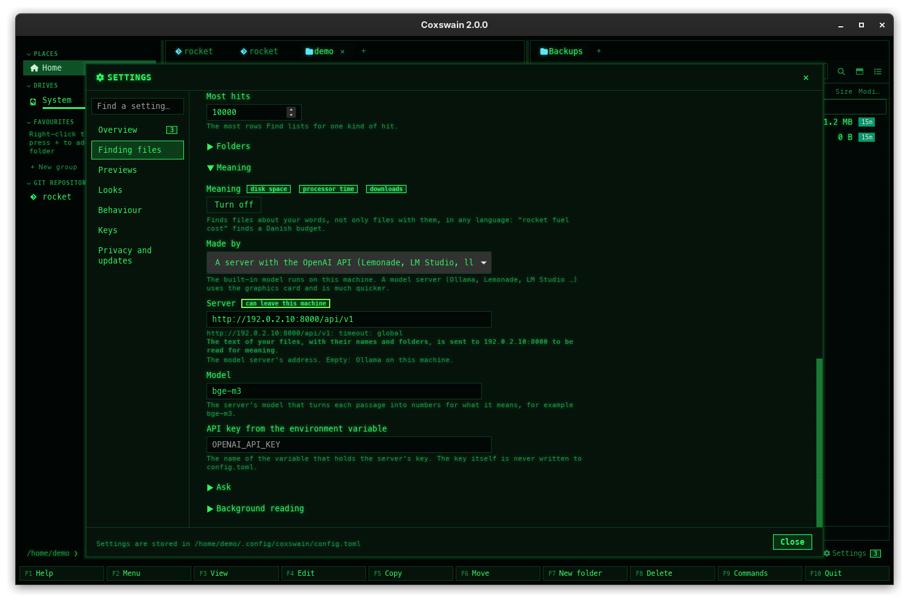

[← README](../../README.md) · [Docs index](../README.md) · [Reference](README.md)

# Privacy: what stays, what can leave

Coxswain has no telemetry and no account. What it learns about your files (names, text, sizes,
hashes, meaning vectors) stays in files on your own disk, readable by you alone. This page lists
every time something can go over the network, and how to stop each one.

## Contents

- [How to use it](#how-to-use-it)
- [What stays on your machine](#what-stays-on-your-machine)
- [What can leave it](#what-can-leave-it)
- [What you see](#what-you-see)
- [Settings and config.toml](#settings-and-configtoml)
- [In the terminal app](#in-the-terminal-app)
- [Questions](#questions)

## How to use it

To keep everything on this machine:

1. Turn the update check off: Settings (**Ctrl+,**) → *Behaviour* → untick *Check for a new
   version once a day*, or `check_updates = false` in `config.toml`.
2. For search by meaning, use the built-in model (`coxswain --meaning builtin`) or a server on
   this machine (`localhost`). Downloading the built-in model is the one request it makes, once.
3. Leave `[preview] container = "off"` if you do not want podman or docker to pull images.

With those, nothing leaves the machine. Previews load nothing from the web, not even a picture a
Markdown file links: the app's own content security policy allows only the app and your disk.

## What stays on your machine

| What | Where |
|---|---|
| Your settings | `config.toml` |
| The session, favourites, tags, notes, recent repositories, dismissed notices, the last update check | `state.json` |
| The name index: every file name in the folders indexed | `index.bin` in the cache folder |
| The search store: the text of your files, their sizes, hashes and meaning vectors | `search.db` in the cache folder, permissions `0600` (you alone) on Linux and macOS |
| The model for search by meaning | `models/` in the cache folder |
| Previews made by tools | `previews/` in the cache folder |
| Passwords of encrypted archives | Nowhere on disk: in the app's memory until it quits ([Passwords](../files/archive-passwords.md)) |

All paths: [Where things are kept](where-things-are-kept.md).

The apps talk to the [search helper](../search/helper.md) over a loopback connection on your own
machine. Its port and a random token are in `index.addr`, a file only you can read, so other
users of the machine cannot ask it anything.

Reading your documents for search is done by Coxswain itself, with no network. Installed
programs it may use (tesseract, pdftoppm, LibreOffice) run locally and write only into a
temporary folder that is removed afterwards. Containers for previews run with `--network=none`.
Files copied out of an archive on the way to another archive pass through a temporary folder of
their own, removed afterwards.

**Files only in the cloud** (OneDrive, Dropbox, Google Drive, Proton Drive, iCloud, cloud mounts
on Linux) are never read unless you open one: reading them would make the cloud app download
them. They are found by name only ([Cloud files](../search/cloud-files.md)).

**HTML files** are shown as pages in a sandbox: the page runs no scripts and may load only
pictures, styles, fonts and media from your own disk (beside the file). A page that links a
script or a picture on the web gets nothing from the web ([HTML pages](../previews/html.md)).

## What can leave it

| When | What goes where | Who starts it | To stop it |
|---|---|---|---|
| **Update check**, once a day | A request to `api.github.com` for the latest release's version number, with `User-Agent: coxswain/1.20.0` | Both apps, by themselves | `check_updates = false`, or untick *Settings → Behaviour → Check for a new version once a day* ([Update checks](updates.md)) |
| **Model download**, once | The three files of multilingual-e5-small (about 488 MB) from `huggingface.co` | You: *Download the model* in Settings, or `coxswain --meaning on` | Do not turn search by meaning on, or use a server |
| **Search by meaning on another machine** | The text of your files (all of it, up to 256 passages each, with the file's name and two folders) and every question you type at Find file's text depth, to that server | You: a *Server* that is not on this machine | Use the built-in model or a server on `localhost`. Settings warns: *The text of your files, with their names and folders, is sent to evo to get its vectors.* |
| **Ask** | The question, the questions and answers before it in this Find file, and the ten closest passages with their paths, to the chat model on the server (Ollama on this machine with the built-in model). Nothing is stored | You: pressing **Enter** at Find file's Ask depth ([Ask](../search/ask.md)) | Leave *Chat model* empty, or use a server on `localhost` |
| **Ollama pull** | Ollama downloads the model from its registry | You: *Pull bge-m3 with Ollama* or `coxswain --meaning ollama` | Do not pull |
| **Container images** | podman or docker downloads the image from its registry (`docker.io`) | You: the first build or render with a container, or *Pull* in Settings. Never by itself | `[preview] container = "off"` |
| **Links you click** | The release notes, a docs page under *Settings → What's new* (on GitHub), a web link in a rendered Markdown or AsciiDoc file: each opens in your browser. *What's new* itself is built into the app | You | – |

On a machine with search by meaning on the built-in model, Coxswain also asks
`http://localhost:11434`, now and then, whether Ollama runs there, to suggest it. That request
never leaves the machine.

Nothing else: no crash reports, no usage counts, no fonts or libraries fetched at run time.
Every preview library ships inside the app, and draw.io's viewer runs offline.

## What you see

- With a remote server chosen, Settings → *Search by meaning* shows under it
  *The text of your files, with their names and folders, is sent to evo to get its vectors.*, with the server's host name.
- An update found by the check shows as a button in the desktop app and a line in the terminal
  app's status line: [Update checks](updates.md#what-you-see).
- Nothing shows for requests that do not happen: there is no "sending data" indicator because
  nothing is sent in the background apart from the update check.

## Settings and config.toml

| Settings | Key | Default | Network when |
|---|---|---|---|
| *Behaviour* → *Check for a new version once a day* | `check_updates` | `true` | On: once a day, to GitHub |
| *Search by meaning* → *Vectors made by* | `[search] meaning_engine` | `"builtin"` | `"ollama"` or `"openai"` with a remote `meaning_url` |
| *Search by meaning* → *Server* | `[search] meaning_url` | `""` | Not `localhost` |
| *Search by meaning* → *API key from the variable* | `[search] meaning_key_env` | `""` | The key is sent to the saved server only (unencrypted over `http://`), and never stored in `config.toml` |
| *Previews made by tools* → *Container runtime* | `[preview] container` | `"auto"` | Pulling an image, when you ask |

## In the terminal app

The same, with one difference: the terminal app's update check runs once when it starts (the
result shared with the desktop app through `state.json`). `check_updates = false` turns it off in
both.

## Questions

#### Does anything leave my machine?

Only what the table above lists. With update checks off and search by meaning either off or on
the built-in model (after its one download), nothing does. A picture a Markdown file links on
the web stays an empty box in the preview; the webview itself is held to the app and your disk,
so no preview of any kind can reach out.

#### Can other users on the same machine see my index?

No. At every start both apps (and the search helper) make the cache folder (`index.bin`,
`search.db`, previews, archive copies, the model) and the state folder (`state.json`: notes,
tags, favourites, recent folders) readable by you alone: the folders `700`, the files `600`.
Installs from before 1.26.4, whose files could be readable by others, are corrected at their first
start after the update. The helper answers only to a connection that knows its token, which is in
a file only you can read. (On Windows these folders are inside your own profile, which only you
can open.)

#### What does a remote embedding server get exactly?

The passages of each file with text in the folders read (the whole text, up to 256 passages of
about 120 words), each with a first line naming the file, the two folders it is in and, in
Markdown, the heading above it (`budget.md · rocket/notes · Fuel`); and each question you type
at Find file's text depth while search by meaning is on. Not the full path. Before 1.36.0 it got
the first eight passages, without the line.

#### Is my archive password stored anywhere?

No. The box says so: *Its password (kept in memory while the app runs, never saved):*. It is kept in memory
while the app runs, so you are not asked again inside the same archive, and forgotten when the
app quits.

#### Can an HTML file I preview phone home?

No. It is shown in a sandbox with no scripts, and it may load only files from its own folder.
Tracking pixels and web fonts on the web are blocked, and a link in it goes nowhere: press
**Enter** to open the page in your browser.

#### Does the update check send anything about me?

Only what any web request sends: your IP address to GitHub, and `User-Agent: coxswain/1.20.0`.
No machine ID, no file names, no settings.

#### Does Coxswain talk to Ollama without asking?

Only to `localhost:11434`, on your own machine, to see whether Ollama runs there. It uses Ollama
only once you choose it.

---
[← Previous: Configuration: every key](configuration.md) · [Next: Update checks →](updates.md)
