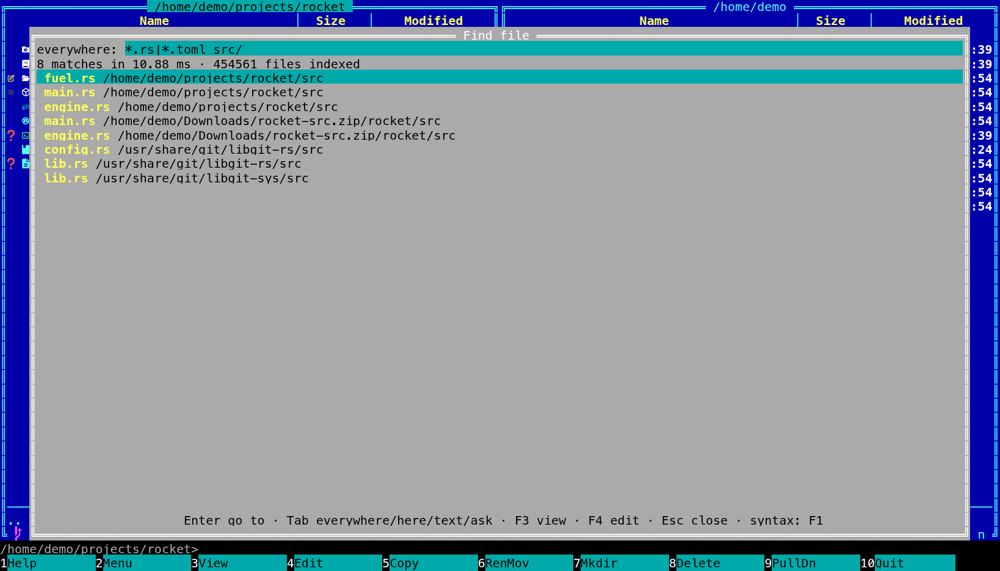

[← README](../../README.md) · [Docs index](../README.md)

# Search

Find file finds what you have the way you remember it, at four depths: every file name on the
machine, the words inside your files, what your files are about, and answers to questions about them. Both apps have all three,
and they share one index, kept by a [search helper](helper.md) in the background. These pages
walk through each depth, what is read and when, and every setting.

*Names everywhere in the terminal app: six hits among 452,393 names in 3.5 ms.*

| Depth | Finds | Needs |
|---|---|---|
| [Names everywhere](names.md) | Files and folders by name, on the whole machine | Nothing |
| [Names in this folder](names.md#names-in-this-folder) | The same, in the active panel's folder and below | Nothing |
| [Text in files](text.md) | Files whose text has your words; with [search by meaning](meaning.md), also files about them | *Search inside files* on (the default) and the [helper](helper.md) |
| [Inside archives](archives.md) | Each of the above for the files in your zip, 7z and tar archives too | *Search inside archives* on (the default) |
| [Ask](ask.md) | An answer to your question, written from the passages closest to it, with numbered sources | Search by meaning and a chat model on your server |

| Page | What it covers |
|---|---|
| [Find file](find-file.md) | Opening it, the window, the keys, the three depths with Tab, where it can look |
| [Names everywhere](names.md) | The name index, how it stays current and fast, names in this folder |
| [Name syntax](name-syntax.md) | Everything's syntax: `!`, `\|`, `*`, `ext:`, `file:`, `folder:`, `case:`, paths |
| [Text in files](text.md) | Searching the words inside files, what is read and when |
| [Documents it reads](documents.md) | PDF, Word, spreadsheets, slides, mail, books, notebooks: the formats |
| [Scans, pictures and older Office files](scans.md) | tesseract, pdftoppm and LibreOffice, when they are installed |
| [Diagrams read as sentences](diagrams.md) | draw.io, Mermaid, Graphviz and PlantUML: a sentence per arrow |
| [Git history in search](history.md) | Commit messages, authors and changed paths, found like text; Enter opens the commit |
| [Inside archives](archives.md) | Files in zip, 7z and tar archives, found by name, text and meaning; changes followed |
| [Choosing the folders](folders.md) | Folders read, names only, `.nosearch`, `text_exclude` |
| [Removable disks](removable-disks.md) | USB and external disks: kept while unplugged, found again anywhere |
| [Search by meaning](meaning.md) | The built-in multilingual model: turning it on, what it finds |
| [Search by meaning on a server](servers.md) | Ollama, Lemonade, LM Studio or any server with the OpenAI API |
| [Ask](ask.md) | Questions answered from your files by your own chat model, with numbered sources |
| [The search helper](helper.md) | The background process, and starting it with your session |
| [Battery](battery.md) | Why reading waits while a laptop runs on its battery |
| [Notices and the window title](notices.md) | What the status line tells you once, and the version and depths in the title |
| [Search settings](settings.md) | Every item of *Settings → Search inside files* and *Search by meaning*, with its `config.toml` key |

## Keys at a glance

| Key | Desktop app | Terminal app | Does |
|---|---|---|---|
| **Alt+F7**, **Ctrl+F** | yes | yes | Open Find file, at names everywhere |
| **Tab** | yes | yes | The next depth: everywhere → this folder → text in files → Ask |
| **Up** / **Down** | yes | yes | Move through the results |
| **PageUp** / **PageDown** | 15 at a time | 10 at a time | Move a page |
| **Enter** | yes | yes | Go to the file: the active panel opens its folder, cursor on it |
| **F3** | no (the preview pane is behind) | yes | View the file, then come back to the results |
| **F4** | yes | yes | Edit the file, without leaving Find file |
| **Esc** | yes | yes | Close Find file |
| **Ctrl+,** | yes | no Settings window | Settings, with *Search inside files* and *Search by meaning* |

The terminal app sets everything with `config.toml` and flags such as `coxswain --meaning on`
and `coxswain --index-service on`; see [Command-line flags](../reference/command-line-flags.md).

---
[← Previous: Opening files](../commands/opening-files.md) · [Next: Find file →](find-file.md)
