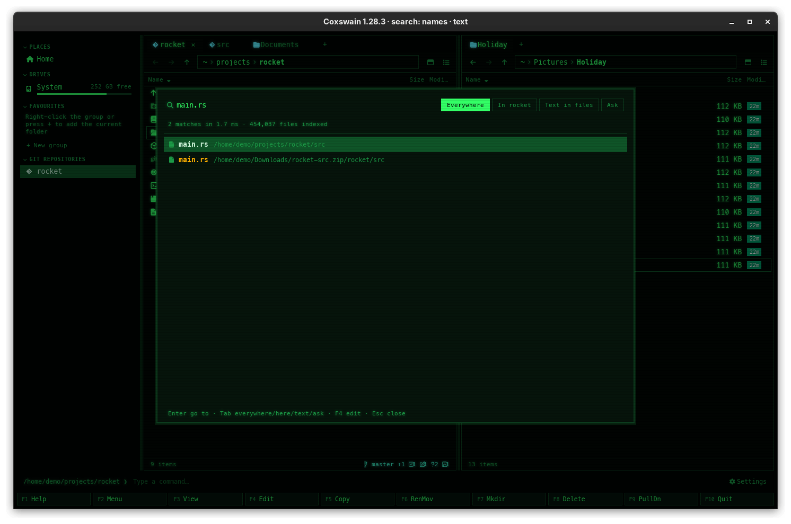

[← README](../../README.md) · [Docs index](../README.md) · [Search](README.md)

# Inside archives

Find file looks inside your zip, 7z and tar archives. A file in `website.tar.gz` is found by its
name, `main.rs`, and by its words in *Text in files*, by its meaning, and by Ask, just like a
file on disk. A hit is shown as a path through the archive, `…/website.tar.gz/src/main.rs`, and
**Enter** opens the archive's folder in the panel with the cursor on the file. When an archive
changes, by Coxswain or by anything else, what search knows of it changes with it.



## Contents

- [How to use it](#how-to-use-it)
- [What you see](#what-you-see)
- [Which archives](#which-archives)
- [When an archive changes](#when-an-archive-changes)
- [Locked archives](#locked-archives)
- [Limits](#limits)
- [Settings and config.toml](#settings-and-configtoml)
- [In the terminal app](#in-the-terminal-app)
- [Questions](#questions)

## How to use it

Nothing to do: *Search inside archives* is on from the start.

1. **Alt+F7** or **Ctrl+F** opens Find file at *everywhere*.
2. Type a name, as for any file: `main.rs`, `ext:md report`, `website src/`. Entries inside
   archives are among the hits.
3. **Tab** once for *in this folder*: the folder in the panel and below it, archives in it
   included. When the panel is inside an archive, it searches that folder of the archive.
4. **Tab** again for *Text in files*: the words of files inside archives are found too, with
   their passage under the name.
5. **Enter** on a hit goes to it.

| Key | Desktop app | Terminal app | Does |
|---|---|---|---|
| **Alt+F7**, **Ctrl+F** | yes | yes | Open Find file |
| **Tab** | yes | yes | *everywhere* → *in this folder* → *Text in files* → *Ask* |
| **Enter** | yes | yes | The active panel opens the folder inside the archive, cursor on the file |
| **F3** / **F4** | F4 | yes | As for any file inside an archive ([Archives as folders](../files/archives.md)) |

The formats are those Coxswain opens as folders: zip (and jar, apk, whl, nupkg, vsix), 7z, tar,
and tar compressed with gzip, bzip2, xz or zstd (`.tar.gz`, `.tgz`, `.tar.bz2`, `.tar.xz`,
`.tar.zst` …). Files inside are read with the same readers as files on disk, by their
extension: a PDF in a zip is read as a PDF ([Documents it reads](documents.md)).

## What you see

- **Names:** a hit inside an archive shows its name, and as its folder the path through the
  archive: `main.rs   /home/demo/projects/website.tar.gz/src`. A folder only named in the paths
  of an archive's files (`src`) is a folder hit like any other. The archive itself is still a
  file hit of its own.
- **Text:** the same name and folder, and under them the passage that matched, your words
  highlighted.
- **Enter:** the active panel goes into the archive at that folder, the cursor on the file. The
  desktop app tints the pane and shows the *archive* badge in the path bar; the terminal app's
  panel title says `[archive]`. **Backspace** or `..` leads back out, as in any archive.
- **Settings → Search inside files:** the count *Searchable: … files* includes the files read
  inside archives.

## Which archives

Search looks inside the archives in the **folders whose text is read**: your home folder unless
you chose others ([Choosing the folders](folders.md)), less the folders left out there: hidden
folders, folders named `node_modules`, `target`, `build` … (`text_exclude`), folders marked
*Names only*, and folders holding a `.nosearch` file. Elsewhere on the machine an archive is
found by its own name only.

This keeps the name index small and quick: a whole machine holds thousands of archives that are
nobody's documents, such as a package cache or the jars of an installed program. On one Linux
machine with 10,800 cached packages (46 GB), looking into every archive took the name index's
build from under a second to a minute, and its memory from 0.8 to 2.6 GB.

To have the archives on another disk looked into, add that folder to *Folders read*.

## When an archive changes

The name index and the text store both note each archive's size and date. When either
changes, the archive is listed again: entries that are gone leave the index and the store, new
ones come in, and the store reads the text of the members that changed (their size or their
date in the archive), while the rest keep their text and their vectors. An archive written in
the last three seconds (a download under way) waits until it has settled, so it is not unpacked
at every step of the download. It makes no difference who changed it:

- **Coxswain's own changes** (copying into an archive with **F5**, moving in or renaming inside
  with **F6**, taking out with **F8**, a new folder with **F7**): the archive is
  written anew and put in place of the old one, the file watcher sees it, and Find file has the
  new names within a second or two, the new text a few seconds later.
- **Anything else** (a build that writes a new `.tar.gz`, a download, a zip tool): the same,
  through the file watcher.
- **Without the watcher** (`watch = false`, or a change it missed): the names at the next
  hourly rebuild of the name index, the text at the next walk of the store, within ten minutes.

An archive that has not changed is not read again: the hourly rebuild takes its entries from
the index it had.

## Locked archives

Search never uses a password, not even one you gave in this run to open an archive, and never
sends one anywhere: what it knows of a locked archive is what anyone can see.

| Archive | Names found | Text read |
|---|---|---|
| A zip with locked files | Yes, all of them: a zip's names are never locked | Only the files that are not locked |
| A 7z with locked contents and open names | Yes | No |
| A 7z with locked names | No: it is found by its own name only | No |

## Limits

| Limit | Value | What happens past it |
|---|---|---|
| Entries of one archive | the first 50,000 | The rest are not found |
| A compressed tar, to be listed | 256 MB | It is found by its own name only: a compressed tar must be unpacked from its start to be listed |
| A 7z or compressed tar, to be read for text | 256 MB | Its names are found, its text is not read |
| One file inside | 20 MB (`text_max_size`) | Its name is found, its text is not read |
| Read out of one archive | 128 MB | The files after that are found by name only |
| How deep | 64 folders | Deeper entries, and entries named with `..`, are left out |

- **An archive inside an archive** is not looked into: the inner one is found by its name.
- **Folder sizes and Duplicates** see an archive as the one file it is on disk; its contents are
  never counted twice.
- Files inside are unpacked one at a time into Coxswain's cache folder, readable by you alone,
  read, and deleted at once.

## Settings and config.toml

*Settings → Search inside files → Search inside archives: the files in zip, 7z and tar archives
are found by name and by their text* (desktop app); `archives` under `[search]` in
`config.toml`.

| Key | Type | Default | Does |
|---|---|---|---|
| `archives` | bool | `true` | Look inside archives, for names and for text. `false`: archives are found by their own names only, and what the store had read inside them is removed |

```toml
[search]
archives = false
```

The folders looked into follow `text_roots`, `text_exclude` and `names_only`
([Choosing the folders](folders.md)).

## In the terminal app

The same: the same index and store, kept by the same [helper](helper.md), the same hits and the
same **Enter**. There is no Settings window: set `archives` in `config.toml`; the helper takes
it at its next start.

## Questions

#### Does Find file find files inside my zip files?
Yes, when the zip is in a folder that is read (your home folder by default, not inside a hidden
folder): by name at *everywhere* and *in this folder*, and by their words at *Text in files*. A
zip elsewhere is found by its own name only; see [Which archives](#which-archives).

#### I added a file to a zip. When can I find it?
Within a second or two by name, and a few seconds later by its text, whether Coxswain or another
program changed the zip; only the new file is read, the other members keep their text. Without
the file watcher, at the next hourly rebuild (names) or within ten minutes (text).

#### Why is a file in my .tar.xz not found?
One of these: the archive is larger than 256 MB (a compressed tar is listed by unpacking it,
so larger ones are found by their own name only); the file is past the archive's first 50,000
entries; the archive is not in a folder that is read, or is in a hidden one; or, for its text,
the file is larger than 20 MB or comes after the first 128 MB read out of the archive.

#### Why are the jars in ~/.m2, or the archives in ~/.cache, not looked into?
They are in hidden folders, which search leaves out, as it does for their text. Those are a
program's archives, not yours, and would fill the results. Add the folder to *Folders read* if
you want them.

#### Can search find files in a locked archive?
Their names, when the archive shows its names without a password: every zip does, a 7z with
open names does. Their text, never: search uses no password, even one you gave in this run. See
[Locked archives](#locked-archives).

#### Does looking inside archives make search slower or bigger?
A little, and only for the archives in the folders read. On a test tree of 200,000 files and
260 archives holding 145,000 entries, the name index took 70 ms to build instead of 25 ms (35 ms
when its archives had not changed) and its cache 8.1 MB instead of 4.6 MB; a search took the
same time. On a whole Linux machine with 3.4 million names, a home folder with few archives
made no difference to see.

#### How do I turn it off?
Untick *Search inside archives* in *Settings → Search inside files*, or set `archives = false`
under `[search]` in `config.toml`. The helper starts again with it; what was read inside archives
is removed from the store at its next walk.

#### Can I open a file that was found inside an archive?
**Enter** goes to it: the panel opens the archive's folder, cursor on the file. From there it is a
file inside an archive like any other: the desktop app's preview pane shows it and **F3** in the
terminal app views it, from a copy of just that file, and **F5** copies it out to change it
([Archives as folders](../files/archives.md)).

---
[← Previous: Git history in search](history.md) · [Next: Choosing the folders →](folders.md)
